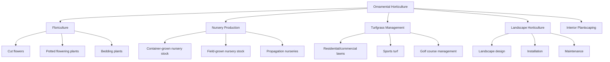

## Ornamental Horticulture

### Overview

Ornamental horticulture is the branch of horticulture concerned with the cultivation, production, and use of plants primarily for aesthetic, decorative, and amenity value rather than food production. It encompasses a wide range of production systems and end markets, including cut flowers, potted/container plants, bedding plants, nursery stock (trees and shrubs), turfgrass, and landscape/garden design applications.

### Classification of Ornamental Plant Categories

**By Production/Market Segment**

- **Floriculture**: cut flowers, potted flowering plants, bedding/garden plants
- **Nursery production**: woody ornamental trees and shrubs, grown in containers or field-grown for landscape use
- **Turfgrass management**: lawns, sports fields, golf courses
- **Interior plantscaping**: foliage plants for indoor decorative use
- **Landscape horticulture**: design, installation, and maintenance of outdoor ornamental plantings

**By Life Cycle**

- **Annuals**: complete life cycle within one growing season (e.g., petunia, marigold, zinnia); widely used in bedding plant production for seasonal color
- **Biennials**: complete life cycle over two growing seasons (e.g., foxglove, some pansies grown as biennials)
- **Herbaceous perennials**: non-woody plants that die back and regrow from root/crown structures across multiple years (e.g., hosta, daylily, peony)
- **Woody ornamentals**: trees and shrubs with persistent above-ground woody structure (e.g., ornamental cherry, boxwood, rose)
- **Bulbous/geophytic plants**: plants with underground storage organs (bulbs, corms, tubers, rhizomes) enabling dormancy survival (e.g., tulip, daffodil, gladiolus)

### Floriculture Production Systems

**Cut Flower Production**

- Grown in field, greenhouse, or high tunnel systems depending on species, climate, and market timing requirements
- Greenhouse production allows year-round supply and precise environmental control for crops like rose, chrysanthemum, and carnation
- Field production is common for many specialty and seasonal cut flowers (e.g., sunflower, zinnia, dahlia) where climate permits
- Postharvest handling is critical given high perishability: immediate hydration, cool chain maintenance, and use of floral preservatives to extend vase life

**Potted/Container Flowering Plant Production**

- Crop timing (scheduling) is a central production skill, coordinating planting dates, environmental manipulation (temperature, photoperiod), and growth regulator use to have plants in peak flowering condition for specific market dates (e.g., poinsettia for winter holidays, Easter lily for spring holiday timing)
- Photoperiod manipulation is particularly important for photoperiodic species (e.g., poinsettia and chrysanthemum are short-day plants requiring controlled day-length manipulation to induce flowering on schedule)

**Bedding Plant Production**

- Mass-produced annual and some perennial plants grown in plug trays or small containers for garden/landscape planting
- Production emphasizes uniform, compact, well-branched plants timed to regional planting seasons
- Plant growth regulators (PGRs) are commonly used to control height and improve compactness for shipping and retail display

### Diagram: Ornamental Horticulture Production Segments

### Nursery Production Systems

**Container Production**

- Predominant method for many ornamental shrubs and small trees, allowing flexible sale timing, easier transport, and reduced transplant shock
- Growing media selection (typically soilless substrates: pine bark, peat, coir-based mixes) is critical for drainage, aeration, and nutrient-holding capacity in containers
- Container size progression ("potting up" or "bumping") as plants grow, following standard nursery container size classifications

**Field Production**

- Used for larger shade trees, certain shrubs, and species less suited to long-term container culture
- **Balled and burlapped (B&B)**: field-grown trees dug with an intact soil root ball wrapped in burlap for transport
- **Bare-root production**: dormant deciduous trees/shrubs lifted with soil removed from roots, used for cost-efficient shipping during the dormant season

**Propagation Methods**

- **Seed propagation**: used for many annuals and some woody species, though less common for cultivar-specific woody ornamental propagation due to genetic variability
- **Vegetative propagation (cuttings)**: stem, leaf, or root cuttings rooted under controlled humidity/mist conditions; standard method for maintaining cultivar trueness in most woody ornamentals
- **Grafting/budding**: used for ornamental trees where scion cultivar characteristics (flower color, form) must be preserved on a specific rootstock (e.g., ornamental flowering cherry, some ornamental crabapple cultivars)
- **Tissue culture (micropropagation)**: used for rapid clonal multiplication of certain high-value or difficult-to-propagate ornamentals (e.g., some orchids, certain perennials)

### Turfgrass Management

**Turfgrass Species Classification**

- **Cool-season grasses**: optimal growth 15–24°C, used in temperate climates (e.g., Kentucky bluegrass, perennial ryegrass, tall fescue)
- **Warm-season grasses**: optimal growth 27–35°C, used in subtropical/tropical climates (e.g., bermudagrass, zoysiagrass, St. Augustinegrass)

**Key Management Practices**

- **Mowing**: height and frequency management specific to species and use (e.g., golf putting greens mowed extremely short and frequently; lawns mowed at moderate height less frequently)
- **Fertilization**: nitrogen-focused programs timed to species growth patterns (e.g., cool-season grasses typically fertilized in spring and fall; warm-season grasses fertilized during active summer growth)
- **Irrigation**: scheduling based on evapotranspiration rates, soil type, and species water requirements
- **Aeration and dethatching**: mechanical practices relieving soil compaction and managing thatch buildup (a layer of organic debris between soil and turf canopy) to maintain turf health
- **Pest and disease management**: includes weed control (pre- and post-emergent herbicides), turf-specific fungal disease management (e.g., dollar spot, brown patch), and insect pest management (e.g., grubs)

### Landscape Horticulture

**Landscape Design Principles**

- Plant selection based on site conditions (light, soil, hardiness zone), mature size, and intended aesthetic/functional role
- Consideration of seasonal interest (bloom timing, foliage color change, winter structure)
- Water-wise/xeriscape principles increasingly incorporated in water-limited regions, emphasizing drought-tolerant plant selection and efficient irrigation design

**Landscape Installation and Maintenance**

- Proper planting technique (correct planting depth, root ball preparation, backfill soil management) is critical for woody ornamental establishment success
- Ongoing maintenance includes pruning, mulching, irrigation management, and integrated pest management specific to the landscape plant palette
- Pruning objectives in ornamental landscape contexts often prioritize aesthetic form and safety (structural pruning) alongside plant health considerations

### Plant Growth Regulation in Ornamental Production

Plant Growth Regulators (PGRs) are used extensively in ornamental production, more so than in most food crop production, to achieve specific aesthetic and market-timing outcomes:

- **Height control**: reducing internode elongation for compact, shippable plants (common in bedding plant and potted plant production)
- **Flowering induction/timing**: manipulating flowering response in conjunction with photoperiod and temperature control
- **Branching enhancement**: promoting lateral branching for fuller, more marketable plant form

### Environmental Control in Greenhouse Ornamental Production

**Key Controlled Parameters**

- **Temperature**: species-specific optimal ranges for vegetative growth and flowering
- **Photoperiod**: critical for photoperiodic flowering crops; controlled via supplemental lighting (long-day induction) or blackout curtains (short-day induction)
- **Light intensity**: supplemental lighting (often LED or high-pressure sodium) used to extend growing season and improve quality in low-light periods
- **Humidity and ventilation**: managed to reduce foliar disease pressure while maintaining adequate plant hydration status
- **CO2 enrichment**: sometimes used in enclosed greenhouse systems to enhance photosynthetic rate and growth, particularly during winter production periods when ventilation (and associated CO2 loss) is minimal

### Illustration: Photoperiodic Response in Flowering Crop Scheduling (svg_diagram)

<svg xmlns="http://www.w3.org/2000/svg" viewBox="0 0 700 320">
<text x="350" y="25" text-anchor="middle" font-size="16" font-weight="bold" fill="#1a1a1a">Photoperiodic Response in Flowering Crop Scheduling (svg_diagram)</text>

<text x="180" y="60" text-anchor="middle" font-size="13" font-weight="bold">Short-Day Plant (e.g., Poinsettia)</text>

<rect x="60" y="80" width="240" height="30" fill="`#fff59d`" stroke="`#f9a825`" />

<text x="180" y="100" text-anchor="middle" font-size="10">Long day - vegetative growth</text>

<rect x="60" y="120" width="240" height="30" fill="`#37474f`" stroke="#000" />

<text x="180" y="140" text-anchor="middle" font-size="10" fill="#fff">Short day (long uninterrupted night) - flower induction</text>

<rect x="60" y="160" width="240" height="30" fill="`#f8bbd0`" stroke="`#ad1457`" />

<text x="180" y="180" text-anchor="middle" font-size="10">Flowering / bract coloration</text>

<text x="520" y="60" text-anchor="middle" font-size="13" font-weight="bold">Long-Day Plant (e.g., some perennials)</text>

<rect x="400" y="80" width="240" height="30" fill="`#37474f`" stroke="#000" />

<text x="520" y="100" text-anchor="middle" font-size="10" fill="#fff">Short day - vegetative growth</text>

<rect x="400" y="120" width="240" height="30" fill="`#fff59d`" stroke="`#f9a825`" />

<text x="520" y="140" text-anchor="middle" font-size="10">Long day (extended light) - flower induction</text>

<rect x="400" y="160" width="240" height="30" fill="`#f8bbd0`" stroke="`#ad1457`" />

<text x="520" y="180" text-anchor="middle" font-size="10">Flowering</text>

<text x="350" y="240" text-anchor="middle" font-size="11" fill="#555">Growers manipulate day length via blackout curtains or supplemental lighting to schedule bloom for target market dates</text>

</svg>

### Pest and Disease Management

**IPM Considerations Specific to Ornamentals**

- Aesthetic quality thresholds are often much stricter than for food crops, since cosmetic damage (leaf spotting, minor insect presence) that would be tolerable in a food crop can render an ornamental product unmarketable
- Common greenhouse ornamental pests: aphids, whiteflies, thrips, spider mites, fungus gnats
- Common ornamental diseases: powdery mildew, botrytis blight, root rots (Pythium, Phytophthora) particularly in overwatered container production
- Biological control (predatory mites, parasitic wasps, beneficial nematodes) is widely adopted in greenhouse ornamental production due to the enclosed environment facilitating biological control agent establishment and the high value/low pesticide residue tolerance of the ornamental market compared to food crops in some contexts

### Practical Example: Scheduling Poinsettia for Holiday Market Timing

**Scenario**: A greenhouse grower needs poinsettias in full bract color for a specific late-year holiday market date.

1. **Cultivar selection**: Choose a poinsettia cultivar with a known "response time" (number of weeks of short-day conditions required from flower initiation to marketable bract color), working backward from the target sale date.
2. **Vegetative growth phase**: Maintain plants under long-day conditions (natural or extended via supplemental lighting) to promote vegetative branching before flower induction begins.
3. **Photoperiod control**: Beginning at the calculated date, ensure plants receive uninterrupted short-day conditions (typically requiring blackout cloth in greenhouses located at latitudes/seasons where natural night length is insufficient, or where stray light contamination from surrounding areas could disrupt the dark period).
4. **Temperature management**: Maintain appropriate greenhouse temperatures during the flower induction and development period, as temperature affects both the rate and quality of bract coloration.
5. **PGR application**: Apply height-control growth regulators as needed during vegetative growth to achieve the desired compact, well-branched plant form appropriate for retail sale.
6. **Quality timing check**: Monitor bract color development against the calculated schedule, with contingency lighting/shading adjustments available if development is running ahead of or behind the target date.

**Key Points**

- Photoperiodic crop scheduling requires working backward from the market date using cultivar-specific response time data.
- Precise control of uninterrupted darkness is essential for short-day flower induction; even brief light interruption during the dark period can delay or prevent flowering.
- Environmental control (temperature, light) and PGR use work together to achieve both correct timing and desired plant aesthetic quality.

### Marketing and Postharvest Considerations

**Cut Flowers**

- Vase life extension through proper harvest stage selection, immediate post-harvest hydration, cool chain maintenance (often 1–4°C depending on species chilling sensitivity), and commercial floral preservative use (typically containing sugar, biocide, and acidifying agents)
- Ethylene sensitivity varies by species; some cut flowers (e.g., carnation) are highly ethylene-sensitive and require careful handling to avoid premature senescence

**Potted and Nursery Plants**

- Quality standards typically address plant form, foliage/flower condition, root system health, and absence of pest/disease symptoms
- Grading standards (e.g., American Standard for Nursery Stock in the US context) provide industry benchmarks for size and quality classification of nursery stock

### Conclusion

Ornamental horticulture spans a diverse set of production systems unified by an aesthetic rather than nutritional end goal, resulting in distinct emphases on precise crop timing, plant form manipulation, and stricter cosmetic quality standards compared to food crop production. Success across floriculture, nursery, turfgrass, and landscape segments depends on matching production techniques, environmental control, and scheduling precision to the specific market and aesthetic requirements of each ornamental product category.

**Related Topics**

- Greenhouse environmental control systems
- Plant propagation techniques (cuttings, grafting, tissue culture)
- Photoperiodism and flowering physiology
- Plant growth regulator applications in horticulture
- Turfgrass species selection and management
- Landscape design principles and xeriscaping
- Postharvest handling of cut flowers
- Integrated Pest Management in greenhouse production
- Nursery stock grading and quality standards
- Container media formulation for ornamental production