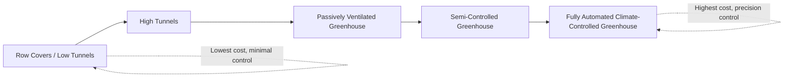

## Greenhouse and Protected Cultivation

### Overview

Greenhouse and protected cultivation refers to growing crops within structures or under materials that modify the ambient environment to improve growing conditions, extend production seasons, and increase yield and quality relative to open-field production. This encompasses a spectrum of systems from simple row covers to fully automated, climate-controlled greenhouse facilities, unified by the goal of buffering crops from unfavorable environmental conditions.

### Classification of Protected Cultivation Systems

**By Structural Complexity**

- **Row covers and low tunnels**: lightweight fabric or plastic draped over low hoops directly above crop rows, providing frost protection, wind protection, and minor pest exclusion with minimal capital investment
- **High tunnels (polytunnels/hoop houses)**: taller, walk-in structures typically covered with a single layer of polyethylene film, passively ventilated (no active heating/cooling systems in most configurations), extending the growing season without full climate control
- **Greenhouses**: permanent structures with glazing (glass or rigid/film plastic), equipped with varying levels of environmental control systems (heating, cooling, ventilation, supplemental lighting, CO2 enrichment)
- **Screenhouses/shade structures**: mesh or shade cloth structures primarily providing insect exclusion and/or light intensity reduction rather than temperature control, common in warm climates

**By Environmental Control Sophistication**

- **Passive/naturally ventilated**: relying on roof vents, side vents, and natural convection for temperature regulation
- **Semi-controlled**: incorporating fans, evaporative cooling (pad-and-fan systems), and basic heating
- **Fully controlled/climate-controlled**: integrated computer-controlled systems managing temperature, humidity, CO2, and often supplemental lighting for near-optimal, consistent growing conditions year-round

### Diagram: Protected Cultivation Systems by Investment and Control Level

### Greenhouse Structural Components

**Glazing Materials**

- **Glass**: high light transmission, long lifespan, higher capital cost, heavier structural support requirements
- **Rigid plastics (polycarbonate, acrylic)**: good insulation properties (particularly multi-wall polycarbonate), moderate cost, good durability
- **Polyethylene film**: lowest cost glazing option, common in high tunnels and single/double-layer greenhouses, requires periodic replacement (typically every 3–5 years depending on UV stabilization and climate exposure)

**Structural Frame**

- Steel or aluminum framing is standard in permanent greenhouse structures, providing support for glazing, equipment, and snow/wind load resistance
- Gothic arch and gutter-connected (multi-span) designs are common configurations, with gutter-connected ranges allowing efficient use of land area for large-scale production

**Foundation and Flooring**

- Concrete, gravel, or ground cover fabric flooring depending on production system (raised bench, floor-grown, or ground-bed cultivation)

### Environmental Control Systems

**Heating Systems**

- Forced-air heaters, hot water/hydronic systems, and radiant heating are common methods, selected based on climate severity, crop temperature requirements, and energy cost considerations
- Energy curtains (thermal screens) deployed at night reduce heat loss and are widely used in colder climate greenhouse operations to improve energy efficiency

**Cooling and Ventilation**

- **Natural ventilation**: roof and side vents utilizing convection and wind-driven airflow
- **Fan-and-pad evaporative cooling**: exhaust fans combined with wetted cooling pads, drawing air through the pad to reduce temperature via evaporative cooling; effective primarily in low-humidity climates
- **Fog/mist cooling systems**: fine mist injection providing evaporative cooling with lower humidity impact than pad systems in some configurations

**Humidity Management**

- Ventilation and heating are jointly used to manage relative humidity, as excessive humidity increases foliar disease risk (botrytis, powdery mildew) while excessively low humidity can cause plant water stress and issues like blossom end rot in susceptible crops
- Dehumidification via ventilation combined with heating ("vent and heat" strategy) is a standard humidity control approach in enclosed greenhouse environments

**CO2 Enrichment**

Supplemental CO2 injection (commonly to 700–1000+ ppm, compared to ambient ~420 ppm) can enhance photosynthetic rate and growth in enclosed greenhouse environments, particularly beneficial during cold-season production when ventilation (and associated CO2 loss to the outside atmosphere) is minimized. [Inference: optimal CO2 concentration and economic return vary by crop, light level, and other limiting factors]

**Supplemental Lighting**

- High-Pressure Sodium (HPS) lighting: historically standard for supplemental greenhouse lighting, providing high light output but with significant heat generation and a light spectrum weighted toward red/orange wavelengths
- LED lighting: increasingly adopted due to higher energy efficiency, lower heat output, longer fixture lifespan, and the ability to tune spectral output (e.g., specific red:blue ratios) to target crop photomorphogenic responses
- Photoperiod extension lighting: used for photoperiodic flowering crop scheduling (e.g., inducing or delaying flowering in long-day or short-day ornamental species)

### Growing Systems Within Protected Cultivation

**Soil-Based Systems**

Ground beds within greenhouse structures, requiring soil health management (organic matter maintenance, disease management given continuous cropping without natural fallow/rotation exposure to weather extremes that might otherwise reduce pathogen loads).

**Container/Substrate Systems**

Plants grown in pots or bags containing soilless substrate (peat, coir, perlite, bark mixes), allowing greater control over root zone conditions and easier disease management through substrate replacement between crop cycles.

**Hydroponic Systems**

- **Nutrient Film Technique (NFT)**: shallow, recirculating nutrient solution flowing across plant roots in channels; common for leafy greens and herbs
- **Deep Water Culture (DWC)**: plant roots suspended directly in an aerated nutrient solution reservoir
- **Drip/substrate hydroponics**: nutrient solution delivered via drip emitters to an inert substrate (rockwool, coco coir) supporting the root system, widely used for greenhouse tomato, cucumber, and pepper production
- **Ebb-and-flow (flood and drain)**: periodic flooding of a growing tray with nutrient solution, then draining back to a reservoir

**Aeroponic Systems**

Roots suspended in air within an enclosed chamber, periodically misted with nutrient solution; offers high oxygenation to root systems but requires precise system reliability given the lack of buffering substrate. [Inference: commercial adoption remains more limited compared to other hydroponic methods, largely due to system complexity and reliability requirements]

### Nutrient Management in Protected Cultivation

**Fertigation**

The standard nutrient delivery method in most protected and hydroponic systems, combining irrigation and fertilization through the delivery system, allowing precise, frequent nutrient supply matched to crop growth stage.

**Nutrient Solution Management**

- Electrical Conductivity (EC) monitoring: indicates total dissolved salt/nutrient concentration in the solution, adjusted according to crop-specific target ranges and growth stage
- pH monitoring: nutrient availability is highly pH-dependent; most hydroponic systems target a pH range of approximately 5.5–6.5 depending on crop
- Recirculating vs. run-to-waste systems: recirculating systems reuse drainage solution (requiring careful monitoring to prevent nutrient imbalance or pathogen buildup), while run-to-waste systems discard drainage after each irrigation event (simpler management, higher water/nutrient use)

### Illustration: Greenhouse Climate Control Feedback Loop (svg_diagram)

<svg xmlns="http://www.w3.org/2000/svg" viewBox="0 0 700 380">
<text x="350" y="25" text-anchor="middle" font-size="16" font-weight="bold" fill="#1a1a1a">Greenhouse Climate Control Feedback Loop (svg_diagram)</text>
<rect x="280" y="60" width="140" height="60" rx="8" fill="#c8e6c9" stroke="#2e7d32" />
<text x="350" y="95" text-anchor="middle" font-size="12" font-weight="bold">Climate Sensors</text>
<rect x="280" y="160" width="140" height="60" rx="8" fill="#bbdefb" stroke="#1565c0" />
<text x="350" y="185" text-anchor="middle" font-size="12" font-weight="bold">Control</text>
<text x="350" y="200" text-anchor="middle" font-size="12" font-weight="bold">Computer</text>
<rect x="60" y="260" width="130" height="50" rx="8" fill="#ffe0b2" stroke="#ef6c00" />
<text x="125" y="288" text-anchor="middle" font-size="11">Heating system</text>
<rect x="210" y="260" width="130" height="50" rx="8" fill="#b3e5fc" stroke="#0277bd" />
<text x="275" y="288" text-anchor="middle" font-size="11">Vents / cooling</text>
<rect x="360" y="260" width="130" height="50" rx="8" fill="#fff9c4" stroke="#f9a825" />
<text x="425" y="288" text-anchor="middle" font-size="11">Supplemental light</text>
<rect x="510" y="260" width="130" height="50" rx="8" fill="#d1c4e9" stroke="#5e35b1" />
<text x="575" y="288" text-anchor="middle" font-size="11">CO2 injection</text>
<line x1="350" y1="120" x2="350" y2="160" stroke="#333" stroke-width="2" marker-end="url(#arrow)" />
<line x1="330" y1="220" x2="125" y2="260" stroke="#333" stroke-width="2" />
<line x1="340" y1="220" x2="275" y2="260" stroke="#333" stroke-width="2" />
<line x1="360" y1="220" x2="425" y2="260" stroke="#333" stroke-width="2" />
<line x1="370" y1="220" x2="575" y2="260" stroke="#333" stroke-width="2" />
<rect x="270" y="340" width="160" height="30" rx="6" fill="#e0e0e0" stroke="#555" />
<text x="350" y="360" text-anchor="middle" font-size="11">Adjusted greenhouse environment</text>
<line x1="125" y1="310" x2="300" y2="340" stroke="#333" stroke-width="1.5" />
<line x1="275" y1="310" x2="330" y2="340" stroke="#333" stroke-width="1.5" />
<line x1="425" y1="310" x2="380" y2="340" stroke="#333" stroke-width="1.5" />
<line x1="575" y1="310" x2="410" y2="340" stroke="#333" stroke-width="1.5" />
</svg>

### Crop Suitability and Common Protected Crops

**High-Value Fruiting Vegetables**

Tomato, cucumber, pepper, and eggplant are among the most widely grown greenhouse vegetable crops globally, benefiting substantially from climate control, extended season production, and hydroponic yield/quality improvements over open-field production.

**Leafy Greens and Herbs**

Lettuce, spinach, basil, and other leafy crops are well-suited to NFT and other hydroponic systems due to shallow root systems and short crop cycles, making them prominent in vertical farming and Controlled Environment Agriculture (CEA) applications.

**Ornamental and Floriculture Crops**

Greenhouse production is standard for many cut flower and potted plant crops requiring precise photoperiod and temperature control for scheduled flowering (see Ornamental Horticulture).

**Transplant/Seedling Production**

Protected structures are widely used for raising seedlings/transplants for subsequent field planting across many vegetable and some agronomic crops, providing controlled germination and early growth conditions independent of field weather variability.

### Pest and Disease Management in Protected Cultivation

**Advantages of Enclosed Systems**

- Physical exclusion of many insect pests via screening on vents and doors
- Enhanced feasibility of biological control agent (beneficial insect/predatory mite) establishment and persistence due to the enclosed, more stable environment
- Reduced exposure to weather-driven disease pressure events compared to open field

**Distinct Challenges**

- High humidity within enclosed structures can favor certain fungal diseases (botrytis, powdery mildew) if ventilation/humidity management is inadequate
- Continuous cropping in the same structure without weather-driven "reset" can allow pest and disease populations to build up over time if sanitation between crop cycles is insufficient
- Soil-borne pathogen buildup in soil-based greenhouse systems, managed through soil solarization, steam sterilization, chemical fumigation, or transition to soilless substrate systems

### Economic Considerations

**Capital and Operating Costs**

Protected cultivation systems require substantially higher capital investment (structure, environmental control equipment) and ongoing operating costs (energy for heating/cooling/lighting, labor for intensive management) compared to open-field production.

**Yield and Quality Premiums**

These higher costs are typically justified by:

- Significantly higher yield per unit area (often multiple times open-field yields for the same crop)
- Extended or year-round production enabling market access during off-season periods when prices are typically higher
- Improved and more consistent product quality commanding premium pricing
- Reduced weather-related crop loss risk

**Energy Efficiency Considerations**

Given that heating, cooling, and lighting represent major ongoing operating costs, energy-efficient design (thermal screens, efficient glazing, LED lighting adoption) is an increasingly significant factor in protected cultivation economic viability, particularly in colder climates or regions with high energy costs. [Inference: specific payback periods for energy efficiency investments are highly dependent on regional energy costs and climate]

### Practical Example: Establishing a Hydroponic Greenhouse Tomato Operation

**Scenario**: A grower is establishing a greenhouse tomato operation using a drip-fed substrate hydroponic system.

1. **Structure selection**: Choose a gutter-connected polycarbonate or glass greenhouse offering good light transmission and structural durability suited to the local climate and snow/wind load requirements.
2. **Growing system**: Install a substrate-based drip system using rockwool or coco coir slabs, allowing precise root-zone moisture and nutrient control while avoiding the complexity of full recirculating hydroponics for a first-time system.
3. **Climate control setup**: Install a combination of roof/side vents for passive ventilation, supplemented by exhaust fans and evaporative cooling pads for temperature control during warm periods, along with a hydronic heating system for cold-season production.
4. **Nutrient management**: Implement a fertigation system with EC and pH monitoring, following a tomato-specific nutrient solution recipe adjusted across vegetative, flowering, and fruiting growth stages.
5. **Training system**: Train tomato plants using a high-wire trellis system (common in greenhouse tomato production), allowing continuous vertical growth and periodic lowering of the vine as it matures, supporting a long, continuous harvest period rather than a single flush.
6. **IPM program**: Install insect screening on all vents, and establish a biological control program (e.g., predatory mites for spider mite management, parasitic wasps for whitefly control) suited to the enclosed greenhouse environment.

**Key Points**

- Structure and climate control system selection should be matched to local climate severity and the target production season (year-round vs. seasonal extension).
- Substrate hydroponic systems offer a practical middle ground between soil-based simplicity and full recirculating hydroponic precision for growers transitioning to protected cultivation.
- High-wire trellis training enables the extended, continuous harvest period characteristic of greenhouse indeterminate tomato production, distinct from field production's typically shorter harvest window.

### Emerging Trends

**Controlled Environment Agriculture (CEA) and Vertical Farming**

Fully enclosed, often multi-tier indoor growing systems using LED lighting and hydroponic/aeroponic systems, eliminating dependence on natural sunlight and enabling production in non-arable or urban locations; predominantly applied to leafy greens and herbs due to their short crop cycles and relatively lower light requirements compared to fruiting crops. [Inference: economic viability for fruiting/higher-light-demand crops in fully enclosed vertical systems remains more constrained by energy costs relative to greenhouse production using natural sunlight]

**Precision Environmental Sensing and Automation**

Increasing integration of sensor networks (temperature, humidity, light, CO2, substrate moisture) with automated control systems and data analytics to optimize climate control decisions in real time and support predictive crop management.

**Renewable Energy Integration**

Adoption of solar panels, geothermal heating, and combined heat-and-power systems in some greenhouse operations to offset energy costs and reduce reliance on fossil fuel-based heating.

### Conclusion

Greenhouse and protected cultivation systems span a wide continuum from simple, low-cost season-extension tools to fully automated, precision-controlled production facilities. The core value proposition across this continuum is environmental buffering, protecting crops from unfavorable conditions while enabling extended seasons, higher yields, and improved quality, with the appropriate level of investment determined by crop value, target market timing, and local climate constraints.

**Related Topics**

- Hydroponic system design and nutrient solution management
- Controlled Environment Agriculture and vertical farming
- Greenhouse structural engineering and glazing materials
- Supplemental lighting technology and spectral management
- Biological pest control in enclosed growing systems
- Fertigation system design
- Energy efficiency and renewable energy integration in greenhouses
- Photoperiod manipulation for flowering crop scheduling
- Transplant and seedling nursery production
- Soilless substrate formulation and management