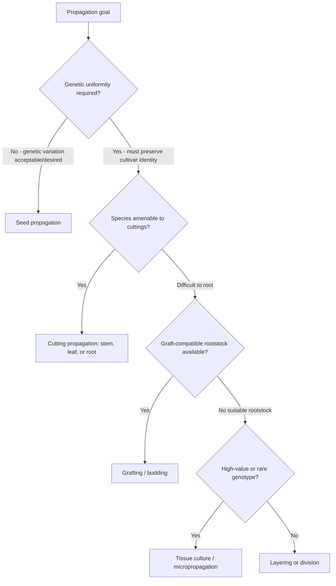
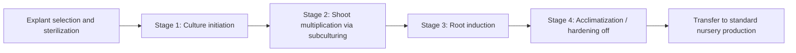

## Nursery Propagation Techniques

### Overview

Nursery propagation techniques encompass the methods used to multiply plants for production, ranging from sexual (seed-based) propagation to various asexual (vegetative/clonal) methods. Method selection depends on species biology, desired genetic uniformity, propagation speed, cost, and the intended end use of the propagated material.

### Sexual vs. Asexual Propagation

**Sexual Propagation (Seed Propagation)**

Involves fertilization and seed formation, producing genetically variable offspring (unless using self-pollinated, true-breeding lines or F1 hybrid seed). Advantages include lower cost at scale, disease-free starting material (in most cases), and the only viable method for producing new genetic combinations or F1 hybrids.

**Asexual Propagation (Vegetative Propagation)**

Involves generating new plants from vegetative plant parts (stems, roots, leaves) or specialized tissue culture, producing genetically identical clones of the parent plant. Essential for maintaining specific cultivar characteristics (flower color, fruit quality, disease resistance) that would not breed true from seed, particularly in most woody ornamentals, fruit tree cultivars, and many perennial crops.

### Diagram: Nursery Propagation Method Selection

### Seed Propagation

**Seed Handling and Pretreatment**

Many species require specific pretreatments to break seed dormancy before germination:

- **Stratification**: cold, moist storage period mimicking winter conditions, required by many temperate tree and shrub seeds to break physiological dormancy
- **Scarification**: mechanical, chemical (acid), or hot water treatment to break hard seed coat dormancy, common in many legume and some woody species
- **Fire/smoke treatment**: required by some fire-adapted species for germination cues, relevant in specific native plant and restoration nursery contexts

**Germination Environment**

- Controlled temperature and moisture conditions optimize germination rate and uniformity
- Sterile or pathogen-free germination media reduces damping-off disease risk (caused by soil-borne fungi like *Pythium* and *Rhizoctonia*)
- Light requirements vary by species (some seeds require light for germination, others require darkness)

**Seedling Management**

- Transplanting from germination trays/flats to individual containers ("pricking out") once seedlings reach a manageable size
- Hardening off: gradual acclimatization to less protected conditions (lower humidity, higher light, outdoor temperature fluctuation) before final transplanting or sale

### Cutting Propagation

**Stem Cuttings**

The most widely used vegetative propagation method for woody and herbaceous ornamentals, classified by the maturity of the wood used:

- **Softwood cuttings**: taken from current-season, actively growing, still-flexible shoots; generally root quickly but require careful humidity management to prevent desiccation
- **Semi-hardwood cuttings**: taken from partially matured, current-season growth, typically in mid-to-late summer; common for many broadleaf evergreen shrubs
- **Hardwood cuttings**: taken from fully mature, dormant-season wood; commonly used for many deciduous shrubs and some fruit crops, generally requiring less intensive environmental control than softwood cuttings but slower to root

**Rooting Hormone Application**

Auxin-based rooting hormones (commonly indole-3-butyric acid, IBA, or naphthaleneacetic acid, NAA) are applied to the cut stem base to promote adventitious root formation, particularly beneficial for species that are naturally difficult to root.

**Environmental Requirements for Rooting**

- High humidity (often maintained via intermittent mist systems or humidity domes/tents) to prevent desiccation before root systems develop
- Bottom heat (typically maintaining root zone temperature around 21–24°C) to promote root initiation while maintaining cooler air temperature to reduce shoot transpiration demand
- Well-drained, sterile rooting media (perlite, sand, or peat-perlite mixes) providing adequate aeration for root development while preventing rot

**Leaf and Leaf-Bud Cuttings**

Used for select species capable of regenerating an entire plant from a leaf or leaf-with-bud section (e.g., some succulents, African violet, some woody ornamentals for leaf-bud cuttings); less broadly applicable than stem cuttings but valuable for space-efficient propagation of specific species.

**Root Cuttings**

Sections of root used to generate new shoots and root systems, applicable to species that naturally sucker or produce adventitious shoots from root tissue (e.g., some ornamental shrubs, certain fruit trees).

### Illustration: Stem Cutting Types by Wood Maturity (svg_diagram)

<svg xmlns="http://www.w3.org/2000/svg" viewBox="0 0 700 300">
<text x="350" y="25" text-anchor="middle" font-size="16" font-weight="bold" fill="#1a1a1a">Stem Cutting Types by Wood Maturity (svg_diagram)</text>
<rect x="40" y="60" width="180" height="140" rx="8" fill="#c8e6c9" stroke="#2e7d32" />
<text x="130" y="85" text-anchor="middle" font-size="12" font-weight="bold">Softwood</text>
<text x="130" y="110" text-anchor="middle" font-size="10">Current-season, flexible</text>
<text x="130" y="128" text-anchor="middle" font-size="10">Roots quickly</text>
<text x="130" y="146" text-anchor="middle" font-size="10">Needs high humidity</text>
<text x="130" y="164" text-anchor="middle" font-size="10">control (mist/dome)</text>
<rect x="260" y="60" width="180" height="140" rx="8" fill="#fff9c4" stroke="#f9a825" />
<text x="350" y="85" text-anchor="middle" font-size="12" font-weight="bold">Semi-hardwood</text>
<text x="350" y="110" text-anchor="middle" font-size="10">Partially matured</text>
<text x="350" y="128" text-anchor="middle" font-size="10">Mid-to-late summer</text>
<text x="350" y="146" text-anchor="middle" font-size="10">Moderate humidity</text>
<text x="350" y="164" text-anchor="middle" font-size="10">needs</text>
<rect x="480" y="60" width="180" height="140" rx="8" fill="#d7ccc8" stroke="#5d4037" />
<text x="570" y="85" text-anchor="middle" font-size="12" font-weight="bold">Hardwood</text>
<text x="570" y="110" text-anchor="middle" font-size="10">Dormant-season wood</text>
<text x="570" y="128" text-anchor="middle" font-size="10">Slower rooting</text>
<text x="570" y="146" text-anchor="middle" font-size="10">Lower environmental</text>
<text x="570" y="164" text-anchor="middle" font-size="10">control requirement</text>
</svg>

### Grafting and Budding

**Purpose**

Joining a scion (desired cultivar's shoot section) to a rootstock (chosen for vigor control, disease resistance, or soil adaptability), producing a single plant combining the genetic characteristics of both components. Essential for species that are difficult or impossible to root from cuttings, or where rootstock benefits (dwarfing, disease resistance) are specifically desired.

**Grafting Compatibility**

Successful grafting generally requires close botanical relationship between scion and rootstock (often within the same genus or closely related genera), with cambium layer alignment between the two components being critical for successful union formation.

**Common Grafting Methods**

- **Whip-and-tongue graft**: interlocking angled cuts on scion and rootstock of similar diameter, providing strong initial union and good cambial contact; common in fruit tree nursery propagation
- **Cleft graft**: scion inserted into a vertical split in a larger-diameter rootstock, often used for top-working (changing the cultivar of) an established tree
- **Bark/rind graft**: scion inserted between bark and wood of a larger rootstock, used similarly to cleft grafting for larger-diameter stock
- **Chip budding and T-budding (shield budding)**: a single bud (rather than a full scion section) inserted into a rootstock incision, widely used in commercial fruit tree and rose nursery propagation due to efficient use of scion material and suitability for field/nursery-row grafting

**Post-Graft Care**

- Grafting tape or wax sealing to prevent desiccation at the graft union during healing
- Protection from temperature extremes and physical disturbance during the critical union formation period
- Removal of rootstock suckers/shoots below the graft union to prevent rootstock growth from outcompeting the desired scion

### Layering

**Principle**

Inducing root formation on a stem while it is still attached to the parent plant, then severing the rooted section once established; advantageous because the developing cutting continues receiving water and nutrients from the parent plant during root formation, often resulting in higher success rates for difficult-to-root species compared to standard cuttings.

**Common Layering Methods**

- **Simple layering**: bending a low, flexible stem to the ground, covering a section with soil while leaving the tip exposed, inducing rooting at the buried section
- **Air layering**: wounding a stem section (typically higher on the plant, away from ground contact), surrounding the wound with moist rooting medium wrapped in plastic film, inducing root formation at the wound site before the section is severed and potted
- **Mound (stool) layering**: mounding soil around the base of a stooled (cut back) parent plant, inducing rooting of the resulting shoots at their base; used commercially for certain rootstock propagation (e.g., some apple rootstock production)

### Division

Separation of a plant into multiple sections, each containing both root and shoot tissue, applicable to plants with clumping growth habits, rhizomes, tubers, or offset/pup production:

- **Clump division**: separating a multi-crowned perennial into individual sections (e.g., hosta, daylily)
- **Rhizome division**: cutting rhizomatous root structures into sections each containing viable buds (e.g., iris, ginger)
- **Offset/pup removal**: separating naturally produced small plantlets from the parent plant (e.g., many bromeliads, some succulents)

### Tissue Culture (Micropropagation)

**Overview**

Laboratory-based propagation using small explants (tissue sections) cultured on sterile nutrient media under controlled conditions, enabling rapid multiplication of genetically identical plantlets, often at a much higher multiplication rate than conventional vegetative methods.

**General Process Stages**

1. **Explant establishment (Stage 0/1)**: selection and surface sterilization of source tissue, initiation on sterile culture media
2. **Multiplication (Stage 2)**: repeated subculturing to multiply shoot/plantlet numbers, using media formulated with specific plant growth regulator ratios (typically cytokinin-dominant for shoot proliferation)
3. **Rooting (Stage 3)**: transfer to root-inducing media (typically auxin-dominant) to develop root systems on multiplied shoots
4. **Acclimatization/hardening (Stage 4)**: gradual transition of plantlets from the high-humidity, sterile in vitro environment to standard greenhouse/nursery conditions, a critical and often loss-prone stage due to the significant physiological adjustment required (e.g., functional stomatal control, cuticle development)

**Applications**

- Rapid clonal multiplication of high-value or difficult-to-propagate cultivars (certain orchids, some ornamental perennials, banana, some fruit rootstocks)
- Production of disease-free/virus-indexed planting material through meristem culture (using very small shoot tip explants that are often free of systemic viral infection even when the parent plant is infected)
- Preservation and multiplication of rare or endangered plant genetics

**Limitations**

- High capital and technical infrastructure requirements (sterile laboratory facilities, trained personnel)
- Cost-effectiveness generally favors high-value crops or situations requiring rapid mass multiplication or disease-free material, rather than low-value, easily-propagated species [Inference: specific cost-effectiveness thresholds vary considerably by species, region, and labor costs]
- Risk of somaclonal variation (genetic/epigenetic changes arising during tissue culture) in some species/protocols, potentially resulting in off-type plants

### Diagram: Tissue Culture Micropropagation Stages

### Propagation Structures and Equipment

**Mist Propagation Systems**

Intermittent misting nozzles controlled by timers or leaf-moisture sensors, maintaining high humidity around cuttings to prevent desiccation while roots develop; standard equipment in commercial softwood cutting propagation.

**Propagation Domes/Humidity Tents**

Clear plastic covers creating a small, enclosed high-humidity microenvironment around cuttings or seedling trays, used at smaller scale or for species requiring very high humidity during establishment.

**Bottom Heat Systems**

Heating mats or hydronic bench heating systems maintaining elevated root-zone temperature independent of ambient air temperature, promoting faster root initiation in cuttings and improved seed germination rates for many species.

**Sterile Media and Sanitation Practices**

Given the vulnerability of young, unrooted propagules to pathogen infection, sanitation practices (sterilized tools, pathogen-free media, clean water sources) are critical across all propagation methods to minimize losses from damping-off and other propagation-stage diseases.

### Practical Example: Propagating a Difficult-to-Root Woody Ornamental via Semi-Hardwood Cuttings

**Scenario**: A nursery wants to propagate a woody ornamental shrub cultivar known to root with moderate difficulty from cuttings.

1. **Timing**: Collect semi-hardwood cutting material in mid-to-late summer when shoots have partially matured but retain enough juvenility for rooting response.
2. **Cutting preparation**: Take cuttings approximately 10–15 cm long, removing lower leaves and retaining 2–4 upper leaves to balance photosynthetic capacity against transpirational water loss.
3. **Hormone treatment**: Apply an IBA-based rooting hormone (concentration selected based on species-specific difficulty level, following recommended commercial product guidelines) to the basal cut surface.
4. **Media and environment**: Insert cuttings into a well-drained perlite-based rooting medium under intermittent mist with bottom heat maintaining root-zone temperature around 21–24°C.
5. **Monitoring**: Assess root development periodically (gentle tug test or observation through container drainage holes) over several weeks, adjusting mist frequency as roots establish to gradually reduce misting dependency.
6. **Transition**: Once adequately rooted, transplant into standard nursery containers and gradually acclimate to reduced humidity and standard nursery growing conditions before integrating into general production.

**Key Points**

- Cutting timing relative to wood maturity significantly affects rooting success for many woody species.
- Rooting hormone concentration should be matched to the species' known rooting difficulty, as excessive concentrations can be phytotoxic to easy-to-root species.
- Gradual reduction of humidity/misting as roots establish helps prevent transplant shock during the transition to standard production conditions.

### Conclusion

Nursery propagation technique selection is fundamentally driven by the trade-off between genetic uniformity requirements and propagation cost/complexity. Seed propagation remains the most economical method where genetic variability is acceptable or a specific hybrid seed line is available, while vegetative methods, ranging from simple cuttings and division to grafting, layering, and tissue culture, are essential wherever cultivar-specific traits must be preserved, with method choice further shaped by species-specific rooting or grafting compatibility characteristics.

**Related Topics**

- Rootstock breeding and compatibility research
- Seed dormancy mechanisms and pretreatment protocols
- Plant growth regulator use in propagation
- Greenhouse mist and humidity control systems
- Virus indexing and clean plant certification programs
- Somaclonal variation in tissue culture
- Nursery container media formulation
- Grafting techniques in fruit and nut tree production
- Damping-off disease management in propagation
- Commercial rootstock production systems (stooling beds)