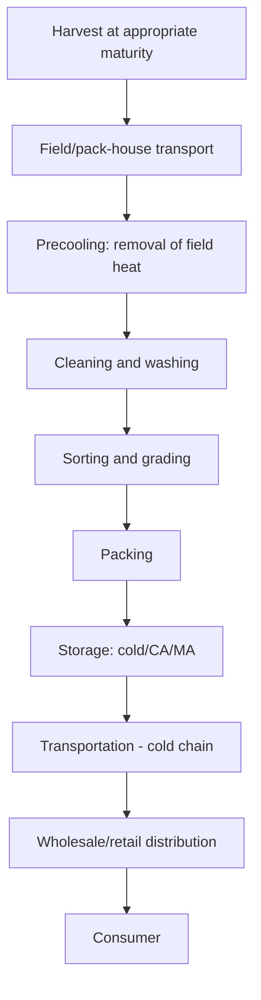

## Postharvest Handling of Produce

### Overview

Postharvest handling encompasses all operations performed on horticultural produce between harvest and final consumption, including cooling, cleaning, sorting, grading, packing, storage, and transportation. Since most fruits and vegetables remain physiologically active after harvest, postharvest management is fundamentally about slowing deteriorative processes (respiration, water loss, senescence, decay) to preserve quality, safety, and marketable shelf life.

### Physiological Basis of Postharvest Deterioration

**Respiration**

Harvested produce continues respiring, consuming stored carbohydrates and releasing energy as heat; respiration rate is a primary driver of shelf life, with higher respiration rates generally correlating with faster quality decline and shorter storage potential.

**Climacteric vs. Non-Climacteric Produce**

- **Climacteric fruits**: exhibit a distinct respiration and ethylene production surge during ripening, allowing harvest at a mature but not fully ripe stage with subsequent ripening occurring off the plant (e.g., banana, tomato, avocado, apple, mango)
- **Non-climacteric fruits**: do not show this respiratory surge and generally must be harvested at or near full ripeness, as they will not continue to ripen (improve in eating quality) significantly after harvest (e.g., citrus, grape, strawberry, most vegetables)

**Ethylene**

A plant hormone produced naturally by many fruits, acting as a ripening and senescence signal. Ethylene-sensitive produce can experience accelerated ripening, yellowing, or quality decline when exposed to ethylene from other produce, external sources (combustion engines, some heating systems), or self-generated accumulation in poorly ventilated storage. Ethylene management (removal via ventilation/scrubbing, or intentional application for ripening control) is a key postharvest technique.

**Transpiration (Water Loss)**

Moisture loss through produce surfaces leads to wilting, shriveling, and weight loss; managed through appropriate humidity control, packaging, and minimizing handling time in low-humidity environments.

### Diagram: Postharvest Handling Chain

### Harvest Maturity and Timing

**Maturity Indices**

Correct harvest timing is foundational to postharvest quality outcomes, as produce harvested too early or too late will have compromised final quality or storage potential regardless of subsequent handling quality. Common indices include:

- Visual indicators: color change, size
- Physical indicators: firmness (via penetrometer), specific gravity
- Chemical indicators: soluble solids content (Brix), starch content, titratable acidity
- Physiological indicators: days from flowering/full bloom, accumulated heat units

**Harvest Timing Considerations**

- Harvesting during cooler periods of the day (early morning) when feasible reduces field heat load and subsequent cooling burden
- Minimizing time between harvest and initial cooling is critical, as field heat accelerates respiration and quality loss during the vulnerable pre-cooling period

### Precooling Methods

Precooling (rapid removal of field heat immediately after harvest) is one of the most impactful postharvest interventions, as it slows respiration rate and subsequent deterioration processes.

**Common Precooling Methods**

- **Room cooling**: produce placed in a refrigerated room, relying on ambient air circulation; slowest method, suitable for less perishable commodities
- **Forced-air cooling**: refrigerated air forced through ventilated packaging/pallets, significantly faster than room cooling; widely used for many fruits and vegetables
- **Hydrocooling**: cold water (often chilled and sometimes chlorinated for sanitation) applied directly to produce via immersion or shower systems; effective and fast for produce tolerant of water contact (e.g., many vegetables, stone fruit)
- **Vacuum cooling**: rapid cooling through evaporative water loss under reduced atmospheric pressure; particularly effective for high-surface-area, leafy produce (e.g., lettuce) due to rapid, uniform cooling
- **Ice cooling (top/package icing)**: direct ice application or ice incorporation into packaging, providing both cooling and humidity maintenance during transport for select commodities

### Cleaning, Sorting, and Grading

**Cleaning/Washing**

Removal of field soil, debris, and surface contaminants; sanitizing rinses (often chlorine-based or other approved sanitizers) may be incorporated to reduce microbial load, particularly important for food safety in fresh-consumed produce.

**Sorting**

Removal of damaged, diseased, or otherwise unmarketable units, typically performed via visual inspection (manual or increasingly automated via optical/imaging sorting systems).

**Grading**

Classification of produce into quality/size categories according to established standards (which may be industry, national, or buyer-specific), determining market channel and price tier; criteria typically include size, color, shape, defect presence, and sometimes internal quality measures (e.g., Brix for some fruit grading).

### Storage Technologies

**Refrigerated (Cold) Storage**

The foundational postharvest storage technology, slowing respiration and microbial growth through temperature reduction. Optimal storage temperature is species-specific and must avoid chilling injury thresholds for chilling-sensitive commodities.

**Controlled Atmosphere (CA) Storage**

Precise, actively maintained modification of storage atmosphere composition (typically reduced O2, elevated CO2 relative to normal air) combined with refrigeration, used to substantially extend storage life for select commodities, most notably apples and pears, where CA storage can extend marketable storage from weeks to many months.

**Modified Atmosphere Packaging (MAP)**

Passive or actively-flushed packaging atmosphere modification at the individual package level (rather than whole-room CA systems), using film permeability characteristics and produce respiration to establish a beneficial atmosphere within the package; widely used in fresh-cut and retail-packaged produce.

**Chilling Injury**

A physiological disorder affecting chilling-sensitive commodities (predominantly of tropical/subtropical origin, e.g., tomato, cucumber, banana, mango) when stored below a critical temperature threshold (often in the range of 10–13°C depending on species), resulting in symptoms such as surface pitting, discoloration, uneven ripening, and increased susceptibility to decay, sometimes appearing only after return to warmer temperatures.

### Illustration: Storage Temperature Requirements by Commodity Group (svg_diagram)

<svg xmlns="http://www.w3.org/2000/svg" viewBox="0 0 700 340">
<text x="350" y="25" text-anchor="middle" font-size="16" font-weight="bold" fill="#1a1a1a">Storage Temperature Requirements by Commodity Group (svg_diagram)</text>
<line x1="80" y1="280" x2="650" y2="280" stroke="#333" stroke-width="2" />
<text x="365" y="310" text-anchor="middle" font-size="12">Approximate Storage Temperature (°C)</text>
<rect x="100" y="240" width="60" height="20" fill="#90caf9" />
<text x="130" y="235" text-anchor="middle" font-size="10">0-2°C</text>
<text x="130" y="270" text-anchor="middle" font-size="10" transform="rotate(0)">Leafy greens</text>
<rect x="200" y="230" width="60" height="30" fill="#64b5f6" />
<text x="230" y="225" text-anchor="middle" font-size="10">0-4°C</text>
<text x="230" y="270" text-anchor="middle" font-size="10">Apple/pear</text>
<rect x="300" y="200" width="60" height="60" fill="#42a5f5" />
<text x="330" y="195" text-anchor="middle" font-size="10">4-7°C</text>
<text x="330" y="270" text-anchor="middle" font-size="10">Citrus</text>
<rect x="400" y="150" width="60" height="110" fill="#ffb74d" />
<text x="430" y="145" text-anchor="middle" font-size="10">10-13°C</text>
<text x="430" y="270" text-anchor="middle" font-size="10">Tomato</text>
<rect x="500" y="150" width="60" height="110" fill="#ff8a65" />
<text x="530" y="145" text-anchor="middle" font-size="10">10-13°C</text>
<text x="530" y="270" text-anchor="middle" font-size="10">Cucumber</text>
<rect x="580" y="140" width="60" height="120" fill="#e57373" />
<text x="610" y="135" text-anchor="middle" font-size="10">12-14°C</text>
<text x="610" y="270" text-anchor="middle" font-size="10">Banana</text>
<line x1="380" y1="140" x2="660" y2="140" stroke="#c62828" stroke-dasharray="4,4" />
<text x="500" y="130" text-anchor="middle" font-size="10" fill="#c62828">Chilling-sensitive zone (approx. threshold)</text>
</svg>

### Packaging

**Functions of Postharvest Packaging**

- Physical protection from mechanical damage (compression, vibration, impact) during handling and transport
- Moisture retention to reduce transpirational water loss
- Facilitation of appropriate airflow for cooling and respiration gas exchange
- Consumer-facing information (grading, branding, food safety labeling)

**Common Packaging Types**

- Corrugated fiberboard cartons (ventilated for airflow)
- Plastic clamshells and trays for delicate or fresh-cut produce
- Mesh or perforated bags allowing airflow for commodities like citrus or onions
- Modified atmosphere film packaging for fresh-cut and extended-shelf-life retail products

### Cold Chain Management

**Concept**

Maintaining an unbroken sequence of appropriate temperature control from harvest/precooling through storage, transportation, and retail display; breaks in the cold chain (temperature abuse) at any point can substantially reduce the benefit of proper handling at all other stages, since quality loss and decay progression are often irreversible once initiated.

**Key Cold Chain Components**

- Refrigerated transport vehicles (reefer trucks, containers) maintaining set-point temperatures during transit
- Temperature monitoring and data logging throughout the supply chain to verify cold chain integrity
- Rapid transfer procedures at loading/unloading points to minimize temperature exposure gaps
- Retail display case temperature management as the final cold chain segment before consumer purchase

### Postharvest Disease and Decay Management

**Common Postharvest Pathogens**

Fungal pathogens (e.g., *Botrytis*, *Penicillium*, *Rhizopus*, *Colletotrichum* causing anthracnose) are major causes of postharvest decay, often entering through wounds, natural openings, or pre-existing field infections that remain latent until favorable postharvest conditions trigger disease development.

**Management Approaches**

- Careful harvest and handling to minimize physical wounding (primary infection entry points)
- Sanitation of packing house equipment, water (hydrocoolers, wash tanks), and storage facilities to reduce pathogen inoculum
- Postharvest fungicide treatments (where approved) applied at packing
- Temperature management, as most postharvest decay organisms have reduced growth rates at lower storage temperatures
- Controlled/modified atmosphere storage, which can also suppress some pathogen development in addition to slowing produce senescence

### Physiological Disorders

Distinct from pathogen-caused decay, physiological disorders arise from non-infectious stress or imbalance, including:

- **Chilling injury**: discussed above, affecting chilling-sensitive commodities stored below critical thresholds
- **Freezing injury**: ice crystal formation causing cellular damage in produce exposed to temperatures below their freezing point
- **Internal browning/breakdown**: various causes including CA storage mismanagement (excessive CO2 or insufficient O2) or extended storage duration
- **Water core, bitter pit, and other nutrient/physiological imbalance disorders**: often linked to pre-harvest factors (e.g., calcium nutrition) manifesting as postharvest quality defects

### Practical Example: Postharvest Handling Protocol for Leafy Greens

**Scenario**: A packing operation needs to establish a postharvest protocol for freshly harvested lettuce destined for fresh-market retail.

1. **Harvest timing**: Harvest during cooler morning hours to minimize field heat accumulation before processing.
2. **Rapid transport**: Move harvested product to the packing facility with minimal delay to limit field heat exposure time.
3. **Precooling method selection**: Apply vacuum cooling, well-suited to the high surface-area-to-volume ratio of leafy greens, achieving rapid and uniform temperature reduction shortly after harvest.
4. **Washing/sanitizing**: Wash in sanitized, chilled water to remove field debris and reduce microbial load while reinforcing the cooling effect.
5. **Sorting and packing**: Remove damaged or discolored leaves/heads, pack into appropriately ventilated containers or modified atmosphere packaging suited to the retail format.
6. **Cold chain maintenance**: Store and transport at the crop's target temperature range (commonly near 0–2°C for lettuce) with continuous monitoring through distribution to retail.

**Key Points**

- Leafy greens have high respiration rates and large surface areas relative to volume, making rapid precooling especially critical to prevent quality loss.
- Vacuum cooling's speed and uniformity make it particularly well suited to high-surface-area commodities compared to other precooling methods.
- Maintaining consistent low temperature throughout the entire chain is essential, as leafy greens have limited storage life and are highly sensitive to any interruption in cold chain integrity.

### Food Safety in Postharvest Handling

**Key Considerations**

- Water quality management for washing, hydrocooling, and other water-contact processes, since water can serve as a pathogen transmission vector if not properly sanitized and monitored
- Worker hygiene practices throughout harvest and packing operations
- Traceability systems enabling identification of product origin and handling history in the event of a food safety concern
- Compliance with applicable food safety regulatory frameworks, which vary by country/region and specific commodity risk profiles

### Conclusion

Postharvest handling is a critical extension of horticultural production quality, since even optimally grown and harvested produce can suffer substantial quality and value loss through inadequate postharvest management. Effective postharvest systems integrate correct harvest timing, prompt and appropriate cooling, careful handling to minimize mechanical damage, and unbroken cold chain maintenance, all calibrated to the specific physiological characteristics (respiration rate, ethylene sensitivity, chilling sensitivity) of each commodity.

**Related Topics**

- Cold chain logistics and monitoring technology
- Controlled atmosphere and modified atmosphere storage systems
- Postharvest disease management and sanitation practices
- Food safety regulations for fresh produce
- Ethylene management and ripening room technology
- Fresh-cut produce processing
- Packaging material science for produce protection
- Precooling technology selection by commodity
- Physiological disorders in stored produce
- Supply chain traceability systems in fresh produce