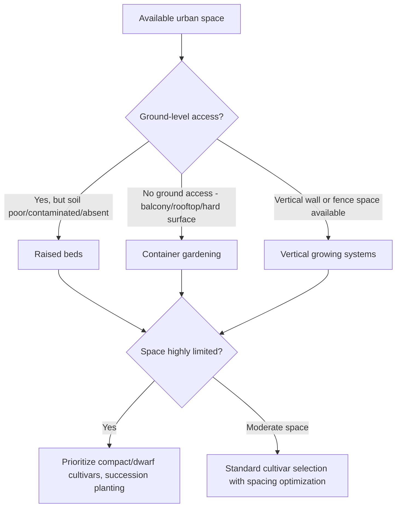

## Urban and Container Gardening

### Overview

Urban and container gardening refers to horticultural production adapted to space-constrained environments, typically in cities, using containers, raised beds, and vertical growing systems rather than conventional open-ground field or garden plots. These approaches make food and ornamental plant production accessible in settings with limited, poor-quality, or absent soil, and are increasingly integrated into broader urban agriculture and food system initiatives.

### Classification of Urban Growing Systems

**By Growing Medium/Structure**

- **Container gardening**: plants grown in pots, buckets, grow bags, or other discrete vessels filled with growing media, usable on balconies, patios, rooftops, or any hard-surface area
- **Raised bed gardening**: contained growing areas built above ground level, filled with imported soil/media, used where native soil is poor, contaminated, or absent (common on paved urban lots)
- **Vertical gardening systems**: wall-mounted, stacked, or trellised systems maximizing growing area per unit of ground/floor footprint
- **Rooftop gardens/farms**: production systems installed on building rooftops, ranging from container arrangements to more substantial soil-based or hydroponic rooftop farm installations
- **Community gardens**: shared plots (often raised bed or in-ground where soil permits) allocated to multiple individual gardeners within a shared urban site

**By Growing Method**

- **Soil/substrate-based**: traditional potting mix or amended soil in containers or raised beds
- **Hydroponic/soilless systems**: increasingly used in urban settings for space efficiency and where soil access or contamination is a concern (see Greenhouse and Protected Cultivation for detailed hydroponic system types)

### Diagram: Urban Growing System Selection Framework

### Container Gardening Fundamentals

**Container Selection**

- Material considerations: plastic (lightweight, retains moisture well, lower cost), terracotta/clay (porous, better aeration but faster drying, heavier), fabric grow bags (excellent aeration and root pruning effect, lightweight for transport)
- Drainage: adequate drainage holes are essential to prevent waterlogging and root rot, a leading cause of container plant failure
- Size matching: container volume must accommodate the mature root system of the intended crop; undersized containers restrict growth and increase watering frequency demands, while oversized containers relative to plant size can lead to waterlogged, poorly aerated media around an underdeveloped root zone

**Growing Media for Containers**

- Soilless potting mixes (peat- or coir-based, combined with perlite/vermiculite for aeration and drainage) are strongly preferred over garden soil for container use, as garden soil typically compacts poorly in confined container conditions, restricting root aeration and drainage
- Media should provide a balance of water retention (to reduce watering frequency) and drainage/aeration (to prevent waterlogging)
- Periodic replacement or amendment of container media is necessary as organic components decompose and physical structure degrades over multiple growing seasons

**Watering Management**

Container-grown plants generally require more frequent watering than in-ground plants due to limited soil volume and buffer capacity, faster drying (particularly in smaller containers, porous materials, or hot/windy urban microclimates), and restricted root zone extent for water uptake.

### Raised Bed Gardening

**Advantages**

- Enables cultivation on sites with contaminated, compacted, or otherwise unsuitable native soil by physically separating the growing medium from the underlying ground
- Improved drainage and soil warming (raised beds typically warm faster in spring than ground-level soil, extending the growing season slightly)
- Easier accessibility for gardeners with mobility limitations when built at appropriate height
- Reduced weed pressure compared to ground-level beds, particularly when lined appropriately

**Construction Considerations**

- Material selection (untreated wood, composite lumber, metal, masonry) with attention to avoiding materials that may leach contaminants into food-growing media (e.g., avoiding certain older pressure-treated lumber formulations for edible crop beds)
- Bed depth appropriate to intended crops (shallow-rooted crops like lettuce may need only 15–20 cm, while deeper-rooted crops like tomatoes or root vegetables benefit from 30+ cm)
- Base/liner considerations when placing over contaminated soil or hard surfaces, sometimes including a barrier layer to prevent contact with underlying contaminated soil while still allowing drainage

### Soil Contamination Considerations in Urban Settings

A distinctive concern in urban gardening (compared to most rural agricultural contexts) is the potential for soil contamination from historical industrial use, lead-based paint residue (common near older building foundations), vehicle emissions residue, or other urban pollution sources.

**Risk Management Approaches**

- Soil testing for heavy metals (particularly lead) and other contaminants before establishing in-ground gardens on urban sites with uncertain land use history
- Use of raised beds with imported clean growing media as a primary mitigation strategy where contamination is confirmed or suspected
- Physical barriers (landscape fabric, mulch layers) to reduce soil splash onto edible plant parts even when using raised beds over contaminated ground
- Awareness that leafy vegetables and root crops generally show higher potential for contaminant uptake/accumulation compared to fruiting vegetables, informing crop selection choices on sites of uncertain soil quality [Inference: specific uptake risk varies by contaminant type, concentration, soil chemistry, and plant species]

### Vertical Gardening Systems

**Approaches**

- **Trellising**: training vining crops (cucumber, pole beans, some squash, tomato) vertically to reduce ground footprint while maintaining or improving light exposure and airflow
- **Wall-mounted planting systems**: pocket-style fabric planters, modular wall panel systems, or living wall installations supporting shallow-rooted crops (herbs, leafy greens, some ornamentals)
- **Stacked/tiered container systems**: multiple planting levels arranged vertically to maximize growing area per unit floor footprint
- **Hanging containers**: baskets or suspended pots utilizing overhead space, common for trailing herbs, strawberries, and ornamental plants

**Considerations**

- Structural support and weight-bearing capacity must be verified, particularly for wall-mounted or rooftop vertical systems, given the substantial weight of saturated growing media
- Irrigation design becomes more complex in vertical systems, often requiring drip irrigation with careful attention to even water distribution across different heights/tiers

### Illustration: Container Size Guidelines by Crop Type (svg_diagram)

<svg xmlns="http://www.w3.org/2000/svg" viewBox="0 0 700 320">
<text x="350" y="25" text-anchor="middle" font-size="16" font-weight="bold" fill="#1a1a1a">Container Size Guidelines by Crop Type (svg_diagram)</text>
<rect x="60" y="240" width="80" height="40" fill="#a5d6a7" stroke="#2e7d32" />
<text x="100" y="265" text-anchor="middle" font-size="10">Herbs</text>
<text x="100" y="300" text-anchor="middle" font-size="10">15-20 cm depth</text>
<rect x="180" y="220" width="90" height="60" fill="#81c784" stroke="#2e7d32" />
<text x="225" y="255" text-anchor="middle" font-size="10">Lettuce/</text>
<text x="225" y="268" text-anchor="middle" font-size="10">greens</text>
<text x="225" y="300" text-anchor="middle" font-size="10">20-25 cm depth</text>
<rect x="310" y="180" width="100" height="100" fill="#66bb6a" stroke="#2e7d32" />
<text x="360" y="225" text-anchor="middle" font-size="10">Peppers/</text>
<text x="360" y="238" text-anchor="middle" font-size="10">bush beans</text>
<text x="360" y="300" text-anchor="middle" font-size="10">25-30 cm depth</text>
<rect x="450" y="140" width="110" height="140" fill="#43a047" stroke="#1b5e20" />
<text x="505" y="195" text-anchor="middle" font-size="10">Tomato</text>
<text x="505" y="208" text-anchor="middle" font-size="10">(determinate)</text>
<text x="505" y="300" text-anchor="middle" font-size="10">30-40 cm depth</text>
<rect x="600" y="110" width="80" height="170" fill="#2e7d32" stroke="#1b5e20" />
<text x="640" y="170" text-anchor="middle" font-size="10">Dwarf</text>
<text x="640" y="183" text-anchor="middle" font-size="10">fruit tree</text>
<text x="640" y="300" text-anchor="middle" font-size="10">50+ cm depth</text>
</svg>

### Crop Selection for Urban and Container Growing

**Favorable Characteristics**

- Compact or dwarf cultivars specifically bred for container performance (e.g., determinate/patio tomato varieties, dwarf pepper cultivars, bush-type rather than vining squash)
- Shallow to moderate root systems compatible with limited container volume
- Shorter crop cycles enabling succession planting within limited space over a growing season
- High value-per-space-unit crops (herbs, salad greens, cherry tomatoes) that maximize return on limited growing area

**Commonly Successful Urban Container Crops**

- Herbs (basil, parsley, chives, mint - though mint's spreading habit makes container growing advisable even in ground settings)
- Leafy greens (lettuce, spinach, Swiss chard)
- Compact fruiting vegetables (patio tomatoes, peppers, bush cucumbers)
- Root vegetables in adequately deep containers (radish more readily than deep-rooted carrots, though appropriate container depth accommodates most root crops)
- Dwarf fruit trees and berry shrubs in large containers, particularly on rootstocks selected for restricted growth

### Nutrient and Water Management in Confined Systems

**Fertilization**

Container growing media, particularly soilless mixes, typically have limited native nutrient reserves compared to garden soil and require more frequent supplemental fertilization, often via:

- Slow-release granular fertilizers incorporated at planting
- Regular liquid fertilizer applications (fertigation-style) throughout the growing season, particularly important given the more frequent watering (and associated nutrient leaching) inherent to container systems

**Irrigation Frequency**

Container plants in full sun urban settings (particularly on heat-retaining surfaces like rooftops or paved patios) may require daily or even twice-daily watering during hot weather, given limited media volume buffer capacity; self-watering container designs (incorporating a water reservoir) can reduce watering frequency demands and improve consistency.

### Microclimate Considerations in Urban Settings

**Urban Heat Island Effect**

Cities generally exhibit elevated ambient and surface temperatures compared to surrounding rural areas, particularly pronounced on paved surfaces and near buildings, affecting plant heat stress risk, water demand, and in some cases extending frost-free growing seasons relative to regional averages. [Inference: magnitude of urban heat island effect on specific microclimates varies substantially by city, site exposure, and surrounding surface materials]

**Light Availability**

Building shading, particularly in dense urban environments, can substantially reduce available sunlight compared to open rural or suburban sites, requiring careful crop selection matched to actual site light conditions (full sun vs. partial shade tolerant species) rather than general regional assumptions.

**Wind Exposure**

Rooftop and balcony sites, particularly at height in urban settings, often experience increased wind exposure compared to ground-level gardens, increasing transpirational water loss and physical plant stress, sometimes necessitating windbreak measures or wind-tolerant plant selection.

### Practical Example: Establishing a Balcony Vegetable Garden

**Scenario**: An urban resident wants to establish a productive vegetable garden on a south-facing balcony with limited floor space and weight-bearing considerations.

1. **Site assessment**: Confirm actual sunlight hours received (accounting for adjacent building shading) and check with building management regarding weight limits for container placement, particularly relevant for larger containers filled with saturated media.
2. **Container selection**: Choose lightweight fabric grow bags or plastic containers to manage weight, sized appropriately to intended crops (larger for tomato/pepper, smaller for herbs and greens).
3. **Vertical space utilization**: Install a trellis system against the balcony railing for vining crops like cucumber or pole beans, maximizing growing area without increasing floor footprint.
4. **Crop selection**: Prioritize compact/dwarf cultivars (patio tomato, bush pepper varieties) alongside high-value, quick-turnaround crops (herbs, lettuce) suited to the available space and light conditions.
5. **Irrigation setup**: Consider self-watering containers or a simple drip irrigation system on a timer to manage the increased watering frequency demands of container growing in a potentially wind-exposed, heat-retaining balcony environment.
6. **Succession planning**: Plan successive plantings of quick-cycle crops (lettuce, radish) in vacated container space throughout the season to maximize productivity from limited growing area.

**Key Points**

- Weight-bearing capacity is a genuine structural consideration for balcony and rooftop container gardens, not merely a horticultural one.
- Actual measured sunlight hours, rather than general regional climate assumptions, should guide crop selection given urban shading effects.
- Vertical growing strategies are particularly valuable in floor-space-constrained urban settings for maximizing productivity.

### Community and Urban Agriculture Integration

Urban and container gardening principles extend into larger-scale community garden and urban farm initiatives, which additionally involve considerations such as:

- Shared plot allocation and governance structures
- Communal infrastructure (shared water access, tool storage, composting systems)
- Food access and food security program integration in some community garden models
- Educational and community-building functions alongside direct food production goals

### Conclusion

Urban and container gardening adapts core horticultural principles to space-constrained, often soil-limited environments through containerization, raised bed construction, and vertical growing strategies. Success in these settings requires particular attention to container/media selection, more intensive water and nutrient management than typical in-ground gardening, awareness of urban-specific microclimate and soil contamination considerations, and crop selection favoring compact, high-value, and appropriately shallow-rooted cultivars.

**Related Topics**

- Soilless potting media formulation
- Raised bed construction and material selection
- Urban soil contamination testing and remediation
- Vertical farming and living wall systems
- Self-watering container design
- Community garden planning and management
- Compact and dwarf cultivar breeding
- Rooftop agriculture and structural load considerations
- Urban heat island effects on plant growth
- Small-scale composting for urban gardens