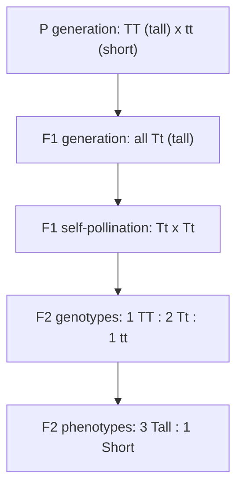
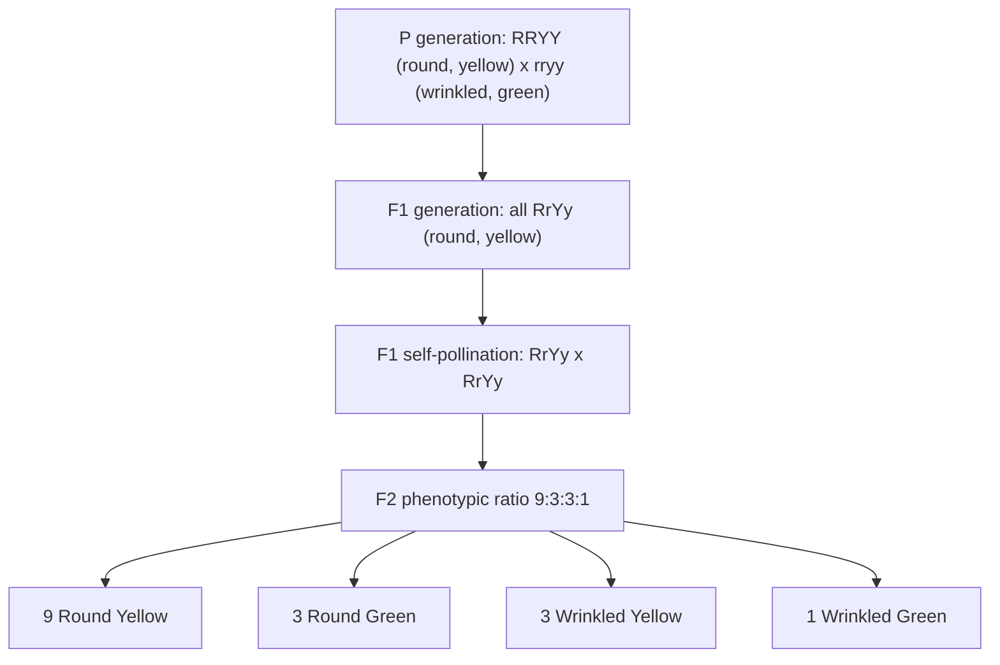

## Principles of Mendelian Genetics

### Overview

Mendelian genetics describes the fundamental rules of inheritance discovered by Gregor Mendel through his 19th-century experiments on garden pea (*Pisum sativum*), establishing the foundational framework for understanding how traits are transmitted from parents to offspring. These principles remain central to plant breeding, underpinning the prediction and manipulation of trait inheritance in crop improvement programs.

### Historical Context and Mendel's Experimental Approach

Mendel selected the garden pea for his experiments due to several favorable characteristics: availability of clearly distinguishable, discrete trait variants (rather than continuous variation), a naturally self-pollinating reproductive system enabling controlled crosses, and a relatively short generation time allowing multi-generational study within a practical timeframe. He examined seven distinct trait pairs, including seed shape (round vs. wrinkled), seed color (yellow vs. green), flower color (purple vs. white), and plant height (tall vs. short), tracking their inheritance patterns across controlled crosses.

### Basic Genetic Terminology

**Gene**

A unit of heredity occupying a specific location (locus) on a chromosome, encoding information for a particular trait or function.

**Allele**

An alternative form of a gene; diploid organisms carry two alleles for each gene (one inherited from each parent).

**Genotype**

The genetic constitution of an organism at a given locus (or across the genome), describing which alleles are present.

**Phenotype**

The observable physical or biochemical characteristics resulting from the genotype, often influenced by environmental interaction as well.

**Homozygous**

Possessing two identical alleles at a given locus (e.g., $AA$ or $aa$).

**Heterozygous**

Possessing two different alleles at a given locus (e.g., $Aa$).

**Dominant and Recessive Alleles**

A dominant allele is one whose phenotypic effect is expressed in the heterozygous condition, masking the effect of the recessive allele; a recessive allele's phenotypic effect is only observed in the homozygous recessive condition. By convention, dominant alleles are represented with an uppercase letter and recessive alleles with the corresponding lowercase letter.

### Mendel's Law of Segregation (First Law)

**Statement**

Each individual carries two alleles for each gene, and these two alleles segregate (separate) from each other during gamete formation, such that each gamete carries only one allele for each gene.

**Basis in Meiosis**

This law reflects the behavior of homologous chromosome pairs during meiosis, where homologs separate into different daughter cells, ensuring that each resulting gamete receives exactly one allele from each homologous pair.

**Monohybrid Cross Example**

Crossing two true-breeding (homozygous) parents differing in a single trait, such as tall ($TT$) and short ($tt$) pea plants, produces an $F_1$ generation that is uniformly heterozygous ($Tt$) and phenotypically tall (assuming tall is dominant). Self-pollinating the $F_1$ generation produces an $F_2$ generation segregating in a characteristic 3:1 phenotypic ratio (three tall to one short), reflecting the underlying 1:2:1 genotypic ratio ($TT:Tt:tt$).

### Diagram: Monohybrid Cross - Law of Segregation

### Punnett Square Analysis

A Punnett square is a diagrammatic tool predicting the genotypic and phenotypic ratios of offspring from a given cross, arranging possible gametes from each parent along two axes and filling in the resulting offspring genotype combinations.

**Monohybrid Cross Punnett Square ($Tt \times Tt$)**

|  | $T$ | $t$ |
| --- | --- | --- |
| $T$ | $TT$ | $Tt$ |
| $t$ | $Tt$ | $tt$ |

This produces a genotypic ratio of $1\,TT : 2\,Tt : 1\,tt$ and, assuming complete dominance, a phenotypic ratio of $3$ dominant : $1$ recessive.

### Mendel's Law of Independent Assortment (Second Law)

**Statement**

Alleles of different genes (located on different chromosome pairs, or sufficiently far apart on the same chromosome to assort independently) segregate independently of one another during gamete formation, meaning the inheritance of one trait does not influence the inheritance of another.

**Dihybrid Cross Example**

Crossing parents differing in two independently assorting traits, such as seed shape (round $R$ dominant, wrinkled $r$ recessive) and seed color (yellow $Y$ dominant, green $y$ recessive), starting from true-breeding parents ($RRYY \times rryy$) produces an $F_1$ generation uniformly heterozygous at both loci ($RrYy$). Self-pollinating the $F_1$ generation produces an $F_2$ generation segregating in the characteristic 9:3:3:1 phenotypic ratio.

$$9\, R\_Y\_ : 3\, R\_yy : 3\, rrY\_ : 1\, rryy$$

Where the underscore denotes either allele (dominant or recessive) at that position, since only one dominant allele is needed to express the dominant phenotype.

### Diagram: Dihybrid Cross - Law of Independent Assortment

**Limitation: Linkage**

Independent assortment holds true for genes located on different chromosomes or far apart on the same chromosome; genes located close together on the same chromosome tend to be inherited together (linked) rather than assorting independently, a departure from Mendel's second law explored further in linkage and recombination analysis. [Inference: the specific recombination frequency between linked genes depends on physical distance and is determined empirically through cross data]

### Test Cross

**Purpose**

A test cross is used to determine whether an individual displaying a dominant phenotype is homozygous dominant or heterozygous, since both genotypes produce the same observable phenotype under complete dominance.

**Method**

The individual of unknown genotype is crossed with a homozygous recessive individual (whose genotype is certain). The resulting offspring ratios reveal the unknown parent's genotype:

- If the unknown parent is homozygous dominant ($AA \times aa$), all offspring will display the dominant phenotype
- If the unknown parent is heterozygous ($Aa \times aa$), offspring will segregate approximately 1:1 between dominant and recessive phenotypes

### Extensions and Modifications to Simple Mendelian Ratios

**Incomplete Dominance**

Neither allele is fully dominant, and the heterozygous phenotype is intermediate between the two homozygous phenotypes (e.g., red x white flower color producing pink-flowered heterozygotes in some ornamental species).

**Codominance**

Both alleles are fully and simultaneously expressed in the heterozygous phenotype, rather than blending (e.g., certain flower color patterns where both parental pigments appear distinctly, such as spotted or striped patterns rather than a blended intermediate color).

**Multiple Alleles**

Some genes have more than two allelic forms present within a population, though any individual diploid organism still carries only two alleles at that locus.

**Epistasis**

Interaction between genes at different loci, where the expression of one gene masks or modifies the phenotypic expression of another gene, producing phenotypic ratios that deviate from the standard 9:3:3:1 dihybrid ratio.

**Polygenic Inheritance**

Traits controlled by multiple genes acting cumulatively, typically producing continuous rather than discrete phenotypic variation (e.g., many quantitative agronomic traits such as yield, plant height in most crops beyond simple single-gene height differences, and fruit size), in contrast to the discrete, single-gene traits Mendel specifically selected for study.

### Illustration: Extensions Beyond Simple Mendelian Dominance (svg_diagram)

<svg xmlns="http://www.w3.org/2000/svg" viewBox="0 0 700 300">
<text x="350" y="25" text-anchor="middle" font-size="16" font-weight="bold" fill="#1a1a1a">Extensions Beyond Simple Mendelian Dominance (svg_diagram)</text>

<text x="115" y="55" text-anchor="middle" font-size="12" font-weight="bold">Complete Dominance</text>

<circle cx="65" cy="90" r="20" fill="`#c62828`" />

<text x="65" y="125" text-anchor="middle" font-size="9">Red (RR)</text>

<circle cx="165" cy="90" r="20" fill="`#ffffff`" stroke="#333" />

<text x="165" y="125" text-anchor="middle" font-size="9">White (rr)</text>

<text x="115" y="150" text-anchor="middle" font-size="10">↓</text>

<circle cx="115" cy="180" r="20" fill="`#c62828`" />

<text x="115" y="215" text-anchor="middle" font-size="9">Heterozygote (Rr) = Red</text>

<text x="350" y="55" text-anchor="middle" font-size="12" font-weight="bold">Incomplete Dominance</text>

<circle cx="300" cy="90" r="20" fill="`#c62828`" />

<circle cx="400" cy="90" r="20" fill="`#ffffff`" stroke="#333" />

<text x="350" y="150" text-anchor="middle" font-size="10">↓</text>

<circle cx="350" cy="180" r="20" fill="`#f48fb1`" />

<text x="350" y="215" text-anchor="middle" font-size="9">Heterozygote = Pink (intermediate)</text>

<text x="585" y="55" text-anchor="middle" font-size="12" font-weight="bold">Codominance</text>

<circle cx="535" cy="90" r="20" fill="`#c62828`" />

<circle cx="635" cy="90" r="20" fill="`#ffffff`" stroke="#333" />

<text x="585" y="150" text-anchor="middle" font-size="10">↓</text>

<circle cx="585" cy="180" r="20" fill="`#ffffff`" stroke="#333" />

<path d="M 565 165 L 605 195 M 605 165 L 565 195" stroke="`#c62828`" stroke-width="3" />

<text x="585" y="215" text-anchor="middle" font-size="9">Heterozygote = both colors expressed</text>

</svg>

### Application of Mendelian Principles in Plant Breeding

**Predicting Cross Outcomes**

Breeders apply Punnett square and probability-based analysis to predict the proportion of desired genotypes/phenotypes expected from planned crosses, informing population size decisions needed to recover a target genotype with reasonable statistical confidence.

**Backcrossing Programs**

Repeated crossing of a hybrid or its descendants back to one parental line (the recurrent parent) to recover the recurrent parent's genetic background while retaining a specific target trait from the donor parent, relying on Mendelian segregation to eventually isolate lines that are homozygous for the desired introgressed trait while otherwise matching the recurrent parent genotype.

**Pedigree Breeding and Selection**

Tracking trait segregation across generations following Mendelian ratios to select desired genotype combinations in segregating populations (e.g., $F_2$ and subsequent generations following a hybridization cross between two distinct parental lines).

**Marker-Assisted Selection**

Modern breeding programs frequently combine Mendelian principles with molecular marker technology to more precisely and efficiently track the inheritance of specific alleles, particularly valuable for traits that are difficult, slow, or costly to phenotype directly, or where marker-trait linkage allows earlier-generation selection than would be possible through phenotypic evaluation alone.

### Practical Example: Applying Segregation Ratios in a Breeding Cross

**Scenario**: A plant breeder crosses a disease-resistant line (homozygous dominant, $RR$, for a single dominant resistance gene) with a susceptible commercial variety (homozygous recessive, $rr$) to introgress resistance while planning subsequent generations.

1. **F1 generation**: All offspring are heterozygous ($Rr$) and phenotypically resistant, since resistance is dominant; this generation cannot yet be used to identify homozygous resistant individuals, as $Rr$ and $RR$ are phenotypically indistinguishable under complete dominance.
2. **F1 self-pollination to produce F2**: Following the law of segregation, the F2 generation is expected to segregate approximately 1 $RR$ : 2 $Rr$ : 1 $rr$, or a 3:1 phenotypic ratio of resistant to susceptible.
3. **Population size planning**: To identify a reasonable number of individuals from the desired homozygous resistant ($RR$) genotype class (representing 1 in 4 of the population, or 1 in 3 among the resistant-phenotype individuals), the breeder must plant a sufficiently large F2 population, since the RR and Rr genotypes are phenotypically identical and require a further test cross or molecular marker analysis to distinguish.
4. **Test cross or marker confirmation**: Selected resistant F2 individuals are test-crossed with a susceptible tester or genotyped via molecular markers linked to the resistance gene to confirm homozygosity before advancing lines into further breeding or variety development stages.

**Key Points**

- Complete dominance means phenotypic screening alone cannot distinguish homozygous dominant from heterozygous individuals, requiring test crosses or marker-based genotyping for confirmation.
- Expected segregation ratios directly inform the population size needed to have reasonable confidence of recovering individuals with the desired genotype.
- Mendelian segregation principles remain foundational even in breeding programs that incorporate modern molecular marker technology, since markers are used to more efficiently track the same underlying segregation patterns Mendel described.

### Limitations of Mendelian Genetics for Complex Agronomic Traits

Many economically important agronomic traits (yield, drought tolerance, many quality parameters) are polygenic and quantitatively inherited, showing continuous rather than discrete phenotypic distributions and being substantially influenced by environmental interaction (genotype-by-environment interaction). Such traits require quantitative genetics approaches (Quantitative Trait Loci, QTL, analysis; genomic selection) that build upon but extend beyond simple Mendelian single-gene segregation analysis. [Inference: the relative contribution of genetic versus environmental variance for any specific quantitative trait depends on the trait, germplasm, and environment in question, and is typically estimated through heritability studies]

### Conclusion

Mendel's laws of segregation and independent assortment established the foundational logic of particulate inheritance, replacing earlier blending inheritance concepts and providing the predictive framework still used throughout plant breeding today. While many economically important traits deviate from simple Mendelian ratios due to polygenic control, epistasis, or incomplete/codominance, the underlying segregation and assortment principles remain the conceptual bedrock upon which modern quantitative and molecular breeding approaches are built.

**Related Topics**

- Linkage, recombination, and genetic mapping
- Quantitative trait loci (QTL) analysis
- Marker-assisted selection and genomic selection
- Backcross breeding methodology
- Heritability and genotype-by-environment interaction
- Hybrid vigor (heterosis) in crop breeding
- Population genetics principles (Hardy-Weinberg equilibrium)
- Cytogenetics and chromosome behavior in meiosis
- Pedigree and bulk breeding methods
- Epistasis and gene interaction in trait expression