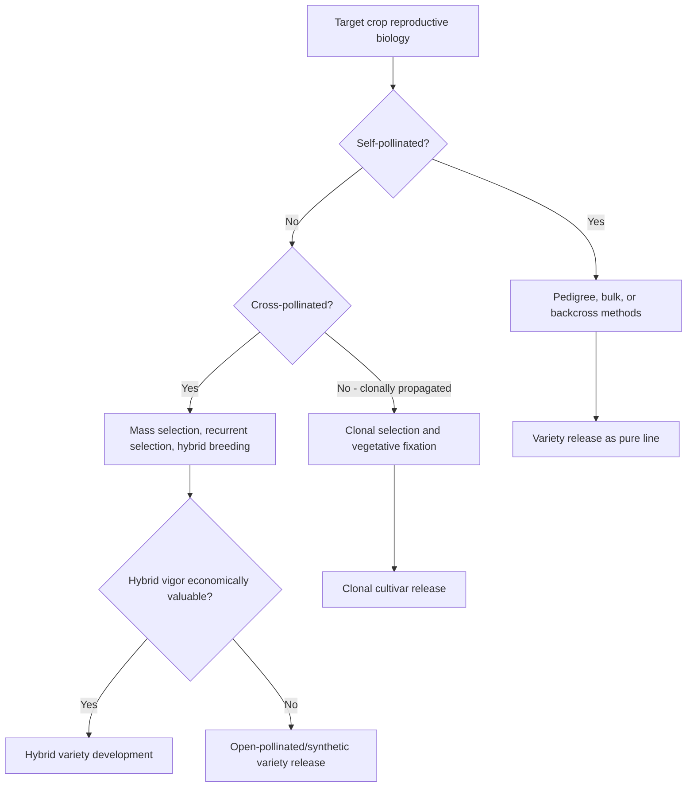
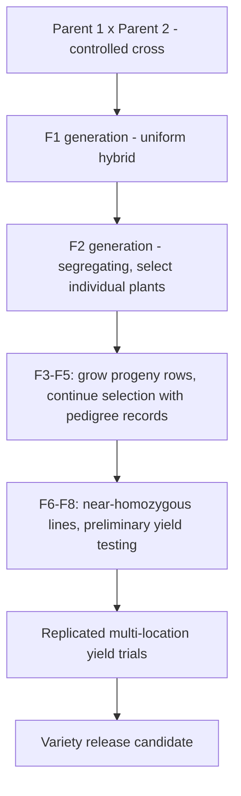

## Plant Breeding Methods

### Overview

Plant breeding methods encompass the systematic approaches used to develop improved crop varieties by manipulating genetic variation through selection, hybridization, and increasingly, molecular and biotechnological tools. Method selection depends fundamentally on the target crop's reproductive biology (self-pollinated, cross-pollinated, or clonally propagated), the genetic architecture of the target trait(s), and available resources and timeframes.

### Breeding Method Classification by Reproductive Biology

**Self-Pollinated Crops**

Species predominantly reproducing through self-fertilization (e.g., wheat, rice, soybean, common bean, tomato), naturally existing as largely homozygous, true-breeding lines in their unimproved state, with breeding methods generally aimed at creating and fixing new homozygous combinations following hybridization.

**Cross-Pollinated Crops**

Species predominantly reproducing through cross-fertilization (e.g., maize, rye, many forage grasses, most vegetable brassicas), naturally maintaining high heterozygosity within populations, with breeding methods often exploiting heterosis (hybrid vigor) and population improvement approaches.

**Clonally Propagated Crops**

Species reproduced vegetatively rather than through seed for commercial production (e.g., potato, sugarcane, many fruit tree cultivars, banana), where breeding focuses on identifying superior individual genotypes that can then be fixed permanently through clonal propagation, since seed propagation would not maintain the specific genotype.

### Diagram: Breeding Method Selection by Reproductive Biology

### Selection-Based Methods

**Mass Selection**

Individual plants displaying desired phenotypes are selected from a genetically variable population, and their seed is bulked together to form the next generation, repeated over successive cycles. Simple and low-cost, but selection is based on phenotype alone (without progeny testing), making it most effective for highly heritable traits with limited environmental influence.

**Pure Line Selection**

Applied primarily in self-pollinated crops, involving selection of a single superior plant from a genetically variable (often naturally occurring or landrace) population, followed by self-pollination and evaluation of its progeny to establish a genetically uniform, homozygous pure line variety.

**Progeny Testing**

Evaluation of a selected individual's offspring performance (rather than the individual's own phenotype alone) to more accurately assess genetic merit, particularly valuable for traits with low heritability or for identifying combining ability in cross-pollinated species.

### Hybridization-Based Methods (Self-Pollinated Crops)

**Pedigree Method**

Following a controlled cross between two parental lines, individual plants are selected in each segregating generation (typically starting from $F_2$), with careful records maintained of the parentage and selection history (the "pedigree") of each line. Selection continues across successive selfed generations until sufficient homozygosity is achieved (typically by $F_5$–$F_8$), at which point promising lines are evaluated in replicated yield trials before potential variety release.

**Bulk Method**

Following the initial hybridization, segregating populations are grown in bulk (without individual plant selection) for several generations, allowing natural selection pressures to operate and the population to approach homozygosity through continued self-pollination, with individual plant selection deferred until later generations (often $F_5$ or later) when the population is more genetically stable.

**Single Seed Descent (SSD)**

A rapid generation advancement method where a single seed is harvested from each plant in each generation and used to establish the next generation, allowing multiple generations to be advanced per year (particularly when combined with off-season nurseries or controlled environment facilities) while maintaining broad genetic representation from the original cross through to a homozygous state, at which point normal selection and evaluation proceeds.

**Backcross Method**

Used to transfer a specific, often simply inherited trait from a donor parent into an otherwise well-adapted recurrent parent background, through repeated crossing of hybrid offspring back to the recurrent parent across multiple generations, progressively recovering the recurrent parent genome while retaining the target trait (see also the Mendelian genetics discussion of backcrossing for the underlying segregation logic).

### Diagram: Pedigree Method Generational Flow

### Recurrent Selection (Cross-Pollinated Crops)

**Principle**

A cyclical breeding approach designed to gradually improve the frequency of favorable alleles within a population while maintaining genetic variability for continued improvement, involving repeated cycles of selection and intermating among selected individuals.

**General Cycle Structure**

1. Evaluate individuals or families within the population for the target trait
2. Select superior individuals/families based on evaluation results
3. Intermate selected individuals to recombine favorable alleles and generate a new, improved population
4. Repeat the cycle using the improved population as the new starting point

**Variants**

- **Simple recurrent selection**: selection based on the phenotype of individual plants
- **Recurrent selection for general combining ability (GCA)**: selection based on performance of test crosses with a broad-based tester, identifying parents that combine well across a range of genetic backgrounds
- **Recurrent selection for specific combining ability (SCA)**: selection based on performance of test crosses with a specific, often inbred, tester line, identifying parents that combine particularly well with that specific genetic background, relevant for hybrid breeding programs

### Hybrid Breeding

**Heterosis (Hybrid Vigor)**

The phenomenon whereby hybrid offspring from crossing two genetically distinct, often inbred, parental lines display superior performance (for yield or other traits) compared to either parent, a central driver of hybrid variety development in crops like maize where heterosis effects are substantial and commercially exploitable.

**Inbred Line Development**

Repeated self-pollination of a cross-pollinated species over multiple generations to develop genetically uniform, homozygous inbred lines, which typically show reduced vigor themselves (inbreeding depression) but serve as parental lines for subsequent hybrid combinations.

**Combining Ability Testing**

Inbred lines are test-crossed in various combinations to identify which parental combinations produce hybrids with superior performance, informed by general and specific combining ability evaluation as described under recurrent selection.

**Hybrid Seed Production**

Commercial hybrid seed production requires controlled crossing between two specific parental inbred lines (or, in some cases, single-cross hybrids used as one parent in a "three-way" or "double-cross" hybrid system), often relying on mechanisms to prevent self-pollination of the female parent, such as manual/mechanical emasculation (detasseling in maize), cytoplasmic male sterility (CMS) systems, or self-incompatibility mechanisms in some species.

### Illustration: Hybrid Vigor Concept in Maize Breeding (svg_diagram)

<svg xmlns="http://www.w3.org/2000/svg" viewBox="0 0 700 320">
<text x="350" y="25" text-anchor="middle" font-size="16" font-weight="bold" fill="#1a1a1a">Hybrid Vigor Concept in Maize Breeding (svg_diagram)</text>
<rect x="60" y="180" width="100" height="60" fill="#a5d6a7" stroke="#2e7d32" />
<text x="110" y="210" text-anchor="middle" font-size="11">Inbred Line A</text>
<text x="110" y="260" text-anchor="middle" font-size="10">Reduced vigor</text>
<rect x="280" y="180" width="100" height="60" fill="#a5d6a7" stroke="#2e7d32" />
<text x="330" y="210" text-anchor="middle" font-size="11">Inbred Line B</text>
<text x="330" y="260" text-anchor="middle" font-size="10">Reduced vigor</text>

<text x="220" y="150" text-anchor="middle" font-size="14">×</text>

<line x1="160" y1="210" x2="280" y2="210" stroke="#333" stroke-width="1" stroke-dasharray="3,3" />

<line x1="220" y1="240" x2="500" y2="120" stroke="#333" stroke-width="2" />
<rect x="450" y="70" width="140" height="90" fill="#2e7d32" stroke="#1b5e20" />
<text x="520" y="105" text-anchor="middle" font-size="12" fill="#fff" font-weight="bold">F1 Hybrid</text>
<text x="520" y="125" text-anchor="middle" font-size="10" fill="#fff">Superior vigor</text>
<text x="520" y="140" text-anchor="middle" font-size="10" fill="#fff">(exceeds both parents)</text>
</svg>

### Mutation Breeding

Induced mutation (via chemical mutagens such as ethyl methanesulfonate, EMS, or physical mutagens such gamma irradiation) applied to seeds or vegetative propagules to generate novel genetic variation not present in existing germplasm, followed by screening of the resulting mutant population for desirable trait changes. Historically significant in developing certain commercial varieties with novel traits (e.g., specific disease resistance or plant architecture modifications), though requiring extensive screening given the largely random nature of induced mutations. [Inference: the efficiency and typical mutation rate achieved varies substantially by mutagen type, dose, and target species]

### Polyploidy and Wide Hybridization

**Polyploidy Induction**

Chromosome doubling (commonly induced using colchicine treatment) to create polyploid individuals, used both to restore fertility in wide hybrids between species with different chromosome numbers and to directly develop polyploid varieties in crops where polyploidy confers desirable characteristics (e.g., larger fruit/organ size in some triploid or tetraploid varieties).

**Wide Hybridization**

Crossing between different species or genera to introgress desirable traits (often disease or pest resistance) not available within the cultivated species' gene pool, frequently requiring specialized techniques (embryo rescue, chromosome doubling) to overcome natural incompatibility barriers and restore fertility in the resulting hybrids.

### Molecular and Biotechnological Breeding Tools

**Marker-Assisted Selection (MAS)**

Use of DNA markers linked to genes or QTLs controlling target traits to select desired genotypes at the seedling stage or before phenotypic expression is possible/practical, improving selection efficiency and accuracy, particularly for traits that are difficult, slow, destructive, or expensive to phenotype directly.

**Genomic Selection**

A more comprehensive molecular approach using genome-wide marker data to predict breeding values for complex, polygenic traits based on a statistical model trained on a reference population with both marker and phenotypic data, allowing selection decisions in new breeding material based on genomic prediction alone, without requiring direct phenotyping of every candidate, potentially substantially accelerating breeding cycle time for complex traits. [Inference: prediction accuracy and practical breeding gain from genomic selection depend on the trait's genetic architecture, the size and relevance of the training population, and the genetic relationship between training and selection populations]

**Genetic Engineering (Transgenic Breeding)**

Direct introduction of specific genes (potentially from unrelated species) into a crop genome using recombinant DNA techniques, bypassing sexual compatibility barriers entirely; historically significant applications include herbicide tolerance and insect resistance traits in several major row crops, subject to distinct regulatory frameworks compared to conventionally bred varieties in most jurisdictions.

**Genome Editing**

Precision techniques (notably CRISPR-Cas9 and related systems) enabling targeted modification of specific genomic sequences, including gene knockouts, precise base changes, or targeted insertions, offering more precise trait modification capability compared to both conventional mutation breeding and some earlier transgenic approaches; regulatory treatment of genome-edited crops varies by jurisdiction and by whether the edit introduces foreign DNA or produces changes indistinguishable from those achievable through conventional breeding/mutation. [Inference: the regulatory classification and market acceptance of genome-edited crops continues to evolve and varies significantly by country]

### Practical Example: Developing a Disease-Resistant Self-Pollinated Crop Variety

**Scenario**: A breeder aims to develop a new wheat variety combining high yield potential from an elite adapted line with a disease resistance gene identified in a less-adapted source line.

1. **Initial cross**: Cross the elite high-yielding line (susceptible to the target disease) with the resistance source line, producing an $F_1$ generation.
2. **Segregating generation advancement**: Advance the population through several generations using the pedigree or single seed descent method, applying marker-assisted selection at early generations (if a reliable marker linked to the resistance gene is available) to efficiently identify resistance-carrying individuals without requiring disease screening of every plant.
3. **Line stabilization**: Continue selfing and selection until lines reach acceptable homozygosity (typically by $F_5$–$F_6$), retaining lines confirmed to carry the resistance gene via marker or direct disease phenotyping.
4. **Yield and agronomic evaluation**: Evaluate resistance-confirmed lines in replicated, multi-location yield trials to identify candidates combining both the target resistance and competitive yield/agronomic performance comparable to the original elite parent.
5. **Variety release**: Advance the top-performing, resistance-confirmed line through official variety testing and release processes appropriate to the region's regulatory and seed certification framework.

**Key Points**

- Marker-assisted selection can substantially improve breeding efficiency when a reliable marker-trait association exists, reducing reliance on labor-intensive or destructive direct phenotyping in early generations.
- Combining a target simply-inherited trait (like many disease resistance genes) with a complex trait (like yield) requires evaluating both marker/phenotype confirmation of the target trait and separate replicated yield testing, since yield potential cannot be reliably assessed in early, non-uniform segregating generations.
- The overall breeding method (pedigree, backcross, or SSD) chosen depends on program resources, generation turnover capacity (e.g., access to off-season nurseries), and how many traits/parents are involved in the cross.

### Variety Testing and Release

**Multi-Environment Trials**

Advanced breeding lines are evaluated across multiple locations and years to assess yield stability and genotype-by-environment interaction, since a line's performance in a single location/year is not a reliable predictor of its performance across the diverse conditions of its intended production region.

**Official Variety Registration/Release**

Most jurisdictions maintain regulatory frameworks (varying by country) requiring some form of official testing, distinctness/uniformity/stability (DUS) assessment, and/or value for cultivation and use (VCU) evaluation before a new variety can be formally registered and commercially marketed, particularly for regulated crops.

### Conclusion

Plant breeding methods span a continuum from classical selection and hybridization approaches, tailored to the reproductive biology of the target crop, through to modern molecular and biotechnological tools that increase selection precision and efficiency. Effective breeding program design requires matching the chosen method(s) to the crop's reproductive system, the genetic architecture of target traits (simply inherited versus polygenic), and the resources and timeframe available, often combining multiple approaches (e.g., conventional hybridization with marker-assisted selection) within a single program.

**Related Topics**

- Heterosis and combining ability testing
- Marker-assisted selection and genomic selection technology
- Genetic engineering and genome editing regulatory frameworks
- Germplasm conservation and genetic resource utilization
- Quantitative genetics and heritability estimation
- Variety testing, registration, and seed certification systems
- Wide hybridization and embryo rescue techniques
- Cytoplasmic male sterility systems in hybrid seed production
- Mutation breeding techniques and mutagen selection
- Genotype-by-environment interaction in multi-environment trials