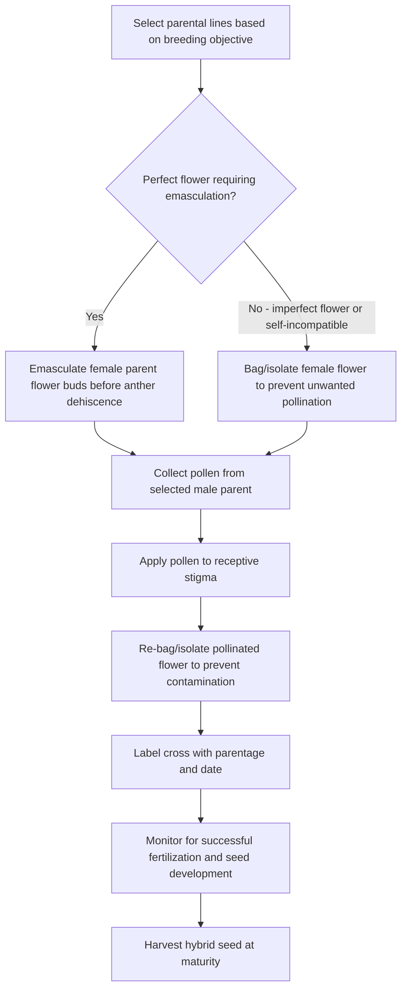
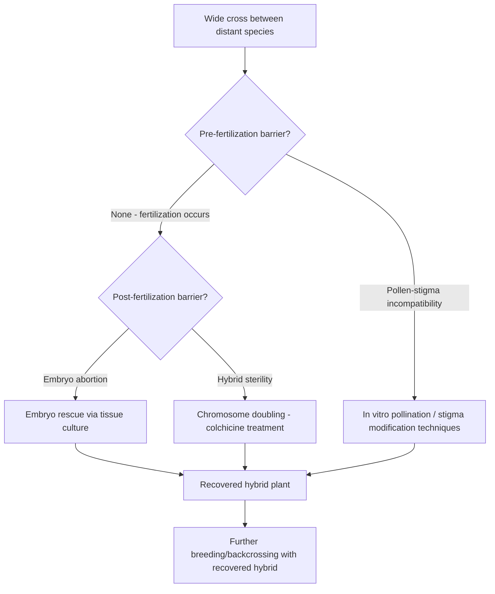

## Hybridization Techniques

### Overview

Hybridization techniques comprise the practical methods used to execute controlled crosses between selected parental plants, forming the essential operational foundation upon which most plant breeding methods depend. While breeding methods (pedigree, backcross, recurrent selection, hybrid breeding) describe the overall strategic framework for improvement, hybridization techniques address the hands-on procedures, floral biology considerations, and technical challenges involved in actually achieving a controlled, successful cross between chosen parents.

### Floral Biology Considerations

**Understanding Flower Structure**

Successful controlled hybridization requires detailed knowledge of the target species' floral anatomy, including the relative position and timing of anther (pollen-producing) and stigma (pollen-receiving) maturity, since this determines the practical window and method needed to prevent unwanted self- or cross-pollination.

**Perfect vs. Imperfect Flowers**

- **Perfect (hermaphroditic) flowers**: contain both male (stamen) and female (pistil) reproductive structures within the same flower, common in many crop species (e.g., tomato, wheat, soybean), requiring emasculation to prevent self-pollination during controlled crossing
- **Imperfect (unisexual) flowers**: separate male and female flowers, either on the same plant (monoecious, e.g., maize, cucurbits) or on different plants (dioecious, e.g., pistachio, spinach, asparagus), simplifying controlled pollination since female flowers naturally lack pollen-producing structures

**Self-Incompatibility Mechanisms**

Some species possess natural genetic mechanisms preventing self-fertilization (self-incompatibility systems), which can simplify controlled crossing by eliminating the need for emasculation, though breeders must still control which specific pollen source reaches the stigma to achieve the intended cross.

### Diagram: General Hybridization Procedure Workflow

### Emasculation

**Purpose**

Removal of the anthers (or entire male reproductive structures) from a hermaphroditic flower before pollen shed, preventing self-pollination and ensuring that any seed set results from the deliberately applied cross-pollen.

**Manual Emasculation**

Physical removal of anthers using fine forceps or similar tools, performed before the flower opens and before anther dehiscence (pollen release), timed according to species-specific floral development; this remains standard practice for many self-pollinated crops used in breeding programs (e.g., wheat, rice, tomato) despite being labor-intensive.

**Timing Considerations**

Emasculation must occur at the correct developmental stage: too early risks damaging immature flower structures or improper anther identification, while too late risks the anthers having already dehisced and self-pollination having already occurred, rendering the cross invalid.

**Alternatives to Manual Emasculation**

- **Cytoplasmic male sterility (CMS)**: genetic systems (typically involving mitochondrial genome factors) rendering certain lines naturally unable to produce viable pollen, widely exploited in hybrid seed production (e.g., in maize, sorghum, sunflower, and other crops) to eliminate the need for manual or mechanical emasculation at commercial scale
- **Genetic male sterility**: nuclear gene-controlled male sterility, sometimes used in breeding programs though generally requiring maintenance of sterile and fertile segregating populations
- **Mechanical detasseling**: physical removal of the male inflorescence (tassel) in monoecious crops like maize, historically standard in commercial hybrid maize seed production, though increasingly supplemented or replaced by CMS systems in many programs
- **Chemical hybridizing agents**: chemical treatments inducing temporary male sterility, used in some hybrid seed production systems as an alternative to genetic sterility systems or mechanical emasculation [Inference: adoption and reliability of chemical hybridizing agents vary by crop species and specific product formulation]

### Pollen Collection and Handling

**Collection Methods**

- Direct collection from freshly dehisced anthers, often by shaking or gently tapping mature flowers/inflorescences over a collection surface
- Anther extraction and controlled dehiscence under laboratory conditions (drying at controlled temperature/humidity) for species where field collection is impractical or where pollen must be stored briefly before use

**Pollen Viability Considerations**

Pollen viability duration varies substantially by species, ranging from mere hours in some species to days under appropriate storage conditions in others; breeders must time pollen collection and application to coincide with, or fall within, the pollen's viable window relative to the intended use.

**Pollen Storage**

For species or breeding programs requiring pollen storage (e.g., when parental flowering times do not naturally overlap), controlled low-temperature and low-humidity storage, sometimes combined with desiccation, can extend pollen viability, with specific optimal storage protocols being species-dependent.

### Pollination Techniques

**Hand Pollination**

Direct transfer of collected pollen onto the receptive stigma of the emasculated or naturally female flower, typically using a small brush, forceps, or direct anther contact, performed under conditions minimizing contamination from unwanted pollen sources.

**Bagging and Isolation**

Physical isolation of flowers before and after pollination using paper, glassine, or mesh bags, preventing both unwanted pollen contamination before the intended cross and unwanted subsequent pollination after the controlled cross has been applied; bag material selection balances adequate pollen exclusion with appropriate humidity/temperature conditions to avoid damaging enclosed flower tissue.

**Timing of Stigma Receptivity**

Stigma receptivity (the period during which the stigma is capable of supporting pollen germination and fertilization) is time-limited and species-specific; successful hybridization requires pollen application within this receptive window, which breeders must determine or verify for the target species and cultivar.

### Illustration: Hand Pollination Process on a Perfect Flower (svg_diagram)

<svg xmlns="http://www.w3.org/2000/svg" viewBox="0 0 700 300">
<text x="350" y="25" text-anchor="middle" font-size="16" font-weight="bold" fill="#1a1a1a">Hand Pollination Process on a Perfect Flower (svg_diagram)</text>

<text x="115" y="60" text-anchor="middle" font-size="12" font-weight="bold">1. Emasculation</text>

<ellipse cx="115" cy="130" rx="50" ry="60" fill="`#fce4ec`" stroke="`#ad1457`" />

<line x1="95" y1="110" x2="80" y2="90" stroke="#333" stroke-width="2" />

<circle cx="80" cy="90" r="4" fill="`#f9a825`" />

<text x="115" y="210" text-anchor="middle" font-size="9">Remove anthers</text>

<text x="115" y="222" text-anchor="middle" font-size="9">before dehiscence</text>

<text x="350" y="60" text-anchor="middle" font-size="12" font-weight="bold">2. Pollen transfer</text>

<ellipse cx="350" cy="130" rx="50" ry="60" fill="`#fce4ec`" stroke="`#ad1457`" />

<line x1="350" y1="130" x2="350" y2="80" stroke="#333" stroke-width="2" />

<circle cx="350" cy="78" r="6" fill="#333" />

<path d="M 280 100 Q 320 85 345 90" stroke="`#f9a825`" stroke-width="2" fill="none" />

<circle cx="280" cy="100" r="3" fill="`#f9a825`" />

<text x="350" y="210" text-anchor="middle" font-size="9">Apply donor pollen</text>

<text x="350" y="222" text-anchor="middle" font-size="9">to receptive stigma</text>

<text x="585" y="60" text-anchor="middle" font-size="12" font-weight="bold">3. Bagging/isolation</text>

<ellipse cx="585" cy="130" rx="50" ry="60" fill="`#fce4ec`" stroke="`#ad1457`" opacity="0.6" />

<rect x="530" y="70" width="110" height="130" fill="none" stroke="#666" stroke-width="2" stroke-dasharray="5,3" />

<text x="585" y="210" text-anchor="middle" font-size="9">Bag to prevent</text>

<text x="585" y="222" text-anchor="middle" font-size="9">contamination</text>

</svg>

### Record-Keeping and Labeling

Accurate labeling of each cross with parentage, date of pollination, and a unique identifier is essential throughout the hybridization process, since the value of the resulting seed/plant material for subsequent breeding depends entirely on reliable knowledge of its genetic origin; loss of accurate pedigree records can render an otherwise successful cross useless for structured breeding programs.

### Overcoming Hybridization Barriers

**Pre-Fertilization Barriers**

- **Temporal isolation**: parental lines flowering at different times, addressed through staggered planting dates, controlled environment manipulation of flowering time, or pollen storage
- **Mechanical/structural incompatibility**: physical floral structure differences preventing normal pollen transfer, sometimes requiring specialized hand-pollination technique adaptations
- **Pollen-stigma incompatibility**: particularly relevant in wide crosses between distantly related species, where pollen may fail to germinate or pollen tube growth may be arrested before reaching the ovule

**Post-Fertilization Barriers**

- **Embryo abortion**: in some wide crosses, fertilization occurs but the resulting embryo fails to develop normally due to genetic incompatibility, sometimes addressable through embryo rescue techniques (excising the young embryo and culturing it on artificial nutrient media before natural abortion would occur)
- **Hybrid sterility**: resulting hybrids may be viable but sterile (often due to chromosome pairing failure during meiosis in hybrids between species with different chromosome numbers or structures), sometimes addressed through chromosome doubling techniques (e.g., colchicine treatment) to restore fertility by creating a fertile amphidiploid

### Diagram: Overcoming Wide Hybridization Barriers

### Species-Specific Hybridization Considerations

**Cereal Crops (e.g., Wheat, Rice)**

Small floral structures require fine, precise emasculation technique (often using specialized fine forceps or clipping techniques), typically performed on individual florets within the spike/panicle, with careful timing relative to floret development stage critical for success.

**Maize**

Monoecious structure with separate tassel (male) and ear/silk (female) simplifies controlled crossing considerably: the ear shoot is covered with a shoot bag before silk emergence to prevent unwanted pollination, silks are trimmed at the appropriate stage to promote uniform receptivity, and pollen collected from a tassel bag is applied directly to the exposed silks before immediately re-bagging.

**Vegetable Crops (e.g., Tomato, Pepper)**

Perfect flowers require standard emasculation of immature flower buds, with hand pollination and bagging following typical procedure; some vegetable breeding programs increasingly use marker-assisted approaches to reduce the number of crosses and generations needed to achieve breeding objectives, complementing rather than replacing the underlying hybridization technique.

**Tree Fruits and Perennial Crops**

Longer generation times and often more complex floral biology (timing relative to bud dormancy release, extended bloom periods) require careful synchronization of parental flowering, sometimes using controlled forcing of potted parent plants in greenhouse conditions to achieve overlapping bloom for crosses between naturally asynchronous-flowering parents.

### Practical Example: Executing a Controlled Cross in Tomato Breeding

**Scenario**: A breeder needs to cross a disease-resistant tomato line (as pollen donor/male parent) with an elite fresh-market cultivar (as the female/seed parent) to combine desirable traits.

1. **Bud selection**: Identify immature flower buds on the female parent plant that are approaching anthesis but have not yet opened, ensuring the anthers have not dehisced.
2. **Emasculation**: Carefully remove the sepals and petals as needed, then use fine forceps to remove the anther cone before pollen shed, taking care not to damage the stigma or ovary.
3. **Immediate isolation**: Cover the emasculated flower with a small isolation bag or tag to prevent contamination from stray pollen before the intended cross is applied.
4. **Pollen collection**: Collect fresh, dehisced pollen from the male parent (disease-resistant line) flowers, typically by gently tapping mature, dehiscing anthers over a collection surface.
5. **Pollination**: Apply the collected pollen directly to the receptive stigma of the emasculated female flower, typically within a day or two of emasculation depending on stigma receptivity timing for the species.
6. **Re-isolation and labeling**: Re-cover the pollinated flower and attach a label recording the cross parentage and pollination date, then monitor for successful fruit/seed set over the following weeks.

**Key Points**

- Precise timing of emasculation relative to anther dehiscence is the most critical technical factor determining hybridization success, since even brief anther dehiscence before emasculation can result in unintended self-pollination contaminating the cross.
- Isolation before and after the controlled pollination event is essential to ensure the resulting seed reflects the intended, documented cross rather than accidental pollen contamination.
- Accurate labeling immediately at the time of crossing prevents loss of critical pedigree information needed for subsequent breeding program record-keeping.

### Modern Complementary Technologies

**In Vitro Fertilization and Embryo Culture**

Laboratory-based techniques allowing fertilization or early embryo development to proceed under controlled conditions outside the normal floral environment, particularly valuable for overcoming specific incompatibility barriers in wide hybridization efforts.

**Protoplast Fusion**

A somatic (non-sexual) hybridization technique involving fusion of plant cells with their cell walls removed (protoplasts), enabling genetic combination between species that cannot be crossed through normal sexual hybridization due to complete sexual incompatibility; resulting somatic hybrids require subsequent regeneration into whole plants via tissue culture techniques. [Inference: successful whole-plant regeneration and fertility restoration from protoplast fusion hybrids is highly species-dependent and not achievable for all desired species combinations]

### Conclusion

Hybridization techniques provide the essential practical toolkit enabling breeders to execute the controlled crosses that underpin virtually all conventional plant breeding methods. Success depends on detailed understanding of the target species' floral biology, precise timing of emasculation and pollination relative to floral development stages, rigorous contamination control through isolation practices, and, for challenging wide crosses, specialized techniques such as embryo rescue and chromosome doubling to overcome natural sexual incompatibility barriers.

**Related Topics**

- Floral biology and reproductive systems in crop species
- Cytoplasmic male sterility systems in hybrid seed production
- Embryo rescue and tissue culture techniques
- Wide hybridization and interspecific/intergeneric crosses
- Chromosome doubling and polyploidy induction
- Pollen storage and viability testing methods
- Pedigree record-keeping systems in breeding programs
- Protoplast fusion and somatic hybridization
- Self-incompatibility mechanisms in flowering plants
- Commercial hybrid seed production systems