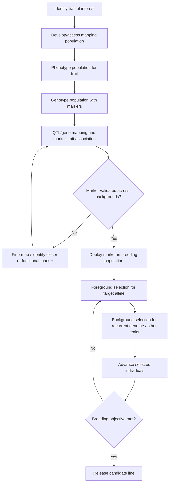

## Marker-Assisted Selection

### Definition and Core Concept

Marker-assisted selection (MAS) is a plant breeding methodology that uses molecular markers linked to traits of interest to select individuals carrying favorable alleles, rather than relying solely on direct phenotypic evaluation. A molecular marker is a identifiable DNA sequence variant whose chromosomal location is known and which can be tracked through generations because it is physically linked to a gene or quantitative trait locus (QTL) controlling a trait.

The underlying principle rests on genetic linkage: when a marker is located close enough to a gene of interest on a chromosome, recombination between the marker and the gene during meiosis occurs at a low frequency. This allows breeders to infer the presence or absence of a target allele by genotyping the marker rather than waiting to observe the phenotype, which may be costly, slow, environmentally variable, or destructive to assess (e.g., requiring the plant to be killed or fully mature).

### Rationale for Using MAS

**Key Points**

- Phenotypic selection for many agronomically important traits is difficult because of environmental interaction, low heritability, recessive gene masking, or late expression (traits visible only at maturity).
- MAS allows selection at the seedling stage, drastically shortening breeding cycles.
- MAS enables selection for traits that are expensive or dangerous to phenotype directly, such as disease resistance requiring pathogen inoculation under controlled containment, or traits requiring destructive tissue sampling.
- MAS permits pyramiding multiple genes (stacking several resistance or quality genes into a single genotype) which is nearly impossible to verify through phenotype alone when genes have similar or overlapping effects.
- Selection can occur independent of season or environment since DNA can be extracted from young tissue regardless of the growing conditions needed to express the trait.

### Types of Molecular Markers Used in MAS

**RFLP (Restriction Fragment Length Polymorphism)**

One of the earliest marker systems. Genomic DNA is digested with restriction enzymes, and fragment length differences between individuals (caused by mutations that create or destroy restriction sites) are detected via Southern blotting. RFLPs are codominant and highly reproducible but labor-intensive, requiring large amounts of DNA and radioactive or chemiluminescent probes. Largely obsolete in modern breeding due to throughput limitations.

**RAPD (Random Amplified Polymorphic DNA)**

Uses short, arbitrary primers (~10 bp) in PCR to amplify random genomic regions. Polymorphisms arise from primer binding site variation. RAPDs are dominant markers (cannot distinguish heterozygotes from homozygotes) and suffer from poor reproducibility across laboratories due to sensitivity to PCR conditions. [Inference] Their use in contemporary commercial breeding programs is minimal given more robust alternatives.

**AFLP (Amplified Fragment Length Polymorphism)**

Combines restriction digestion with selective PCR amplification using adapter-ligated primers. Produces a high number of markers per assay and is more reproducible than RAPD, but is dominant, technically demanding, and has largely been superseded by sequence-based markers.

**SSR (Simple Sequence Repeats) / Microsatellites**

Tandemly repeated short DNA motifs (1–6 bp units, e.g., (CA)n) flanked by unique sequences that allow PCR primer design. SSRs are codominant, highly polymorphic (multiple alleles per locus due to variable repeat number), reproducible, and amenable to automation via capillary electrophoresis. SSRs became the workhorse marker system for MAS through the 1990s–2000s due to their high information content per locus.

**SNP (Single Nucleotide Polymorphism)**

A single base-pair variation at a specific genomic position. SNPs are the most abundant variant type in most genomes, biallelic (limiting information per marker relative to SSRs, but compensated by sheer abundance), highly amenable to high-throughput automated genotyping platforms (arrays, KASP assays, genotyping-by-sequencing), and cost-effective at scale. SNPs are the dominant marker type in modern MAS and genomic selection programs.

**InDel (Insertion/Deletion) Markers**

Small insertions or deletions detected via PCR fragment size differences. Often co-located with or used alongside SNP panels; simple to score on standard gel or capillary systems.

**CAPS/dCAPS (Cleaved Amplified Polymorphic Sequence)**

A PCR product is digested with a restriction enzyme whose recognition site overlaps a SNP; presence/absence of the cut site distinguishes alleles. Useful for converting a known SNP into a simple gel-based, low-cost assay without specialized SNP-genotyping equipment.

### Requirements for Effective MAS

**Key Points**

- A validated marker-trait association: the marker must be genetically linked to the causal gene/QTL, ideally within 1–5 cM, or directly within the gene itself (a "perfect" or functional marker).
- A reliable, high-throughput, and cost-effective genotyping assay.
- A reference population (e.g., a biparental mapping population, or a diverse panel) in which the marker-trait linkage has been established and the marker's predictive value confirmed.
- Recombination frequency between marker and gene should be low enough to keep false positive/negative selection rates acceptable across the number of generations the marker will be used.

The genetic distance between marker and target locus determines selection accuracy. Recombination frequency ($r$) is approximately related to genetic distance in centiMorgans, where 1 cM corresponds to approximately a 1% recombination frequency over one meiosis (this approximation holds at short distances; at larger distances the relationship becomes non-linear due to multiple crossover events, and mapping functions such as Haldane's or Kosambi's are applied):

$$r \approx d_{cM} / 100 \quad \text{(for small } d_{cM}\text{)}$$

A marker 2 cM from the target gene will, on average, correctly predict the target allele in roughly 98% of gametes, meaning MAS at this distance carries an inherent, quantifiable error rate that decreases as marker-gene distance decreases.

### Types of Markers by Function in Breeding Programs

**Trait-Linked (Indirect) Markers**

Markers located near but not within the causal gene. Useful when the causal gene is unknown, but carry risk of selection errors due to recombination and require validation across genetic backgrounds since linkage phase (which marker allele is coupled with which trait allele) can differ between populations.

**Functional (Perfect) Markers**

Markers derived from polymorphisms within the causal gene itself, such as a SNP in a coding or regulatory region directly responsible for the phenotype. These eliminate recombination-based prediction error and remain valid across diverse genetic backgrounds and breeding populations, making them the gold standard when available. Examples include markers within the *Rht* (reduced height) genes in wheat or the *Sub1A* gene for submergence tolerance in rice.

### Applications of MAS in Plant Breeding

**Marker-Assisted Backcrossing (MABC)**

Used to introgress a single gene or a small number of genes (e.g., a disease resistance gene) from a donor parent into an elite recurrent parent while minimizing linkage drag (the unintentional transfer of a segment of donor chromosome surrounding the target gene, which may carry deleterious genes). MABC uses:

- **Foreground selection**: markers tightly linked to (or within) the target gene, used to confirm the presence of the donor allele at each backcross generation.
- **Background selection**: genome-wide markers used to select backcross progeny with the highest proportion of recurrent parent genome, accelerating the recovery of the recurrent parent's genetic background compared to conventional backcrossing.

Under conventional backcrossing without background selection, the expected proportion of recurrent parent genome recovered after $n$ generations is:

$$P_n = 1 - \left(\frac{1}{2}\right)^{n+1}$$

Background selection with dense markers can achieve equivalent recurrent parent genome recovery in fewer backcross generations than this formula predicts under random segregation, since breeders actively select the individuals with the highest recurrent genome content at each generation rather than relying on chance.

**Gene Pyramiding**

The combination of multiple genes controlling the same or complementary traits (e.g., stacking several distinct disease resistance genes against different pathogen races, or multiple QTLs for a quantitative trait) into a single genotype. Because pyramided genes often produce phenotypes indistinguishable from single-gene genotypes, or because some genes are recessive and masked in heterozygous states, molecular markers are frequently the only practical way to confirm the presence of all target genes simultaneously.

**Marker-Assisted Recurrent Selection (MARS)**

Applied to quantitative traits controlled by multiple QTLs. Markers associated with favorable QTL alleles are used across recurrent selection cycles to enrich a breeding population for favorable alleles at multiple loci simultaneously, intermating selected individuals each cycle to recombine and accumulate favorable alleles.

**QTL Mapping as a Prerequisite**

Before MAS can be deployed for a quantitative trait, QTL mapping is required to identify chromosomal regions associated with trait variation, typically via biparental populations (F2, recombinant inbred lines, doubled haploids) or association mapping panels genotyped with dense marker sets and phenotyped for the trait of interest. Statistical methods such as interval mapping or composite interval mapping identify marker intervals significantly associated with trait variance, expressed via LOD (logarithm of odds) scores.

### MAS Workflow in a Breeding Program

### Worked Example: Marker-Assisted Backcrossing for Disease Resistance

**Example**

A breeder wants to introgress a bacterial blight resistance gene (analogous to *Xa* genes in rice) from a donor landrace into an elite but susceptible rice variety.

1. **Cross**: Elite variety (recurrent parent, RP) × Donor landrace (donor parent, DP) → F1.
2. **BC1F1 generation**: F1 backcrossed to RP. Progeny genotyped with a marker tightly linked to (or within) the resistance gene. Only plants carrying the donor allele at this locus are retained (foreground selection).
3. **Background selection**: Retained BC1F1 plants are further genotyped with a genome-wide SSR or SNP panel (typically 50–100+ well-distributed markers). Plants with the highest percentage of RP-type alleles at background loci are selected for the next backcross.
4. **Repeat for BC2F1, BC3F1**: At each generation, foreground selection confirms retention of the resistance gene; background selection accelerates recovery of RP genetic background.
5. **BC3F1 self-pollinated to BC3F2**: Marker genotyping identifies plants homozygous for the donor resistance allele.
6. **Result**: A near-isogenic line phenotypically and genetically identical to the elite RP, but carrying the introgressed resistance gene, achieved in approximately 3–4 backcross generations rather than the 6–8 generations typically needed without background selection to reach comparable recurrent parent genome recovery.

### Genotyping Platforms Commonly Used

**Key Points**

- **Gel-based assays** (agarose/polyacrylamide electrophoresis): used for SSR and CAPS markers; low-cost, low-throughput, suited to smaller breeding programs or specific gene confirmation.
- **KASP (Kompetitive Allele-Specific PCR)**: a fluorescence-based SNP genotyping method allowing scalable, cost-effective genotyping of individual SNPs across large sample sets; widely adopted in public and private breeding programs for MAS.
- **SNP arrays** (e.g., Illumina Infinium, Affymetrix Axiom platforms developed for specific crops): genotype thousands to hundreds of thousands of SNPs simultaneously; more suited to genomic selection and QTL discovery than routine MAS due to cost per sample at scale.
- **Genotyping-by-sequencing (GBS)**: reduced-representation sequencing approach generating large numbers of SNPs without a prior array design; useful for species or populations lacking existing marker resources.

### Limitations and Challenges

**Key Points**

- **Cost of assay development**: identifying and validating a robust marker-trait association requires substantial upfront investment in mapping populations and phenotyping.
- **Marker transferability**: a marker validated in one genetic background (biparental population) may not show the same linkage phase or predictive accuracy in a different background, since recombination history differs between populations. [Inference] This is a primary reason functional markers are preferred over loosely linked markers when available.
- **Polygenic/complex traits**: traits controlled by many small-effect QTLs with significant genotype-by-environment interaction are difficult to capture with a small number of markers; such traits are increasingly addressed through genomic selection (which uses genome-wide markers to estimate breeding values) rather than MAS targeting individual loci.
- **Linkage drag**: even with foreground/background selection, closely linked deleterious genes near the target locus can be difficult to separate from the favorable allele without a very high marker density in that specific region.
- Behavior of any given marker assay (call rates, error rates, cost per data point) may vary by platform, laboratory, and crop species, so figures cited in literature should be treated as context-dependent rather than universal constants.

### MAS versus Genomic Selection

| Aspect | MAS | Genomic Selection |
| --- | --- | --- |
| Target | Single genes / few major QTLs | Whole-genome, many small-effect loci |
| Marker density | Low to moderate (few to dozens) | Very high (thousands to hundreds of thousands) |
| Statistical basis | Direct marker-trait association | Genome-wide prediction model (estimated breeding values) |
| Best suited for | Qualitative or major-gene traits (e.g., disease resistance, herbicide tolerance) | Complex quantitative traits (e.g., yield, drought tolerance) |
| Data requirement | Validated marker per trait | Large training population with genotype + phenotype data |

### Illustrative Diagram: Foreground vs. Background Selection Concept

<svg xmlns="http://www.w3.org/2000/svg" viewBox="0 0 700 300">
<text x="350" y="25" font-size="16" font-weight="bold" text-anchor="middle" fill="#222">Foreground vs Background Selection (svg_diagram)</text>

<text x="20" y="60" font-size="13" fill="#333">Chromosome pair in BC1 plant:</text>

<rect x="20" y="80" width="300" height="20" fill="#4a90d9" stroke="#222" />
<text x="170" y="95" font-size="11" text-anchor="middle" fill="#fff">Recurrent parent (RP) genome</text>
<rect x="320" y="80" width="40" height="20" fill="#e07b39" stroke="#222" />
<text x="340" y="95" font-size="9" text-anchor="middle" fill="#fff">Donor gene</text>
<rect x="360" y="80" width="320" height="20" fill="#4a90d9" stroke="#222" />
<line x1="330" y1="105" x2="330" y2="130" stroke="#222" stroke-width="1" />
<text x="330" y="145" font-size="10" text-anchor="middle" fill="#222">Foreground marker</text>
<text x="330" y="158" font-size="10" text-anchor="middle" fill="#222">(confirms donor allele present)</text>
<rect x="20" y="190" width="150" height="20" fill="#4a90d9" stroke="#222" />
<rect x="170" y="190" width="20" height="20" fill="#e07b39" stroke="#222" />
<rect x="190" y="190" width="150" height="20" fill="#4a90d9" stroke="#222" />
<rect x="340" y="190" width="20" height="20" fill="#4a90d9" stroke="#222" opacity="0.5" />
<rect x="360" y="190" width="320" height="20" fill="#4a90d9" stroke="#222" />
<line x1="60" y1="215" x2="60" y2="235" stroke="#222" stroke-width="1" />
<line x1="250" y1="215" x2="250" y2="235" stroke="#222" stroke-width="1" />
<line x1="500" y1="215" x2="500" y2="235" stroke="#222" stroke-width="1" />
<text x="270" y="250" font-size="10" text-anchor="middle" fill="#222">Background markers scattered genome-wide</text>
<text x="270" y="263" font-size="10" text-anchor="middle" fill="#222">(select plant with highest % RP-type alleles)</text>
<rect x="20" y="280" width="15" height="12" fill="#4a90d9" />
<text x="40" y="290" font-size="10" fill="#222">RP allele</text>
<rect x="120" y="280" width="15" height="12" fill="#e07b39" />
<text x="140" y="290" font-size="10" fill="#222">Donor allele (target gene)</text>
</svg>

### Related Topics

- Quantitative trait locus (QTL) mapping and interval mapping methods
- Genomic selection and genomic estimated breeding values (GEBV)
- Marker-assisted recurrent selection (MARS) in detail
- Genotyping-by-sequencing (GBS) workflows
- Association mapping / genome-wide association studies (GWAS) in crops
- Doubled haploid technology as a complement to MAS
- Speed breeding integrated with marker-based selection
- CRISPR-based gene editing as an alternative/complement to introgression breeding
- Linkage drag and fine-mapping strategies to minimize donor segment size
- High-throughput phenotyping technologies to pair with genomic data