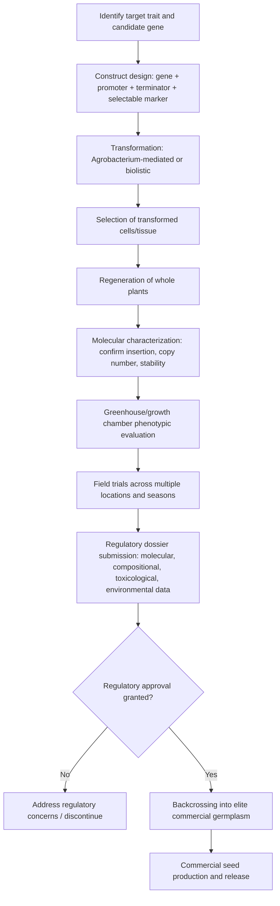

## Genetically Modified Crops

### Definition and Core Concept

Genetically modified (GM) crops are plants whose genomes have been altered using recombinant DNA technology to introduce, remove, or modify specific genetic sequences in ways that do not occur through natural mating or classical breeding recombination alone. The resulting organisms are commonly termed genetically modified organisms (GMOs) or, in regulatory language, living modified organisms (LMOs). The defining feature distinguishing GM crops from conventionally bred crops is the direct manipulation of DNA at the molecular level, often introducing genes from unrelated species (transgenesis) or, in some approaches, genes from the same or a sexually compatible species (cisgenesis).

### Historical Development

**Key Points**

- 1983: First transgenic plant (tobacco) produced in laboratory settings using *Agrobacterium*-mediated transformation.
- 1994: The Flavr Savr tomato became the first commercially approved GM food crop in the United States, engineered for delayed ripening via antisense suppression of the polygalacturonase gene.
- 1996: Large-scale commercial planting of GM crops began, notably herbicide-tolerant soybean and insect-resistant (Bt) cotton and maize.
- Since the mid-1990s, global GM crop hectarage expanded substantially, with soybean, maize, cotton, and canola constituting the dominant commercialized GM crop species. [Inference] Exact current global hectarage figures fluctuate year to year and by source, so specific statistics should be checked against current reporting bodies (e.g., ISAAA successor organizations, USDA) rather than treated as fixed.

### Core Genetic Engineering Techniques

**Agrobacterium tumefaciens-Mediated Transformation**

Exploits the natural ability of the soil bacterium *Agrobacterium tumefaciens* to transfer a segment of its Ti (tumor-inducing) plasmid, called T-DNA, into plant cell genomes. In genetic engineering, the native tumor-inducing genes are removed and replaced with a gene of interest plus a selectable marker, flanked by T-DNA border sequences. The bacterium's natural transfer machinery (encoded by *vir* genes) delivers this engineered T-DNA into the plant cell nucleus, where it integrates into the plant genome largely at random locations. This method is most efficient in dicot species and has been extended to many monocots including rice and maize through optimized protocols.

**Biolistic (Particle Bombardment) Transformation**

DNA of interest is coated onto microscopic gold or tungsten particles, which are physically propelled into plant cells or tissues using a gene gun under high pressure (typically helium-driven). This method bypasses the host-range limitations of *Agrobacterium* and has historically been important for transforming monocots such as maize, wheat, and rice, though *Agrobacterium* protocols for these species have since improved considerably.

**Protoplast-Based Methods**

Plant cell walls are enzymatically removed to produce protoplasts, into which DNA is introduced via polyethylene glycol (PEG)-mediated uptake or electroporation (applying an electric field to create transient pores in the cell membrane). Requires subsequent regeneration of whole plants from protoplasts, which can be genotype-dependent and technically demanding.

**Selectable Markers and Reporter Genes**

Because transformation efficiency is typically low, selectable marker genes (commonly conferring resistance to an antibiotic such as kanamycin, or a herbicide such as glyphosate/basta) are co-introduced to allow identification of successfully transformed cells on selective media. Reporter genes such as *gus* (beta-glucuronidase) or *gfp* (green fluorescent protein) are used to visually confirm and localize gene expression during research and development, though they are typically not present in final commercial products unless serving a functional purpose.

### Major Trait Categories in Commercialized GM Crops

**Herbicide Tolerance (HT)**

The most widely deployed GM trait category. The dominant example is glyphosate tolerance, engineered via introduction of a bacterial *epsps* (5-enolpyruvylshikimate-3-phosphate synthase) gene variant (e.g., from *Agrobacterium* strain CP4) that is insensitive to glyphosate inhibition, since native plant EPSPS is the target of glyphosate's herbicidal action. This allows glyphosate application over the growing crop to control weeds without killing the crop itself. Glufosinate (basta) tolerance is achieved via the *bar* or *pat* gene, which detoxifies the herbicide through acetylation.

**Insect Resistance (Bt Crops)**

Genes from the soil bacterium *Bacillus thuringiensis* encoding crystal (Cry) proteins or vegetative insecticidal proteins (Vip) are introduced into the plant genome. These proteins are toxic to specific insect larvae when ingested: the protoxin binds to specific receptors in the insect midgut epithelium, is proteolytically activated, and causes pore formation leading to cell lysis and larval death, while having no comparable receptor-binding activity in mammals or most non-target organisms. Different Cry proteins (e.g., Cry1Ab, Cry1Ac, Cry3Bb1) target different insect orders (Lepidoptera, Coleoptera). Commercial Bt maize and Bt cotton are widely deployed against pests such as European corn borer and cotton bollworm.

**Combined/Stacked Traits**

Many commercial varieties combine multiple traits (e.g., glyphosate tolerance plus two or more Bt genes targeting different pests) through conventional breeding crosses of single-trait transgenic lines or through simultaneous multi-gene transformation, achieved via molecular stacking or conventional crossing followed by marker-assisted selection to confirm all transgenes are present.

**Virus Resistance**

Achieved historically through pathogen-derived resistance strategies, most notably coat protein-mediated resistance, where a viral coat protein gene is introduced into the plant, triggering resistance mechanisms including RNA silencing pathways that degrade viral RNA matching the introduced sequence. The papaya ringspot virus-resistant "Rainbow" papaya, developed in Hawaii, is a widely cited example credited with rescuing the state's papaya industry from the virus outbreak.

**Nutritional Enhancement (Biofortification)**

Golden Rice is the most prominent example, engineered to biosynthesize beta-carotene (a provitamin A precursor) in the endosperm by introducing genes encoding phytoene synthase and carotene desaturase (from daffodil or, in later versions, maize, plus a bacterial gene), addressing a metabolic pathway that is otherwise inactive in rice endosperm. [Inference] Adoption and regulatory approval status of Golden Rice varies by country and has evolved over time, so current deployment status should be verified against recent sources rather than assumed static.

**Reduced Browning / Altered Ripening**

Examples include the Arctic Apple, engineered via RNA interference (RNAi) to suppress polyphenol oxidase (PPO) gene expression, reducing the enzymatic browning reaction that occurs when apple flesh is cut and exposed to oxygen. The Flavr Savr tomato similarly used antisense technology to slow softening by suppressing polygalacturonase expression.

**Disease Resistance**

Includes traits such as late blight resistance in potato achieved via introduction of resistance (R) genes sourced from wild relatives of the crop species, functioning through gene-for-gene recognition of pathogen effector proteins.

### Gene Silencing Mechanisms Used in GM Crops

**Antisense Technology**

An introduced transgene produces RNA complementary to the mRNA of a target endogenous gene; the resulting double-stranded RNA hybrid blocks translation or promotes degradation, reducing expression of the target gene.

**RNA Interference (RNAi)**

Utilizes the plant's endogenous RNA silencing machinery. An introduced construct typically produces a hairpin RNA structure that is processed by the enzyme Dicer into small interfering RNAs (siRNAs), which guide the RNA-induced silencing complex (RISC) to degrade complementary target mRNAs sequence-specifically. RNAi underlies traits such as reduced browning (Arctic Apple) and virus resistance in some crops.

### Regulatory and Risk Assessment Framework

**Key Points**

- GM crop regulation typically follows a case-by-case, science-based risk assessment framework administered by national or regional bodies (e.g., USDA/APHIS, EPA, and FDA in the United States operating under a coordinated framework; EFSA in the European Union; equivalent bodies in other jurisdictions).
- Risk assessment generally evaluates: molecular characterization of the inserted DNA and its stability across generations, compositional analysis comparing the GM crop to its non-GM counterpart, toxicological and allergenicity assessment of novel proteins, and environmental risk assessment including potential effects on non-target organisms and gene flow to wild relatives.
- Regulatory stringency and approval timelines vary substantially between countries and regions; some jurisdictions maintain de facto moratoria or highly restrictive approval pathways, while others have streamlined processes for specific trait categories.
- [Inference] Current regulatory status for any specific crop-trait combination in a specific country changes over time and should be verified against current regulatory agency publications rather than general background knowledge, given the pace of policy change in this area.

### Agronomic and Economic Considerations

**Key Points**

- Herbicide-tolerant crops can simplify weed management programs and, in some systems, facilitate reduced tillage practices, though widespread reliance on a single herbicide mode of action has been associated with the evolution of herbicide-resistant weed populations, prompting integrated weed management recommendations and the development of stacked/multiple herbicide tolerance traits.
- Bt crops have been associated with reduced insecticide spray applications for targeted pests in many production systems, though resistance management (commonly the "refuge strategy," maintaining a proportion of non-Bt planting to sustain susceptible insect populations and delay resistance evolution) is required as a condition of registration in many jurisdictions.
- Economic outcomes for adopting farmers depend on factors including pest/weed pressure, seed cost premiums, technology fees, and regional pest resistance status; [Inference] these vary substantially by region, crop, and season, so specific yield or profitability figures cited in literature should not be generalized without checking the study context.

### Detection and Traceability

GM content in seed, grain, or food products is commonly detected via PCR-based methods targeting transgene-specific sequences (such as the junction between the inserted construct and flanking plant genomic DNA, which is unique to a specific transformation event) or via immunoassay methods (e.g., ELISA) detecting the novel protein product. Event-specific PCR detection is considered the gold standard for regulatory compliance testing and labeling verification because it can distinguish between different transformation events even when they carry the same transgene.

### GM Crop Development Pipeline

### Worked Example: Bt Cry Protein Mechanism of Action

**Example**

1. A susceptible insect larva ingests plant tissue expressing a Cry protoxin (e.g., Cry1Ab in Bt maize targeting European corn borer).
2. The alkaline pH and specific proteases present in the larval midgut cleave the protoxin into an active toxin fragment.
3. The activated toxin binds specifically to receptor proteins (such as cadherin-like proteins and aminopeptidase N) located on the midgut epithelial cell membrane of susceptible insect species.
4. Receptor binding triggers toxin oligomerization and insertion into the cell membrane, forming pores.
5. Pore formation disrupts osmotic balance, causing cell lysis, gut paralysis, and eventual larval death.
6. Because the specific receptors required for this mechanism are largely restricted to certain insect taxa and are not present in comparable form in mammals, birds, or most non-target insects, the toxicity is considered highly selective. [Inference] Selectivity findings are based on the specific Cry protein and target/non-target organism tested; effects should not be generalized across all Cry variants without reference to specific studies.

### Illustrative Diagram: T-DNA Transfer Concept

<svg xmlns="http://www.w3.org/2000/svg" viewBox="0 0 700 320">
<text x="350" y="25" font-size="16" font-weight="bold" text-anchor="middle" fill="#222">Agrobacterium T-DNA Transfer (svg_diagram)</text>
<ellipse cx="130" cy="150" rx="90" ry="55" fill="#a8d5a2" stroke="#222" stroke-width="1.5" />
<text x="130" y="150" font-size="12" text-anchor="middle" fill="#222">Agrobacterium</text>
<text x="130" y="165" font-size="12" text-anchor="middle" fill="#222">tumefaciens</text>
<circle cx="130" cy="200" r="25" fill="none" stroke="#555" stroke-width="1.5" />
<text x="130" y="204" font-size="9" text-anchor="middle" fill="#333">Ti plasmid</text>
<rect x="105" y="192" width="15" height="8" fill="#e07b39" stroke="#222" />
<text x="112" y="188" font-size="7" text-anchor="middle" fill="#333">T-DNA</text>
<line x1="220" y1="150" x2="330" y2="150" stroke="#222" stroke-width="2" marker-end="url(#arrow)" />
<text x="275" y="140" font-size="10" text-anchor="middle" fill="#222">vir genes mediate transfer</text>
<rect x="340" y="70" width="320" height="180" rx="10" fill="#cfe3f7" stroke="#222" stroke-width="1.5" />
<text x="500" y="90" font-size="12" text-anchor="middle" fill="#222">Plant cell</text>
<rect x="420" y="110" width="160" height="120" rx="8" fill="#f7f0d5" stroke="#222" />
<text x="500" y="128" font-size="11" text-anchor="middle" fill="#222">Nucleus</text>
<line x1="440" y1="150" x2="560" y2="150" stroke="#333" stroke-width="3" />
<line x1="440" y1="170" x2="560" y2="170" stroke="#333" stroke-width="3" />
<line x1="440" y1="190" x2="560" y2="190" stroke="#333" stroke-width="3" />
<rect x="480" y="165" width="20" height="10" fill="#e07b39" stroke="#222" />
<text x="490" y="215" font-size="8" text-anchor="middle" fill="#333">T-DNA integrated into</text>
<text x="490" y="225" font-size="8" text-anchor="middle" fill="#333">host chromosome</text>
</svg>

### Related Topics

- Marker-assisted selection (as a complementary or comparative breeding approach)
- CRISPR/Cas9 gene editing versus transgenic modification
- Biosafety protocols and containment levels for GM research
- Gene flow and coexistence management between GM and non-GM crops
- Insect resistance management and refuge strategies for Bt crops
- Herbicide-resistant weed evolution and integrated weed management
- Regulatory frameworks: Cartagena Protocol on Biosafety
- Labeling and consumer traceability of GM food products
- RNA interference (RNAi) applications beyond crop modification
- Cisgenesis and intragenesis as alternative genetic modification strategies