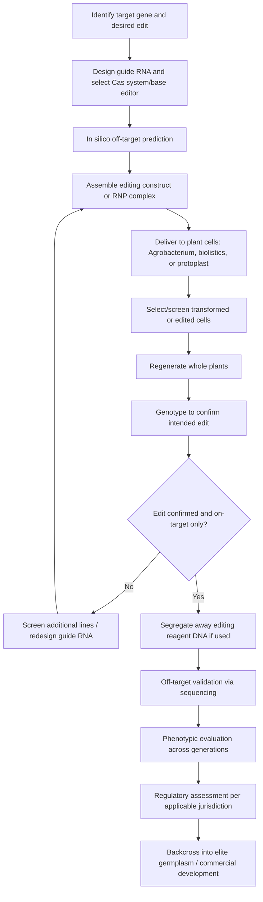

## Gene Editing in Agriculture

### Definition and Core Concept

Gene editing refers to a set of molecular techniques that enable precise, targeted modification of specific DNA sequences at defined locations in a genome, in contrast to earlier transgenic approaches where inserted DNA integrates at largely random genomic positions. Gene editing tools introduce site-specific double-strand breaks (DSBs) or, in newer variants, direct base changes without DSBs, at a location determined by a programmable targeting molecule. The cell's endogenous DNA repair machinery then resolves the break or edit through one of several pathways, which can be exploited to achieve gene knockout, precise sequence correction, or targeted insertion.

### Core Molecular Mechanisms

**Double-Strand Break Repair Pathways**

Two principal cellular repair pathways are exploited in gene editing:

- **Non-homologous end joining (NHEJ)**: The predominant repair pathway in most plant cells. Directly ligates the broken DNA ends, frequently introducing small insertions or deletions (indels) at the break site due to imprecise repair. This is exploited for gene knockout, since indels within a coding sequence commonly cause frameshift mutations and loss of functional protein.
- **Homology-directed repair (HDR)**: Uses a homologous DNA template (either an endogenous sister chromatid or an exogenously supplied donor template) to repair the break with high fidelity, allowing precise sequence replacement or targeted gene insertion. HDR occurs at substantially lower frequency than NHEJ in most plant cell types and is generally restricted to specific cell cycle phases (S/G2), making precise editing technically more challenging than simple knockout.

### CRISPR-Cas Systems

**CRISPR-Cas9**

The most widely adopted gene editing platform in agricultural research. Derived from a bacterial adaptive immune system, the system in its engineered form consists of two components:

- **Cas9 protein**: An RNA-guided endonuclease that creates a blunt-ended double-strand break.
- **Single guide RNA (sgRNA)**: A synthetic RNA molecule combining the natural crRNA (which provides sequence specificity via base-pairing with the target DNA) and tracrRNA (which recruits Cas9), engineered as one contiguous molecule for practical use.

Target specificity is determined by approximately 20 nucleotides of complementarity between the sgRNA and the genomic target sequence, combined with the requirement for a protospacer adjacent motif (PAM) sequence (for the commonly used *Streptococcus pyogenes* Cas9, the PAM sequence is NGG) immediately adjacent to the target site. Cas9 will not cleave DNA lacking an appropriately positioned PAM, which constrains which genomic sequences are directly targetable.

**Cas12a (Cpf1)**

An alternative CRISPR nuclease with distinct properties from Cas9: recognizes a T-rich PAM sequence (typically TTTV), generates staggered-end cuts with 5' overhangs rather than blunt ends, and requires only a single crRNA without a separate tracrRNA, simplifying guide RNA design. Cas12a's distinct PAM requirement expands the range of targetable genomic sites relative to Cas9 alone and offers a useful alternative when the local sequence context lacks a suitable Cas9 PAM.

**Multiplexed Editing**

CRISPR systems can be designed with multiple sgRNAs simultaneously targeting several genomic loci in a single transformation event, enabling simultaneous editing of multiple genes (e.g., multiple members of a gene family, or several genes in the same biosynthetic pathway) in one generation, which substantially accelerates trait development compared to sequential single-gene editing followed by crossing.

### Base Editing

Base editing uses a catalytically impaired ("nickase" or fully inactive, "dead") Cas9 fused to a deaminase enzyme to directly convert one DNA base to another without generating a double-strand break.

- **Cytosine base editors (CBEs)**: Convert cytosine (C) to thymine (T) (technically, C•G to T•A base pairs) via cytidine deaminase activity within a defined editing window near the PAM-proximal end of the target sequence.
- **Adenine base editors (ABEs)**: Convert adenine (A) to guanine (G) (A•T to G•C base pairs) via engineered adenine deaminase activity.

Because base editing avoids double-strand breaks, it substantially reduces the frequency of unintended large insertions, deletions, or chromosomal rearrangements associated with DSB repair, and does not require a donor DNA template, making it comparatively efficient for introducing specific point mutations, such as those known to confer herbicide tolerance or disease resistance in characterized genes.

### Prime Editing

A more recent development that enables precise insertions, deletions, and all twelve possible base-to-base conversions without requiring a double-strand break or a separate donor DNA template. The system uses a Cas9 nickase fused to a reverse transcriptase enzyme, guided by a specialized prime editing guide RNA (pegRNA) that both specifies the target site and encodes the desired edit as a template for reverse transcription directly at the target locus. [Inference] Prime editing efficiency in plant systems has historically been lower than in mammalian cell systems and remains an active area of protocol optimization; specific efficiency figures should be checked against current primary literature for the species and locus in question.

### Delivery Methods for Editing Reagents

**Key Points**

- **Agrobacterium-mediated delivery**: The CRISPR construct (encoding Cas protein and sgRNA, typically under plant-active promoters) is delivered via T-DNA transfer, analogous to conventional transgenic methods; this approach results in stable integration of the editing machinery unless later segregated away.
- **Biolistic (particle bombardment) delivery**: Used particularly for species or tissues recalcitrant to *Agrobacterium* transformation, or for delivering ribonucleoprotein (RNP) complexes directly.
- **Ribonucleoprotein (RNP) delivery**: Pre-assembled Cas protein and guide RNA complexes are delivered directly into plant cells (via biolistics or protoplast transfection) without any DNA intermediate. Because no foreign DNA is stably integrated, RNP-edited plants that segregate away any residual delivery vector DNA can, in many regulatory frameworks, be considered free of foreign DNA insertions, a distinction with significant regulatory implications discussed below.
- **Viral vector-based delivery**: Modified plant viruses can be engineered to deliver CRISPR components systemically through the plant without requiring tissue culture-based transformation and regeneration in some systems, though viral genome packaging capacity constraints limit the size of cargo (e.g., full-length Cas9 plus guide RNA) that can be delivered this way.

### Distinguishing Gene Editing from Transgenic GM Technology

**Key Points**

- Conventional transgenic GM crops typically involve stable integration of a foreign gene (often from an unrelated species) that remains permanently in the genome and is inherited by all progeny.
- Gene editing, particularly when achieved via transient reagent delivery (RNP, or DNA constructs that are later segregated out through breeding), can produce final products containing only the intended small-scale sequence changes (indels, base substitutions) with no foreign DNA remaining, a genetic outcome that in some cases is indistinguishable from a mutation that could theoretically arise through natural mutation or conventional mutagenesis breeding.
- This distinction underlies differentiated regulatory treatment in numerous jurisdictions, where gene-edited crops lacking stably integrated foreign DNA and expressing only the intended targeted change are, in some regulatory systems, treated separately from transgenic GMOs (see Regulatory section below); this treatment varies considerably by country and is subject to ongoing policy evolution.

### Applications in Crop Improvement

**Disease Resistance**

Gene editing has been used to knock out or modify host susceptibility (S) genes, which are host genes that pathogens exploit to establish infection, rather than introducing new resistance genes. A widely cited example is editing of *MLO* (Mildew Locus O) genes to confer broad-spectrum powdery mildew resistance in species such as wheat and tomato, based on the principle that loss-of-function mutations in *MLO* disrupt a susceptibility factor required by the pathogen.

**Improved Nutritional and Quality Traits**

Examples include editing of genes controlling starch composition (e.g., increasing amylose or amylopectin ratios), reducing anti-nutritional or allergenic compounds, and modifying fatty acid composition in oilseed crops by targeting genes in relevant biosynthetic pathways (e.g., FAD2 desaturase genes to increase oleic acid content in soybean).

**Herbicide Tolerance via Base Editing**

Specific point mutations in genes such as *ALS* (acetolactate synthase) that confer tolerance to certain herbicide classes have been introduced via base editing, replicating known naturally occurring resistance mutations without introducing foreign genetic material.

**Yield and Architecture Traits**

Editing of genes controlling plant architecture, flowering time, and fruit or grain size/number has been explored to fine-tune agronomic traits, sometimes drawing on genes originally characterized through QTL mapping in wild relatives or landraces that carry favorable natural alleles at these loci.

**De Novo Domestication**

An emerging strategy in which multiple domestication-related genes are simultaneously edited in wild or semi-domesticated plant relatives to rapidly confer domestication traits (e.g., reduced seed shattering, larger fruit, altered growth habit) that would otherwise require many generations of conventional selection, potentially accelerating the development of new crop species from wild germplasm with desirable stress tolerance or nutritional properties.

### Off-Target Effects and Specificity Assessment

**Key Points**

- Off-target editing occurs when the guide RNA directs the Cas enzyme to cleave a genomic site with partial sequence similarity to the intended target, potentially causing unintended mutations elsewhere in the genome.
- Bioinformatic guide RNA design tools are used to predict and minimize potential off-target sites prior to experimental work, by screening candidate guide sequences against the reference genome for sequence similarity at other loci.
- Experimental off-target validation methods include targeted deep sequencing of predicted off-target sites, and genome-wide unbiased detection methods (e.g., whole-genome sequencing of edited lines, or specialized assays designed to capture double-strand break locations genome-wide).
- Off-target frequency and pattern can vary depending on the specific Cas variant, guide RNA design, delivery method, and target genome, so specificity outcomes reported for one system or species should not be assumed to generalize universally without verification.

### Regulatory Landscape

**Key Points**

- Regulatory treatment of gene-edited crops varies substantially by jurisdiction and has been an active area of policy development.
- Some regulatory frameworks distinguish gene-edited products based on whether the final product contains foreign DNA: edits resulting only in small indels or base changes with no stably integrated foreign genetic material may, in some jurisdictions, be exempted from the regulatory pathway applied to transgenic GMOs, while edits involving stable insertion of foreign DNA sequences are typically regulated under existing GMO frameworks.
- Other jurisdictions regulate any gene-edited organism under existing GMO regulations regardless of whether foreign DNA is present in the final product, based on the technique used rather than the characteristics of the final product.
- [Inference] Because this regulatory area has evolved rapidly and continues to change across multiple jurisdictions, specific current regulatory status for any given country, crop, or edit type should be verified against current official regulatory guidance rather than treated as a stable fact.

### Gene Editing Workflow in Crop Development

### Worked Example: CRISPR-Cas9 Knockout of a Susceptibility Gene

**Example**

1. A susceptibility (S) gene is identified through prior research as being co-opted by a fungal pathogen to establish infection in a crop species.
2. A guide RNA is designed targeting an early exon of the S gene, selected to lie immediately upstream of a PAM sequence (NGG for SpCas9) and screened computationally against the reference genome to minimize predicted off-target binding sites.
3. A binary vector construct is assembled containing the Cas9 coding sequence under a plant-active promoter, the sgRNA expression cassette under a plant RNA polymerase III promoter (e.g., U6), and a selectable marker.
4. The construct is delivered via *Agrobacterium*-mediated transformation into embryogenic callus tissue.
5. Putative transgenic/edited calli are selected on selective media and regenerated into whole plantlets.
6. Genomic DNA from regenerated plants is PCR-amplified across the target site and sequenced (e.g., via Sanger sequencing or amplicon deep sequencing) to identify plants carrying frameshift-inducing indels at the target locus.
7. Plants homozygous for a loss-of-function indel are selfed or crossed to segregate away the Cas9/sgRNA T-DNA construct, yielding progeny carrying only the intended target-gene edit with no foreign DNA.
8. Selected edited lines are evaluated for pathogen resistance under controlled inoculation and, subsequently, field conditions, alongside off-target sequencing validation.

### Comparison: CRISPR-Cas9 vs. Base Editing vs. Prime Editing

| Aspect | CRISPR-Cas9 (standard) | Base Editing | Prime Editing |
| --- | --- | --- | --- |
| DNA break | Double-strand break | No double-strand break (nickase) | No double-strand break (nickase) |
| Typical edit type | Indels (knockout); HDR-based precise edits with donor template | Single base substitutions (C→T or A→G) | Insertions, deletions, all base substitutions |
| Donor template required | Only for HDR-based precise edits | No | No (edit encoded in pegRNA) |
| Precision | Lower for knockout (variable indels); high with HDR | High within editing window | High |
| Relative technical maturity in plants | Well-established | Established, increasingly routine | [Inference] Comparatively newer; efficiency optimization ongoing |

### Illustrative Diagram: CRISPR-Cas9 Targeting and Repair Outcomes

<svg xmlns="http://www.w3.org/2000/svg" viewBox="0 0 700 340">
<text x="350" y="25" font-size="16" font-weight="bold" text-anchor="middle" fill="#222">CRISPR-Cas9 Editing Outcomes (svg_diagram)</text>

<text x="350" y="55" font-size="12" text-anchor="middle" fill="#333">Target DNA with sgRNA-Cas9 complex</text>

<line x1="100" y1="80" x2="600" y2="80" stroke="#333" stroke-width="3" />

<rect x="330" y="70" width="60" height="20" fill="`#e07b39`" stroke="#222" />

<text x="360" y="65" font-size="9" text-anchor="middle" fill="#333">PAM</text>

<rect x="230" y="70" width="100" height="20" fill="`#4a90d9`" opacity="0.5" stroke="#222" />

<text x="280" y="105" font-size="9" text-anchor="middle" fill="#333">20-nt target sequence</text>

<line x1="355" y1="90" x2="355" y2="120" stroke="#222" stroke-width="1" />
<text x="355" y="135" font-size="10" text-anchor="middle" fill="#222">Double-strand break site</text>

<text x="150" y="180" font-size="12" font-weight="bold" fill="#333">Pathway 1: NHEJ</text>

<line x1="60" y1="200" x2="240" y2="200" stroke="#333" stroke-width="3" />

<line x1="245" y1="200" x2="270" y2="200" stroke="#333" stroke-width="3" stroke-dasharray="4,3" />

<line x1="275" y1="200" x2="330" y2="200" stroke="#333" stroke-width="3" />

<text x="195" y="220" font-size="9" text-anchor="middle" fill="#333">Indel introduced</text>

<text x="195" y="232" font-size="9" text-anchor="middle" fill="#333">(gene knockout)</text>

<text x="500" y="180" font-size="12" font-weight="bold" fill="#333">Pathway 2: HDR</text>

<line x1="420" y1="200" x2="640" y2="200" stroke="#333" stroke-width="3" />

<rect x="500" y="192" width="40" height="16" fill="`#a8d5a2`" stroke="#222" />

<text x="520" y="188" font-size="8" text-anchor="middle" fill="#333">Donor</text>

<text x="530" y="220" font-size="9" text-anchor="middle" fill="#333">Precise sequence</text>

<text x="530" y="232" font-size="9" text-anchor="middle" fill="#333">replacement/insertion</text>

<text x="350" y="280" font-size="10" text-anchor="middle" fill="#333">Requires homologous donor template</text>

<text x="350" y="295" font-size="10" text-anchor="middle" fill="#333">Lower frequency than NHEJ in most plant cells</text>

</svg>

### Related Topics

- Marker-assisted selection versus gene editing for trait deployment
- Genetically modified (transgenic) crops as a comparative technology
- Guide RNA design tools and off-target prediction bioinformatics
- Tissue culture and plant regeneration protocols supporting transformation
- Regulatory science: product-based versus process-based GMO regulation
- De novo domestication of orphan and wild crop species
- RNA-guided endonucleases beyond CRISPR (e.g., TALENs, zinc finger nucleases)
- CRISPR delivery via viral vectors and nanoparticle-based systems
- Genomic selection integration with gene-edited elite lines
- Public perception and acceptance of gene-edited versus transgenic foods