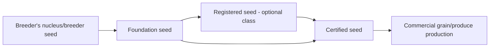
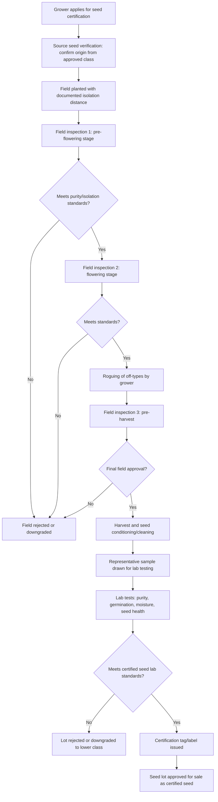

## Seed Production and Certification

### Definition and Core Concept

Seed production and certification encompasses the systematic multiplication of genetically pure, high-quality seed of a given crop variety, coupled with a formal quality assurance process that verifies the resulting seed lots meet defined genetic identity, genetic purity, physical purity, and germination standards. Certification provides an official guarantee to farmers that the seed they purchase will produce plants true to the named variety and of adequate physiological quality, which is essential for realizing the genetic gains achieved through plant breeding programs in commercial production.

### Seed Classes and the Generation System

Seed multiplication proceeds through a defined sequence of generations, each subject to specific standards, to maintain genetic purity while producing sufficient volume for commercial planting. The generation system, with some regional naming variation, generally follows this structure:

**Breeder Seed**

The initial seed source, produced by or under the direct supervision of the plant breeder or originating institution responsible for developing the variety. Breeder seed has the highest genetic purity and is produced in relatively small quantities under the most intensive selection and rogueing (removal of off-type plants) practices. This class is not typically sold commercially but serves as the source for the next generation.

**Foundation Seed (or Pre-Basic/Basic Seed, terminology varies by country)**

Produced directly from breeder seed under careful supervision, typically by specialized seed certification agencies, universities, or designated seed production organizations. Foundation seed maintains high genetic purity standards and serves as the immediate source for certified seed production. In many systems this class is subdivided further (e.g., pre-basic and basic seed) with progressively less restrictive standards at each step while still maintaining high purity.

**Registered Seed**

An intermediate class used in some certification systems (notably in the United States and several other countries) between foundation and certified seed, allowing an additional generation of multiplication while maintaining documented genetic purity, though not all national systems include this class.

**Certified Seed**

The final class in the sequence, produced from foundation (or registered) seed and intended for sale to farmers for commercial crop production. Certified seed standards are somewhat less stringent than foundation seed standards (permitting slightly higher tolerances for off-types and other-crop seed) but still ensure a defined minimum level of genetic and physical purity suitable for commercial production. Certified seed is not typically used to produce further certified seed generations (i.e., a farmer cannot save certified seed and have it recertified) except where explicitly permitted for self-pollinated crops under specific regulatory allowances.

### The Generation Sequence Visualized

### Field Inspection Standards

**Key Points**

- Isolation distance: minimum physical separation required between a seed production field and other fields of the same crop species (particularly different varieties, or fields that could cross-pollinate) to prevent genetic contamination via cross-pollination; required distances vary substantially by crop species depending on pollination biology (self-pollinated crops generally require much shorter isolation distances than cross-pollinated or insect/wind-pollinated crops).
- Varietal purity tolerance: maximum permissible percentage of off-type plants (plants not conforming to the characteristic morphology of the named variety) observed during field inspections, with different tolerance levels typically specified for foundation versus certified seed classes.
- Isolation requirements and purity tolerances are crop-specific and are published in official seed certification standards by the relevant national or regional certifying authority; [Inference] specific numeric values vary by crop, seed class, and certifying jurisdiction, so exact figures should be verified against the applicable current standard for the crop and country in question rather than assumed universal.
- Field inspections are typically conducted at multiple defined growth stages (e.g., pre-flowering, flowering, and pre-harvest) by trained certification agency personnel, who assess varietal purity, presence of prohibited or objectionable weed species, disease incidence, and general crop condition.
- Roguing: the practice of manually removing off-type plants, diseased plants, or plants of other varieties/species from the seed field prior to flowering (to prevent unwanted cross-pollination) and again before harvest, is a critical grower responsibility supporting field inspection outcomes.

### Seed Quality Testing Parameters

**Genetic Purity**

Verifies that the seed lot conforms genetically to the named variety, historically assessed primarily through grow-out tests (planting a representative seed sample and comparing resulting plant morphology against the official variety description) and increasingly supplemented or replaced by molecular marker-based identity testing (e.g., SSR or SNP fingerprinting) which can confirm varietal identity more rapidly than a full-season grow-out test.

**Physical Purity**

Assessed through laboratory analysis of a representative seed sample, determining the percentage by weight of pure seed of the kind being tested, seed of other crop species, weed seeds (with particular attention to prohibited and restricted noxious weed species defined by regulation), and inert matter (soil, chaff, broken seed fragments).

**Germination Percentage**

Determined through standardized germination tests conducted under controlled temperature, moisture, and light conditions specified by official testing protocols (e.g., those published by the International Seed Testing Association, ISTA, or equivalent national testing authorities), measuring the percentage of seeds producing normal seedlings within a specified test duration.

**Moisture Content**

Measured to ensure seed lots meet maximum moisture thresholds appropriate for the crop and storage conditions, since excess moisture accelerates seed deterioration and promotes fungal growth during storage.

**Seed Health**

Testing for the presence of seed-borne pathogens (fungal, bacterial, or viral) that could be transmitted to the next crop, using methods ranging from visual/microscopic inspection to laboratory culturing and, increasingly, molecular diagnostic assays (e.g., PCR-based pathogen detection).

### Seed Certification Workflow

### Seed Conditioning and Processing

**Key Points**

- **Cleaning**: Removal of foreign material, weed seeds, chaff, and broken seed using equipment such as air-screen cleaners (separating by size and density using calibrated screens and airflow), gravity tables (separating by density and shape), and indent cylinders (separating by seed length).
- **Sizing/grading**: Sorting seed into uniform size classes, which improves planting precision in mechanized seeding equipment and can correlate with seed vigor differences within a lot.
- **Treatment**: Application of fungicide, insecticide, or biological seed treatments to protect seed and emerging seedlings from soil-borne and seed-borne pests and pathogens; treated seed typically requires specific labeling to distinguish it from untreated seed.
- **Packaging and labeling**: Certified seed bags/containers must bear an official certification tag or label displaying required information, which commonly includes variety name, seed class, lot number, germination percentage, purity percentage, test date, and the certifying agency's identification, enabling traceability back to the specific production field and lot.

### Hybrid Seed Production Considerations

Hybrid seed production, common in crops such as maize, sunflower, and many vegetable crops, involves additional complexity beyond standard varietal seed multiplication because it requires maintaining and crossing distinct parent lines.

**Key Points**

- **Parent line maintenance**: Inbred or otherwise genetically stable parent lines (commonly a male-sterile or detasseled female line and a fertile male/pollinator line) must be maintained with especially high genetic purity, since any contamination in parent lines propagates into all subsequent hybrid seed produced from them.
- **Isolation requirements for hybrid seed production fields are typically more stringent** than for standard varietal seed production, given the critical importance of preventing unwanted pollen contamination from affecting hybrid seed purity.
- **Detasseling or male sterility systems**: Mechanical or manual detasseling (removal of male flower structures) or genetic/cytoplasmic male sterility systems are used to prevent self-pollination of the female parent line, ensuring that seed set on the female line results only from cross-pollination with the intended male parent.
- **Hybrid seed purity testing** often relies heavily on molecular marker-based parentage verification in addition to standard grow-out and morphological assessment, given the economic stakes of hybrid seed quality and the difficulty of visually distinguishing self-pollinated (off-type) seed from properly hybridized seed in some crops.

### International and National Certification Frameworks

**Key Points**

- **OECD Seed Schemes**: Provide internationally harmonized standards and procedures for varietal certification of seed moving in international trade, covering multiple crop categories (e.g., grasses and legumes, crucifers, cereals, maize and sorghum, among others), allowing seed certified under one participating country's OECD-compliant program to be recognized in other participating countries.
- **ISTA (International Seed Testing Association)**: Establishes internationally standardized methods for seed sampling and laboratory testing (germination, purity, moisture, health), with ISTA-accredited laboratories issuing internationally recognized orange international seed lot certificates used in international seed trade.
- **National certification agencies**: Most countries maintain a national or state/provincial seed certification authority (e.g., state crop improvement associations in the United States operating under guidelines coordinated by bodies such as the Association of Official Seed Certifying Agencies, AOSCA) responsible for administering field inspection and seed testing standards domestically.
- [Inference] Specific standards, participating crop lists, and procedural details of these frameworks are periodically revised, so current program documentation should be consulted for authoritative, up-to-date requirements rather than relying on general background knowledge of the frameworks' structure.

### Worked Example: Certified Seed Production of a Self-Pollinated Cereal

**Example**

1. A grower obtains foundation seed of a newly released wheat variety from the breeding institution or a designated foundation seed organization.
2. The grower's field is registered with the state/national seed certification agency, and isolation distance from other wheat varieties is confirmed as adequate (self-pollinated cereals like wheat generally require comparatively modest isolation distances relative to cross-pollinated crops).
3. A certification inspector conducts a first field inspection during vegetative growth to check for volunteer plants of other varieties and general field condition.
4. A second inspection during heading/flowering assesses varietal purity by comparing plant characteristics (heading date, plant height, awn presence/absence, spike characteristics) against the official variety description; off-type plants exceeding the tolerance threshold would result in field rejection.
5. The grower removes any observed off-type plants (roguing) prior to harvest.
6. A final pre-harvest inspection confirms the field remains within purity tolerances and checks for prohibited weed species and disease symptoms.
7. Upon harvest, the grower's seed is cleaned and conditioned, and an official sample is drawn according to standardized sampling procedures.
8. The sample undergoes laboratory testing for germination percentage, physical purity, other-crop seed content, weed seed content (including any prohibited noxious weed seeds), and moisture content.
9. If all standards are met, the certification agency issues official certified seed tags, which are affixed to seed bags/containers prior to sale, displaying the variety name, seed class (Certified), lot number, and test results.

### Comparison of Seed Classes

| Attribute | Breeder Seed | Foundation Seed | Certified Seed |
| --- | --- | --- | --- |
| Genetic purity standard | Highest | Very high | High (but relatively less stringent than foundation) |
| Quantity produced | Smallest | Moderate | Largest |
| Typical producer | Breeder/originating institution | Specialized foundation seed organization | Registered commercial seed growers |
| Commercial sale to farmers | No | Generally no (used for further multiplication) | Yes |
| Tag/label color (illustrative, varies by country) | White | White | Blue |

### Illustrative Diagram: Isolation Distance Concept

<svg xmlns="http://www.w3.org/2000/svg" viewBox="0 0 700 260">
<text x="350" y="25" font-size="16" font-weight="bold" text-anchor="middle" fill="#222">Seed Field Isolation Distance Concept (svg_diagram)</text>
<circle cx="220" cy="150" r="70" fill="#a8d5a2" stroke="#222" stroke-width="1.5" />
<text x="220" y="145" font-size="11" text-anchor="middle" fill="#222">Certified seed field</text>
<text x="220" y="160" font-size="11" text-anchor="middle" fill="#222">Variety A</text>
<circle cx="480" cy="150" r="70" fill="#cfe3f7" stroke="#222" stroke-width="1.5" />
<text x="480" y="145" font-size="11" text-anchor="middle" fill="#222">Other field</text>
<text x="480" y="160" font-size="11" text-anchor="middle" fill="#222">Variety B / other crop</text>
<line x1="290" y1="150" x2="410" y2="150" stroke="#333" stroke-width="1.5" marker-start="url(#arrowL)" marker-end="url(#arrowR)" />
<text x="350" y="140" font-size="10" text-anchor="middle" fill="#222">Isolation distance</text>
<text x="350" y="185" font-size="9" text-anchor="middle" fill="#333">(minimum distance varies by crop</text>
<text x="350" y="197" font-size="9" text-anchor="middle" fill="#333">pollination biology and seed class)</text>
</svg>

### Related Topics

- Grow-out testing and molecular marker-based varietal identity verification
- Hybrid seed production systems and cytoplasmic male sterility
- Seed vigor testing methods beyond standard germination percentage
- Seed storage physiology and longevity under different conditions
- OECD Seed Schemes and international seed trade regulations
- Plant variety protection (PVP) and plant breeders' rights
- Seed-borne disease diagnostics and phytosanitary certification
- Community-based and farmer-managed seed systems versus formal certification
- Truthful labeling and seed law enforcement
- Genebank conservation and breeder seed maintenance over time