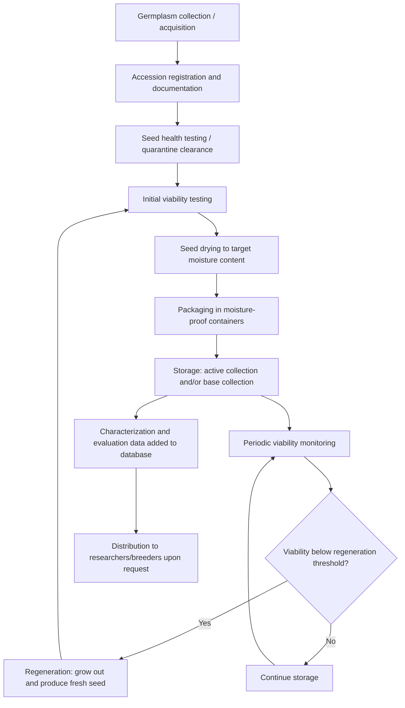

## Germplasm Conservation and Genebanks

### Definition and Core Concept

Germplasm conservation is the systematic collection, maintenance, and safeguarding of genetic material (seeds, tissues, DNA, or whole plants) representing the genetic diversity of crop species, their wild relatives, and related plant genetic resources, for the purpose of preserving this diversity against loss and making it available for research, breeding, and future use. Genebanks are the institutional facilities responsible for carrying out this conservation, typically maintaining accessions (individually catalogued samples of germplasm, each representing a distinct population or genotype) under conditions designed to maximize viability and genetic integrity over long time periods.

The core rationale rests on the recognition that genetic diversity within crop species and their wild relatives constitutes a finite and non-renewable resource once lost, containing alleles for traits such as disease resistance, stress tolerance, and nutritional quality that may not exist in current elite breeding material but may be essential for addressing future breeding challenges, including those posed by climate change, emerging pests and diseases, and evolving consumer or production demands.

### Categories of Germplasm Conservation

**In Situ Conservation**

Conservation of genetic material within its natural or original habitat and ongoing evolutionary context.

- **On-farm conservation**: The maintenance of traditional crop varieties (landraces) by farmers within their traditional agricultural systems, allowing continued evolution and adaptation of the germplasm under natural selection pressures and farmer-driven selection, in contrast to the genetically static state of material held in genebank storage.
- **Protected areas/wild relative conservation**: Conservation of crop wild relatives (CWR) and wild plant populations within natural reserves, national parks, or other protected habitats, preserving the natural ecological and evolutionary processes acting on these populations.

**Ex Situ Conservation**

Conservation of genetic material outside its natural habitat, in a genebank or equivalent facility, under controlled conditions.

- **Seed genebanks**: The most widely used ex situ method for orthodox seed species (species whose seeds can be dried and stored at low temperature without losing viability); seeds are dried to low moisture content and stored under refrigerated or frozen conditions.
- **Field genebanks**: Living plant collections maintained in the field, used for species that cannot be conserved as seed (e.g., because they produce recalcitrant seed that does not tolerate drying/freezing, or are vegetatively propagated crops such as many fruit trees, cassava, and potato).
- **In vitro conservation (tissue culture)**: Maintenance of plant tissue (shoot tips, meristems) under sterile culture conditions, often with growth-retarding conditions (reduced temperature, growth regulator manipulation) to extend subculture intervals, used particularly for vegetatively propagated and recalcitrant-seeded species.
- **Cryopreservation**: Storage of plant tissue (typically shoot tips, embryos, or pollen) at ultra-low temperature, commonly in liquid nitrogen at approximately −196°C, at which essentially all metabolic and biochemical degradation processes are halted, offering the potential for very long-term, low-maintenance storage for species otherwise difficult to conserve as seed.
- **DNA/pollen storage**: Storage of extracted DNA or pollen samples, of more limited but specific utility (DNA storage supports genetic research and, in principle, future resynthesis technologies; pollen storage supports breeding crosses without maintaining full living plant collections).

### Seed Genebank Classification by Storage Duration and Function

**Base Collections (Long-Term Storage)**

Maintained at very low temperature (commonly around −18°C or colder) and low seed moisture content, intended for long-term security storage with minimal accession and distribution activity, serving as the ultimate safeguard against loss of the genetic material.

**Active Collections (Medium-Term Storage)**

Maintained at moderately low temperature (commonly around 4°C to 5°C), intended for more frequent access, regeneration monitoring, characterization, and distribution of samples to researchers and breeders upon request.

### The Seed Physiology Basis of Storage

**Key Points**

- Orthodox seeds tolerate desiccation to low moisture content (commonly targeted in the range of approximately 3–7% moisture content depending on species and oil content) and can subsequently be stored at low or sub-zero temperature without loss of viability for extended periods.
- Seed longevity under storage is governed by the combined effects of moisture content and storage temperature, following a widely referenced general relationship (attributed to Ellis and Roberts) indicating that seed longevity approximately doubles for each defined reduction in moisture content and each defined reduction in temperature within the ranges typically used in genebank storage, though the exact quantitative parameters are species-specific.
- **Recalcitrant seeds** (e.g., many tropical tree species, cacao, mango) cannot be dried below a relatively high moisture threshold without lethal damage and cannot tolerate freezing, making conventional seed genebank storage unsuitable; these species require field genebank, in vitro, or cryopreservation approaches instead.
- **Intermediate seeds** exhibit storage behavior between orthodox and recalcitrant categories, tolerating some desiccation and cool storage but not the full desiccation and freezing tolerance of fully orthodox seeds.

### Genebank Operational Workflow

### Genetic Diversity and Sampling Considerations in Collection

**Key Points**

- Collecting strategy must balance capturing maximum genetic diversity within a species against practical constraints on the number of accessions a genebank can realistically process, characterize, and maintain.
- Sampling design for wild or landrace populations typically considers factors such as population size, geographic distribution, and known or inferred patterns of genetic variation (e.g., collecting across an ecological or altitudinal gradient to capture locally adapted variation), often guided by ecogeographic surveys prior to or during collecting missions.
- Core collections are subsets of a larger germplasm collection selected to represent the maximum genetic diversity of the full collection with a minimum number of accessions, developed using passport data (basic collection information such as geographic origin), characterization data (morphological and agronomic traits), and increasingly molecular marker data, to make large collections more manageable for screening and use by breeders.

### Documentation and Data Management

**Key Points**

- **Passport data**: Basic identifying and origin information for each accession (collection site, date, donor, taxonomic identity, collector), which is essential baseline documentation without which the value of an accession for targeted use is greatly diminished.
- **Characterization data**: Morphological and other highly heritable traits recorded under standardized conditions, generally consistent across environments, used to describe and distinguish accessions.
- **Evaluation data**: Agronomic performance and trait data recorded under specific environmental/management conditions (yield, disease response, stress tolerance), which may be more environment-dependent than characterization data and often generated collaboratively with external researchers using distributed germplasm.
- **Genomic/molecular data**: Increasingly generated through genotyping (SSR, SNP, or whole-genome sequencing) of genebank accessions, supporting more precise identification of genetically distinct or redundant accessions and facilitating genomics-assisted mining of the collection for specific alleles of interest.
- International data standards (such as those developed under multi-crop passport descriptor frameworks) support interoperability of genebank documentation systems across institutions, enabling coordinated global germplasm information systems.

### International Genebank Institutions and Frameworks

**Key Points**

- **CGIAR genebanks**: A network of international agricultural research centers (part of the Consultative Group on International Agricultural Research system) maintains major crop-specific germplasm collections (e.g., rice, wheat and maize, various legumes, root and tuber crops), holding some of the largest and most utilized international collections for their respective mandate crops.
- **Svalbard Global Seed Vault**: A secure, long-term backup storage facility located in permafrost on the Svalbard archipelago (Norway), designed to hold duplicate seed samples deposited by genebanks worldwide as a safety backup against loss of original collections due to natural disaster, conflict, equipment failure, or funding interruption, operating under a "black box" deposit model where depositing institutions retain ownership and control over withdrawal of their own deposited material.
- **International Treaty on Plant Genetic Resources for Food and Agriculture (ITPGRFA)**: An international legal framework governing access to and benefit-sharing from plant genetic resources for specific crops listed in the treaty's Multilateral System, establishing standardized terms (via a Standard Material Transfer Agreement) for germplasm exchange among treaty-adhering countries and institutions.
- **National genebanks**: Most countries maintain national genebank facilities responsible for conserving genetic resources of national importance, often coordinating with international collections and frameworks. [Inference] Specific institutional names, holdings, and current operational status change over time and should be verified against current institutional sources for precise or time-sensitive details.

### Regeneration Challenges

**Key Points**

- Periodic regeneration (growing accessions to produce fresh seed) is required as stored seed viability gradually declines over time, but regeneration carries inherent risks to genetic integrity, including potential genetic drift (random changes in allele frequency, particularly significant in small regeneration plot populations), unintentional selection pressure imposed by the specific growing environment or management practices differing from the original collection environment, and outcrossing/contamination risk for cross-pollinated species if inadequate isolation is used during regeneration.
- Regeneration protocols aim to minimize these risks through practices such as maintaining adequately large population sizes during regeneration, controlling pollination where feasible, and documenting any observed changes relative to original accession characterization data.
- Determining the appropriate timing for regeneration relies on periodic viability monitoring (germination testing of stored samples at defined intervals) to detect declining viability before it drops below levels considered safe for maintaining genetic representativeness of the original population.

### Use of Genebank Material in Breeding Programs

**Key Points**

- Genebank accessions, particularly landraces and crop wild relatives, are important sources of alleles for traits often absent or rare in modern elite breeding material, including resistance to diseases and pests, tolerance to abiotic stresses (drought, heat, salinity), and, in some cases, novel quality or nutritional traits.
- Direct use of genebank material in breeding is often complicated by linkage drag and generally poor overall agronomic performance of unimproved landrace or wild material, necessitating pre-breeding: an intermediate step in which desirable traits from genebank accessions are introgressed into more breeding-amenable genetic backgrounds before the material is incorporated into mainstream breeding pipelines.
- Genomic characterization of genebank collections (sometimes referred to as genebank genomics) increasingly allows breeders to identify specific accessions carrying favorable alleles at genes or QTLs of interest without needing to phenotypically screen the entire collection, substantially improving the efficiency of mining genebank diversity for breeding use.

### Worked Example: Seed Genebank Accession Lifecycle

**Example**

1. A collecting team gathers seed samples of a landrace variety from farmer fields in a defined geographic region, recording passport data including precise collection site coordinates, farmer/donor information, and local variety name.
2. Upon arrival at the genebank, seed samples undergo seed health testing to screen for seed-borne pathogens and, where the material crosses international borders, quarantine clearance according to applicable phytosanitary regulations.
3. An initial germination test establishes baseline viability of the newly acquired accession.
4. Seed is dried under controlled conditions to the genebank's target moisture content for long-term storage.
5. Dried seed is divided into working samples, stored in the active collection under medium-term conditions (~4-5°C) for characterization, evaluation, and distribution purposes, and long-term backup samples, stored in the base collection under long-term conditions (sub-zero temperature).
6. The accession is characterized for standard morphological descriptors and, if resources allow, genotyped with molecular markers; this data, along with the original passport data, is entered into the genebank's documentation database.
7. A duplicate sample may be deposited at a secure backup facility (such as the Svalbard Global Seed Vault) as a safeguard against loss of the primary collection.
8. Periodic viability monitoring (e.g., testing a subsample every several years, with the specific interval depending on species-specific seed longevity characteristics) tracks germination percentage over time.
9. When viability monitoring indicates the accession has declined toward a defined regeneration threshold, the accession is grown out under controlled conditions (with appropriate isolation for cross-pollinated species) to produce a fresh seed supply, which then re-enters storage, restarting the monitoring cycle.
10. Researchers or breeders seeking specific traits can search the genebank's documentation database (passport, characterization, evaluation, and genomic data) to identify candidate accessions, and request samples under applicable material transfer agreements for use in pre-breeding or direct breeding programs.

### Comparison of Ex Situ Conservation Methods

| Method | Best Suited For | Storage Duration Potential | Key Limitation |
| --- | --- | --- | --- |
| Seed genebank (orthodox) | Most cereals, legumes, many vegetables | Long-term (years to decades) | Not usable for recalcitrant-seeded or vegetatively propagated species |
| Field genebank | Fruit trees, vegetatively propagated crops | Ongoing (living collection) | High land, labor, and maintenance cost; vulnerable to pests, disease, disasters |
| In vitro (tissue culture) | Vegetatively propagated, recalcitrant-seeded species | Medium-term (with periodic subculture) | Labor-intensive; risk of somaclonal variation over repeated subculture |
| Cryopreservation | Recalcitrant seed, vegetatively propagated, difficult species | Potentially very long-term | Technically demanding protocol development per species; higher upfront cost |

### Illustrative Diagram: Ex Situ vs In Situ Conservation Relationship

<svg xmlns="http://www.w3.org/2000/svg" viewBox="0 0 700 300">
<text x="350" y="25" font-size="16" font-weight="bold" text-anchor="middle" fill="#222">Germplasm Conservation Strategies (svg_diagram)</text>
<rect x="40" y="60" width="280" height="200" rx="10" fill="#a8d5a2" stroke="#222" stroke-width="1.5" />
<text x="180" y="85" font-size="13" font-weight="bold" text-anchor="middle" fill="#222">In Situ Conservation</text>
<text x="180" y="115" font-size="10" text-anchor="middle" fill="#333">On-farm landrace maintenance</text>
<text x="180" y="135" font-size="10" text-anchor="middle" fill="#333">Protected wild relative habitats</text>
<text x="180" y="165" font-size="9" text-anchor="middle" fill="#333">Ongoing evolution and</text>
<text x="180" y="178" font-size="9" text-anchor="middle" fill="#333">adaptation continues</text>
<text x="180" y="210" font-size="9" text-anchor="middle" fill="#333">Vulnerable to habitat loss,</text>
<text x="180" y="223" font-size="9" text-anchor="middle" fill="#333">land-use change, genetic erosion</text>
<rect x="380" y="60" width="280" height="200" rx="10" fill="#cfe3f7" stroke="#222" stroke-width="1.5" />
<text x="520" y="85" font-size="13" font-weight="bold" text-anchor="middle" fill="#222">Ex Situ Conservation</text>
<text x="520" y="115" font-size="10" text-anchor="middle" fill="#333">Seed genebanks (base/active)</text>
<text x="520" y="135" font-size="10" text-anchor="middle" fill="#333">Field genebanks</text>
<text x="520" y="155" font-size="10" text-anchor="middle" fill="#333">In vitro / cryopreservation</text>
<text x="520" y="185" font-size="9" text-anchor="middle" fill="#333">Genetic state fixed at</text>
<text x="520" y="198" font-size="9" text-anchor="middle" fill="#333">time of collection</text>
<text x="520" y="228" font-size="9" text-anchor="middle" fill="#333">Vulnerable to storage failure,</text>
<text x="520" y="241" font-size="9" text-anchor="middle" fill="#333">funding interruption, disaster</text>

<text x="350" y="280" font-size="10" text-anchor="middle" fill="#222">Complementary strategies: neither approach alone is fully sufficient</text>

</svg>

### Related Topics

- Crop wild relatives and pre-breeding for trait introgression
- Genebank genomics and molecular characterization of collections
- International Treaty on Plant Genetic Resources for Food and Agriculture (ITPGRFA)
- Core collection development and genetic diversity sampling strategies
- Seed longevity physiology and the Ellis-Roberts viability equations
- Cryopreservation protocol development for recalcitrant species
- On-farm conservation and farmer seed systems
- Genetic erosion and causes of crop genetic diversity loss
- Marker-assisted selection using genebank-derived donor alleles
- Digital sequence information and access/benefit-sharing debates in genetic resources