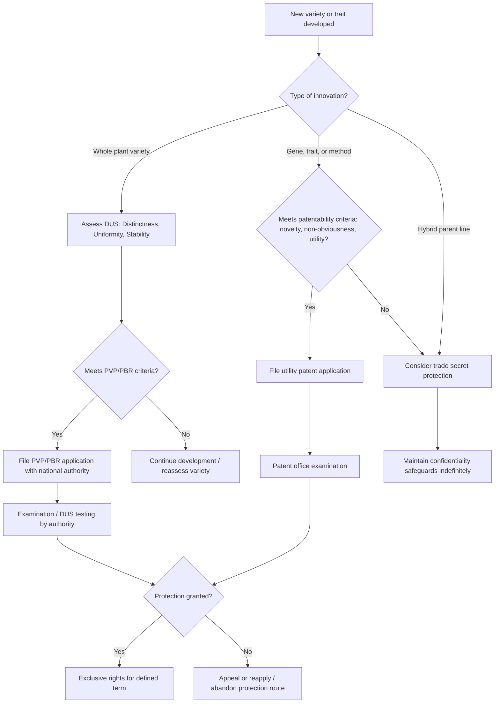

## Intellectual Property in Plant Breeding

### Definition and Core Concept

Intellectual property (IP) in plant breeding refers to the legal mechanisms that grant breeders, institutions, or companies exclusive rights over new plant varieties, breeding technologies, and associated genetic material, enabling them to control propagation, sale, and use of protected material for a defined period. These mechanisms exist to provide an economic incentive for the substantial time and investment required to develop new varieties (commonly a decade or more from initial cross to commercial release) by allowing rights holders to recoup development costs and profit from successful varieties before the innovation enters the public domain or becomes freely usable by competitors.

### Plant Variety Protection (PVP) / Plant Breeders' Rights (PBR)

**Core Mechanism**

Plant Variety Protection (termed Plant Breeders' Rights in many jurisdictions, particularly those following UPOV terminology) is a sui generis (purpose-specific) form of intellectual property right specifically designed for plant varieties, distinct from general patent law. It grants the breeder of a new variety exclusive control over the propagating material of that variety for a defined term.

**UPOV Convention**

The International Union for the Protection of New Varieties of Plants (UPOV) establishes an internationally harmonized framework for plant variety protection, to which member countries align their national PVP legislation. Successive UPOV Convention texts (notably 1978 and 1991 Acts) have established evolving standards, with the 1991 Act generally providing stronger and broader breeder rights than the 1978 Act, including extended scope of protection and reduced farmer exemption flexibility, though the specific Act(s) a given country has adopted, and any transitional provisions, vary by jurisdiction. [Inference] Current membership status and which Act a specific country has ratified should be verified against current UPOV documentation, as this changes as countries join or update their accession.

**Criteria for Protection (DUS Testing)**

To qualify for PVP/PBR, a candidate variety must generally satisfy the following criteria, assessed through DUS testing:

- **Distinctness (D)**: The variety must be clearly distinguishable from any other variety whose existence is a matter of common knowledge at the time of application, based on defined morphological or other characteristics.
- **Uniformity (U)**: The variety must be sufficiently uniform in its relevant characteristics, subject to variation expected from its particular method of propagation (self-pollinated varieties are generally expected to show greater uniformity than cross-pollinated or hybrid varieties, and standards account for this).
- **Stability (S)**: The variety's relevant characteristics must remain unchanged after repeated propagation or, for a specific cycle of propagation, at the end of each such cycle.

A further common requirement is that the variety must be new (not previously sold or otherwise disposed of beyond specified grace periods prior to application).

**Breeder Exemption**

A characteristic feature of PVP/PBR systems (particularly under earlier UPOV Acts and, in more limited form, retained under the 1991 Act) is the breeder's exemption, which permits other breeders to freely use a protected variety as a source of initial variation for developing new varieties, without requiring authorization from or payment to the rights holder of the protected variety, provided the resulting new variety is itself sufficiently distinct. This exemption reflects a policy judgment that continued breeding progress benefits from broad access to existing genetic diversity, even genetic material under active protection.

**Farmer's Privilege**

Many PVP/PBR systems include a farmer's privilege (also called farm-saved seed exemption) permitting farmers to save and replant seed of a protected variety harvested from their own crop for their own use on their own holding, without infringing the breeder's rights, though this privilege is typically more restricted or subject to specific conditions (such as remuneration to the rights holder in some jurisdictions) than under general seed-saving practices for unprotected varieties, and its scope varies considerably between countries and, in some cases, between crop types within the same country.

### Utility Patents

**Core Mechanism**

In some jurisdictions, particularly the United States, plant-related inventions can be protected under general utility patent law, which is broader in scope than PVP/PBR and can cover not only whole plant varieties but also specific genes, gene constructs, transformation methods, breeding methods, and plant parts, provided the invention meets the standard utility patent criteria of novelty, non-obviousness (inventive step), and utility (industrial applicability), along with adequate written description and enablement of the invention.

**Distinction from PVP/PBR**

Utility patents generally do not include a breeder's exemption or farmer's privilege comparable to PVP/PBR systems, meaning that a utility-patented plant variety or trait typically cannot be freely used by other breeders as a source of variation for further breeding, nor can farmers generally save and replant patented seed, without risk of infringement, subject to the specific claims and terms of the patent and any associated licensing agreements. This makes utility patent protection generally more restrictive from the perspective of subsequent breeding use and farmer seed-saving than PVP/PBR protection, though the appropriateness of each system is often debated in relation to different types of innovation (e.g., a specific transgenic trait versus a conventionally bred whole variety).

**Plant Patents (US-Specific Category)**

The United States additionally maintains a distinct plant patent category (separate from utility patents) applicable specifically to new and distinct asexually reproduced plant varieties (excluding tuber-propagated plants), commonly used for ornamental plants and certain fruit varieties propagated by grafting, budding, or cuttings rather than by seed.

### Comparison of IP Mechanisms

| Aspect | PVP / PBR | Utility Patent |
| --- | --- | --- |
| Scope | Whole plant variety (specific denomination) | Can cover genes, traits, methods, plant parts, or whole varieties |
| Breeder's exemption | Generally yes (varies by UPOV Act adopted) | Generally no |
| Farmer's privilege | Often yes, with conditions (varies by jurisdiction) | Generally no |
| Novelty standard | Distinctness from existing varieties (DUS) | Novelty + non-obviousness (inventive step) |
| Typical duration | Commonly around 20-25 years depending on jurisdiction and crop type [Inference: exact terms vary by country/crop and should be confirmed against current national law] | Generally around 20 years from filing, per standard patent term conventions, subject to jurisdiction-specific rules |

### Trade Secrets

**Key Points**

- Certain aspects of proprietary breeding programs, particularly inbred parent lines used in hybrid seed production, are frequently protected as trade secrets rather than through formal IP registration, since the parent lines themselves are typically not sold or publicly disclosed (only the resulting hybrid seed is commercialized), making it difficult for competitors to reverse-engineer the specific inbred parents through ordinary means.
- Trade secret protection relies on maintaining confidentiality (through contractual, physical, and procedural safeguards) rather than public registration and disclosure, and protection persists only as long as the information remains genuinely secret and reasonable protective measures are maintained, in contrast to the fixed statutory term of patents and PVP/PBR.
- Trade secret status is particularly well-suited to hybrid crop breeding programs where the commercial product (the hybrid seed) does not reveal the identity of the parent lines used to produce it, unlike varietal (non-hybrid) seed, where the seed itself is the propagatable and identifiable protected material.

### The Multilateral Access and Benefit-Sharing Framework

**International Treaty on Plant Genetic Resources for Food and Agriculture (ITPGRFA)**

Establishes a Multilateral System covering a defined list of crops important for food security, under which access to genetic resources held in the system is facilitated through a Standard Material Transfer Agreement (SMTA), and recipients agree to specific benefit-sharing obligations (including a share of commercial benefits under certain conditions) if the material or derived products incorporating it are commercialized and further restricted from access by others through IP.

**Convention on Biological Diversity (CBD) and the Nagoya Protocol**

Establish a broader framework for access to genetic resources and fair and equitable sharing of benefits arising from their use, generally applicable to genetic resources not covered by the ITPGRFA's Multilateral System, typically requiring prior informed consent from the country of origin and mutually agreed terms for access and benefit-sharing, which has implications for germplasm exchange and subsequent IP claims involving genetic material sourced across borders.

**Digital Sequence Information (DSI) Debate**

An evolving and actively contested policy area concerns whether and how access and benefit-sharing obligations should apply to digital sequence information (genomic sequence data derived from genetic resources) as distinct from the physical genetic material itself, since sequence data can be freely shared, downloaded, and used (including in gene editing or informatics-driven breeding) without physical transfer of the underlying biological material, raising questions about how existing physical-material-based frameworks apply. [Inference] This is an area of ongoing international negotiation and policy development, so the current state of any resolution or framework should be checked against current sources rather than assumed settled.

### IP Considerations in Genomics-Era Breeding Technologies

**Key Points**

- Molecular markers, genomic selection models, and bioinformatics pipelines used in modern breeding programs may themselves be subject to patent protection (for specific methods or technologies) or maintained as proprietary trade secrets (for internally developed genomic prediction models and databases), adding a layer of IP consideration distinct from protection of the resulting plant varieties themselves.
- Gene editing technology, particularly foundational CRISPR-Cas systems, has been the subject of significant patent litigation and licensing activity at the level of the core technology platform (separate from IP protection of any specific edited crop variety produced using the technology), meaning companies developing gene-edited crops may need to secure licenses to underlying editing technology patents in addition to seeking any protection for the resulting variety itself.
- [Inference] The patent landscape and specific licensing terms for core gene editing technologies have evolved substantially and continue to change through ongoing litigation and licensing agreements; current status should be verified against current legal/industry sources rather than treated as static.

### Farmer Seed Systems and IP Tensions

**Key Points**

- A recurring point of policy debate concerns the tension between formal IP protection systems (designed around commercial breeding and seed sale) and informal farmer seed systems, particularly in regions where farmer seed saving, exchange, and informal sale of harvested seed of protected varieties is a long-standing practice, sometimes conflicting with the scope of rights granted under national PVP/PBR or patent law.
- Some countries' national PVP/PBR legislation includes explicit provisions or exceptions intended to accommodate traditional farmer seed-saving and exchange practices, reflecting differing national policy balances between incentivizing formal breeding investment and preserving traditional agricultural practices; the specific balance struck varies considerably across countries and remains an active area of legislative and policy discussion in several jurisdictions.

### IP Protection Pathway Workflow

### Worked Example: Choosing an IP Strategy for a New Hybrid Maize Variety

**Example**

1. A breeding company develops two proprietary inbred lines (Line A and Line B) and discovers their cross produces a superior hybrid with improved yield and standability.
2. The company assesses that Line A and Line B, if disclosed, would allow competitors to reproduce the hybrid; since these parent lines are never sold or distributed (only the F1 hybrid seed is sold to farmers), the company opts to maintain the inbred parent line genetics as a **trade secret**, restricting access to the lines through internal confidentiality controls and controlled seed production contracts.
3. The commercial hybrid seed itself may separately qualify for **PVP/PBR protection** as a distinct, uniform (within hybrid seed uniformity expectations), and stable variety, which the company pursues to obtain a formal exclusive right specifically over the sale of that hybrid seed, providing a legal remedy against unauthorized seed multiplication and sale distinct from trade secret protection of the parent lines.
4. If the hybrid also incorporates a specific patented transgenic trait (e.g., a proprietary Bt insect resistance gene) licensed from another company, the breeding company must additionally comply with the terms of the **utility patent license** covering that trait, which may include restrictions on farmer seed-saving of the resulting hybrid seed beyond what PVP/PBR alone would impose.
5. This combined strategy—trade secret protection of parent lines, PVP/PBR protection of the hybrid variety denomination, and patent licensing compliance for any incorporated patented traits—illustrates how multiple IP mechanisms are frequently layered together for a single commercial product in modern plant breeding.

### Illustrative Diagram: Layered IP Protection in a Hybrid Variety

<svg xmlns="http://www.w3.org/2000/svg" viewBox="0 0 700 300">
<text x="350" y="25" font-size="16" font-weight="bold" text-anchor="middle" fill="#222">Layered IP Protection Example (svg_diagram)</text>
<rect x="240" y="60" width="220" height="60" rx="8" fill="#e07b39" stroke="#222" stroke-width="1.5" />
<text x="350" y="85" font-size="11" text-anchor="middle" fill="#fff">Patented transgenic trait</text>
<text x="350" y="102" font-size="9" text-anchor="middle" fill="#fff">(licensed utility patent)</text>
<rect x="240" y="140" width="220" height="60" rx="8" fill="#4a90d9" stroke="#222" stroke-width="1.5" />
<text x="350" y="165" font-size="11" text-anchor="middle" fill="#fff">Commercial hybrid variety</text>
<text x="350" y="182" font-size="9" text-anchor="middle" fill="#fff">(PVP/PBR protected denomination)</text>
<rect x="80" y="220" width="220" height="60" rx="8" fill="#a8d5a2" stroke="#222" stroke-width="1.5" />
<text x="190" y="245" font-size="11" text-anchor="middle" fill="#222">Inbred parent Line A</text>
<text x="190" y="262" font-size="9" text-anchor="middle" fill="#222">(trade secret)</text>
<rect x="400" y="220" width="220" height="60" rx="8" fill="#a8d5a2" stroke="#222" stroke-width="1.5" />
<text x="510" y="245" font-size="11" text-anchor="middle" fill="#222">Inbred parent Line B</text>
<text x="510" y="262" font-size="9" text-anchor="middle" fill="#222">(trade secret)</text>
<line x1="350" y1="120" x2="350" y2="140" stroke="#222" stroke-width="1.5" />
<line x1="190" y1="220" x2="300" y2="200" stroke="#222" stroke-width="1.5" />
<line x1="510" y1="220" x2="400" y2="200" stroke="#222" stroke-width="1.5" />
</svg>

### Related Topics

- Seed production and certification as the operational counterpart to IP-protected varieties
- UPOV Convention Acts (1978 vs 1991) and their differing breeder/farmer provisions
- CRISPR patent litigation and gene editing technology licensing
- Access and benefit-sharing under the Nagoya Protocol
- Digital sequence information (DSI) policy debates
- Farmer's rights under the ITPGRFA versus formal PVP/PBR systems
- Trade secret protection strategies for proprietary hybrid parent lines
- Genomic selection and proprietary breeding informatics as IP assets
- Open-source seed initiatives as an alternative to conventional IP protection
- Compulsory licensing and public-interest exceptions in plant variety protection