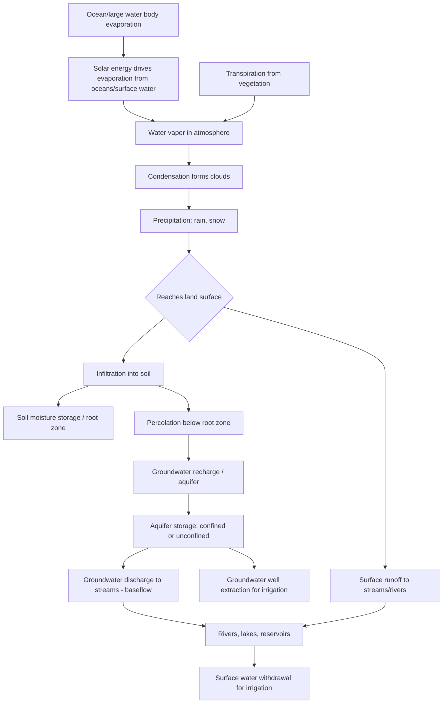

## Water Sources and Hydrology Basics

### Definition and Core Concept

Hydrology is the scientific study of the occurrence, distribution, movement, and properties of water on and beneath the Earth's surface and in the atmosphere. In an agricultural water management context, hydrology basics provide the foundation for understanding where irrigation water originates, how it moves through the environment, and how much of it is reliably available for agricultural use across seasons and years. This knowledge underlies virtually all irrigation planning, water rights allocation, and on-farm water management decisions.

### The Hydrologic Cycle

**Key Points**

- The hydrologic cycle (water cycle) describes the continuous circulation of water between the atmosphere, land surface, and subsurface through the processes of evaporation, transpiration, condensation, precipitation, infiltration, percolation, and runoff.
- **Evaporation**: The conversion of liquid water at the surface of oceans, lakes, rivers, and soil into water vapor, driven by solar energy input.
- **Transpiration**: The loss of water vapor from plant leaves through stomatal openings, a process intrinsically linked to plant photosynthetic gas exchange; evaporation and transpiration are frequently combined into a single term, **evapotranspiration (ET)**, since both processes occur simultaneously from a vegetated land surface and are difficult to measure separately in practice.
- **Precipitation**: Water returning to the Earth's surface as rain, snow, hail, or sleet, forming the primary input of new water to a given watershed or catchment.
- **Infiltration**: The entry of water at the soil surface into the soil profile, governed by soil texture, structure, initial moisture content, and surface condition (compaction, crusting, vegetative cover).
- **Percolation**: The continued downward movement of infiltrated water through the soil profile beyond the root zone toward groundwater.
- **Runoff**: The portion of precipitation (or irrigation water) that flows over the land surface rather than infiltrating, eventually reaching streams, rivers, or other surface water bodies.

### Water Balance Equation

The hydrologic cycle for a defined area (a field, watershed, or larger basin) over a given time period can be expressed through a water balance (mass balance) equation, a foundational concept underlying irrigation scheduling, watershed management, and reservoir operation:

$$P + I = ET + R + D + \Delta S$$

Where $P$ is precipitation, $I$ is irrigation input, $ET$ is evapotranspiration, $R$ is surface runoff, $D$ is deep percolation/drainage below the root zone, and $\Delta S$ is the change in water stored within the system (e.g., soil moisture storage or reservoir storage) over the period considered. This equation expresses the principle of conservation of mass applied to water: all water entering a system must be accounted for as either leaving the system through a specific pathway or being retained in storage.

### Surface Water Sources

**Rivers and Streams**

Natural channels carrying flowing water derived from precipitation runoff, snowmelt, and groundwater discharge (baseflow) within their contributing watershed. River flow is typically measured as discharge (volumetric flow rate), commonly expressed in units such as cubic meters per second ($m^3/s$) or cubic feet per second (cfs), and exhibits natural seasonal variation driven by precipitation patterns and, in snowmelt-dominated systems, temperature-driven snowmelt timing.

**Lakes and Natural Ponds**

Standing surface water bodies that can serve as direct irrigation sources or as natural regulators moderating downstream river flow variability by storing water during high-flow periods and releasing it gradually.

**Reservoirs**

Artificial impoundments created by dams, engineered specifically to store water during periods of surplus (wet season, snowmelt) for release during periods of deficit (dry season, peak crop water demand), fundamentally altering the natural seasonal flow pattern of the impounded river to better match agricultural or other demand timing. Reservoir capacity and operating rules (release schedules, minimum pool requirements for other uses) directly determine the reliability of surface water supply available to downstream irrigators.

**Watershed/Catchment Concept**

A watershed (catchment or drainage basin) is the total land area that drains to a common outlet point, such as a specific point on a river; all precipitation falling within a watershed's boundary contributes, through the processes described above, to that watershed's surface water and groundwater resources. Watershed boundaries are determined by topography (ridgelines and elevation gradients direct surface flow) and are the fundamental spatial unit for surface water resource assessment and management.

### Groundwater Sources

**Aquifers**

Underground geological formations of permeable rock, sand, or gravel capable of storing and transmitting significant quantities of water. Aquifers are broadly classified as:

- **Unconfined aquifers**: Aquifers where the upper boundary is the water table itself (the upper surface of the saturated zone), which is in direct hydraulic connection with the atmosphere through the overlying unsaturated soil, meaning the aquifer can be recharged relatively directly from surface infiltration and its water table level responds relatively quickly to local recharge and pumping.
- **Confined aquifers**: Aquifers overlain by a relatively impermeable layer (aquitard or aquiclude) that restricts direct vertical water movement, causing the water within the confined aquifer to be under pressure; a well penetrating a confined aquifer may exhibit water rising above the top of the aquifer itself (a piezometric or potentiometric surface), and in some cases pressure is sufficient for water to flow to the surface without pumping (an artesian well).

**Aquifer Recharge**

The process by which water enters and replenishes an aquifer, occurring through natural infiltration of precipitation or surface water in recharge zones (areas where geological conditions allow relatively direct downward water movement to the aquifer), or through deliberate managed aquifer recharge practices designed to enhance natural recharge rates using engineered infiltration basins, injection wells, or similar methods.

**Groundwater Movement**

Groundwater flow through an aquifer is governed by Darcy's Law, which describes flow rate as proportional to the hydraulic gradient (the change in hydraulic head per unit distance) and the hydraulic conductivity of the aquifer material:

$$Q = -K A \frac{dh}{dl}$$

Where $Q$ is the volumetric flow rate, $K$ is hydraulic conductivity (a property of the aquifer material reflecting how readily it transmits water), $A$ is the cross-sectional area of flow, and $\frac{dh}{dl}$ is the hydraulic gradient. This relationship explains why groundwater generally moves very slowly (commonly on the order of meters per year to meters per day, depending heavily on aquifer material) compared to surface water flow, and why aquifer characteristics (sand and gravel aquifers transmit water much more readily than fine clay-dominated formations) strongly influence well yield and aquifer response to pumping.

**Groundwater Depletion and Sustainable Yield**

Groundwater extraction exceeding the long-term natural or managed recharge rate results in a net decline in stored groundwater volume over time, commonly manifesting as declining water table levels, increased pumping costs (greater lift required), and, in coastal aquifers, potential saltwater intrusion as the freshwater-saltwater interface shifts inland in response to reduced freshwater hydraulic pressure. Sustainable yield refers to the extraction rate that can be maintained over the long term without progressive depletion of aquifer storage, though determining an accurate sustainable yield for a given aquifer requires reliable long-term data on recharge rates, which can be difficult to establish with precision, particularly for large or heterogeneous aquifer systems.

### Precipitation Characteristics Relevant to Agriculture

**Key Points**

- **Amount and distribution**: Total precipitation received is important, but its temporal distribution relative to crop growth stages is often equally or more important for rainfed agriculture and for planning supplemental irrigation needs.
- **Intensity**: Precipitation intensity (rate of rainfall, e.g., mm/hour) influences the proportion of rainfall that infiltrates versus runs off; intensity exceeding the soil's infiltration capacity generates runoff even when total soil moisture storage capacity has not been reached.
- **Effective rainfall**: The portion of total precipitation that is actually stored in the root zone and available for crop use, excluding the portions lost to runoff, deep percolation beyond the root zone, and, in some definitions, evaporation directly from the soil surface before infiltration; effective rainfall is a key parameter in irrigation scheduling calculations since it reduces the supplemental irrigation requirement.
- **Variability and reliability**: Interannual and seasonal precipitation variability directly affects the reliability of rainfed production and the required capacity of any water storage infrastructure intended to buffer against dry periods.

### Hydrologic Cycle and Sources Diagram

### Water Rights and Allocation Frameworks (Brief Orientation)

**Key Points**

- Access to and use of both surface water and groundwater sources for irrigation is typically governed by a legal water rights or water allocation framework, which varies substantially by country and, within some countries (such as the United States), by state or region.
- Common surface water rights doctrines include **riparian rights** (rights tied to ownership of land adjacent to a water body, historically common in wetter regions) and **prior appropriation** (rights based on a "first in time, first in right" principle where the earliest established water use claim generally has priority during shortage, historically common in more arid regions), though many jurisdictions have adopted modified or hybrid systems.
- Groundwater allocation frameworks vary widely, ranging from largely unregulated extraction in some jurisdictions to permit-based systems with defined extraction limits tied to assessed sustainable yield in others.
- [Inference] Because water rights and allocation law is jurisdiction-specific and subject to legislative and judicial change over time, specific current rules for any given location should be verified against current local/regional water authority sources rather than general background knowledge.

### Worked Example: Simple Field-Level Water Balance Calculation

**Example**

A farmer wants to estimate the supplemental irrigation requirement for a field over a two-week period.

**Given:**

- Effective rainfall received during the period: 25 mm
- Estimated crop evapotranspiration ($ET_c$) for the period: 60 mm
- Deep percolation losses (assumed negligible under careful management): 0 mm
- Change in soil moisture storage (assumed field starts and ends near field capacity, so treated as approximately zero net change over the period for this simplified example): 0 mm

**Calculation using the water balance equation** (rearranged to solve for required irrigation, $I$):

$$I = ET_c - P_{eff} - \Delta S + D$$

$$I = 60\text{ mm} - 25\text{ mm} - 0\text{ mm} + 0\text{ mm} = 35\text{ mm}$$

The farmer therefore needs to apply approximately 35 mm of irrigation water over the two-week period to meet crop water demand, assuming the stated simplifying assumptions hold. [Inference] In practice, deep percolation and soil moisture storage changes are rarely exactly zero and should be estimated or measured (e.g., via soil moisture monitoring) for accurate field-scale irrigation scheduling rather than assumed negligible by default.

### Illustrative Diagram: Unconfined vs. Confined Aquifer Cross-Section

<svg xmlns="http://www.w3.org/2000/svg" viewBox="0 0 700 320">
<text x="350" y="25" font-size="16" font-weight="bold" text-anchor="middle" fill="#222">Unconfined vs Confined Aquifer (svg_diagram)</text>
<rect x="40" y="60" width="280" height="220" fill="#f7f0d5" stroke="#222" stroke-width="1" />
<text x="180" y="80" font-size="12" font-weight="bold" text-anchor="middle" fill="#222">Unconfined Aquifer</text>
<rect x="40" y="95" width="280" height="50" fill="#e8dcc0" stroke="none" />
<text x="180" y="115" font-size="9" text-anchor="middle" fill="#333">Unsaturated soil zone</text>
<line x1="40" y1="145" x2="320" y2="145" stroke="#4a90d9" stroke-width="2" stroke-dasharray="5,3" />
<text x="180" y="140" font-size="8" text-anchor="middle" fill="#4a90d9">Water table</text>
<rect x="40" y="145" width="280" height="100" fill="#cfe3f7" stroke="none" />
<text x="180" y="200" font-size="9" text-anchor="middle" fill="#333">Saturated zone (aquifer)</text>
<rect x="40" y="245" width="280" height="35" fill="#999" stroke="none" />
<text x="180" y="266" font-size="9" text-anchor="middle" fill="#fff">Bedrock / impermeable base</text>
<line x1="100" y1="60" x2="100" y2="145" stroke="#555" stroke-width="3" />
<text x="105" y="55" font-size="8" fill="#333">Well</text>
<rect x="380" y="60" width="280" height="220" fill="#f7f0d5" stroke="#222" stroke-width="1" />
<text x="520" y="80" font-size="12" font-weight="bold" text-anchor="middle" fill="#222">Confined Aquifer</text>
<rect x="380" y="95" width="280" height="40" fill="#c9c9c9" stroke="none" />
<text x="520" y="118" font-size="9" text-anchor="middle" fill="#333">Upper confining layer (aquitard)</text>
<rect x="380" y="135" width="280" height="80" fill="#cfe3f7" stroke="none" />
<text x="520" y="178" font-size="9" text-anchor="middle" fill="#333">Confined aquifer (under pressure)</text>
<rect x="380" y="215" width="280" height="30" fill="#c9c9c9" stroke="none" />
<text x="520" y="234" font-size="9" text-anchor="middle" fill="#333">Lower confining layer</text>
<rect x="380" y="245" width="280" height="35" fill="#999" stroke="none" />
<text x="520" y="266" font-size="9" text-anchor="middle" fill="#fff">Bedrock</text>
<line x1="440" y1="60" x2="440" y2="175" stroke="#555" stroke-width="3" />
<line x1="440" y1="60" x2="440" y2="95" stroke="#4a90d9" stroke-width="2" stroke-dasharray="4,2" />
<text x="450" y="70" font-size="8" fill="#4a90d9">Pressure surface</text>
<text x="445" y="55" font-size="8" fill="#333">Well</text>
</svg>

### Related Topics

- Evapotranspiration measurement and estimation methods (Penman-Monteith, pan evaporation)
- Soil moisture monitoring techniques for irrigation scheduling
- Irrigation system types and application efficiency
- Water rights doctrines: riparian rights versus prior appropriation
- Managed aquifer recharge techniques
- Watershed delineation and hydrologic modeling
- Water quality considerations for irrigation (salinity, sodium adsorption ratio)
- Drought monitoring indices and agricultural drought planning
- Reservoir operation rules and conjunctive surface-groundwater use
- Climate change impacts on precipitation patterns and water availability