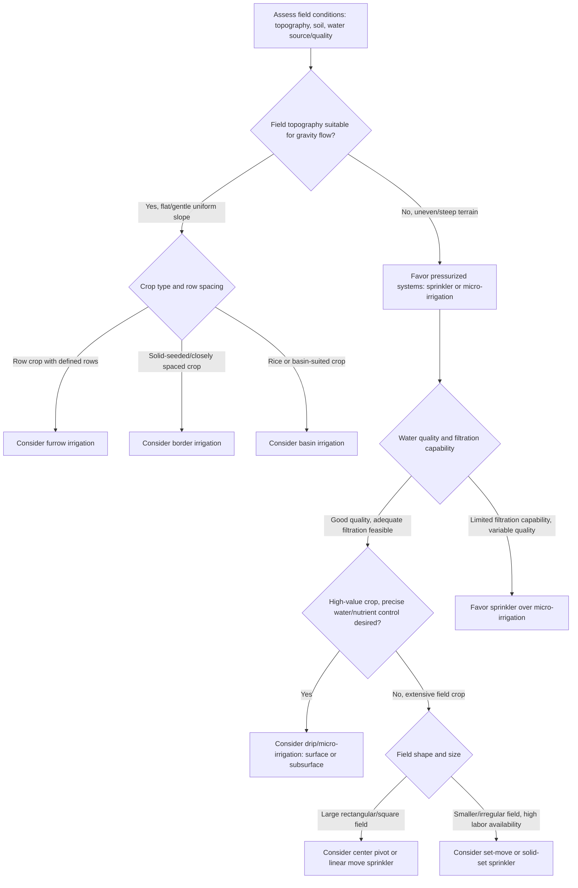

## Irrigation System Types

### Definition and Core Concept

Irrigation system types refer to the range of engineered methods used to apply water to agricultural land in order to supplement natural precipitation and meet crop water requirements. System selection depends on factors including crop type, field topography, soil characteristics, water source and quality, available capital and labor, energy costs, and target application efficiency. Each system category represents a distinct approach to delivering water from its source to the plant root zone, with differing trade-offs among capital cost, operating cost, water use efficiency, labor requirement, and suitability to specific crops and field conditions.

### Surface (Gravity) Irrigation

Surface irrigation applies water directly to the soil surface and relies on gravity to distribute it across the field, generally representing the oldest and, globally, still one of the most widely used irrigation approaches due to relatively low capital and energy costs.

**Furrow Irrigation**

Water is conveyed along small, parallel channels (furrows) constructed between crop rows, infiltrating into the soil as it advances down the furrow length. Commonly used for row crops (maize, cotton, vegetables) planted on ridges or raised beds. Application uniformity depends heavily on furrow length, field slope, soil infiltration rate, and inflow rate, with water advancing faster and reaching greater depth of infiltration near the inlet end unless carefully managed (e.g., through cutback or surge flow techniques that reduce inflow rate partway through the irrigation event).

**Border (Border Strip) Irrigation**

Water flows as a broad sheet across a field divided into long, level or gently sloped strips (borders) bounded by low earthen ridges, suited to closely spaced or solid-seeded crops such as small grains, forages, and pasture where furrows between individual plants are impractical.

**Basin Irrigation**

The field, or a subdivided portion of it, is leveled and surrounded by low earthen bunds forming a basin, into which water is applied and allowed to pond and infiltrate completely rather than flowing through. Commonly used for rice paddies (where standing water is often an intentional part of crop management, not merely an irrigation method) and for orchard basin irrigation around individual or grouped trees.

**Design Considerations**

- **Land leveling/grading**: Precise field grading (achieving a uniform, gentle slope or a level surface for basin systems) is critical to surface irrigation performance, since even minor elevation irregularities cause uneven water advance and infiltration depth; laser-guided land leveling equipment is widely used to achieve the required precision.
- **Infiltration rate matching**: Effective design requires matching inflow rate and irrigation set time to the soil's infiltration characteristics, since a mismatch results in either excessive runoff/tailwater loss (inflow too fast/duration too long relative to infiltration) or inadequate water penetration at the field's far end (inflow too slow/duration too short).
- **Tailwater management**: Water reaching the downstream end of furrows or borders without infiltrating (tailwater) represents an efficiency loss unless captured and reused via a tailwater recovery/return system.

### Sprinkler Irrigation

Sprinkler irrigation applies water under pressure through a piped distribution network to nozzles or sprinkler heads that discharge water into the air, simulating rainfall as it falls onto the crop and soil surface.

**Set-Move (Portable) Systems**

Include hand-move pipe systems (lightweight aluminum pipe sections manually repositioned between irrigation sets) and side-roll (wheel-line) systems (pipe sections mounted on wheels, mechanically rolled to a new position between sets), representing lower-capital but higher-labor sprinkler options.

**Center Pivot Systems**

A self-propelled lateral pipeline, supported on a series of wheeled towers, rotates around a fixed central pivot point, irrigating a circular area. Widely adopted for large-scale field crop irrigation due to relatively low labor requirement per irrigated area once installed, and adaptability to variable rate irrigation through modern control systems that adjust application rate by pivot position and, in advanced systems, by zone-specific sensor or prescription map data.

**Linear Move (Lateral Move) Systems**

Similar mechanical design to center pivots but move in a straight line across a rectangular field rather than rotating, requiring either a guidance furrow/cable system or GPS-based guidance, and typically fed by a moving flexible hose connection or a series of hydrants along one field edge.

**Solid-Set and Permanent Systems**

Sprinkler laterals and heads are installed at fixed positions covering the entire field simultaneously (or a substantial zone of it), eliminating the need to move equipment between sets; commonly used for high-value crops, frost protection applications (where sprinklers are activated to release latent heat of fusion as applied water freezes, protecting buds/blossoms from more severe cold damage), and situations where labor for equipment movement is constrained.

**Micro-Sprinklers and Mini-Sprinklers**

Lower-flow-rate, lower-pressure sprinkler devices typically used in orchard and vineyard applications, providing more localized wetting patterns than full-size sprinklers while still using an above-canopy or under-canopy spray delivery mechanism.

**Design Considerations**

- **Application rate versus infiltration rate**: Sprinkler application rate (depth per unit time) must not exceed the soil's infiltration capacity, or surface ponding and runoff will occur, particularly relevant on fine-textured or crusted soils and on sloped land.
- **Wind drift and evaporation losses**: Sprinkler irrigation, particularly with smaller droplet sizes and higher-pressure impact sprinklers, is subject to evaporative losses during airborne travel and wind-driven distribution distortion, generally greater than losses associated with surface or drip systems.
- **Distribution uniformity**: Commonly assessed via a Christiansen Uniformity Coefficient or similar statistical measure derived from catch-can field testing, quantifying how evenly water is distributed across the irrigated area.

### Micro-Irrigation (Drip/Trickle Irrigation)

Micro-irrigation applies water in small, frequent, precisely controlled volumes directly to the vicinity of individual plants or plant rows, typically through emitters installed along or within polyethylene tubing (laterals), rather than wetting the entire field surface.

**Surface Drip Irrigation**

Drip tubing with inline or on-line emitters is laid on the soil surface adjacent to plant rows, commonly used in row crops, vegetables, orchards, and vineyards.

**Subsurface Drip Irrigation (SDI)**

Drip tubing is buried beneath the soil surface (commonly at depths ranging from roughly 15–45 cm depending on crop root depth and cultivation practices), delivering water directly into the root zone while minimizing surface evaporation losses and, in many field crop applications, allowing normal surface field operations (tillage, harvest equipment movement) to continue without disturbing the buried tubing.

**Micro-Spray/Micro-Jet Systems**

A hybrid approach using low-flow, low-pressure spray or jet emitters mounted on risers above or near the ground, delivering a small wetted pattern intermediate in coverage area between point-source drip emitters and broader sprinkler coverage, common in orchard and nursery applications.

**Emitter Types and Flow Regulation**

- **Non-pressure-compensating emitters**: Discharge rate varies with inlet pressure, meaning emitters located at different points along a lateral (subject to pressure variation from friction loss and elevation change) will discharge at somewhat different rates unless the system is carefully designed to minimize pressure variation.
- **Pressure-compensating emitters**: Internal flexible diaphragm or similar mechanism maintains a relatively constant discharge rate across a specified range of inlet pressures, improving uniformity particularly on long lateral runs or sloped/undulating terrain.

**Design Considerations**

- **Filtration requirement**: Micro-irrigation systems, due to small emitter orifice sizes, are highly susceptible to clogging from suspended sediment, organic matter, and chemical precipitates (e.g., calcium carbonate scaling, iron/manganese precipitation), necessitating robust filtration (screen, disc, sand media filters depending on water source and quality) as an essential system component rather than an optional add-on.
- **Chemigation/fertigation integration**: The precise, localized delivery inherent to drip systems is well suited to injecting fertilizers (fertigation) and, in some cases, other agrochemicals directly through the irrigation system, improving nutrient use efficiency by delivering nutrients in step with crop uptake patterns and directly to the active root zone.
- **System flushing**: Periodic flushing of lateral and submain lines is required to remove accumulated sediment and prevent progressive emitter clogging over the system's operational life.

### Comparison of Major Irrigation System Categories

| Aspect | Surface (Gravity) | Sprinkler | Micro-Irrigation (Drip) |
| --- | --- | --- | --- |
| Typical application efficiency | Lower (commonly cited ranges around 40-70%, highly design/management dependent) | Moderate (commonly cited ranges around 65-85%, system/condition dependent) | Highest (commonly cited ranges around 80-95%, condition dependent) |
| Capital cost | Generally lowest | Moderate to high | Generally highest |
| Energy requirement | Lowest (gravity-driven, minimal or no pumping beyond conveyance) | Moderate to high (pressurized delivery) | Moderate (pressurized, though generally lower operating pressure than many sprinkler systems) |
| Labor requirement | Variable; can be high for manual set-move surface systems | Variable by system (low for center pivot, higher for hand-move) | Generally low once installed, aside from filtration/maintenance |
| Land leveling requirement | High (critical for uniform performance) | Low to moderate | Low |
| Suitability for uneven terrain | Poor | Good | Good |
| [Inference] note | Efficiency figures are strongly dependent on specific design, management, and local conditions | Efficiency figures are strongly dependent on specific design, management, and local conditions | Efficiency figures are strongly dependent on specific design, management, and local conditions |

### Irrigation System Selection Decision Flow

### Worked Example: Selecting Between Center Pivot and Subsurface Drip for a Field Crop

**Example**

A grower is planning irrigation infrastructure for a large, gently rolling field of maize, with access to a groundwater well and moderate water quality (some suspended sediment present).

1. **Topography assessment**: The gently rolling terrain is unsuitable for precision-graded surface irrigation without extensive and costly land leveling, favoring pressurized systems (sprinkler or micro-irrigation) over furrow irrigation.
2. **Field shape and scale**: The field is large and roughly square, well-suited to a center pivot system's circular coverage pattern, though a linear move system would be considered if the field's rectangular shape and available water supply configuration (e.g., a hydrant line along one edge) made full-field coverage important, since center pivots do not irrigate the corners of a square/rectangular field without supplemental corner arm equipment.
3. **Capital and operating cost comparison**: A center pivot system generally involves lower upfront capital cost per irrigated hectare than subsurface drip for a field of this scale, along with lower filtration requirements given the moderate (not high) water quality demands of impact or spray sprinkler nozzles compared to fine drip emitters.
4. **Water use efficiency consideration**: Subsurface drip would likely offer higher application efficiency and better fertigation integration, but the higher capital cost, more demanding filtration requirement (given the sediment present in the water source), and reduced flexibility for future crop rotation (buried tape can complicate deep tillage or crop changes) are weighed against these efficiency gains.
5. **Decision**: Given the large field scale, moderate water quality, and cost sensitivity typical of extensive field crop production, the grower selects a center pivot system, potentially incorporating variable rate irrigation control to improve application uniformity and efficiency without the capital and maintenance demands of subsurface drip.

### Illustrative Diagram: Comparative Water Application Patterns

<svg xmlns="http://www.w3.org/2000/svg" viewBox="0 0 700 320">
<text x="350" y="25" font-size="16" font-weight="bold" text-anchor="middle" fill="#222">Irrigation Application Patterns (svg_diagram)</text>

<text x="115" y="55" font-size="12" font-weight="bold" text-anchor="middle" fill="#222">Furrow (Surface)</text>

<rect x="30" y="65" width="170" height="120" fill="`#e8dcc0`" stroke="#222" />

<path d="M50,65 L50,185 M90,65 L90,185 M130,65 L130,185 M170,65 L170,185" stroke="`#4a90d9`" stroke-width="8" opacity="0.6" />

<text x="115" y="200" font-size="9" text-anchor="middle" fill="#333">Water flows along furrows,</text>

<text x="115" y="212" font-size="9" text-anchor="middle" fill="#333">infiltrates laterally/downward</text>

<text x="350" y="55" font-size="12" font-weight="bold" text-anchor="middle" fill="#222">Sprinkler</text>

<rect x="265" y="65" width="170" height="120" fill="`#e8dcc0`" stroke="#222" />

<circle cx="300" cy="100" r="25" fill="`#cfe3f7`" opacity="0.7" />

<circle cx="360" cy="100" r="25" fill="`#cfe3f7`" opacity="0.7" />

<circle cx="330" cy="150" r="25" fill="`#cfe3f7`" opacity="0.7" />

<circle cx="400" cy="150" r="25" fill="`#cfe3f7`" opacity="0.7" />

<text x="350" y="200" font-size="9" text-anchor="middle" fill="#333">Overlapping circular spray</text>

<text x="350" y="212" font-size="9" text-anchor="middle" fill="#333">patterns wet entire surface</text>

<text x="585" y="55" font-size="12" font-weight="bold" text-anchor="middle" fill="#222">Drip (Micro)</text>

<rect x="500" y="65" width="170" height="120" fill="`#e8dcc0`" stroke="#222" />

<line x1="520" y1="80" x2="520" y2="170" stroke="#333" stroke-width="2" />

<line x1="565" y1="80" x2="565" y2="170" stroke="#333" stroke-width="2" />

<line x1="610" y1="80" x2="610" y2="170" stroke="#333" stroke-width="2" />

<line x1="655" y1="80" x2="655" y2="170" stroke="#333" stroke-width="2" />

<circle cx="520" cy="100" r="10" fill="`#cfe3f7`" opacity="0.7" />

<circle cx="520" cy="130" r="10" fill="`#cfe3f7`" opacity="0.7" />

<circle cx="565" cy="100" r="10" fill="`#cfe3f7`" opacity="0.7" />

<circle cx="565" cy="130" r="10" fill="`#cfe3f7`" opacity="0.7" />

<circle cx="610" cy="100" r="10" fill="`#cfe3f7`" opacity="0.7" />

<circle cx="610" cy="130" r="10" fill="`#cfe3f7`" opacity="0.7" />

<circle cx="655" cy="100" r="10" fill="`#cfe3f7`" opacity="0.7" />

<circle cx="655" cy="130" r="10" fill="`#cfe3f7`" opacity="0.7" />

<text x="585" y="200" font-size="9" text-anchor="middle" fill="#333">Point-source wetting</text>

<text x="585" y="212" font-size="9" text-anchor="middle" fill="#333">along plant lines only</text>

<text x="350" y="260" font-size="10" text-anchor="middle" fill="#222">Wetted area and application precision generally increase from left to right</text>

<text x="350" y="275" font-size="10" text-anchor="middle" fill="#222">while capital cost and filtration demands also generally increase left to right</text>

</svg>

### Related Topics

- Irrigation scheduling methods and soil moisture monitoring
- Application efficiency and distribution uniformity measurement
- Fertigation and chemigation system design
- Variable rate irrigation and precision agriculture integration
- Water sources and hydrology basics as the supply-side counterpart
- Drainage and salinity management under different irrigation systems
- Pump selection and energy requirements for pressurized irrigation
- Filtration system design for micro-irrigation
- Deficit irrigation and regulated deficit irrigation strategies
- Frost protection using sprinkler irrigation