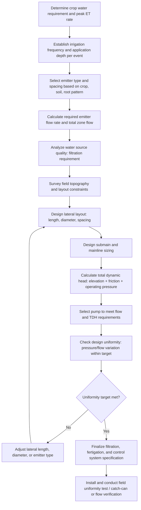

## Drip and Micro-Irrigation Design

### Definition and Core Concept

Drip and micro-irrigation design is the engineering process of sizing, laying out, and specifying the components of a micro-irrigation system so that it delivers the required volume of water to each plant with acceptable uniformity, at an economically justifiable capital and operating cost, while accounting for the specific water source quality, field topography, crop water requirements, and soil characteristics of the site. Unlike surface or sprinkler system design, drip design is fundamentally a hydraulic engineering exercise centered on pressure and flow management across a branching pipe network feeding large numbers of small, closely spaced emission points.

### System Components and Layout Hierarchy

**Key Points**

- **Water source and pumping plant**: Provides the pressurized flow into the system; pump selection must match the total system flow requirement and total dynamic head (accounting for elevation change, friction losses, and required operating pressure at the emitters).
- **Head control unit (headworks)**: Typically includes a filtration system, backflow prevention device, pressure regulator, flow meter, and fertigation/chemigation injection equipment, all located at the point where water enters the piped distribution network.
- **Mainline**: The primary pipeline (commonly PVC or, for smaller systems, polyethylene) conveying water from the headworks to submains, typically buried and sized to minimize friction loss while remaining economically reasonable in diameter.
- **Submains (manifolds)**: Pipelines branching from the mainline that distribute water to individual lateral lines, often incorporating a valve for each zone to allow sequential or independent operation.
- **Laterals**: The smaller-diameter polyethylene tubing (commonly 12-25 mm outer diameter for typical row crop applications) running along or near crop rows, into or onto which emitters are installed.
- **Emitters**: The discharge devices (inline drippers, on-line drippers, drip tape emission points, micro-sprayers) that release water from the lateral into the soil at a controlled, generally low flow rate.

### Emitter Types and Selection

**Point-Source Emitters (Drippers)**

Discrete emission devices installed at specific intervals along a lateral, either inline (built into the tubing during manufacture at fixed spacing) or on-line (individually punched into blank tubing at the desired location, offering flexibility for irregular plant spacing such as individual trees or vines).

**Drip Tape**

Thin-walled polyethylene tubing (commonly with wall thickness in the range of roughly 6-15 mil for typical row crop seasonal applications) with emission points formed directly into the tape at the manufacturing stage at a specified spacing, widely used in annual row crop and vegetable production due to lower cost per unit length relative to rigid dripline, generally intended for single or limited-season use given its lighter wall construction.

**Pressure-Compensating (PC) vs. Non-Pressure-Compensating (Non-PC) Emitters**

- Non-PC emitters follow an approximately fixed flow-pressure relationship in which discharge increases with inlet pressure according to a power-law relationship; they are lower cost but require the design to keep pressure variation across the field within a tight range to maintain acceptable uniformity.
- PC emitters maintain a relatively constant discharge across a specified inlet pressure range through an internal flexible diaphragm mechanism, allowing longer lateral runs, greater elevation variation, and generally simplifying uniformity management, at correspondingly higher unit cost.

**Emitter Flow Equation**

Emitter discharge as a function of pressure is generally described by the empirical relationship:

$$q = k \cdot h^x$$

Where $q$ is emitter discharge rate, $h$ is the operating pressure head at the emitter, $k$ is a discharge coefficient specific to the emitter design, and $x$ is an emitter exponent reflecting flow regime and emitter design (an ideal, fully pressure-compensating emitter would have $x$ approaching 0, meaning discharge is essentially independent of pressure over its compensating range, while non-compensating turbulent-flow emitters typically exhibit $x$ values around 0.5, and laminar-flow path emitters can exhibit $x$ values closer to 1.0). [Inference] Specific $k$ and $x$ values are manufacturer- and product-specific and must be obtained from manufacturer specification sheets or direct testing rather than assumed generically for design purposes.

### Hydraulic Design Principles

**Total Dynamic Head Calculation**

The pump and system must overcome several components of head loss and gain to deliver design pressure at the emitters:

$$TDH = H_{elevation} + H_{friction} + H_{operating} + H_{minor}$$

Where $H_{elevation}$ is the net elevation difference between the water source and the highest point in the field (a gain if pumping downhill, a loss if pumping uphill), $H_{friction}$ is the cumulative friction loss through mainline, submain, and lateral pipe due to water movement against pipe wall resistance, $H_{operating}$ is the pressure required at the emitter inlet for it to perform at its design flow rate, and $H_{minor}$ accounts for losses through fittings, valves, and filtration equipment.

**Friction Loss Estimation**

Friction loss in pipelines is commonly estimated using empirical formulas such as the Hazen-Williams equation, which relates head loss to flow rate, pipe diameter, pipe length, and a roughness coefficient specific to the pipe material (smoother materials such as PVC and polyethylene exhibit lower friction loss than rougher materials at equivalent flow and diameter). Because friction loss increases sharply with flow velocity, lateral and pipe diameters are selected to keep velocities within a range that balances acceptable friction loss against pipe material cost (larger diameter pipe costs more but reduces friction loss and improves uniformity).

**Design Uniformity Target**

A key design objective is limiting the variation in emitter discharge across the entire system (arising from pressure differences caused by friction loss along laterals and elevation change across the field) to within an acceptable tolerance, commonly expressed as an emission uniformity (EU) percentage. A widely referenced design guideline (per ASABE/ASAE standards commonly cited in micro-irrigation design literature) targets keeping the pressure variation within a subunit (a submain-controlled zone) such that the resulting flow variation stays within an acceptable range, often approximated by keeping total pressure variation across a lateral/submain combination within about 20% of average operating pressure, though specific target values and the precise uniformity coefficient formula used vary by design standard and should be confirmed against the applicable current standard for rigorous design work.

**Lateral Length and Diameter Sizing**

Maximum practical lateral length for acceptable uniformity is governed by the trade-off between friction loss (favoring shorter laterals or larger diameter) and cost/practicality (favoring longer laterals with smaller, less expensive tubing); on sloping ground, laterals run downslope can tolerate greater length than laterals run upslope or across a slope, since downslope elevation loss partially offsets frictional pressure loss along the lateral.

### System Design Workflow

### Filtration System Design

**Key Points**

- **Screen filters**: Use a fine mesh screen to remove suspended particles; suited to relatively clean water sources with primarily sand-sized or larger particulate contamination, and to systems requiring lower initial capital cost.
- **Disc filters**: Use stacked, grooved discs compressed together to trap particles within the groove channels; offer finer filtration and better handling of organic matter than simple screen filters, at moderate cost and complexity.
- **Sand media filters**: Pass water through a bed of graded sand or similar media, providing the most effective filtration for water sources with high organic matter or algae content (common with surface water and some pond sources), at higher capital cost and requiring periodic backwashing to maintain performance.
- **Filtration degree (mesh size) selection**: Filter mesh rating must be matched to the smallest emitter passage dimension in the system, with a common design guideline recommending filtration to remove particles down to a size meaningfully smaller than the emitter's minimum flow path dimension to provide an adequate safety margin against progressive clogging; [Inference] specific numeric mesh-to-orifice ratio guidelines vary somewhat between design references and emitter manufacturers, so manufacturer filtration recommendations for the specific emitter product selected should take precedence in final design.
- **Chemical water treatment**: May be required in addition to physical filtration to address chemical clogging risks such as calcium carbonate precipitation (addressed via acid injection) or iron/manganese precipitation and biological growth (addressed via chlorination or other biocide treatment), depending on water source chemistry.

### Fertigation and Chemigation Integration

**Key Points**

- Drip systems are particularly well suited to fertigation (injecting soluble fertilizers directly into the irrigation water) because the small, frequent, precisely located water applications characteristic of drip irrigation allow nutrients to be delivered in close synchrony with crop uptake patterns and directly within the wetted root zone, improving nutrient use efficiency relative to broadcast fertilizer application.
- Common injection methods include venturi injectors (using the pressure differential created by water flow through a constriction to draw in and mix a concentrated fertilizer solution), positive displacement injection pumps (offering more precise and pressure-independent injection rate control), and, for larger systems, dedicated proportional injection systems.
- Backflow prevention is a critical safety design element whenever chemical or fertilizer injection is incorporated, to prevent contamination of the water source (particularly important where the source is a potable water supply or shared irrigation system) in the event of a pressure loss or pump failure that could otherwise allow reverse flow of the injected solution.

### Worked Example: Sizing a Drip Lateral for a Vegetable Row Crop

**Example**

A grower is designing a drip system for a vegetable field using inline drip tape with emitters spaced 30 cm apart, each rated at 1.0 L/hour at a design operating pressure of 8 psi (approximately 55 kPa).

1. **Determine emitters per lateral**: For a lateral (row) length of 100 m, the number of emitters is calculated as $100\text{ m} / 0.3\text{ m} = 333$ emitters (rounded).
2. **Calculate total lateral flow rate**: $333 \text{ emitters} \times 1.0\text{ L/hour} = 333\text{ L/hour per lateral}$.
3. **Determine total zone flow**: If the irrigation zone contains 50 such laterals operating simultaneously, total zone flow is $333\text{ L/hour} \times 50 = 16{,}650\text{ L/hour}$ (approximately 16.65 m³/hour, or roughly 4.6 L/s).
4. **Check friction loss along the lateral**: Using manufacturer friction loss data or a standard hydraulic calculation for the specified tape diameter and flow rate, the designer verifies that pressure loss along the 100 m lateral length remains within the target tolerance (e.g., within approximately 20% of the 8 psi design operating pressure) to maintain acceptable emitter flow uniformity from the inlet end to the far end of the lateral; if calculated friction loss exceeds this tolerance, the designer would need to shorten the lateral run, select a larger-diameter tape, reduce emitter spacing-driven flow demand, or switch to pressure-compensating emitters.
5. **Size the submain**: The submain feeding this zone must be sized to carry the total zone flow (~4.6 L/s) with acceptable friction loss and to deliver adequate inlet pressure to the first lateral connection, accounting for any elevation change across the submain's length.
6. **Verify pump capacity**: The irrigation system's pump must be capable of delivering the peak simultaneous zone flow rate (accounting for how many zones, if any, operate concurrently) at a total dynamic head sufficient to overcome elevation change, mainline/submain/lateral friction losses, filtration system pressure loss, and the emitter's required operating pressure.

### Comparison of Common Emitter Categories

| Emitter Type | Typical Flow Rate Range | Pressure Sensitivity | Common Application |
| --- | --- | --- | --- |
| Non-PC inline dripper | Fixed per model, commonly low L/hour range | Sensitive to pressure variation | Shorter laterals, relatively flat/uniform fields |
| PC inline dripper | Fixed per model, maintained across compensating range | Largely insensitive within rated pressure range | Long laterals, sloped or uneven terrain, tree/vine rows |
| Drip tape (thin-wall) | Fixed per model/spacing | Varies by tape design (PC and non-PC tape products both exist) | Annual row crops, seasonal vegetable production |
| Micro-spray/micro-jet | Generally higher than point-source drippers | Varies by nozzle design | Orchards, vineyards, nursery production |

### Illustrative Diagram: Drip System Component Hierarchy

<svg xmlns="http://www.w3.org/2000/svg" viewBox="0 0 700 340">
<text x="350" y="25" font-size="16" font-weight="bold" text-anchor="middle" fill="#222">Drip Irrigation System Hierarchy (svg_diagram)</text>
<rect x="270" y="45" width="160" height="40" rx="6" fill="#4a90d9" stroke="#222" />
<text x="350" y="70" font-size="11" text-anchor="middle" fill="#fff">Pump / Water Source</text>
<line x1="350" y1="85" x2="350" y2="110" stroke="#222" stroke-width="2" />
<rect x="240" y="110" width="220" height="40" rx="6" fill="#a8d5a2" stroke="#222" />
<text x="350" y="135" font-size="11" text-anchor="middle" fill="#222">Headworks: filter, regulator, fertigation injector</text>
<line x1="350" y1="150" x2="350" y2="175" stroke="#222" stroke-width="2" />
<rect x="280" y="175" width="140" height="35" rx="6" fill="#f7d488" stroke="#222" />
<text x="350" y="197" font-size="11" text-anchor="middle" fill="#222">Mainline</text>
<line x1="350" y1="210" x2="350" y2="230" stroke="#222" stroke-width="2" />
<line x1="150" y1="230" x2="550" y2="230" stroke="#222" stroke-width="2" />
<rect x="150" y="230" width="120" height="30" rx="5" fill="#f0c674" stroke="#222" />
<text x="210" y="250" font-size="10" text-anchor="middle" fill="#222">Submain A</text>
<rect x="430" y="230" width="120" height="30" rx="5" fill="#f0c674" stroke="#222" />
<text x="490" y="250" font-size="10" text-anchor="middle" fill="#222">Submain B</text>
<line x1="180" y1="260" x2="180" y2="280" stroke="#222" stroke-width="1.5" />
<line x1="240" y1="260" x2="240" y2="280" stroke="#222" stroke-width="1.5" />
<line x1="460" y1="260" x2="460" y2="280" stroke="#222" stroke-width="1.5" />
<line x1="520" y1="260" x2="520" y2="280" stroke="#222" stroke-width="1.5" />
<line x1="160" y1="290" x2="260" y2="290" stroke="#4a90d9" stroke-width="4" />
<line x1="160" y1="305" x2="260" y2="305" stroke="#4a90d9" stroke-width="4" />
<line x1="440" y1="290" x2="540" y2="290" stroke="#4a90d9" stroke-width="4" />
<line x1="440" y1="305" x2="540" y2="305" stroke="#4a90d9" stroke-width="4" />
<text x="350" y="325" font-size="10" text-anchor="middle" fill="#222">Laterals with emitters (dripline/drip tape)</text>
</svg>

### Related Topics

- Irrigation system types as a broader comparative context
- Filtration technology selection for varying water quality sources
- Fertigation nutrient management and injection equipment
- Soil moisture monitoring and irrigation scheduling with drip systems
- Pump selection and total dynamic head calculations
- Water sources and hydrology basics affecting design water quality
- Subsurface drip irrigation depth and layout for field crops
- Distribution uniformity testing and field evaluation methods
- Clogging prevention and system maintenance protocols
- Salinity management under drip irrigation (wetting front and salt accumulation patterns)