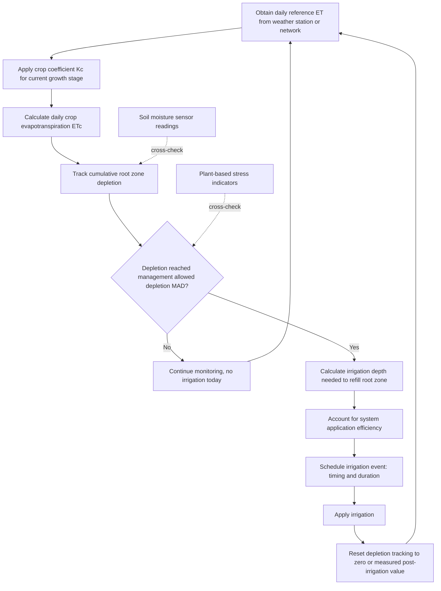

## Irrigation Scheduling

### Definition and Core Concept

Irrigation scheduling is the process of determining when to irrigate and how much water to apply at each irrigation event, based on crop water requirements, soil water status, and system constraints, with the objective of supplying adequate water to meet crop needs while minimizing water waste, energy cost, and negative impacts such as waterlogging, nutrient leaching, or salinity buildup. Effective scheduling requires answering two related questions for each irrigation event: the timing question (when to irrigate) and the amount question (how much water to apply), both of which depend on tracking the dynamic balance between water supplied to and removed from the crop root zone.

### Core Approaches to Irrigation Scheduling

**Soil Water Balance (Checkbook) Method**

Tracks the cumulative depletion of soil water in the root zone by accounting for water inputs (irrigation, effective rainfall) and outputs (crop evapotranspiration, deep percolation) over time, similar in principle to tracking a bank account balance, triggering irrigation when accumulated depletion reaches a defined threshold (commonly termed the management allowed depletion, MAD).

**Soil Moisture Monitoring Method**

Uses direct or indirect measurement of soil water content or soil water potential at one or more depths within the root zone to determine current soil moisture status, triggering irrigation when measured values reach a predetermined threshold, without necessarily requiring the cumulative bookkeeping approach of the water balance method.

**Plant-Based Monitoring Method**

Uses direct measurement of plant water status indicators (such as stem water potential, canopy temperature, or sap flow) as the basis for irrigation decisions, on the premise that the plant itself integrates the combined effects of soil moisture, atmospheric demand, and root system function into a physiological response, potentially providing a more direct indicator of crop water stress than soil-based measurements alone.

**Fixed Interval/Calendar-Based Scheduling**

Irrigation is applied at predetermined, fixed time intervals regardless of actual crop water status, representing the simplest scheduling approach but generally the least precise, since it does not account for variation in weather conditions, crop growth stage, or actual soil moisture depletion between irrigation events.

### Crop Water Requirement Estimation

**Reference Evapotranspiration ($ET_0$)**

A standardized measure of the evapotranspiration rate from a defined reference surface (commonly a well-watered, actively growing grass or alfalfa reference crop under specified conditions) under prevailing weather conditions, calculated from weather station data (solar radiation, temperature, humidity, wind speed) using established methods, most widely the FAO Penman-Monteith equation, which is broadly recommended as the standard method for estimating reference evapotranspiration across a wide range of climates.

**Crop Coefficient ($K_c$) Approach**

Crop-specific water use ($ET_c$) is estimated by adjusting reference evapotranspiration using an empirically derived crop coefficient that accounts for differences between the specific crop and the reference crop, varying through the growing season as canopy cover, plant height, and physiological maturity change:

$$ET_c = K_c \times ET_0$$

Crop coefficients typically follow a characteristic curve through the growing season, commonly represented in the FAO dual crop coefficient framework as distinct initial, mid-season, and late-season stage values (with $K_c$ generally lowest during the initial stage when canopy cover is sparse, rising to a peak during the mid-season stage of full canopy cover, and declining during the late-season stage as the crop matures and senesces), and published reference tables provide typical $K_c$ values for numerous crops, though values should be adjusted for local climate and specific cultivar/management conditions where possible.

**Dual Crop Coefficient Refinement**

A more detailed approach separates the crop coefficient into a basal crop coefficient (representing transpiration through the crop canopy under standard conditions with a dry soil surface) and a separate soil evaporation coefficient (representing evaporation from the soil surface, which varies substantially with surface wetness following irrigation or rainfall events), allowing more precise estimation particularly in situations with partial canopy cover or frequent surface wetting from irrigation.

### The Soil Water Balance Equation for Scheduling

The root zone soil water balance used for irrigation scheduling is a specific application of the general hydrologic water balance:

$$D_i = D_{i-1} + ET_{c,i} - P_{eff,i} - I_i + DP_i$$

Where $D_i$ is the cumulative root zone depletion at the end of day $i$, $D_{i-1}$ is depletion at the end of the previous day, $ET_{c,i}$ is crop evapotranspiration on day $i$, $P_{eff,i}$ is effective rainfall on day $i$, $I_i$ is irrigation applied on day $i$, and $DP_i$ is any deep percolation loss on day $i$ (typically occurring only following an irrigation or rainfall event large enough to exceed the soil's water holding capacity within the root zone). Irrigation is triggered when $D_i$ reaches the management allowed depletion threshold.

### Management Allowed Depletion (MAD) and Available Water Capacity

**Key Points**

- **Total Available Water (TAW)**: The total soil water held between field capacity (the soil moisture content after free drainage has ceased following saturation) and permanent wilting point (the soil moisture content below which plants can no longer extract water, becoming permanently wilted), expressed as a depth of water per unit depth of soil, multiplied by the effective root zone depth.
- **Readily Available Water (RAW)**: The portion of total available water that can be extracted by the crop without inducing water stress that reduces yield or quality, calculated as $RAW = MAD \times TAW$, where MAD is expressed as a fraction.
- **Management Allowed Depletion (MAD)**: The fraction of total available water that is permitted to be depleted before irrigation is triggered, commonly set in a range of roughly 0.3 to 0.6 (30-50%) depending on crop sensitivity to water stress and specific growth stage, with more water-stress-sensitive crops or critical growth stages (such as flowering or early fruit set in many crops) generally managed with a lower (more conservative) MAD value to avoid yield-reducing stress. [Inference] Specific recommended MAD values vary by crop, growth stage, and source, and should be confirmed against crop-specific irrigation management references for precise scheduling rather than applied as a universal constant.

### Irrigation Scheduling Workflow

### Soil Moisture Monitoring Technologies

**Tensiometers**

Measure soil water potential (tension) directly through a water-filled tube with a porous ceramic tip in contact with the soil, connected to a vacuum gauge or pressure transducer; effective over a relatively wet range of soil moisture (typically functioning reliably from saturation down to a soil water tension of roughly 0-80 centibars, beyond which the water column can break, limiting their usefulness in drier soil conditions or coarser-textured soils with wider moisture retention ranges).

**Electrical Resistance Blocks (Gypsum Blocks)**

Measure soil water potential indirectly by relating the electrical resistance between embedded electrodes within a porous block (traditionally gypsum) to the block's moisture content, which equilibrates with surrounding soil moisture; generally effective over a drier range than tensiometers but with lower precision and are subject to degradation over time (particularly gypsum blocks, which dissolve gradually).

**Capacitance and Time Domain Reflectometry (TDR) Sensors**

Measure soil volumetric water content indirectly by relating the dielectric permittivity of the soil (strongly influenced by water content, since water has a much higher dielectric constant than soil solids or air) to a calibrated moisture value. Capacitance sensors measure the response of a sensor probe to an oscillating electrical field, while TDR sensors measure the travel time of an electromagnetic pulse along a probe inserted into the soil, both providing continuous or near-continuous volumetric water content data suitable for automated data logging and remote monitoring systems.

**Neutron Probes**

Measure soil water content by detecting the thermalization of fast neutrons emitted from a radioactive source as they collide with hydrogen atoms (predominantly present in soil water), providing an accurate, well-established measurement method particularly valued for research applications, though requiring radiation safety licensing and handling procedures that limit routine on-farm adoption relative to non-radioactive sensor technologies.

### Plant-Based Monitoring Indicators

**Key Points**

- **Stem water potential**: Measured using a pressure chamber applied to a covered, non-transpiring leaf or small stem sample, providing a widely used and relatively well-validated indicator of plant water status in tree and vine crops, with published crop-specific threshold values available for interpreting the degree of water stress.
- **Canopy temperature/thermal indices**: Water-stressed plants generally exhibit reduced transpirational cooling, leading to elevated canopy temperature relative to well-watered plants; indices such as the Crop Water Stress Index (CWSI) combine canopy temperature measurements (from infrared thermometry or thermal imaging, including from drone-mounted sensors) with ambient weather conditions to quantify relative water stress across a field.
- **Sap flow sensors**: Measure the rate of water movement through the plant's xylem tissue, providing a direct measure of plant transpiration rate that can be related to water status and used to inform irrigation timing, particularly in perennial crop research and, increasingly, in precision commercial applications.

### Deficit Irrigation Strategies

**Key Points**

- **Regulated Deficit Irrigation (RDI)**: Deliberately applies less than full crop water requirement during specific growth stages considered less sensitive to water stress (commonly identified through prior research for a given crop), aiming to achieve water savings, and in some crops (notably certain wine grape and stone fruit production systems), specific quality benefits, while limiting yield impact by avoiding stress during the most water-sensitive growth stages.
- **Partial Rootzone Drying (PRD)**: Alternately irrigates only part of the root system (commonly one side of a row-planted crop) while allowing the other side to dry, based on the premise that root systems experiencing drying send chemical signals (notably abscisic acid) that induce partial stomatal closure and reduced water use, while the alternately wetted side maintains adequate plant water status, though the practical implementation and consistency of benefits reported for PRD across different crops and conditions varies and should be evaluated against crop-specific research.
- Deficit irrigation strategies require careful, crop-specific and stage-specific management, since applying water deficit at an inappropriate growth stage can substantially reduce yield or quality rather than achieving the intended water-saving benefit without meaningful cost.

### Automated and Sensor-Integrated Scheduling Systems

**Key Points**

- Modern irrigation scheduling increasingly integrates automated weather station networks (providing real-time reference ET calculations), telemetered soil moisture sensor networks, and, in advanced systems, satellite or drone-based remote sensing of crop canopy conditions, feeding data into software platforms that generate irrigation recommendations or, in fully automated systems, directly trigger irrigation controllers.
- Irrigation controllers linked to soil moisture sensors or calculated soil water balance models can automatically initiate and terminate irrigation events without requiring daily manual decision-making, though effective automated system operation still requires periodic calibration checks, sensor maintenance, and agronomic oversight to ensure the automated logic remains appropriate for actual field conditions and crop growth stage.
- [Inference] The specific software platforms, sensor technologies, and connectivity standards used in commercial precision irrigation scheduling continue to evolve; current product-specific capabilities should be verified against current vendor documentation rather than assumed static.

### Worked Example: Water Balance Scheduling Calculation Over Several Days

**Example**

A grower is scheduling irrigation for a vegetable crop with a management allowed depletion of 50% and a root zone total available water of 60 mm.

**Given:**

- Readily available water (RAW) = $0.50 \times 60\text{ mm} = 30\text{ mm}$
- Daily reference ET ($ET_0$): approximately 5 mm/day (assumed constant for this simplified example)
- Crop coefficient ($K_c$) during mid-season stage: 1.1
- Daily crop ET: $ET_c = 1.1 \times 5\text{ mm} = 5.5\text{ mm/day}$
- No significant rainfall during the period considered

**Calculation:**

1. Starting from a fully recharged root zone (depletion = 0 mm) immediately following an irrigation event.
2. Each subsequent day, cumulative depletion increases by 5.5 mm (the daily $ET_c$), assuming no rainfall or additional irrigation.
3. Depletion reaches the 30 mm RAW threshold after approximately $30\text{ mm} / 5.5\text{ mm/day} \approx 5.5$ days.
4. The grower schedules the next irrigation event at approximately day 5-6, applying sufficient water (adjusted for system application efficiency) to refill the root zone back to field capacity, at which point the depletion counter resets to zero and the cycle repeats.
5. [Inference] This simplified example assumes constant daily ET and no rainfall; in practice, daily $ET_0$ varies with weather conditions and any rainfall event would need to be incorporated as a credit against accumulated depletion, requiring the water balance to be recalculated daily using actual observed or forecast weather data rather than a fixed assumed value.

### Comparison of Scheduling Methods

| Method | Data Requirement | Precision | Typical Adoption Context |
| --- | --- | --- | --- |
| Fixed interval/calendar | Minimal | Low | Simple systems, limited monitoring capability |
| Soil water balance (checkbook) | Weather data, crop coefficients, soil water holding capacity | Moderate to high | Widely used in extension-based and commercial scheduling programs |
| Soil moisture monitoring | Sensor installation and maintenance | Moderate to high (site-specific) | Farms with sensor infrastructure investment |
| Plant-based monitoring | Specialized measurement equipment/expertise | High (direct physiological indicator) | Research settings and high-value perennial crop production |

### Illustrative Diagram: Root Zone Depletion Cycle

<svg xmlns="http://www.w3.org/2000/svg" viewBox="0 0 700 300">
<text x="350" y="25" font-size="16" font-weight="bold" text-anchor="middle" fill="#222">Soil Water Balance Scheduling Cycle (svg_diagram)</text>
<line x1="60" y1="250" x2="640" y2="250" stroke="#333" stroke-width="1.5" />
<line x1="60" y1="60" x2="60" y2="250" stroke="#333" stroke-width="1.5" />
<text x="30" y="70" font-size="9" fill="#333">FC</text>
<text x="20" y="180" font-size="9" fill="#333">MAD</text>
<text x="350" y="270" font-size="10" text-anchor="middle" fill="#333">Time (days)</text>
<text x="20" y="150" font-size="9" fill="#333" transform="rotate(-90 20 150)">Soil water</text>
<line x1="60" y1="60" x2="640" y2="60" stroke="#4a90d9" stroke-width="1" stroke-dasharray="3,3" />
<text x="620" y="55" font-size="8" fill="#4a90d9">Field capacity</text>
<line x1="60" y1="180" x2="640" y2="180" stroke="#e07b39" stroke-width="1" stroke-dasharray="3,3" />
<text x="600" y="195" font-size="8" fill="#e07b39">MAD threshold</text>
<path d="M60,60 L200,180 L200,60 L340,180 L340,60 L480,180 L480,60 L620,180" fill="none" stroke="#222" stroke-width="2" />
<line x1="200" y1="55" x2="200" y2="65" stroke="#333" stroke-width="2" />
<text x="200" y="45" font-size="8" text-anchor="middle" fill="#333">Irrigate</text>
<line x1="340" y1="55" x2="340" y2="65" stroke="#333" stroke-width="2" />
<text x="340" y="45" font-size="8" text-anchor="middle" fill="#333">Irrigate</text>
<line x1="480" y1="55" x2="480" y2="65" stroke="#333" stroke-width="2" />
<text x="480" y="45" font-size="8" text-anchor="middle" fill="#333">Irrigate</text>
</svg>

### Related Topics

- FAO Penman-Monteith reference evapotranspiration calculation
- Crop coefficient development and dual crop coefficient methodology
- Soil moisture sensor technologies and calibration
- Regulated deficit irrigation for perennial and wine grape production
- Irrigation system types and their scheduling implications
- Weather station networks and agricultural meteorology
- Remote sensing and satellite-based crop water stress assessment
- Salinity management and leaching requirement calculations
- Automated irrigation controller technology and integration
- Water rights and allocation constraints affecting scheduling flexibility