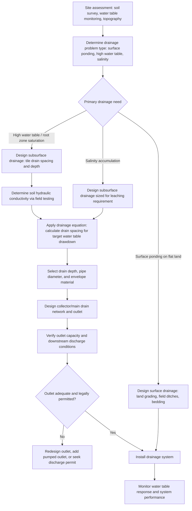

## Drainage Systems

### Definition and Core Concept

Agricultural drainage systems are engineered infrastructure designed to remove excess water from the soil surface (surface drainage) or from within the soil profile (subsurface drainage), maintaining soil conditions favorable for crop root growth, field trafficability, and, particularly in irrigated or naturally saline-prone regions, long-term soil salinity control. Excess water, whether from precipitation, irrigation, or a naturally high water table, restricts root zone aeration, delays field operations, and can promote root disease; drainage systems address these problems by providing a controlled pathway for surplus water to leave the field.

### Rationale for Drainage

**Key Points**

- **Waterlogging and aeration**: Saturated soil pores exclude oxygen from the root zone, restricting root respiration and function; most agricultural crops (with notable exceptions such as rice) require adequate soil aeration for healthy root development and nutrient uptake.
- **Field trafficability and workability**: Excess soil moisture delays planting, cultivation, and harvest operations by preventing equipment access without causing soil compaction or getting bogged down.
- **Salinity management in irrigated agriculture**: In irrigated regions, particularly arid and semi-arid areas, drainage is essential for removing salts that accumulate in the root zone from irrigation water and, in some cases, from a naturally saline water table, since without adequate drainage, evaporative concentration progressively raises soil salinity to levels that become toxic to crops.
- **High water table management**: In regions with naturally shallow water tables (due to topography, geology, or coastal proximity), drainage lowers the water table to a depth that allows adequate root zone aeration and prevents capillary rise of shallow saline groundwater into the root zone.

### Surface Drainage Systems

Surface drainage systems remove excess water that ponds on or flows across the land surface, primarily addressing precipitation-driven waterlogging on relatively flat or poorly graded land.

**Land Grading/Smoothing**

Precision earthmoving to eliminate minor depressions and establish a uniform, gentle slope directing surface runoff toward a defined drainage outlet, often the same land forming operation used for surface irrigation systems, since both benefit from controlled, uniform surface gradients.

**Surface Drains (Field Ditches)**

Shallow, graded open channels constructed to collect and convey surface runoff from the field to a larger collector drain or natural watercourse, commonly used in flat, poorly drained land where subsurface drainage alone would be insufficient to remove ponded surface water quickly enough to prevent crop damage.

**Bedding Systems**

A specific surface drainage configuration in which the field is shaped into a series of parallel raised beds separated by shallow furrows (dead furrows), directing surface water off the raised bed area and into the furrows, which convey it to a field drain; historically common on poorly drained, low-permeability soils, particularly in humid regions with row crop production.

**Random and Parallel Field Ditches**

Random ditches follow natural low points and depressions across an irregularly shaped or contoured field, while parallel ditches are laid out in a systematic, evenly spaced pattern across more uniformly shaped fields, with the choice depending on field topography and the extent of engineered land shaping that has been performed.

### Subsurface Drainage Systems

Subsurface drainage systems remove excess water from within the soil profile by lowering the water table, using buried conduits that collect water entering the soil through infiltration and percolation and convey it to an outlet.

**Tile Drainage (Subsurface Pipe Drains)**

Perforated pipe (historically clay or concrete tile sections, now predominantly corrugated plastic/polyethylene tubing) is installed at a specified depth and grade below the soil surface, collecting water that percolates into the surrounding soil through perforations or joints and conveying it by gravity flow to an outlet (a ditch, stream, or collector main).

**Drain Spacing and Depth**

The horizontal spacing between parallel drain lines and their installation depth are the primary design parameters governing subsurface drainage system performance, determined through drainage design equations (such as the Hooghoudt equation, widely used for steady-state drain spacing calculations) that relate drain spacing to soil hydraulic conductivity, drain depth, depth to any restrictive layer, and the desired water table drawdown rate:

$$S^2 = \frac{4K(2Dh + h^2)}{q}$$

Where $S$ is drain spacing, $K$ is the soil's saturated hydraulic conductivity, $D$ is the equivalent depth to an impermeable layer below the drains, $h$ is the height of the water table above the drains at the midpoint between drains, and $q$ is the design drainage coefficient (drainage rate). This relationship illustrates that soils with higher hydraulic conductivity (typically coarser-textured soils) permit wider drain spacing for equivalent drainage performance, while finer-textured, less permeable soils require closer drain spacing to achieve adequate water table control within an acceptable timeframe.

**Drain Envelope/Filter Material**

A layer of gravel, sand, or synthetic geotextile fabric surrounding the drain pipe, serving to prevent fine soil particles from entering and clogging the drain perforations while still allowing water to pass freely into the pipe; envelope material selection depends on the surrounding soil's particle size distribution, since inadequate filtration relative to soil texture can lead to progressive drain siltation and reduced system performance over time.

**Collector/Main Drains**

Larger-diameter pipes or open channels that receive flow from multiple lateral drain lines and convey the combined flow to the final drainage outlet, sized to accommodate the cumulative design flow from all contributing laterals.

**Mole Drainage**

A specialized subsurface drainage technique in which a mole plow (a bullet-shaped tool towed through the soil at a specified depth) forms an unlined cylindrical channel directly in the soil, relying on the surrounding soil's structural stability (commonly effective in heavy clay soils with adequate structural stability) to maintain the channel without a pipe conduit; generally lower cost than pipe drainage but with a shorter functional lifespan requiring periodic re-forming.

### Controlled Drainage

**Key Points**

- Controlled drainage (also termed drainage water management) uses adjustable water control structures installed at drain outlets to regulate the water table level according to crop growth stage and seasonal management objectives, in contrast to conventional free-drainage systems that continuously drain to the maximum extent the design allows.
- During non-critical periods (such as after harvest or before spring planting in regions with this practice), the outlet control can be raised to retain more water in the soil profile and reduce nutrient loss (particularly nitrate) through the drainage system, then lowered ahead of field operations or during the growing season to provide the aeration and trafficability benefits of conventional drainage when needed.
- [Inference] The specific water table management targets and seasonal timing for controlled drainage operation are region- and crop-specific, developed through local agronomic and hydrologic research, and should be based on locally validated guidance rather than generic assumptions.

### Drainage System Design Workflow

### Salinity and Leaching Requirement

**Key Points**

- In irrigated agriculture, applied irrigation water contains some dissolved salt content, and as crops extract water through transpiration, salts are left behind and concentrate in the root zone unless deliberately leached below the root zone by applying water in excess of crop evapotranspiration requirements.
- The **leaching requirement (LR)** is the fraction of applied irrigation water that must pass through and below the root zone to maintain root zone salinity below a threshold that would cause unacceptable crop yield reduction, commonly estimated using a relationship between the electrical conductivity of the irrigation water and the target threshold electrical conductivity of the soil saturation extract for the specific crop being grown, expressed conceptually as:

$$LR \approx \frac{EC_{iw}}{5 \cdot EC_e^{threshold} - EC_{iw}}$$

Where $EC_{iw}$ is the electrical conductivity of the irrigation water and $EC_e^{threshold}$ is the crop-specific threshold soil salinity above which yield loss begins; [Inference] this is a simplified representation of leaching requirement estimation, and more rigorous current design approaches (which may incorporate crop salt tolerance response curves rather than a single threshold value) should be consulted from current agricultural engineering or extension references for actual design purposes.

- Adequate subsurface drainage is a functional prerequisite for successful leaching, since without a functioning drainage system to remove the leached water (and the salts it carries) below the root zone, leaching water would simply raise the water table without achieving the intended salt removal, potentially worsening waterlogging.

### Environmental Considerations

**Key Points**

- Subsurface drainage water frequently carries elevated concentrations of nitrate and other soluble agrochemicals from the field, and drainage discharge to downstream water bodies has been identified as a contributor to nutrient loading and water quality concerns in many agricultural watersheds, prompting increased interest in drainage water management practices (such as controlled drainage) and edge-of-field treatment practices (such as denitrifying bioreactors and constructed wetlands positioned at drain outlets) intended to reduce nutrient export while retaining the agronomic benefits of drainage.
- Drainage of naturally wet or saline soils can, in some contexts, raise broader environmental and land-use policy considerations (such as impacts on wetland habitat or downstream salinity loading in a shared river basin), meaning drainage system planning in many jurisdictions is subject to environmental review or permitting requirements beyond purely agronomic and engineering design considerations.
- [Inference] Specific regulatory requirements governing agricultural drainage installation and discharge vary substantially by jurisdiction and are subject to policy change, so current local/regional regulatory requirements should be verified against current official sources for any actual drainage project.

### Worked Example: Estimating Tile Drain Spacing Using the Hooghoudt Equation (Simplified)

**Example**

A field has a soil with saturated hydraulic conductivity ($K$) of 0.5 m/day, an equivalent depth to an impermeable layer ($D$) below the drains of 2 m, a target water table height above the drains at the midpoint ($h$) of 0.5 m, and a design drainage coefficient ($q$) of 0.01 m/day (a typical order-of-magnitude value for humid-region cropland drainage design, though actual values are determined based on local design storm/water table drawdown criteria).

**Calculation:**

$$S^2 = \frac{4 \times 0.5 \times (2 \times 2 \times 0.5 + 0.5^2)}{0.01}$$

$$S^2 = \frac{4 \times 0.5 \times (2.0 + 0.25)}{0.01} = \frac{4 \times 0.5 \times 2.25}{0.01} = \frac{4.5}{0.01} = 450$$

$$S = \sqrt{450} \approx 21.2\text{ m}$$

Based on this simplified calculation, drain lines would be spaced approximately 21 m apart to achieve the specified water table drawdown target under the given soil and design conditions. [Inference] This worked example uses illustrative input values for demonstration purposes; actual drain spacing design requires site-specific soil hydraulic conductivity testing (often via auger-hole or piezometer methods) and locally appropriate drainage coefficient selection, and should generally be performed or verified by a qualified drainage engineer using current design standards.

### Comparison of Drainage System Types

| Aspect | Surface Drainage | Subsurface (Tile) Drainage |
| --- | --- | --- |
| Primary problem addressed | Surface ponding, sheet flow | High water table, root zone saturation, salinity |
| Typical installation cost | Generally lower | Generally higher (excavation, pipe, envelope material) |
| Effect on field operations | Open ditches can obstruct equipment travel | No surface obstruction once installed |
| Salinity leaching support | Limited | Well-suited (removes leached water and salts) |
| Longevity | Long, with periodic ditch maintenance | Long, though performance can decline with siltation/clogging over decades |

### Illustrative Diagram: Subsurface Tile Drainage Cross-Section

<svg xmlns="http://www.w3.org/2000/svg" viewBox="0 0 700 300">
<text x="350" y="25" font-size="16" font-weight="bold" text-anchor="middle" fill="#222">Subsurface Tile Drainage Cross-Section (svg_diagram)</text>
<rect x="40" y="50" width="620" height="220" fill="#e8dcc0" stroke="#222" stroke-width="1" />
<path d="M40,90 Q160,70 260,110 T460,100 T660,95" fill="none" stroke="#4a90d9" stroke-width="2" stroke-dasharray="6,3" />
<text x="600" y="80" font-size="9" fill="#4a90d9">Water table before drainage</text>
<path d="M40,180 Q160,160 260,175 T460,170 T660,178" fill="none" stroke="#2a6fb0" stroke-width="2" />
<text x="600" y="200" font-size="9" fill="#2a6fb0">Water table after drainage</text>
<circle cx="200" cy="200" r="12" fill="none" stroke="#333" stroke-width="2" />
<circle cx="350" cy="200" r="12" fill="none" stroke="#333" stroke-width="2" />
<circle cx="500" cy="200" r="12" fill="none" stroke="#333" stroke-width="2" />
<text x="200" y="225" font-size="9" text-anchor="middle" fill="#333">Drain pipe</text>
<text x="350" y="225" font-size="9" text-anchor="middle" fill="#333">Drain pipe</text>
<text x="500" y="225" font-size="9" text-anchor="middle" fill="#333">Drain pipe</text>
<line x1="200" y1="212" x2="200" y2="240" stroke="#666" stroke-width="1" stroke-dasharray="2,2" />
<line x1="350" y1="212" x2="350" y2="240" stroke="#666" stroke-width="1" stroke-dasharray="2,2" />
<line x1="200" y1="245" x2="350" y2="245" stroke="#333" stroke-width="1" />
<text x="275" y="258" font-size="9" text-anchor="middle" fill="#333">Drain spacing (S)</text>
<path d="M170,190 Q200,150 230,190" fill="none" stroke="#4a90d9" stroke-width="1.5" />
<path d="M320,190 Q350,150 380,190" fill="none" stroke="#4a90d9" stroke-width="1.5" />
<text x="350" y="140" font-size="8" text-anchor="middle" fill="#4a90d9">Drawdown curve (h)</text>
<rect x="40" y="270" width="620" height="20" fill="#999" />
<text x="350" y="284" font-size="9" text-anchor="middle" fill="#fff">Restrictive/impermeable layer (depth D below drains)</text>
</svg>

### Related Topics

- Water sources and hydrology basics as foundational context
- Soil salinity management and leaching requirement calculations
- Hooghoudt and other steady-state drainage design equations
- Controlled drainage and drainage water management practices
- Edge-of-field water quality practices: bioreactors and constructed wetlands
- Soil hydraulic conductivity measurement methods
- Irrigation scheduling interactions with drainage-based salinity control
- Land grading and laser leveling for combined irrigation/drainage benefit
- Wetland regulation and agricultural drainage permitting
- Water table monitoring and observation well networks