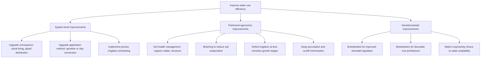

## Water Use Efficiency

### Definition and Core Concept

Water use efficiency (WUE) is a broad term describing the ratio of agricultural output (commonly biomass or economic yield) achieved per unit of water used or consumed, serving as a key metric for evaluating and improving the productivity of water resources in crop production. Because "water used" can be defined at different scales and through different pathways (transpiration alone, total evapotranspiration, total water applied through irrigation, or water delivered through an entire irrigation conveyance system), water use efficiency is not a single universally standardized measurement but rather a family of related metrics, each suited to a different level of analysis, and care must be taken to specify which definition is being used in any given context.

### Physiological (Plant-Level) Water Use Efficiency

**Transpiration Efficiency**

At the individual plant or leaf level, water use efficiency is often defined as the ratio of carbon assimilated (through photosynthesis) to water transpired, commonly expressed as biomass produced per unit of water transpired:

$$WUE_{transpiration} = \frac{\text{Biomass or CO}_2 \text{ assimilated}}{\text{Water transpired}}$$

This physiological efficiency is influenced by the plant's photosynthetic pathway, since C4 plants (such as maize, sorghum, and sugarcane) generally exhibit higher intrinsic water use efficiency than C3 plants (such as wheat, rice, and soybean) due to differences in their carbon-concentrating mechanism and associated stomatal behavior, which allows C4 plants to achieve a given rate of carbon fixation with comparatively less stomatal opening and associated water loss. CAM (Crassulacean Acid Metabolism) plants, which open stomata predominantly at night when evaporative demand is lower, exhibit the highest water use efficiency among the three major photosynthetic pathway categories, though CAM species are generally not major agricultural staple crops.

**Stomatal Regulation**

Water use efficiency at the leaf level is fundamentally governed by stomatal behavior, since stomata mediate the trade-off between $CO_2$ uptake (required for photosynthesis) and water vapor loss (transpiration); plant breeding and physiological research targeting improved water use efficiency frequently focuses on stomatal traits such as density, size, and responsiveness to environmental cues (vapor pressure deficit, soil moisture status) that influence this fundamental trade-off.

### Field and Crop-Level Water Use Efficiency Metrics

**Crop Water Productivity (CWP)**

Defined as marketable yield per unit of water consumed (typically total crop evapotranspiration over the growing season), providing a field-scale measure that integrates the combined effects of crop physiology, agronomic management, and environmental conditions on the relationship between water consumption and yield:

$$CWP = \frac{\text{Yield}}{ET_c}$$

Crop water productivity is commonly expressed in units such as kilograms of yield per cubic meter of water consumed (kg/m³), allowing comparison across crops, though such comparisons should account for differences in crop value and nutritional content per unit mass, since a simple yield-mass-based comparison may not reflect the true economic or nutritional water productivity of different crop choices.

**Irrigation Water Use Efficiency (IWUE)**

Focuses specifically on the productivity of irrigation water applied (as distinct from total crop water use, which includes both irrigation and effective rainfall contributions), often calculated as the difference in yield between an irrigated and a comparable non-irrigated (rainfed) treatment, divided by the amount of irrigation water applied, providing a metric specifically relevant to evaluating the marginal productivity gain attributable to irrigation investment.

### System-Level (Irrigation Delivery) Efficiency Metrics

**Conveyance Efficiency**

The ratio of water delivered at the point of on-farm use to the volume of water diverted or withdrawn at the source, reflecting losses occurring during transport through canals, pipelines, and distribution networks due to seepage, evaporation, and operational spillage; lined canals and piped conveyance systems generally achieve substantially higher conveyance efficiency than unlined earthen canals, which are subject to significant seepage losses depending on soil permeability along the canal alignment.

**Application Efficiency**

The ratio of the volume of water actually stored in the crop root zone (available for crop use) to the volume of water applied at the field level, reflecting on-farm application losses such as surface runoff (tailwater), deep percolation beyond the root zone, and, for sprinkler and micro-irrigation systems, evaporative and wind drift losses during application; as discussed under irrigation system types, drip/micro-irrigation systems generally achieve the highest application efficiency, followed by well-managed sprinkler systems, with surface (gravity) systems generally exhibiting the greatest variability and, without careful management, the lowest application efficiency.

**Overall (Project) Irrigation Efficiency**

The product of conveyance efficiency and application efficiency, representing the fraction of water withdrawn at the source that ultimately becomes available for crop use at the field level:

$$E_{overall} = E_{conveyance} \times E_{application}$$

This overall efficiency figure is important for water resource planning at the irrigation district or basin scale, since it determines how much additional water must be withdrawn from the source to deliver a given quantity of water actually usable by crops. [Inference] Specific efficiency percentage values cited in irrigation literature vary substantially by system type, management quality, and local conditions, so generic efficiency figures should be treated as illustrative ranges rather than universal constants applicable to any specific system without site-specific assessment.

### Factors Influencing Water Use Efficiency

**Key Points**

- **Irrigation system and management**: As outlined above, system type and management quality directly determine application efficiency; well-managed drip and precision sprinkler systems generally support higher water use efficiency than poorly managed surface systems, though even surface systems can achieve reasonably good efficiency under careful management (appropriate land leveling, matched inflow rates, and tailwater recovery).
- **Irrigation scheduling precision**: Scheduling approaches that closely match irrigation timing and amount to actual crop water requirement (as discussed under irrigation scheduling) reduce both under-irrigation (which can reduce yield, lowering the numerator of water use efficiency ratios) and over-irrigation (which wastes water without corresponding yield benefit, increasing the denominator).
- **Soil management**: Soil physical properties affecting water infiltration, storage capacity, and evaporative loss from the soil surface (influenced by factors such as organic matter content, structure, and surface residue cover) affect how efficiently applied water is retained and made available to the crop versus lost to runoff, deep percolation, or direct soil evaporation.
- **Crop variety and physiological traits**: Genetic variation in stomatal behavior, rooting depth and architecture, and canopy characteristics influences a variety's intrinsic water use efficiency, an active target of plant breeding programs, particularly for drought-prone production environments.
- **Climatic and atmospheric conditions**: Vapor pressure deficit (the difference between the amount of moisture the air can hold at saturation and its actual moisture content) strongly influences transpiration rate and therefore plant-level water use efficiency, with higher vapor pressure deficit conditions (hot, dry, or windy weather) generally reducing water use efficiency by increasing transpirational water loss relative to carbon assimilation.
- **Mulching and soil surface management**: Surface residue retention or synthetic mulch application reduces direct soil evaporation, thereby improving the fraction of applied water and rainfall that is transpired productively by the crop rather than lost as non-productive soil evaporation, particularly beneficial during early crop growth stages when canopy cover is incomplete.

### Practices for Improving Water Use Efficiency

### Deficit Irrigation as a Water Use Efficiency Strategy

**Key Points**

- Deficit irrigation strategies (introduced under irrigation scheduling) deliberately supply less than full crop water requirement, generally reducing total yield to some degree but often improving water use efficiency (yield per unit water) if the yield reduction is proportionally smaller than the water savings achieved, particularly when water deficit is timed to avoid the crop's most water-stress-sensitive growth stages.
- The crop water production function, describing the relationship between applied water (or seasonal ET) and yield, is typically characterized by diminishing returns at higher water application levels, meaning the marginal yield gain per additional unit of water applied decreases as water application approaches the level required for maximum yield; this relationship underlies the observation that maximum water use efficiency (yield per unit water) often occurs at an applied water level somewhat below the level that maximizes absolute yield, representing a trade-off between maximizing total production and maximizing water productivity that must be weighed according to specific water scarcity and economic conditions.

### Measuring and Benchmarking Water Use Efficiency

**Key Points**

- Reliable water use efficiency assessment requires accurate measurement of both water use (via flow meters, water balance calculations, or evapotranspiration estimation methods) and yield (via representative field sampling or whole-field harvest weighing), since errors in either component directly propagate into the calculated efficiency metric.
- Remote sensing-based evapotranspiration estimation, using satellite or aircraft-derived surface energy balance models, has become an increasingly used tool for estimating crop water consumption at field to regional scale, supporting broader water use efficiency benchmarking and water accounting efforts without requiring dense ground-based instrumentation at every location. [Inference] Specific remote sensing evapotranspiration products and their accuracy characteristics continue to develop; current capabilities and appropriate use cases should be checked against current literature or agency documentation for any specific application.
- Benchmarking water use efficiency across farms, irrigation districts, or regions requires care in ensuring comparisons account for differing crops, climatic conditions, and soil types, since raw water use efficiency values are not directly comparable across fundamentally different production contexts without appropriate normalization.

### Worked Example: Comparing Water Use Efficiency Across Two Irrigation Approaches

**Example**

A researcher compares crop water productivity for a maize field under two irrigation management approaches over a single growing season.

**Approach A: Conventional full irrigation**

- Seasonal crop evapotranspiration: 650 mm
- Grain yield achieved: 12,000 kg/ha
- Crop water productivity: $CWP_A = 12{,}000\text{ kg/ha} \div (650\text{ mm} \times 10\text{ m}^3/\text{mm-ha}) = 12{,}000 \div 6{,}500\text{ m}^3/\text{ha} \approx 1.85\text{ kg/m}^3$

**Approach B: Regulated deficit irrigation (deficit applied during a less-sensitive vegetative growth stage)**

- Seasonal crop evapotranspiration: 560 mm
- Grain yield achieved: 11,000 kg/ha
- Crop water productivity: $CWP_B = 11{,}000\text{ kg/ha} \div (560\text{ mm} \times 10\text{ m}^3/\text{mm-ha}) = 11{,}000 \div 5{,}600\text{ m}^3/\text{ha} \approx 1.96\text{ kg/m}^3$

**Interpretation**: Although Approach A achieved higher absolute yield (12,000 vs 11,000 kg/ha), Approach B achieved higher water use efficiency (approximately 1.96 vs 1.85 kg/m³) because the proportional reduction in water use (approximately 14% less) exceeded the proportional reduction in yield (approximately 8% less). [Inference] Whether Approach B represents the preferable strategy depends on the grower's specific objective (maximizing total production versus maximizing water productivity), the relative economic value of water versus yield in the specific context, and whether water availability is a binding constraint on the farm's overall operation; this simplified example illustrates the calculation method rather than a universal recommendation favoring deficit irrigation.

### Comparison of Water Use Efficiency Metrics by Scale

| Metric | Scale of Analysis | Numerator | Denominator |
| --- | --- | --- | --- |
| Transpiration efficiency | Leaf/plant | Biomass or carbon assimilated | Water transpired |
| Crop water productivity (CWP) | Field/crop | Marketable yield | Crop evapotranspiration (ETc) |
| Irrigation water use efficiency (IWUE) | Field/crop | Yield gain attributable to irrigation | Irrigation water applied |
| Application efficiency | On-farm delivery | Water stored in root zone | Water applied at field |
| Overall irrigation efficiency | Irrigation district/project | Water available for crop use at field | Water withdrawn at source |

### Illustrative Diagram: Water Pathway from Source to Crop Use

<svg xmlns="http://www.w3.org/2000/svg" viewBox="0 0 700 260">
<text x="350" y="25" font-size="16" font-weight="bold" text-anchor="middle" fill="#222">Water Pathway and Efficiency Points (svg_diagram)</text>
<rect x="30" y="80" width="120" height="50" rx="6" fill="#4a90d9" stroke="#222" />
<text x="90" y="110" font-size="10" text-anchor="middle" fill="#fff">Water source</text>
<line x1="150" y1="105" x2="230" y2="105" stroke="#222" stroke-width="2" marker-end="url(#a1)" />
<text x="190" y="95" font-size="8" text-anchor="middle" fill="#e07b39">Conveyance loss</text>
<rect x="230" y="80" width="120" height="50" rx="6" fill="#a8d5a2" stroke="#222" />
<text x="290" y="110" font-size="10" text-anchor="middle" fill="#222">Field delivery</text>
<line x1="350" y1="105" x2="430" y2="105" stroke="#222" stroke-width="2" marker-end="url(#a1)" />
<text x="390" y="95" font-size="8" text-anchor="middle" fill="#e07b39">Application loss</text>
<rect x="430" y="80" width="120" height="50" rx="6" fill="#f7d488" stroke="#222" />
<text x="490" y="110" font-size="10" text-anchor="middle" fill="#222">Root zone storage</text>
<line x1="550" y1="105" x2="630" y2="105" stroke="#222" stroke-width="2" marker-end="url(#a1)" />
<text x="590" y="95" font-size="8" text-anchor="middle" fill="#e07b39">Non-transpired ET</text>
<rect x="580" y="150" width="90" height="45" rx="6" fill="#c9a0dc" stroke="#222" />
<text x="625" y="177" font-size="9" text-anchor="middle" fill="#222">Crop yield</text>
<line x1="490" y1="130" x2="625" y2="150" stroke="#222" stroke-width="2" marker-end="url(#a1)" />
<text x="550" y="150" font-size="8" fill="#333">Transpiration → biomass/yield</text>
<text x="350" y="230" font-size="9" text-anchor="middle" fill="#222">Overall efficiency = conveyance efficiency × application efficiency; WUE relates final yield to water consumed at each stage</text>

</svg>

### Related Topics

- Irrigation scheduling as the primary operational lever for water use efficiency
- Irrigation system types and their comparative application efficiency
- Deficit irrigation and regulated deficit irrigation strategies
- Crop water production functions and economic optimization of water allocation
- Drought-tolerant crop breeding and stomatal trait selection
- Remote sensing-based evapotranspiration estimation
- Soil health management for improved water retention and infiltration
- Mulching and soil surface management practices
- Water sources and hydrology basics as the supply-side context
- Water rights, allocation, and economic pricing of agricultural water