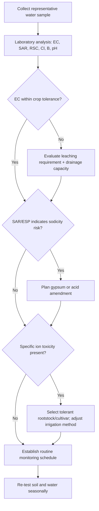

## Water Quality and Salinity Management

### Overview

Water quality and salinity management encompasses the assessment, monitoring, and control of irrigation water characteristics that affect soil health, crop productivity, and long-term land sustainability. Poor water quality—whether from dissolved salts, sodium content, or specific ion toxicity—can degrade soil structure, reduce infiltration, and cause yield decline even when irrigation volume and timing are otherwise correct.

**Key Points**

- Irrigation water quality is evaluated primarily through salinity, sodicity, and specific ion toxicity/permeability hazards.
- Salt accumulation in the root zone is a function of applied water salinity, leaching fraction, and drainage adequacy.
- Management requires integrating water testing, soil monitoring, leaching practices, and crop/salt tolerance matching.

---

### Water Quality Parameters

#### Electrical Conductivity (EC)

Electrical conductivity measures the total dissolved salt concentration in water, expressed in deciSiemens per meter (dS/m) or millimhos per centimeter (mmho/cm), which are numerically equivalent.

$$EC \, (\text{dS/m}) = \frac{TDS \, (\text{mg/L})}{640}$$

This approximation (divisor may range 550–900 depending on ion composition) converts EC to total dissolved solids (TDS). [Inference: the exact divisor is empirically derived and varies by water source composition, so it should be treated as a rough conversion rather than an exact formula.]

Common EC classification for irrigation water:

| Category | EC (dS/m) | Salinity Hazard |
| --- | --- | --- |
| Low | < 0.75 | Minimal restriction |
| Medium | 0.75–1.5 | Moderate restriction |
| High | 1.5–3.0 | Significant restriction; salt-tolerant crops only |
| Very High | > 3.0 | Generally unsuitable without intensive management |

#### Sodium Adsorption Ratio (SAR)

SAR estimates the sodium hazard relative to calcium and magnesium, predicting the potential for soil sodicity (structural degradation).

$$SAR = \frac{Na^+}{\sqrt{\dfrac{Ca^{2+} + Mg^{2+}}{2}}}$$

Ion concentrations are expressed in milliequivalents per liter (meq/L). Higher SAR values indicate greater risk of sodium displacing calcium and magnesium on soil exchange sites, leading to clay dispersion and structural collapse.

#### Adjusted SAR and Exchangeable Sodium Percentage (ESP)

Because carbonate and bicarbonate can precipitate calcium as it moves through soil, an adjusted SAR accounts for the tendency of calcium to be removed from solution. ESP describes the actual proportion of sodium occupying soil exchange sites:

$$ESP = \frac{\text{Exchangeable Na}}{\text{Cation Exchange Capacity (CEC)}} \times 100$$

Soils with ESP > 15% are typically classified as sodic, exhibiting poor structure, reduced permeability, and surface crusting.

#### Residual Sodium Carbonate (RSC)

RSC evaluates the risk of calcium and magnesium precipitating as carbonates, which effectively increases the relative sodium hazard over time:

$$RSC = (CO_3^{2-} + HCO_3^-) - (Ca^{2+} + Mg^{2+})$$

RSC > 2.5 meq/L is generally considered unsuitable for irrigation without amendment.

#### Specific Ion Toxicity

Certain ions cause direct plant toxicity independent of overall salinity:

- **Chloride (Cl⁻)**: Leaf tip and margin burn, particularly in sensitive tree and vine crops.
- **Boron (B)**: Toxic at very low concentrations (>1–2 mg/L) for boron-sensitive crops such as citrus and stone fruit.
- **Sodium (Na⁺)**: Foliar uptake via sprinkler irrigation can cause leaf scorch independent of soil-based sodicity effects.

---

### Salinity's Effect on Soil and Plants

#### Osmotic Effect

Dissolved salts in the soil solution increase osmotic potential, requiring plants to expend more energy to extract water. This physiologically mimics drought stress even when soil moisture content appears adequate.

$$\psi_{total} = \psi_{matric} + \psi_{osmotic}$$

As osmotic potential becomes more negative, the total water potential gradient favoring root uptake diminishes, reducing effective plant-available water.

#### Structural (Sodicity) Effect

Excess sodium relative to calcium and magnesium causes clay particles to disperse rather than flocculate. This collapses soil aggregates, reducing macropore space, infiltration rate, and hydraulic conductivity—compounding the salinity problem by impairing the very leaching needed to remove salts.

#### Combined Diagnostic Framework (svg_diagram)

<svg xmlns="http://www.w3.org/2000/svg" viewBox="0 0 720 360" font-family="Arial, sans-serif">
<text x="360" y="25" text-anchor="middle" font-size="16" font-weight="bold">Salinity vs. Sodicity Hazard Classification (svg_diagram)</text>
<line x1="80" y1="300" x2="680" y2="300" stroke="#333" stroke-width="2" />
<line x1="80" y1="300" x2="80" y2="50" stroke="#333" stroke-width="2" />
<text x="380" y="335" text-anchor="middle" font-size="13">EC (Salinity Hazard) →</text>
<text x="30" y="175" text-anchor="middle" font-size="13" transform="rotate(-90 30,175)">SAR (Sodium Hazard) →</text>
<rect x="80" y="50" width="200" height="125" fill="#a8d5a2" fill-opacity="0.5" />
<text x="180" y="115" text-anchor="middle" font-size="12">Sodic, Non-Saline</text>
<text x="180" y="130" text-anchor="middle" font-size="10">(Dispersion risk)</text>
<rect x="280" y="50" width="400" height="125" fill="#f2c14e" fill-opacity="0.5" />
<text x="480" y="115" text-anchor="middle" font-size="12">Saline-Sodic</text>
<text x="480" y="130" text-anchor="middle" font-size="10">(Combined hazard)</text>
<rect x="80" y="175" width="200" height="125" fill="#8fbfe0" fill-opacity="0.5" />
<text x="180" y="240" text-anchor="middle" font-size="12">Low Hazard</text>
<text x="180" y="255" text-anchor="middle" font-size="10">(Good quality)</text>
<rect x="280" y="175" width="400" height="125" fill="#e08e8e" fill-opacity="0.5" />
<text x="480" y="240" text-anchor="middle" font-size="12">Saline, Non-Sodic</text>
<text x="480" y="255" text-anchor="middle" font-size="10">(Osmotic stress, structure intact)</text>

<text x="280" y="315" font-size="10">EC ≈ 0.75</text>

<text x="80" y="185" font-size="10">SAR ≈ 13</text>

</svg>

---

### Water Quality Assessment Workflow

---

### Leaching Requirement (LR)

Leaching applies additional water beyond crop evapotranspiration needs to flush accumulated salts below the root zone. The leaching requirement is calculated as:

$$LR = \frac{EC_{iw}}{5 \times EC_e - EC_{iw}}$$

Where $EC_{iw}$ is the electrical conductivity of irrigation water and $EC_e$ is the target soil saturation extract EC threshold for a given crop's tolerance level.

**Example**

For irrigation water with $EC_{iw} = 1.5$ dS/m and a target $EC_e = 4.0$ dS/m (a moderately salt-tolerant crop):

$$LR = \frac{1.5}{5(4.0) - 1.5} = \frac{1.5}{18.5} \approx 0.081$$

This indicates approximately 8.1% additional water beyond crop water requirement must be applied to maintain acceptable root-zone salinity, assuming adequate drainage is present. [Inference: actual field leaching efficiency depends on soil uniformity, irrigation distribution uniformity, and drainage system function, so realized leaching may deviate from the calculated value.]

---

### Management Practices

#### Amendment Strategies

- **Gypsum (CaSO₄·2H₂O)**: Supplies calcium to displace exchangeable sodium without raising soil pH; standard remediation for sodic soils.
- **Elemental sulfur or sulfuric acid**: Used on calcareous soils to lower pH and increase native calcium solubility, indirectly displacing sodium.
- **Organic matter amendments**: Improve structural stability and buffering capacity, supporting flocculation resistance.

#### Irrigation Method Selection

| Method | Salinity Consideration |
| --- | --- |
| Drip/Micro-irrigation | Minimizes foliar contact; concentrates salts at wetting front margins |
| Sprinkler | Risk of foliar sodium/chloride toxicity, especially with hot, dry conditions |
| Surface/Flood | Effective for periodic leaching; less precise salt zone control |

#### Crop and Rootstock Selection

Matching crop and rootstock salt tolerance to water quality reduces management burden. Tolerance is commonly expressed via threshold ($EC_e$) and slope (yield decline per unit EC increase) values, as established in standard crop salt-tolerance tables (e.g., Maas-Hoffman relationships).

$$Y_r = 100 - b(EC_e - a)$$

Where $Y_r$ is relative yield percentage, $a$ is the salinity threshold, and $b$ is the percent yield decline per dS/m above threshold.

#### Drainage Management

Effective leaching is contingent on functioning subsurface or surface drainage; without adequate drainage, leaching water raises the water table and can reverse gains through capillary upward salt movement. Installation of tile drainage or maintenance of natural drainage gradients is a prerequisite for sustained leaching programs.

---

### Monitoring Protocol

**Next Steps**

- Establish baseline water quality testing (EC, SAR, RSC, Cl, B, pH) at seasonal intervals or per irrigation source change.
- Conduct soil saturation extract testing at representative root-zone depths annually.
- Track water table depth where shallow water tables or salinization risk exists.
- Maintain field records correlating yield trends with salinity monitoring data to detect early degradation.

---

### Related Topics

- Soil salinity assessment and saturation extract methodology
- Drainage system design (subsurface tile, surface drains)
- Crop salt tolerance classification (Maas-Hoffman tables)
- Fertigation interactions with water quality
- Reclaimed/recycled water use in irrigation
- Deficit irrigation and its interaction with salt accumulation
- Soil amendment application rates and calculation methods