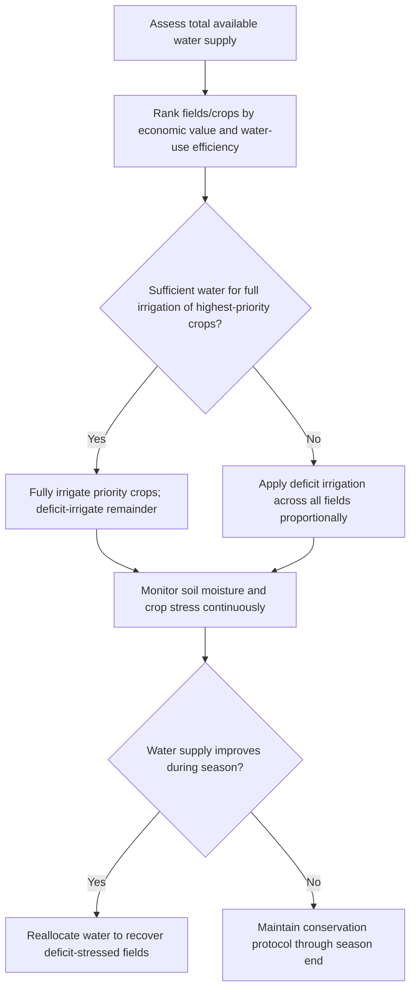

## Drought Management Strategies

### Overview

Drought management strategies encompass the planning, monitoring, and operational practices used to sustain agricultural production under conditions of reduced water availability. These strategies span pre-drought preparedness, in-season deficit management, and post-drought recovery, integrating soil, crop, and irrigation system decisions to minimize yield loss while conserving water resources.

**Key Points**

- Drought management operates across three temporal phases: preparedness (long-term planning), response (in-season adaptation), and recovery (post-drought soil and crop restoration).
- Effective strategies combine soil moisture conservation, crop selection, irrigation scheduling precision, and deficit irrigation techniques.
- Successful drought response requires monitoring infrastructure (soil moisture sensors, weather data, drought indices) to inform timely decisions.

---

### Drought Classification and Indices

#### Types of Agricultural Drought

- **Meteorological drought**: Prolonged deficit in precipitation relative to historical averages.
- **Agricultural drought**: Soil moisture deficit sufficient to impair crop growth, typically lagging meteorological drought.
- **Hydrological drought**: Reduced streamflow, reservoir levels, and groundwater recharge affecting irrigation water supply.

#### Common Drought Indices

| Index | Basis | Typical Use |
| --- | --- | --- |
| Standardized Precipitation Index (SPI) | Precipitation deviation from normal | Meteorological drought severity |
| Palmer Drought Severity Index (PDSI) | Precipitation, temperature, soil moisture balance | Long-term regional drought tracking |
| Crop Moisture Index (CMI) | Short-term soil moisture and evapotranspiration | Near-real-time crop stress assessment |
| Standardized Precipitation Evapotranspiration Index (SPEI) | Precipitation minus potential evapotranspiration | Accounts for temperature-driven water demand |

---

### Phase 1: Preparedness Strategies

#### Soil Moisture Conservation

- **Mulching**: Organic or synthetic mulch reduces soil surface evaporation and moderates soil temperature.
- **Reduced/no-tillage**: Preserves soil structure and residue cover, reducing evaporative water loss and improving infiltration.
- **Organic matter management**: Increases soil water-holding capacity; each 1% increase in soil organic matter can meaningfully raise plant-available water capacity. [Inference: the exact water-holding gain per unit of organic matter varies with soil texture and is commonly cited as an approximate rather than fixed relationship.]

#### Crop and Variety Selection

- Selection of drought-tolerant or short-season cultivars that complete critical growth stages before peak water stress periods.
- Diversification of planting dates to spread water demand risk across the growing season.

#### Infrastructure and System Design

- Conversion from flood/furrow to drip or micro-irrigation to improve water application efficiency.
- Installation of soil moisture monitoring networks (capacitance probes, tensiometers, or time-domain reflectometry sensors) for early stress detection.
- Development of on-farm water storage (ponds, reservoirs) to buffer against supply interruptions.

---

### Phase 2: In-Season Response Strategies

#### Deficit Irrigation

Deficit irrigation deliberately applies less water than full crop evapotranspiration ($ET_c$) requirements, accepting a controlled yield reduction to conserve water, typically applied during growth stages least sensitive to water stress.

$$ET_c = ET_0 \times K_c$$

Where $ET_0$ is reference evapotranspiration and $K_c$ is the crop coefficient. Under deficit irrigation, applied water is reduced relative to full $ET_c$, often targeted using a water stress coefficient $K_s$:

$$ET_{c,adj} = ET_0 \times K_c \times K_s$$

$K_s$ ranges from 0 (severe stress, no transpiration) to 1 (no stress), and is commonly estimated from root-zone depletion relative to total available water.

##### Regulated Deficit Irrigation (RDI)

RDI applies deficit irrigation during specific phenological stages where crops exhibit greater physiological tolerance to water stress (e.g., mid-season vegetative growth in orchard crops), while maintaining full irrigation during critical stages such as flowering and early fruit set.

##### Partial Rootzone Drying (PRD)

PRD alternates irrigation between sides of the root zone, keeping one side dry while irrigating the other, which triggers root-to-shoot abscisic acid (ABA) signaling that partially closes stomata and reduces transpiration without proportionally reducing photosynthesis. [Inference: the degree of water savings versus yield impact from PRD is species- and cultivar-dependent and reported inconsistently across studies.]

#### Irrigation Scheduling Optimization

- **Soil-water balance scheduling**: Tracking cumulative depletion of plant-available water to trigger irrigation only when a defined depletion threshold is reached.
- **Evapotranspiration-based scheduling**: Using real-time or forecast $ET_0$ data combined with crop coefficients to match applied water precisely to crop demand.
- **Plant-based indicators**: Stem water potential, leaf water potential, or infrared canopy temperature sensing to directly assess plant water status rather than inferring from soil or weather data alone.

#### Prioritization and Allocation

When water supply is insufficient for full irrigation across all fields, growers commonly apply allocation prioritization:

---

### Phase 3: Recovery Strategies

#### Post-Drought Soil Rehabilitation

- Assessment of soil structural damage from drought-induced compaction and cracking.
- Reintroduction of organic amendments to restore water-holding capacity and microbial activity.
- Re-evaluation of soil salinity, since reduced leaching during drought periods often results in salt accumulation in the root zone.

#### Crop Recovery Management

- Gradual reintroduction of full irrigation to avoid physiological shock in previously stressed perennial crops.
- Monitoring for delayed pest and disease pressure, as drought-stressed plants often exhibit increased susceptibility.
- Yield and quality assessment to inform variety and management adjustments for subsequent seasons.

---

### Economic and Risk Management Tools

**Example**

A grower facing a 30% reduction in seasonal water allocation might apply the following decision sequence: first, identify the crop's most water-stress-tolerant growth stage using published crop coefficient curves; second, calculate an adjusted irrigation schedule using regulated deficit irrigation during that stage; third, model expected yield reduction using a crop-water production function; and fourth, compare the economic outcome of full-price crop with reduced yield against the cost of supplemental water purchase, if available.

Crop-water production functions generally follow a form similar to:

$$\frac{Y_a}{Y_m} = 1 - K_y \left(1 - \frac{ET_a}{ET_m}\right)$$

Where $Y_a/Y_m$ is actual-to-maximum yield ratio, $K_y$ is the crop yield response factor to water stress, and $ET_a/ET_m$ is actual-to-maximum evapotranspiration ratio. Crops with lower $K_y$ values tolerate deficit irrigation with proportionally smaller yield losses.

**Additional Risk Tools**

- Crop insurance products tied to drought indices (index-based insurance).
- Water banking and transfer agreements in regions with tradable water rights.
- Diversified cropping systems to spread climatic risk across multiple crop water-demand profiles.

---

### Monitoring and Decision Support Systems

Modern drought management increasingly integrates remote sensing and decision support tools:

- **Satellite-based vegetation indices** (NDVI, NDWI) for regional crop stress detection.
- **Soil moisture telemetry networks** feeding automated irrigation controllers.
- **Weather forecasting integration** for proactive scheduling adjustments ahead of predicted dry periods.

[Unverified: specific commercial platform performance and accuracy claims vary by vendor and region, and should be validated against local field conditions rather than assumed from marketing specifications.]

---

### Related Topics

- Evapotranspiration estimation methods (Penman-Monteith, pan evaporation)
- Soil moisture sensor technologies and calibration
- Crop coefficient ($K_c$) curve development
- Water rights, allocation systems, and water banking
- Remote sensing for crop water stress detection
- Drought-tolerant crop breeding and variety trials
- Water use efficiency (WUE) metrics and benchmarking