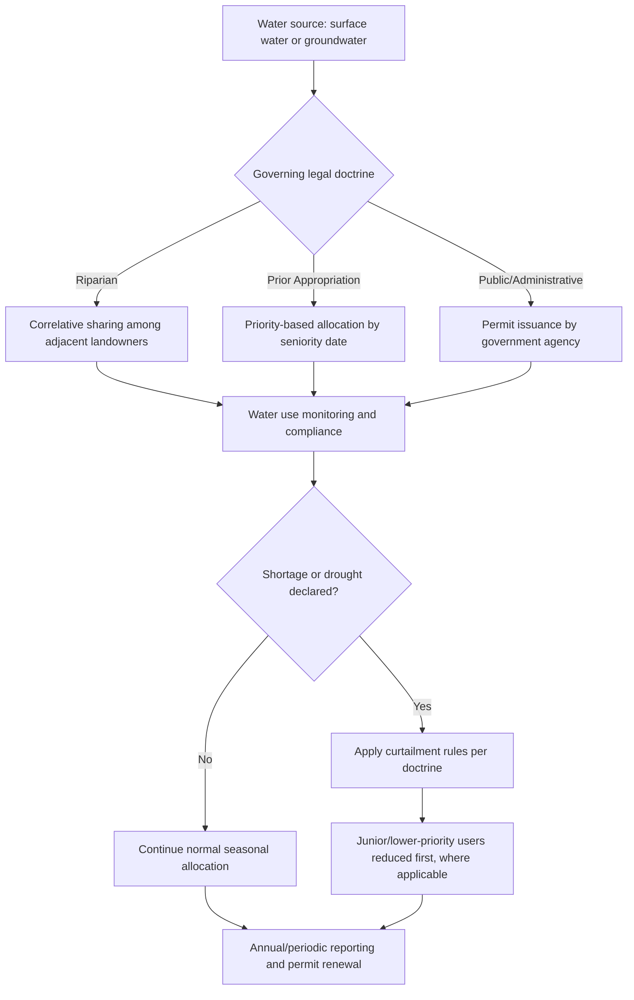

## Water Rights and Allocation Policy

### Overview

Water rights and allocation policy governs the legal frameworks, institutional structures, and administrative mechanisms that determine who may use water resources, in what quantity, for what purpose, and under what priority. These frameworks directly shape irrigation planning, investment decisions, and drought resilience strategies for agricultural operations, since water access security influences long-term crop and infrastructure choices.

**Key Points**

- Water rights systems vary fundamentally by legal doctrine (riparian, prior appropriation, public/administrative allocation, and hybrid systems), each with different implications for agricultural water security.
- Allocation policy determines not only volumetric entitlements but also priority ranking during shortage, transferability, and beneficial-use requirements.
- Because water law is jurisdiction-specific, growers must understand both the doctrinal framework governing their location and the administrative/regulatory bodies enforcing it.

---

### Major Water Rights Doctrines

#### Riparian Rights

Riparian doctrine grants water use rights to landowners whose property borders a natural watercourse. Rights are generally correlative (shared proportionally among riparian landowners) rather than based on a fixed priority date, and are typically tied to the land itself rather than being separately transferable.

- Common in regions with relatively abundant and consistent rainfall (e.g., eastern United States, much of Europe).
- Use is generally limited to "reasonable use" that does not unreasonably impair other riparian users' access.
- Rights cannot typically be sold separately from the adjoining land.

#### Prior Appropriation Doctrine

Prior appropriation allocates water rights based on the principle of "first in time, first in right," where the earliest established water right holds priority during shortage, regardless of land location relative to the water source.

- Common in arid and semi-arid regions with historically scarce water supply (e.g., western United States, parts of Australia).
- Requires demonstration of **beneficial use** (irrigation, domestic, industrial) to establish and maintain a water right; unused rights may be subject to forfeiture in some jurisdictions ("use it or lose it").
- Rights are generally quantified by volume or flow rate and can often be transferred, sold, or leased independent of land ownership, subject to regulatory review.
- During shortage, junior rights holders (later priority date) are curtailed before senior rights holders.

#### Public/Administrative Allocation Systems

Many jurisdictions, particularly outside common-law systems, treat water as a public resource administered through government permitting and allocation systems rather than private property rights.

- Water use permits are issued by government agencies, often with defined terms, renewal conditions, and use-specific allocations.
- Allocation may be adjusted administratively based on basin-wide water balance assessments, environmental flow requirements, or national water policy priorities.
- Common in civil law jurisdictions and many developing economies where water is constitutionally or statutorily declared a public good.

#### Hybrid and Regulated Riparian Systems

Some jurisdictions combine elements of riparian and permit-based systems, requiring riparian landowners to obtain permits above certain use thresholds while retaining underlying riparian priority principles.

---

### Allocation Mechanisms

#### Volumetric and Proportional Allocation

- **Volumetric allocation**: Fixed quantity of water (e.g., acre-feet, cubic meters) granted per right or permit period.
- **Proportional/percentage allocation**: Users receive a percentage of available supply, which fluctuates with total water availability in a given year (common in irrigation districts during drought years).

#### Groundwater Allocation

Groundwater is frequently governed by separate legal frameworks from surface water, including:

- **Absolute ownership doctrine**: Landowners may extract unlimited groundwater beneath their property (increasingly restricted in most jurisdictions due to aquifer depletion concerns).
- **Reasonable use doctrine**: Extraction is limited to reasonable use relative to land ownership, without harming neighboring users disproportionately.
- **Correlative rights doctrine**: Overlying landowners share proportional rights to a common aquifer.
- **Permit-based groundwater management**: Increasingly adopted where sustainable yield concerns require regulated extraction limits, often tied to aquifer recharge modeling.

---

### Water Transfers and Markets

In systems permitting transferability (predominantly prior appropriation and some administrative systems), water rights can be bought, sold, or leased subject to regulatory review, enabling reallocation toward higher-value uses.

#### Key Transfer Considerations

- **No-injury rule**: Transfers typically must not harm other existing water rights holders (e.g., by altering return flow patterns relied upon by downstream users).
- **Beneficial use verification**: Regulators may require confirmation that the transferred right reflects actual historical use rather than a paper entitlement exceeding real consumption.
- **Water banking**: Formalized systems allowing rights holders to store unused allocations (in reservoirs or via groundwater recharge) for use in future years or transfer to other users.

**Example**

An irrigation district operating under prior appropriation with a senior water right dating to 1920 would, during a declared shortage, continue receiving its full allocation while a neighboring district holding a 1965 priority right might be curtailed to a reduced percentage or eliminated entirely, depending on the total shortfall and the specific priority schedule administered by the relevant water authority.

---

### Environmental and Instream Flow Requirements

Modern allocation policy increasingly incorporates environmental water requirements alongside consumptive agricultural, municipal, and industrial uses.

- **Instream flow rights**: Legally protected minimum flow levels reserved for ecological function, fish passage, and habitat maintenance, which can constrain the volume available for agricultural appropriation.
- **Environmental impact review**: Many jurisdictions require environmental assessment before approving new water rights or significant transfers.
- **Basin-wide water balance planning**: Integrated water resource management approaches that allocate water across agricultural, urban, industrial, and environmental sectors within a shared basin framework.

[Inference: the specific balance struck between agricultural and environmental allocation varies significantly by jurisdiction and is often subject to ongoing political and legal contention, so no single standard ratio applies universally.]

---

### Drought and Shortage Administration

During declared water shortages, administering agencies typically apply one or more of the following mechanisms:

| Mechanism | Description |
| --- | --- |
| Priority curtailment | Junior rights suspended before senior rights (prior appropriation systems) |
| Proportional cutback | All users reduced by an equal percentage regardless of priority (common in administrative systems) |
| Rotational delivery | Water delivered on a scheduled rotation among users rather than continuously |
| Emergency permits | Temporary permits issued for critical needs, subject to expedited review |
| Water rights suspension/curtailment orders | Formal regulatory orders temporarily halting diversions to protect senior rights or minimum environmental flows |

---

### Compliance and Administrative Considerations for Growers

**Next Steps**

- Identify the specific water rights doctrine and administering agency governing the farm's water source (surface diversion, groundwater well, or district-delivered water).
- Confirm the priority date, permitted volume, and any beneficial-use reporting requirements attached to existing water rights.
- Review applicable metering, measurement, and reporting obligations, which are increasingly mandated even in historically unregulated groundwater basins.
- Evaluate transferability provisions if water right leasing or sale is being considered as a drought-year risk management or income-diversification strategy.
- Monitor basin-level water management plans, as sustainable groundwater management legislation in many regions is progressively imposing extraction limits on previously unrestricted wells.

---

### Related Topics

- Groundwater sustainability and aquifer management
- Irrigation district governance and water delivery infrastructure
- Water markets and transfer economics
- Drought management strategies
- Environmental flow requirements and ecological water law
- Water metering and compliance reporting systems
- Interstate/international transboundary water agreements