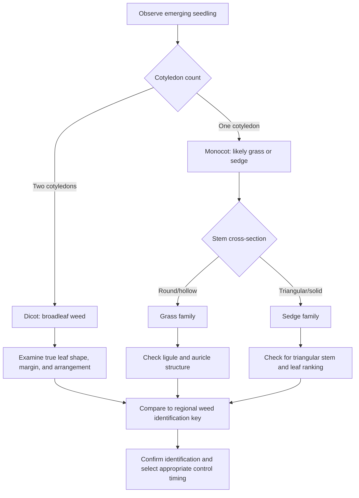

## Weed Biology and Identification

### Overview

Weed biology and identification is the foundational discipline within weed science, covering the classification, life cycles, morphological characteristics, and reproductive strategies that determine how weeds compete with crops and how they must be managed. Accurate identification and biological understanding underpin every downstream management decision, including herbicide selection, timing of control measures, and cultural practice adjustments.

**Key Points**

- Weeds are classified by life cycle (annual, biennial, perennial), botanical group (grass, broadleaf, sedge), and reproductive mechanism (seed, vegetative structures, or both).
- Correct identification at the seedling stage is critical, since most control measures are most effective before weeds reach maturity.
- Understanding a weed's biology—germination triggers, competitive period, and reproductive strategy—directly informs the timing and selection of control tactics.

---

### Classification by Life Cycle

#### Annual Weeds

Annual weeds complete their entire life cycle—germination, vegetative growth, flowering, seed production, and death—within a single growing season.

- **Summer annuals**: Germinate in spring, grow through summer, set seed and die by fall (e.g., pigweed species, crabgrass).
- **Winter annuals**: Germinate in fall, overwinter as rosettes or seedlings, resume growth in spring, and set seed before summer (e.g., chickweed, henbit).

Annual weeds rely entirely on seed production for population persistence, making prevention of seed set a primary long-term control objective.

#### Biennial Weeds

Biennial weeds require two growing seasons to complete their life cycle: the first season produces vegetative rosette growth, and the second season produces bolting, flowering, and seed set before the plant dies (e.g., musk thistle, wild carrot).

#### Perennial Weeds

Perennial weeds persist for multiple years, reproducing via seed and/or vegetative structures that allow regrowth after top growth is removed.

- **Simple perennials**: Reproduce primarily by seed, with limited vegetative spread from a single root system (e.g., dandelion, curly dock).
- **Creeping/spreading perennials**: Reproduce vegetatively via rhizomes, stolons, tubers, or bulbs in addition to seed, enabling aggressive lateral spread and making them substantially more difficult to control (e.g., quackgrass via rhizomes, yellow nutsedge via tubers, field bindweed via extensive root systems).

---

### Classification by Botanical Group

#### Grasses (Poaceae)

- Monocot morphology: parallel leaf venation, hollow or pithy round stems, single seed leaf (cotyledon) at emergence.
- Key identification features: ligule presence/shape, leaf blade width and vernation (rolled vs. folded in the whorl), auricle presence.
- Examples: crabgrass, foxtail species, johnsongrass, quackgrass.

#### Broadleaf Weeds (Dicots)

- Dicot morphology: net-like leaf venation, two seed leaves (cotyledons) at emergence, typically solid stems.
- Key identification features: leaf shape and margin, presence of hairs/pubescence, flower structure, stem cross-section.
- Examples: pigweed, lambsquarters, morning glory, common ragweed.

#### Sedges (Cyperaceae)

- Grass-like appearance but morphologically distinct: triangular stem cross-section (commonly summarized as "sedges have edges"), solid stems, three-ranked leaf arrangement.
- Often associated with wet or poorly drained soils, though some species (e.g., yellow nutsedge) tolerate a range of moisture conditions.
- Examples: yellow nutsedge, purple nutsedge.

---

### Seedling Identification Framework

Accurate early-stage identification relies on a structured sequence of morphological observations:

#### Cotyledon Characteristics

Cotyledons (seed leaves) often differ significantly in shape from a plant's true leaves and are frequently the most diagnostic feature at the earliest growth stage, since many broadleaf species have distinctive cotyledon shapes (e.g., pigweed cotyledons are narrow and lance-shaped, while velvetleaf cotyledons are heart-shaped).

#### Vegetative Structures for Perennial Identification

Identification of perennial weeds often requires examining underground structures in addition to above-ground morphology:

| Structure | Description | Example Species |
| --- | --- | --- |
| Rhizome | Horizontal underground stem producing shoots and roots at nodes | Quackgrass, Bermudagrass |
| Stolon | Horizontal above-ground stem rooting at nodes | White clover, Bermudagrass |
| Tuber | Swollen underground storage structure | Yellow nutsedge |
| Bulb | Underground storage structure composed of layered scales | Wild garlic |
| Taproot with lateral buds | Vertical root capable of regenerating from root fragments | Canada thistle, field bindweed |

---

### Reproductive Biology

#### Seed Production and Dormancy

- Individual weed plants can produce from several hundred to several hundred thousand seeds, depending on species, contributing to persistent soil seed banks.
- Seed dormancy mechanisms (physical seed coat dormancy, physiological dormancy, light/temperature requirements) allow germination to be staggered across seasons and years, complicating single-season control efforts.
- Soil seed banks can remain viable for years to decades depending on species and burial depth, meaning seed production in a single uncontrolled season can affect weed pressure for many subsequent years. [Inference: specific seed bank longevity figures vary considerably by species and are typically reported as ranges from field studies rather than fixed values.]

#### Vegetative Reproduction Strategies

Perennial weeds with vegetative reproduction present unique management challenges because fragmenting the plant (e.g., through tillage) can increase rather than decrease population density, since each viable root or rhizome fragment may generate a new independent plant.

$$N_{plants} \approx N_{fragments} \times V_f$$

Where $N_{fragments}$ is the number of viable fragments produced by disturbance and $V_f$ is the fragment viability rate (proportion capable of establishing new plants). This relationship illustrates why mechanical disturbance of creeping perennials without follow-up control can worsen infestations.

---

### Germination Ecology

#### Environmental Triggers

- **Temperature**: Many summer annuals require soil temperatures above a species-specific threshold (commonly 10–15°C for many summer annual grasses) before germination proceeds.
- **Light**: Some species require light exposure for germination (positively photoblastic), explaining why soil disturbance that brings buried seed to the surface can trigger flushes of germination.
- **Moisture**: Adequate and sustained soil moisture is required to break physical dormancy and support radicle emergence.
- **Soil disturbance**: Tillage exposes buried seed to germination-favorable conditions (light, oxygen, temperature fluctuation), which is why weed flushes commonly follow cultivation events.

#### Critical Period of Weed Competition

The critical period of weed control refers to the window during crop development when weed competition causes the greatest yield loss if left unmanaged; weeds emerging before or after this window generally cause proportionally less economic damage.

$$Yield \, Loss \, (\%) = f(\text{weed density}, \text{time of emergence relative to crop}, \text{duration of competition})$$

[Inference: the precise critical period varies substantially by crop species, weed species composition, and growing conditions, and is typically determined through field trials specific to a given cropping system rather than a universal fixed window.]

---

### Practical Identification Resources and Approach

**Example**

A grower encountering an unfamiliar seedling in a spring-planted field might proceed as follows: first, note cotyledon shape and count (one vs. two); second, allow a small sample to develop true leaves if immediate control is not required, since true leaf morphology often resolves ambiguous cotyledon-stage identification; third, examine the stem cross-section and any underground structures if the plant persists after mowing or shallow cultivation, which would suggest perennial rather than annual biology; and fourth, cross-reference observations against a regional weed identification guide or diagnostic key, since species composition varies significantly by geography and cropping system.

---

### Related Topics

- Herbicide mode of action classification
- Integrated weed management (IWM) systems
- Soil seed bank dynamics and management
- Weed resistance mechanisms and resistance management
- Cultural and mechanical weed control practices
- Critical period of weed competition studies by crop
- Invasive and noxious weed regulatory classification