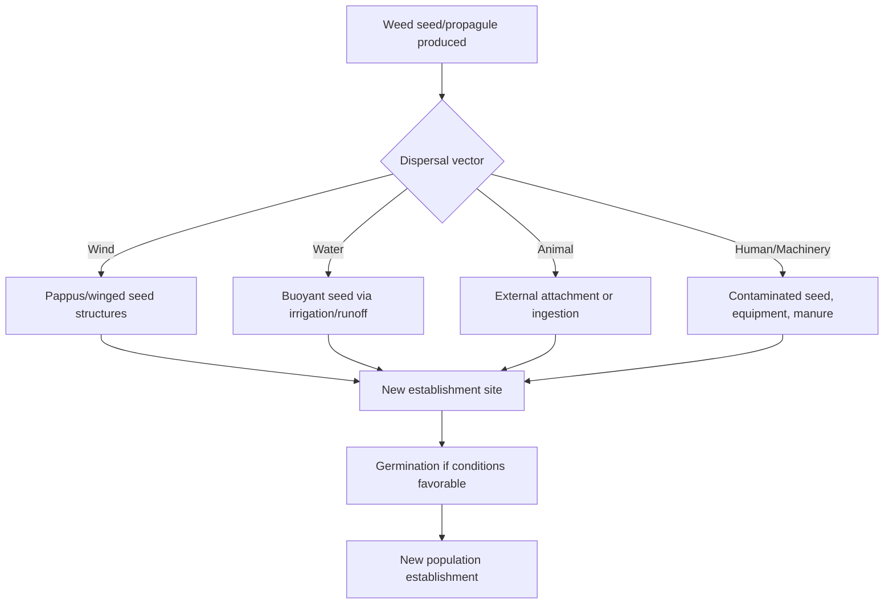

## Weed Life Cycles and Dispersal

### Overview

Weed life cycles and dispersal mechanisms determine how weed populations establish, persist, and spread across agricultural landscapes over time. Understanding the temporal pattern of a weed's development alongside its mechanisms for moving seed or vegetative propagules to new locations is essential for designing control strategies that interrupt reproduction and limit spread rather than merely suppressing existing growth.

**Key Points**

- Life cycle classification (annual, biennial, perennial) determines the timing window during which control measures interrupt reproduction most effectively.
- Dispersal mechanisms (wind, water, animal, human/machinery) determine the spatial scale and rate at which weed populations expand beyond their point of origin.
- Effective long-term management requires targeting both the temporal reproductive cycle and the spatial dispersal pathway simultaneously.

---

### Life Cycle Patterns in Detail

#### Annual Life Cycles

Annual weeds complete germination through seed production within one growing season and rely entirely on seed for population continuity.

- **Summer annuals**: Germinate as soil temperatures warm in spring, complete their cycle by fall (e.g., pigweed, foxtail, crabgrass).
- **Winter annuals**: Germinate in fall under cooling temperatures, overwinter as vegetative rosettes, resume growth and flower in spring (e.g., henbit, common chickweed, cheatgrass).

The single-season dependency on seed makes preventing seed set the most direct long-term suppression strategy for annuals, since eliminating one reproductive cycle can substantially reduce the following season's germination pressure. [Inference: the magnitude of population reduction from a single season of prevented seed set depends on existing seed bank size and longevity, so outcomes vary considerably by species and field history.]

#### Biennial Life Cycles

Biennials require two distinct growing seasons, with vegetative rosette establishment in year one and bolting/flowering/seed production in year two before death.

- Control is often most effective during the first-year rosette stage, when the plant is more vulnerable to herbicides and mechanical removal, and before reproductive investment has occurred.
- Examples: musk thistle, bull thistle, wild carrot.

#### Perennial Life Cycles

Perennials persist across multiple years, with life cycle patterns differing based on reproductive strategy.

- **Seed-only perennials**: Persist through repeated seasonal regrowth from a perennial root system but disperse primarily via seed (e.g., dandelion).
- **Vegetative-spreading perennials**: Combine seed reproduction with vegetative propagation via rhizomes, stolons, tubers, or root fragments, enabling both localized spread and long-distance colonization via seed (e.g., quackgrass, Canada thistle, field bindweed).

For creeping perennials, the life cycle functionally repeats at multiple scales simultaneously: individual shoots may senesce annually while the underlying root/rhizome system persists and continues expanding.

---

### Dispersal Mechanisms

#### Wind Dispersal (Anemochory)

Many weed species have evolved seed morphologies specifically adapted for wind transport.

- **Pappus structures**: Feathery or hairy appendages that increase surface area relative to seed mass, enabling long-distance wind transport (e.g., dandelion, Canada thistle, common groundsel).
- **Winged seeds**: Flattened or winged seed coats that slow descent and extend wind carry distance (e.g., some dock and tumbleweed species).
- **Tumbleweed mechanism**: Entire plant structures break free at maturity and roll across the landscape, distributing seed along the travel path (e.g., Russian thistle/kochia).

Wind dispersal distances vary widely by species and seed morphology, with some lightweight, pappus-bearing seeds capable of travel over considerable distances under favorable wind conditions. [Unverified: specific maximum dispersal distances cited in various sources differ significantly depending on measurement methodology and local wind conditions, so figures should be treated as approximate.]

#### Water Dispersal (Hydrochory)

Seeds transported via irrigation water, rainfall runoff, streams, or flooding events.

- Particularly relevant in irrigated cropping systems, where irrigation water sourced from canals or ditches can carry weed seed directly into fields.
- Seeds adapted for water dispersal often possess buoyant seed coats or air-filled structures that maintain flotation during transport.
- Riparian and floodplain weed establishment is frequently attributable to hydrochory following flood events.

#### Animal Dispersal (Zoochory)

- **Epizoochory**: External attachment to animal fur, feathers, or hide via hooks, barbs, or sticky structures (e.g., burdock, cocklebur, beggarticks).
- **Endozoochory**: Ingestion of seed-bearing fruit followed by excretion at a distant location, with some seeds requiring passage through an animal digestive tract to break dormancy (scarification).
- Livestock movement and feed/hay transport represent significant vectors for introducing weed seed to new fields, particularly when hay is sourced from weed-infested areas.

#### Human and Mechanical Dispersal (Anthropochory)

- **Contaminated seed lots**: Weed seed present as a contaminant in crop seed, particularly in uncertified or farm-saved seed.
- **Farm equipment**: Tillage, harvest, and tillage equipment moving between fields can transport seed and vegetative fragments (rhizomes, tubers) adhering to machinery.
- **Manure and compost**: Weed seed surviving digestion in livestock manure or incomplete composting processes can be reintroduced to fields via manure application.
- **Vehicle and foot traffic**: Seed transport via tires, footwear, and clothing along field margins, roadsides, and equipment travel lanes.

---

### Vegetative Dispersal in Perennial Weeds

Beyond seed-based dispersal, creeping perennials spread locally through vegetative structures, which presents distinct management implications since fragmentation via tillage can increase rather than reduce spread.

| Vegetative Structure | Dispersal Range | Fragmentation Risk |
| --- | --- | --- |
| Rhizome | Moderate (lateral spread within field) | High — tillage fragments create new plants |
| Stolon | Localized (surface spread) | Moderate |
| Tuber | Localized, but tubers can be moved by tillage equipment | High |
| Root fragments (taproot species) | Localized unless moved by equipment | High for species capable of adventitious budding |

$$P_{spread} = P_{seed} + P_{vegetative}$$

Where $P_{spread}$ represents total population spread potential, illustrating that management of vegetative-spreading perennials must address both reproductive pathways rather than seed control alone.

---

### Seed Bank Dynamics and Longevity

Weed seed dispersal contributes to the accumulation of a soil seed bank, which represents the reservoir of viable seed available for future germination.

- **Seed bank stratification**: Seeds are distributed across soil depth based on dispersal mechanism, tillage history, and burial by soil fauna; deeper burial generally extends dormancy and survival.
- **Longevity variation**: Some species retain seed viability in soil for only one to a few years, while others (particularly hard-seeded species) can remain viable for a decade or more. [Inference: specific longevity figures are species-dependent and derived from long-term burial studies, so they represent general tendencies rather than universal constants.]
- **Seed bank depletion strategies**: Preventing new seed input while encouraging existing seed bank germination under controlled conditions (e.g., stale seedbed technique) gradually reduces seed bank density over successive seasons.

---

### Practical Management Implications

**Example**

A field manager identifying a new infestation of a wind-dispersed species such as Canada thistle along a field edge should prioritize immediate control before flowering, since delayed action allows pappus-bearing seed to disperse across the remaining field and into neighboring properties via wind, potentially establishing new colonization points well beyond the original infestation boundary. In contrast, a manager encountering an isolated patch of a vegetatively-spreading species like field bindweed should avoid tillage as a primary control tactic, since fragmenting the root system without complete removal or herbicidal control can convert a single patch into multiple independently established plants.

**Next Steps**

- Map existing weed infestations by species and note proximity to dispersal vectors (irrigation canals, field margins, equipment travel paths).
- Implement equipment sanitation protocols (cleaning tillage and harvest equipment between fields) where perennial or herbicide-resistant species are present.
- Evaluate seed source certification for purchased seed lots to minimize introduction of contaminant weed seed.
- Time control interventions to precede seed set for annual and biennial species, and to avoid fragmentation-inducing disturbance for vegetatively-spreading perennials without follow-up control.

---

### Related Topics

- Weed biology and identification
- Soil seed bank management and depletion strategies
- Integrated weed management (IWM) systems
- Herbicide resistance mechanisms and management
- Sanitation and equipment biosecurity practices
- Invasive and noxious weed regulatory classification
- Cover cropping for weed suppression