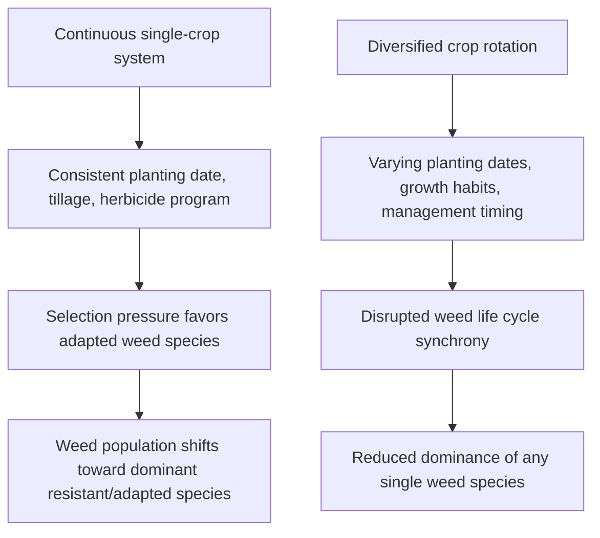
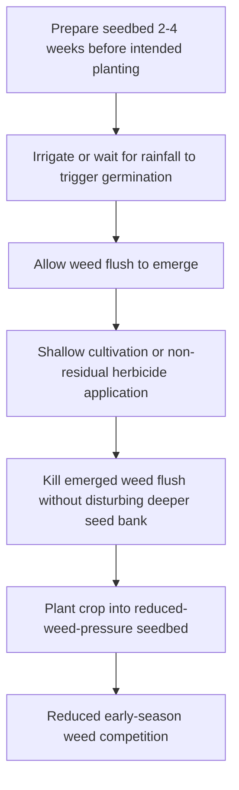

## Cultural Weed Control Methods

### Overview

Cultural weed control methods encompass agronomic practices that suppress weed establishment, growth, and reproduction by manipulating the cropping system itself rather than relying on direct mechanical removal or herbicide application. These methods work by enhancing crop competitiveness, disrupting weed germination and growth conditions, and reducing the long-term weed seed bank, forming a foundational component of integrated weed management (IWM) systems.

**Key Points**

- Cultural control operates preventatively and competitively, shifting the growing environment to favor crops over weeds rather than directly killing existing weeds.
- Core practices include crop rotation, cover cropping, competitive cultivar selection, planting density/geometry manipulation, and soil fertility management.
- Cultural methods are most effective when layered together and combined with mechanical and chemical tactics within an integrated weed management program, rather than used as a standalone solution.

---

### Crop Rotation

Crop rotation disrupts weed life cycles by varying planting dates, crop competitive characteristics, and management practices (tillage, herbicide chemistry) across seasons, preventing weed species from adapting to a consistent set of conditions.

- Rotating between crops with different growth habits (e.g., a tall, canopy-forming crop following a low-growing crop) alters light competition dynamics that favor different weed species each season.
- Alternating planting dates (spring-planted vs. fall-planted crops) disrupts the germination timing synchrony that annual weeds exploit, since summer annuals benefit from consecutive summer-planted crops while winter annuals benefit from consecutive fall-planted crops.
- Rotation to a different herbicide mode-of-action group (an interaction with chemical control) reduces selection pressure that would otherwise favor herbicide-resistant weed biotypes.

---

### Cover Cropping

Cover crops suppress weeds through several concurrent mechanisms operating both during active growth and after termination.

#### Competitive Suppression During Growth

- Rapid canopy closure intercepts light before weed seedlings can establish, directly limiting weed photosynthesis and growth.
- Dense root systems compete with emerging weed seedlings for soil moisture and nutrients.

#### Allelopathic Suppression

Certain cover crop species release biochemical compounds (allelochemicals) into the soil that inhibit weed seed germination or seedling growth.

- **Cereal rye (Secale cereale)**: Widely documented for allelopathic suppression via compounds released during residue decomposition, providing suppression that extends beyond the physical mulch barrier effect.
- **Brassica species** (e.g., mustards): Release glucosinolate-derived compounds with biofumigant properties upon tissue disruption and decomposition.

#### Residue/Mulch Suppression After Termination

Terminated cover crop residue functions as a physical mulch layer that:

- Blocks light required for germination of light-sensitive (positively photoblastic) weed seed.
- Moderates soil temperature fluctuations that trigger germination cues for many summer annual species.
- Physically impedes seedling emergence for small-seeded weed species lacking sufficient stored energy to penetrate a thick residue layer.

$$Suppression_{total} \approx Suppression_{competitive} + Suppression_{allelopathic} + Suppression_{mulch}$$

[Inference: the relative contribution of each suppression mechanism varies by cover crop species, termination timing, and biomass accumulation, so the additive relationship is conceptual rather than a precise quantitative model.]

---

### Crop Competitiveness Management

#### Cultivar Selection

Selecting crop varieties with inherently greater competitive ability against weeds can reduce weed pressure without additional inputs.

- Traits associated with competitive cultivars include rapid early-season canopy development, taller stature, greater leaf area index, and more extensive early root growth.
- Competitive cultivar selection is particularly valuable in organic or reduced-herbicide systems where chemical suppression options are limited.

#### Seeding Rate and Planting Density

Increasing crop seeding rate accelerates canopy closure, reducing the light and resource availability window during which weed seedlings can establish.

$$LAI_{crop} = f(\text{seeding rate}, \text{row spacing}, \text{growth stage})$$

Where $LAI$ (leaf area index) increases with higher seeding density up to a point of diminishing returns, after which excessive density may induce crop-to-crop competition without proportional additional weed suppression benefit. [Inference: the optimal seeding rate balancing weed suppression against crop-to-crop competition costs is crop- and environment-specific, requiring local trial validation rather than a universal rate recommendation.]

#### Row Spacing and Planting Geometry

- **Narrow row spacing**: Accelerates canopy closure compared to wide rows, reducing the interrow space available for weed establishment and light penetration to the soil surface.
- **Row orientation**: In some systems, planting orientation relative to prevailing sun angle can influence interrow shading duration, though this effect is generally secondary to row width and seeding rate.

---

### Soil Fertility and Nutrient Placement Management

#### Banded vs. Broadcast Fertilization

- **Banded (localized) fertilizer placement**: Concentrates nutrient availability near the crop root zone rather than across the entire field surface, reducing the nutrient resources available to weed seedlings germinating between crop rows.
- **Broadcast fertilization**: Distributes nutrients uniformly, potentially providing equal benefit to weed seedlings and crop plants alike, particularly for surface-germinating weed species.

#### Nutrient Timing

Synchronizing nutrient availability with crop demand curves (rather than providing excess early-season nutrient availability) can limit the competitive advantage weeds gain from readily available soil nitrogen during early growth stages when crop canopy has not yet closed.

---

### Water Management as Cultural Control

- **Irrigation method selection**: Drip and subsurface irrigation deliver water directly to the crop root zone, limiting soil moisture availability in interrow areas where weed seed would otherwise germinate; this contrasts with broadcast sprinkler or flood irrigation, which wets the entire field surface uniformly.
- **Irrigation timing**: Delaying initial irrigation until after crop establishment (where feasible) can reduce the germination window available to weed seed relying on surface soil moisture.

---

### Stale Seedbed Technique

The stale seedbed technique deliberately encourages weed seed germination prior to crop planting, followed by non-selective removal (shallow cultivation or non-residual herbicide) before the crop is seeded, reducing the active weed seed bank available to compete with the subsequent crop.

**Example**

A grower preparing a field for a summer vegetable crop might irrigate the prepared seedbed two to three weeks before the intended planting date, allowing a flush of summer annual weed seedlings to emerge from the upper soil profile. A shallow cultivation pass (avoiding deep tillage that would bring additional buried seed to the surface) then eliminates this flush immediately before crop seeding, resulting in a planting bed with substantially reduced initial weed pressure compared to a field planted without this pre-emergence germination cycle.

---

### Sanitation Practices

- **Equipment cleaning**: Removing soil, plant debris, and seed from tillage, harvest, and planting equipment between fields prevents mechanical transport of weed seed and vegetative propagules.
- **Clean seed sourcing**: Using certified, weed-seed-free crop seed prevents introduction of contaminant weed species via planting stock.
- **Field margin management**: Controlling weed populations along field borders, ditches, and fence lines prevents these areas from functioning as a continuous seed source reinfesting adjacent cropped areas.
- **Compost and manure management**: Ensuring adequate composting temperatures and duration to destroy weed seed viability before field application.

---

### Grazing and Livestock Integration

In mixed crop-livestock systems, targeted grazing can serve as a cultural weed suppression tool.

- Timed grazing during vulnerable weed growth stages (e.g., before seed set) removes above-ground biomass and can reduce reproductive capacity.
- Livestock trampling in some systems contributes to physical suppression of certain weed growth forms, though this must be balanced against potential soil compaction effects.
- Grazing management must account for livestock seed dispersal risk (endozoochory), as undigested seed passed through livestock can reintroduce weed populations to new areas via manure.

---

### Integration Considerations

**Next Steps**

- Evaluate current crop rotation sequence for planting-date and growth-habit diversity to disrupt weed life cycle synchrony.
- Select cover crop species based on documented allelopathic and residue suppression characteristics appropriate to the target weed spectrum and cropping window.
- Review seeding rate and row spacing relative to canopy closure speed for competitive suppression potential.
- Assess irrigation method and fertilizer placement practices for opportunities to limit interrow resource availability to weeds.
- Incorporate stale seedbed technique where field preparation timing allows a pre-plant weed flush and removal cycle.

---

### Related Topics

- Weed biology and identification
- Integrated weed management (IWM) systems
- Mechanical and physical weed control methods
- Herbicide mode of action and resistance management
- Cover crop species selection and termination timing
- Soil seed bank dynamics
- Crop rotation planning for pest and disease management