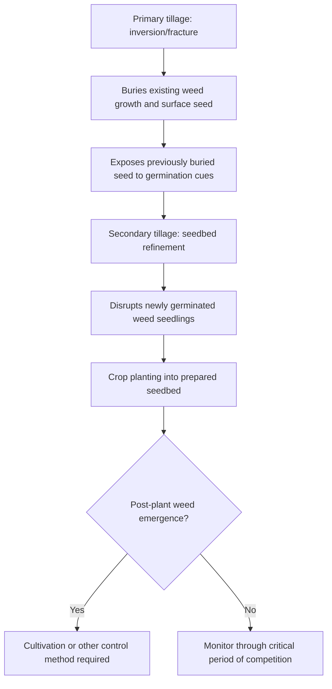

## Mechanical Weed Control

### Overview

Mechanical weed control encompasses physical methods of weed suppression and removal that disrupt weed growth through direct physical action—cutting, uprooting, burying, or crushing—rather than through chemical or biological means. These methods remain foundational to both conventional and organic weed management systems, offering herbicide-independent control options that also serve as essential resistance management tools within integrated weed management (IWM) programs.

**Key Points**

- Mechanical control methods act through direct physical disruption of weed structures (roots, shoots, or seed) and are generally classified as tillage-based, cultivation-based, or non-tillage physical methods.
- Timing relative to weed growth stage is critical, since mechanical efficacy typically declines sharply as weeds mature past the seedling stage and develop deeper root systems or regenerative capacity.
- Mechanical methods carry species-specific risks, particularly for creeping perennials where fragmentation of vegetative structures can increase rather than decrease weed populations.

---

### Tillage-Based Methods

#### Primary Tillage

Primary tillage (moldboard plowing, chisel plowing, disking) inverts or fractures soil to a substantial depth, burying existing weed vegetation and surface seed while bringing previously buried seed toward the surface.

- Effective at burying existing weed growth and seed produced during the prior season below germination-favorable depth.
- Simultaneously exposes previously buried dormant seed to light and temperature conditions that can trigger new germination flushes.
- Generally most disruptive to soil structure and organic matter among mechanical methods, with associated trade-offs for soil health and erosion risk.

#### Secondary Tillage

Secondary tillage (harrowing, field cultivation) prepares a finer seedbed following primary tillage and can provide an additional weed control pass by disturbing recently germinated seedlings before crop planting.

#### Reduced and Conservation Tillage Trade-offs

Reduced tillage and no-till systems minimize soil disturbance to preserve soil structure and organic matter but generally increase reliance on other weed control tactics (herbicides, cover crops, cultural methods) since tillage-based weed suppression is diminished or eliminated.

$$Weed \, Pressure_{no-till} = f(\text{surface seed bank}, \text{residue cover}, \text{alternative control inputs})$$

[Inference: the net weed pressure outcome under reduced tillage depends heavily on complementary practices adopted alongside reduced disturbance, so outcomes vary considerably across specific system implementations.]

---

### Cultivation Methods (In-Season Mechanical Control)

Cultivation refers to shallow, targeted mechanical disturbance performed after crop establishment, designed to control weeds while minimizing crop damage.

#### Interrow Cultivation

- Uses sweeps, shovels, or rotary implements positioned between crop rows to uproot or bury weed seedlings in the interrow zone.
- Requires precise row alignment (often GPS-guided in modern systems) to avoid crop damage, particularly as implement speed and row spacing narrow.
- Most effective against small, shallow-rooted weed seedlings; efficacy declines substantially against established or deep-rooted weeds.

#### Intrarow (In-Row) Cultivation

- Targets weeds growing within the crop row itself, historically the most difficult zone for mechanical control due to proximity to crop plants.
- Specialized implements (finger weeders, torsion weeders, rotary hoes, and increasingly camera-guided precision cultivators) allow selective disturbance close to crop stems while minimizing crop injury.
- Precision/robotic cultivation systems using machine vision to distinguish crop from weed plants represent an increasingly adopted technology for intrarow control, particularly in high-value vegetable production. [Unverified: specific commercial system performance claims (detection accuracy, weed control efficacy rates) vary by manufacturer and field conditions, and should be validated against independent trial data rather than vendor specifications alone.]

#### Rotary Hoeing

- A high-speed, shallow cultivation method using spoked wheels to disturb the soil surface, effective primarily against very small (white thread to first true leaf stage) weed seedlings.
- Can be performed across the entire field surface, including over the crop row, when crop seedlings are sufficiently anchored to tolerate the disturbance.
- Timing is critical, as efficacy is highest in a narrow window shortly after weed germination and declines rapidly as weeds develop secondary roots.

---

### Mowing and Cutting Methods

#### Mowing

- Removes above-ground weed biomass, preventing flowering and seed set when timed appropriately, though it does not eliminate root systems of perennial species.
- Repeated mowing over a growing season can progressively deplete root carbohydrate reserves in some perennial species, gradually weakening regrowth vigor, though complete eradication via mowing alone is uncommon for aggressive creeping perennials. [Inference: the degree of root reserve depletion achieved through repeated mowing varies by species, mowing frequency, and timing relative to phenological stage, and is generally documented as a suppressive rather than eradicative tactic.]
- Common applications include field margins, fallow ground, orchard and vineyard row middles, and pasture weed management.

#### String Trimming and Hand Cutting

- Used for spot treatment in areas inaccessible to larger equipment (around structures, irrigation infrastructure, field edges).
- Labor-intensive relative to mechanized options, generally reserved for smaller-scale or high-precision applications.

---

### Hand Weeding and Hoeing

Hand removal remains a standard practice in organic systems, high-value crops, and situations requiring precision around sensitive crop plants.

- **Hand pulling**: Effective for annual weeds and shallow-rooted species when soil moisture allows complete root removal; incomplete removal of perennial root systems can stimulate regrowth.
- **Hand hoeing**: Uses hand tools to sever weed shoots from roots at or below the soil surface, generally more efficient than pulling for larger areas while remaining precise enough for use near crop plants.
- Labor cost represents the primary limiting factor for hand weeding at commercial scale, generally restricting its use to high-value crops, organic certification requirements, or supplementary spot control following mechanized passes.

---

### Physical Barrier and Mulching Methods

#### Plastic and Fabric Mulch

- Impermeable or semi-permeable plastic/fabric mulches block light transmission to the soil surface, preventing germination of light-requiring weed seed and physically obstructing seedling emergence.
- Commonly used in high-value vegetable and fruit production, often combined with drip irrigation beneath the mulch layer.

#### Organic Mulch

- Straw, wood chips, or crop residue applied at sufficient depth create a physical barrier reducing light penetration and moderating soil temperature fluctuations that trigger weed germination.
- Mulch depth requirements vary by weed seed size and species, with larger-seeded weeds generally requiring thicker mulch layers to prevent emergence due to greater stored energy reserves for penetrating overlying material.

#### Flame and Thermal Weeding

- Propane flame weeders apply brief, intense heat to rupture plant cell walls, causing wilting and death without necessarily combusting plant tissue.
- Most effective against small annual weed seedlings; established perennials with protected root/rhizome systems generally regenerate after thermal treatment of above-ground tissue.
- Requires careful timing relative to crop tolerance stage and precautions regarding fire risk, particularly in dry residue conditions.

---

### Species-Specific Considerations and Risks

#### Fragmentation Risk with Creeping Perennials

Mechanical disturbance of vegetatively-reproducing perennial weeds (via rhizomes, tubers, or root fragments) can increase population density if fragments remain viable and are redistributed across the field.

$$N_{new \, plants} \approx N_{fragments \, produced} \times V_f \times D_f$$

Where $V_f$ represents fragment viability rate and $D_f$ represents the distribution factor (spread across field area by tillage equipment). This relationship explains why species such as quackgrass, field bindweed, and yellow nutsedge often require combined mechanical-chemical strategies rather than tillage alone.

| Species Type | Mechanical Control Suitability | Key Risk |
| --- | --- | --- |
| Annual, fibrous-rooted | High — cultivation/hoeing generally effective | Minimal fragmentation risk |
| Simple perennial (taproot, no vegetative spread) | Moderate — requires complete root removal | Regrowth from incompletely removed root crown |
| Creeping perennial (rhizome/tuber) | Low to moderate — repeated, well-timed treatment required | High fragmentation risk increasing population |

---

### Timing and Efficacy Considerations

**Example**

A vegetable grower managing an interrow weed flush would generally achieve highest cultivation efficacy by timing the cultivation pass to coincide with the weed "white thread" to first true leaf growth stage, since seedlings at this stage have minimal root anchorage and are readily uprooted or desiccated by shallow soil disturbance; delaying cultivation until weeds reach several true leaves substantially reduces control efficacy due to deeper root establishment and increased regenerative capacity from remaining root fragments after incomplete uprooting.

**Next Steps**

- Match mechanical method selection to weed growth stage, prioritizing early intervention at the seedling stage for cultivation and rotary hoeing.
- Assess weed species composition for perennial fragmentation risk before selecting tillage-based control for fields with known creeping perennial infestations.
- Evaluate precision cultivation technology (GPS guidance, camera-based intrarow systems) where labor costs or crop value justify capital investment.
- Integrate mechanical methods with cultural and, where appropriate, chemical tactics within a broader IWM program rather than relying on mechanical control as a standalone strategy.

---

### Related Topics

- Weed biology and identification
- Weed life cycles and dispersal
- Cultural weed control methods
- Integrated weed management (IWM) systems
- Precision agriculture and machine vision weed detection
- Herbicide mode of action and resistance management
- Soil health impacts of tillage practices