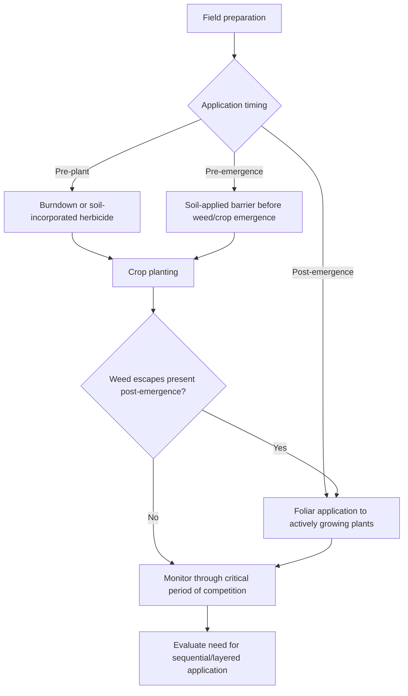
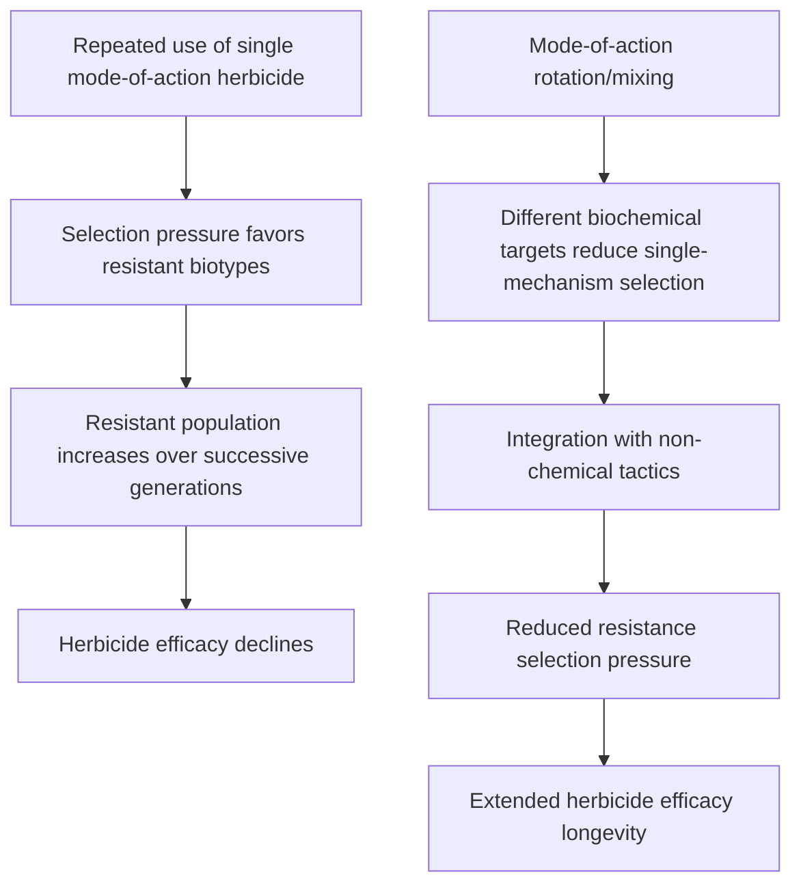

## Chemical Weed Control and Herbicides

### Overview

Chemical weed control uses synthetic or naturally derived herbicidal compounds to disrupt specific physiological or biochemical processes in target weed species, causing growth inhibition or death while ideally sparing the crop through selectivity mechanisms. Herbicides remain among the most widely used weed control tools in modern agriculture due to their scalability, timing flexibility, and cost-effectiveness relative to labor-intensive mechanical methods, though their use requires careful attention to mode of action, application timing, selectivity, and resistance management.

**Key Points**

- Herbicides are classified by mode of action (the specific biochemical process disrupted), timing of application (pre-plant, pre-emergence, post-emergence), and selectivity (selective vs. non-selective).
- Effective herbicide programs require matching product chemistry to target weed spectrum, crop tolerance, application timing, and environmental conditions.
- Herbicide resistance management is a critical modern consideration, requiring mode-of-action rotation and integration with non-chemical control tactics.

---

### Herbicide Classification by Timing

#### Pre-Plant Herbicides

Applied before crop planting, often incorporated into soil or applied to burn down existing vegetation ahead of seeding.

- **Burndown herbicides**: Non-selective, foliar-active products used to eliminate existing vegetation before no-till or reduced-till planting.
- **Soil-incorporated herbicides**: Mechanically incorporated into the soil profile to improve activation and reduce volatilization or photodegradation losses.

#### Pre-Emergence Herbicides

Applied to the soil surface after planting but before crop and weed emergence, forming a chemical barrier that intercepts germinating weed seedlings as they pass through the treated soil zone.

- Efficacy depends heavily on adequate soil moisture (rainfall or irrigation) to activate and move the herbicide into the germination zone.
- Generally most effective against small-seeded annual weeds germinating from shallow soil depths; less effective against weeds emerging from deeper positions or established perennial root systems.

#### Post-Emergence Herbicides

Applied after crop and/or weed emergence, targeting actively growing plant tissue through foliar absorption and translocation.

- **Selective post-emergence**: Controls target weed species while minimizing crop injury through differential uptake, translocation, or metabolic detoxification between crop and weed.
- **Non-selective post-emergence**: Controls a broad spectrum of vegetation regardless of species, requiring careful application timing and technique (directed spray, shielded application) to avoid crop contact.

---

### Herbicide Selectivity Mechanisms

#### Physiological Selectivity

Differences in plant morphology or growth habit that result in differential herbicide exposure, such as leaf angle, waxy cuticle thickness, or growing point location relative to soil surface, affecting spray retention and absorption.

#### Biochemical Selectivity

Differential metabolic detoxification capacity between crop and weed species, where a crop possesses enzymatic pathways (e.g., cytochrome P450 monooxygenases, glutathione S-transferases) capable of breaking down the herbicide into non-toxic metabolites faster than susceptible weed species can.

#### Placement/Timing Selectivity

Achieving selectivity through application method or timing rather than inherent plant tolerance, such as directed spray application that physically avoids crop contact, or pre-emergence timing that exploits differential germination depth between crop seed and weed seed.

---

### Herbicide Mode of Action Groups

Modern herbicide classification systems (such as the Weed Science Society of America group numbering and the Herbicide Resistance Action Committee/HRAC classification) organize herbicides by their specific biochemical target site, which is the primary basis for resistance management planning.

| Mode of Action Category | Target Site | Example Chemical Families |
| --- | --- | --- |
| ALS (Acetolactate synthase) inhibitors | Branched-chain amino acid synthesis | Sulfonylureas, imidazolinones |
| ACCase inhibitors | Fatty acid synthesis (grass-selective) | Aryloxyphenoxypropionates, cyclohexanediones |
| EPSPS inhibitors | Aromatic amino acid synthesis | Glyphosate |
| PSII inhibitors | Photosystem II electron transport | Triazines, ureas |
| PPO inhibitors | Protoporphyrinogen oxidase (cell membrane disruption) | Diphenylethers, triazolinones |
| Synthetic auxins | Auxin signaling disruption | Phenoxy acids, pyridines |
| Glutamine synthetase inhibitors | Nitrogen metabolism/ammonia accumulation | Glufosinate |

[Inference: exact classification group numbering and naming conventions periodically undergo revision by governing scientific bodies, so growers should verify current classification against the applicable regional regulatory or extension resource rather than relying solely on legacy group numbers.]

---

### Herbicide Formulation and Adjuvant Considerations

#### Formulation Types

- **Emulsifiable concentrates (EC)**: Oil-based formulations requiring emulsification in water carrier.
- **Wettable powders/water-dispersible granules (WP/WDG)**: Solid formulations dispersed in water carrier, often requiring agitation to maintain suspension.
- **Soluble concentrates/liquids (SL)**: Fully water-soluble formulations providing consistent mixing.

#### Adjuvants

- **Surfactants**: Reduce spray solution surface tension, improving leaf surface coverage and cuticle penetration.
- **Crop oil concentrates (COC) and methylated seed oils (MSO)**: Enhance herbicide penetration through waxy leaf cuticles, particularly relevant for certain post-emergence products.
- **Ammonium sulfate (AMS)**: Commonly added to counteract hard water antagonism affecting certain herbicide chemistries (notably glyphosate) by binding cations that would otherwise reduce herbicide efficacy.

---

### Application Rate and Coverage Calculations

Herbicide efficacy depends on delivering an adequate active ingredient dose per unit area with sufficient spray coverage for foliar uptake.

$$Application \, Rate \, (\text{L/ha}) = \frac{Product \, Rate \, (\text{L/ha label rate})}{Carrier \, Volume \, Adjustment}$$

Spray carrier volume (water volume per unit area) affects coverage density, with lower carrier volumes producing more concentrated droplets and higher carrier volumes improving coverage uniformity, particularly relevant for contact herbicides requiring direct tissue contact versus systemic herbicides relying on translocation following limited absorption.

**Example**

A post-emergence contact herbicide applied at a labeled rate typically requires higher carrier volume (e.g., 150–200 L/ha) to achieve adequate coverage across dense weed canopy, since contact herbicides only affect directly contacted tissue, whereas a systemic, translocated herbicide may perform adequately at lower carrier volumes (e.g., 50–100 L/ha) since absorbed active ingredient moves internally beyond the point of initial contact. [Inference: specific optimal carrier volume ranges vary by product label, nozzle type, and target weed canopy density, so label directions and regional extension guidance should govern actual rate selection.]

---

### Herbicide Resistance Management

#### Resistance Development Mechanisms

- **Target-site resistance**: Genetic mutation altering the herbicide's biochemical target site, reducing binding affinity without necessarily affecting the plant's normal physiological function.
- **Non-target-site resistance**: Enhanced metabolic detoxification, reduced herbicide translocation, or altered sequestration that reduces effective herbicide concentration reaching the target site.

#### Resistance Management Strategies

- **Mode-of-action rotation**: Alternating herbicide groups across seasons to avoid consistent selection pressure on a single target site.
- **Tank-mixing multiple effective modes of action**: Applying two or more herbicides with different target sites simultaneously, reducing the likelihood that a single resistance mechanism confers survival against the full mixture.
- **Integration with cultural and mechanical tactics**: Reducing overall reliance on herbicides as the sole selection pressure by incorporating crop rotation, cultivation, and cover cropping.
- **Preventing seed production of escaped weeds**: Removing surviving weed escapes before seed set prevents resistant genetics from entering the seed bank, regardless of the resistance mechanism involved.

---

### Environmental and Safety Considerations

#### Soil Persistence and Carryover

Herbicide soil persistence (residual activity) varies substantially by chemistry, soil type, pH, organic matter content, and environmental conditions, with some products presenting rotational crop restriction periods to prevent injury to sensitive subsequent crops.

#### Drift and Volatility Management

- **Physical drift**: Spray droplet movement beyond the target area due to wind conditions during application, managed through nozzle selection, droplet size, boom height, and wind speed restrictions specified on product labels.
- **Volatility**: Post-application vaporization and movement of certain herbicide chemistries under specific temperature and humidity conditions, requiring attention to label-specified temperature inversion restrictions and application timing.

#### Label Compliance

Herbicide product labels constitute legally binding usage directions in most regulatory jurisdictions, specifying approved crops, application rates, timing restrictions, rotational crop intervals, and personal protective equipment requirements; application inconsistent with label directions typically constitutes a regulatory violation independent of efficacy or safety outcome. [Unverified: specific label requirements vary by product, jurisdiction, and periodic regulatory updates, so current label documentation should always be consulted directly rather than relied upon from general reference material.]

---

### Integration Within Broader Weed Management

**Next Steps**

- Confirm current herbicide mode-of-action classification and resistance status for target weed species in the specific production region before program selection.
- Match application timing (pre-plant, pre-emergence, post-emergence) to target weed germination and growth patterns identified through field scouting.
- Incorporate mode-of-action rotation and tank-mix strategies as core components of a resistance management plan rather than an optional consideration.
- Review current product labels for rate, timing, environmental, and rotational crop restrictions specific to the intended use site before application.
- Integrate chemical control with cultural and mechanical tactics within an overall IWM framework to reduce long-term selection pressure and input reliance.

---

### Related Topics

- Weed biology and identification
- Herbicide resistance mechanisms and monitoring
- Integrated weed management (IWM) systems
- Mechanical weed control
- Cultural weed control methods
- Sprayer calibration and application technology
- Environmental fate and regulatory compliance of pesticides