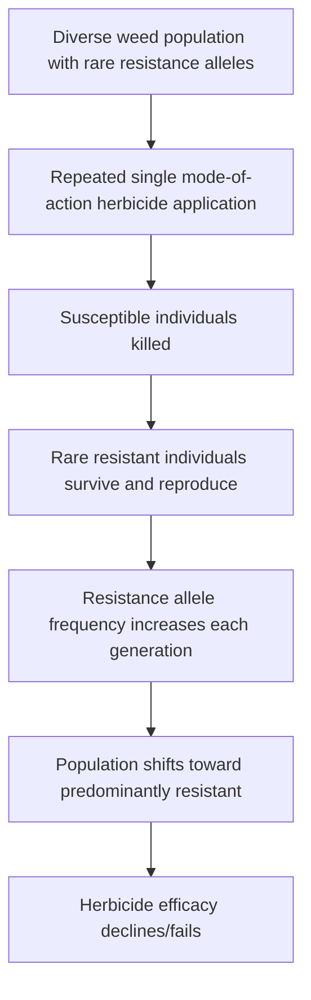
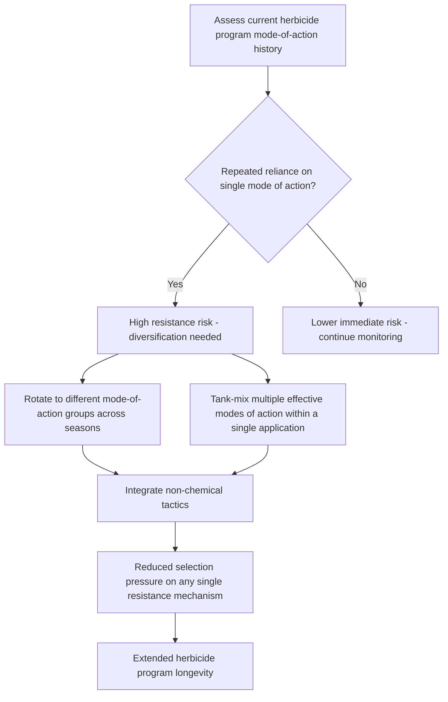

## Herbicide Resistance Management

### Overview

Herbicide resistance management addresses the growing agronomic challenge of weed populations evolving the ability to survive herbicide applications that previously provided effective control. As a consequence of repeated selection pressure from reliance on a limited number of herbicide modes of action, resistance management has become a central pillar of modern weed science, requiring proactive, multi-tactic strategies rather than reactive responses after resistance is already widespread.

**Key Points**

- Herbicide resistance arises through natural genetic variation within weed populations, with resistant individuals surviving and reproducing preferentially under repeated herbicide selection pressure.
- Resistance mechanisms are broadly categorized as target-site resistance (altered biochemical target) and non-target-site resistance (enhanced detoxification, reduced translocation, or altered sequestration).
- Effective management requires diversifying selection pressure through mode-of-action rotation, tank-mixing, and integration with non-chemical control tactics, combined with proactive monitoring and prevention of resistant seed production.

---

### The Biological Basis of Resistance Evolution

#### Selection Pressure Dynamics

Herbicide resistance evolves through standard evolutionary selection: a small proportion of individuals within a weed population possess pre-existing genetic variation conferring reduced herbicide sensitivity, and repeated application of the same herbicide (or mode of action) selectively removes susceptible individuals while allowing resistant individuals to survive, reproduce, and increase in frequency across successive generations.

#### Factors Accelerating Resistance Evolution

- **Repeated use of a single mode of action**: The strongest driver of resistance selection, particularly when used as the sole control tactic across consecutive seasons.
- **High weed population density and reproductive output**: Larger populations with greater seed production increase the absolute number of individuals available to carry rare resistance alleles forward.
- **Herbicide efficacy at the threshold of complete control**: Products achieving high but incomplete control (allowing some survivors to reproduce) can select for resistance more readily than either fully effective or largely ineffective control, since surviving individuals under partial control conditions are disproportionately likely to carry resistance traits.
- **Short weed generation time and high fecundity**: Species completing multiple generations per season or producing large seed quantities per plant accelerate the rate at which resistance alleles can spread through a population.

[Inference: the relative contribution of each accelerating factor varies by weed species biology and specific herbicide chemistry, so risk assessment should be conducted on a species-by-species and field-history basis rather than applying uniform risk assumptions.]

---

### Resistance Mechanisms

#### Target-Site Resistance (TSR)

Target-site resistance arises from a genetic mutation altering the structure of the specific enzyme or protein that the herbicide is designed to bind and inhibit, reducing the herbicide's binding affinity while often preserving the target site's normal physiological function.

- Frequently confers high-level resistance to the specific herbicide and often to other herbicides sharing the same mode of action (cross-resistance within a mode-of-action group).
- Commonly documented for ALS-inhibiting and ACCase-inhibiting herbicide groups, among others, due to the relatively simple genetic basis (often a single point mutation) required to alter target enzyme structure.

#### Non-Target-Site Resistance (NTSR)

Non-target-site resistance encompasses mechanisms that reduce the effective herbicide dose reaching the target site without altering the target site itself.

- **Enhanced metabolic detoxification**: Increased activity of detoxification enzymes (e.g., cytochrome P450 monooxygenases, glutathione S-transferases) that break down the herbicide into non-toxic metabolites before it reaches the target site.
- **Reduced translocation/sequestration**: Physiological changes that limit herbicide movement to the target tissue or sequester the herbicide in metabolically inactive plant compartments (e.g., vacuoles).
- **Reduced absorption/altered cuticle characteristics**: Changes in leaf surface properties reducing initial herbicide uptake.

Non-target-site resistance is often polygenic (controlled by multiple genes with smaller individual effects), which can result in broader cross-resistance patterns spanning multiple, mechanistically unrelated herbicide modes of action—a phenomenon sometimes termed multiple resistance when confirmed across distinct mechanisms.

#### Distinguishing Cross-Resistance from Multiple Resistance

| Term | Definition |
| --- | --- |
| Cross-resistance | Resistance to multiple herbicides sharing the same mode of action, typically via a single resistance mechanism |
| Multiple resistance | Resistance to herbicides from two or more distinct modes of action within the same weed population, often via separate resistance mechanisms co-occurring |

---

### Detection and Monitoring

#### Field-Level Indicators of Developing Resistance

- Unexpected control failures in fields with a consistent multi-year history of the same herbicide or mode-of-action group.
- Surviving weed patches that expand in area or density across successive seasons despite continued herbicide use.
- Escaped weeds concentrated within a single species while other species in the same field remain adequately controlled by the same application.

#### Confirmatory Testing

- **Whole-plant bioassays**: Growing suspected resistant seed or plant material under controlled conditions and applying a dose-response herbicide screen to compare survival relative to known-susceptible reference populations.
- **Molecular/genetic testing**: Identifying specific target-site mutations associated with known resistance mechanisms, where diagnostic markers have been characterized for the herbicide group in question.

$$Resistance \, Ratio = \frac{LD_{50 \, (resistant \, population)}}{LD_{50 \, (susceptible \, reference)}}$$

Where $LD_{50}$ represents the herbicide dose required to control 50% of the tested population; higher resistance ratios indicate greater confirmed resistance magnitude relative to the susceptible reference standard.

---

### Resistance Management Strategies

#### Mode-of-Action Diversification

- **Sequential rotation**: Alternating herbicide mode-of-action groups across growing seasons or within a single season's sequential applications (pre-emergence followed by a different post-emergence mode of action).
- **Tank-mixing effective modes of action**: Combining two or more herbicides with different, independently effective mechanisms in a single application, reducing the probability that resistance to one mode of action alone confers survival against the full mixture. Effectiveness of this strategy depends on both mixture components providing genuinely effective control of the target species independently, rather than pairing an effective product with one offering only marginal activity.

#### Integrated Weed Management Integration

Reducing overall reliance on herbicides as the dominant selection pressure by incorporating non-chemical tactics reduces the rate of resistance evolution even when herbicides remain part of the program.

- **Cultural practices**: Crop rotation, cover cropping, and competitive cultivar selection reduce weed population density and reproductive output, lowering the absolute number of individuals available to carry resistance forward.
- **Mechanical practices**: Cultivation and hand-roguing of herbicide-resistant escapes prevent seed production from surviving resistant individuals.
- **Harvest weed seed control**: Emerging technologies (seed mills, chaff lining, narrow windrow burning) that target weed seed passing through the combine at harvest, reducing seed bank replenishment from herbicide-resistant survivors that reached maturity. [Unverified: adoption rates and documented efficacy of specific harvest weed seed control technologies vary by region and equipment, and current performance data should be verified against recent independent research rather than manufacturer claims alone.]

#### Preventing Seed Set from Resistant Escapes

Removing surviving weed escapes before seed maturation—regardless of the resistance mechanism involved—is one of the most direct interventions available, since it prevents resistant genetics from entering or expanding within the soil seed bank irrespective of which herbicide or tactic ultimately failed to achieve control.

$$Seed \, Bank \, Resistant \, Fraction_{t+1} = Seed \, Bank \, Resistant \, Fraction_t + \Delta(Resistant \, Seed \, Production)$$

Preventing $\Delta(Resistant \, Seed \, Production)$ through pre-seed-set removal directly limits the rate of resistant fraction increase within the seed bank across seasons.

---

### Herbicide Stewardship and Program Design

#### Full Labeled Rate Application

Applying herbicides at less than the full labeled rate can increase resistance selection risk by allowing partially tolerant individuals to survive and reproduce, compared to full-rate application that more completely removes susceptible-to-moderately-tolerant individuals from the population. [Inference: the specific relationship between reduced rates and resistance selection risk is documented in resistance evolution literature as a general principle, though the magnitude of risk varies by herbicide chemistry, weed species, and existing resistance allele frequency in the population.]

#### Residual Herbicide Layering

Sequential application of soil-residual herbicides with different modes of action extends the period of effective weed control while distributing selection pressure across multiple biochemical targets rather than concentrating pressure on a single mode of action throughout the season.

#### Record-Keeping and Field History

Maintaining detailed field-level records of herbicide mode-of-action use across seasons enables identification of fields at elevated resistance risk due to historical over-reliance on limited chemistry, supporting proactive diversification before control failures occur.

---

### Regional and Industry Coordination

**Example**

A grower observing declining control of a specific weed species from a herbicide program relying predominantly on ALS-inhibiting chemistry across several consecutive seasons might first submit suspect plant material for whole-plant bioassay confirmation, then—regardless of confirmed resistance status—proactively incorporate a tank-mix partner from a distinct mode-of-action group with independently verified efficacy against the target species, while simultaneously scouting for and manually removing any surviving escapes before flowering to prevent further seed bank contribution from potentially resistant individuals.

**Next Steps**

- Review multi-year field herbicide application records to identify modes of action used repeatedly without rotation.
- Scout fields for unexplained control failures or expanding weed patches, particularly within a single species, as an early resistance indicator.
- Submit suspect resistant weed samples for confirmatory bioassay or molecular testing where available through regional extension or diagnostic laboratories.
- Diversify herbicide programs through mode-of-action rotation and tank-mixing of independently effective products.
- Integrate non-chemical tactics (cultural, mechanical, harvest weed seed control) to reduce overall reliance on herbicide selection pressure.
- Prioritize prevention of seed set from any surviving weed escapes, regardless of resistance confirmation status.

---

### Related Topics

- Chemical weed control and herbicides
- Weed biology and identification
- Integrated weed management (IWM) systems
- Cultural weed control methods
- Mechanical weed control
- Harvest weed seed control technologies
- Weed seed bank dynamics and monitoring