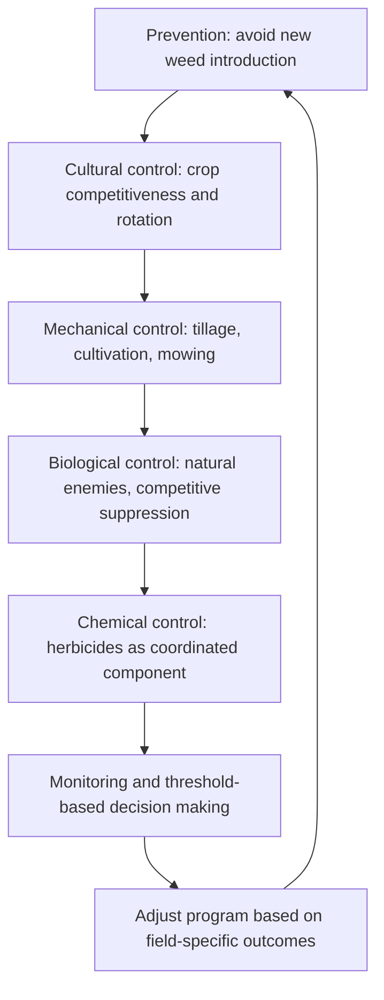
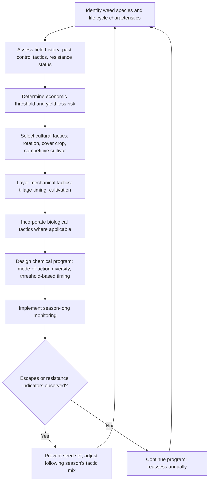

## Integrated Weed Management

### Overview

Integrated weed management (IWM) is a systems-based approach that combines multiple control tactics—cultural, mechanical, biological, and chemical—into a coordinated program designed to achieve sustainable, long-term weed suppression while minimizing reliance on any single method. Rather than pursuing complete weed eradication through one dominant tactic, IWM emphasizes managing weed populations below economically damaging thresholds while reducing selection pressure that drives herbicide resistance and preserving the long-term efficacy of all available control tools.

**Key Points**

- IWM integrates preventive, cultural, mechanical, biological, and chemical tactics into a single coordinated strategy rather than relying on any one method in isolation.
- The approach targets weeds across multiple points in their life cycle simultaneously—seed bank, germination, seedling establishment, and reproduction—rather than addressing only visible mature plants.
- Effective IWM requires field-specific planning informed by weed species identification, life cycle biology, economic thresholds, and site history rather than standardized, one-size-fits-all programs.

---

### Foundational Principles of IWM

#### The Weed Management Hierarchy

IWM is often conceptualized as a hierarchy of tactics addressing weed populations at successive stages, from preventing introduction through to controlling established plants.

- **Prevention**: Excluding new weed species or genotypes (including herbicide-resistant biotypes) from entering a field via clean seed, equipment sanitation, and controlled field-margin management.
- **Cultural control**: Manipulating the cropping system (rotation, cover crops, competitive cultivars, planting density) to favor crop competitiveness over weed establishment.
- **Mechanical control**: Physical disruption of weed structures through tillage, cultivation, mowing, or hand removal.
- **Biological control**: Utilizing natural enemies (insects, pathogens) or competitive plant suppression to reduce weed vigor and reproduction.
- **Chemical control**: Herbicide use integrated as one component of the broader program rather than the sole management tactic.

#### Multiple Points of Attack

A central IWM principle is targeting weed populations at multiple life cycle stages simultaneously, since no single tactic typically achieves complete control across all stages, growth conditions, and weed species present in a given field.

$$Total \, Suppression = 1 - \prod_{i=1}^{n}(1 - E_i)$$

Where $E_i$ represents the efficacy (as a proportion) of each individual tactic $i$ applied within the program. This illustrates how combining multiple moderately effective tactics can achieve substantially higher cumulative suppression than any single tactic alone, even when no individual method provides complete control. [Inference: this multiplicative model represents a simplified conceptual framework assuming independence between tactics; actual field outcomes depend on interaction effects, timing coordination, and weed species-specific responses that may not strictly follow this idealized relationship.]

---

### Weed Identification and Field Assessment as a Foundation

Effective IWM program design begins with accurate characterization of the weed community present in a given field, since tactic selection depends heavily on species-specific biology.

#### Field Scouting and Mapping

- Systematic field scouting at multiple points across the growing season identifies weed species composition, density, and spatial distribution patterns.
- Mapping persistent weed patches over multiple seasons helps distinguish site-specific problem areas (often correlating with soil type, drainage, or field history) from generalized field-wide pressure.

#### Economic Threshold Concepts

Rather than pursuing complete weed elimination, IWM decision-making often incorporates economic threshold concepts, weighing the cost of control intervention against the expected yield loss from allowing a given weed density to persist.

$$Economic \, Threshold = \frac{Cost \, of \, Control}{(Yield \, Loss \, per \, Unit \, Weed \, Density) \times (Crop \, Value)}$$

[Inference: specific economic threshold values are highly crop-, region-, and season-specific, varying with commodity prices, control costs, and weed competitive ability, so published threshold figures should be treated as general guidance requiring local adaptation rather than fixed universal values.]

---

### Integrating Cultural Tactics

Cultural practices form the preventive and competitive foundation of an IWM program, reducing weed pressure before mechanical or chemical intervention becomes necessary.

- **Crop rotation**: Diversifying planting dates and crop growth habits disrupts weed life cycle synchrony and prevents any single weed species from becoming dominant under consistent management conditions.
- **Cover cropping**: Provides competitive suppression, allelopathic effects, and post-termination mulch suppression, reducing weed seedling establishment ahead of the primary cash crop.
- **Competitive cultivar and seeding rate selection**: Accelerates crop canopy closure, limiting the resource availability window for weed establishment.
- **Stale seedbed technique**: Deliberately triggers a pre-plant weed flush for removal before crop seeding, reducing active seed bank pressure during the crop's early vulnerable growth stages.

---

### Integrating Mechanical Tactics

Mechanical methods provide non-chemical control options and serve as essential resistance management tools when integrated alongside herbicide programs.

- **Tillage timing**: Coordinated with weed seed bank management, balancing burial of surface seed against the germination-triggering effects of soil disturbance.
- **Cultivation**: Interrow and intrarow cultivation targeting weed seedlings during their most vulnerable early growth stages, often coordinated with pre-emergence herbicide timing to address escapes.
- **Mowing and hand-roguing**: Preventing seed production from surviving weeds, particularly important for confirmed or suspected herbicide-resistant individuals that may otherwise contribute resistant genetics to the seed bank.

---

### Integrating Biological Tactics

Biological control within IWM programs typically operates as a longer-term, population-suppressive component rather than providing rapid, complete control.

- **Classical biological control**: Introduction of host-specific natural enemies (insects, pathogens) for invasive or noxious weed species, generally implemented at a regional or landscape scale under regulatory oversight rather than as a routine field-level tactic.
- **Conservation biological control**: Managing field margins and non-crop habitat to support existing natural enemy populations that contribute to background weed seed predation and herbivory.
- **Competitive living mulches and companion planting**: Using additional plant species to occupy ecological niches that would otherwise be available for weed establishment.

[Unverified: the magnitude of population suppression achieved through biological control varies substantially by target weed species, natural enemy establishment success, and regional conditions, and specific efficacy claims should be evaluated against locally validated research rather than general assumptions.]

---

### Integrating Chemical Tactics Within IWM

Herbicides remain a valuable and often necessary IWM component, but their role is deliberately constrained to preserve long-term efficacy.

- **Mode-of-action rotation and tank-mixing**: Reducing single-mechanism selection pressure by diversifying herbicide chemistry across and within seasons.
- **Targeted, threshold-based application**: Applying herbicides based on scouting-informed thresholds rather than calendar-based or preventive blanket application where field conditions do not warrant it.
- **Sequential/layered residual programs**: Combining pre-emergence and post-emergence products with different modes of action to extend the effective control window while distributing resistance selection pressure.

---

### Decision-Making Framework for IWM Program Design

---

### Practical Application Example

**Example**

A grower managing a field with a documented history of ALS-resistant pigweed might design an integrated program beginning with crop rotation to a competitive, canopy-closing crop planted on a different date than the previous season's crop, disrupting the weed's germination synchrony. A cover crop with documented allelopathic suppression could be established ahead of the cash crop, followed by a stale seedbed pass to eliminate an initial weed flush before planting. During the growing season, a pre-emergence herbicide from a mode of action distinct from ALS inhibitors would be layered with a post-emergence tank-mix combining two independently effective, non-ALS modes of action, timed to the weed's early seedling stage. Any surviving escapes would be identified through mid-season scouting and manually removed before flowering to prevent further contribution to the resistant seed bank, with all tactics and outcomes recorded to inform the following season's program adjustments.

**Next Steps**

- Conduct comprehensive field-level weed species identification and life cycle assessment as the foundation for program design.
- Review multi-year field history for herbicide mode-of-action use patterns and any documented or suspected resistance issues.
- Layer at least three distinct tactic categories (cultural, mechanical, chemical, and/or biological) rather than relying predominantly on a single method.
- Establish season-long scouting protocols to inform threshold-based intervention timing rather than calendar-based blanket treatment.
- Maintain detailed records of tactics used and outcomes observed to support continuous program refinement across seasons.

---

### Related Topics

- Weed biology and identification
- Weed life cycles and dispersal
- Cultural weed control methods
- Mechanical weed control
- Chemical weed control and herbicides
- Herbicide resistance management
- Economic thresholds in pest management decision-making