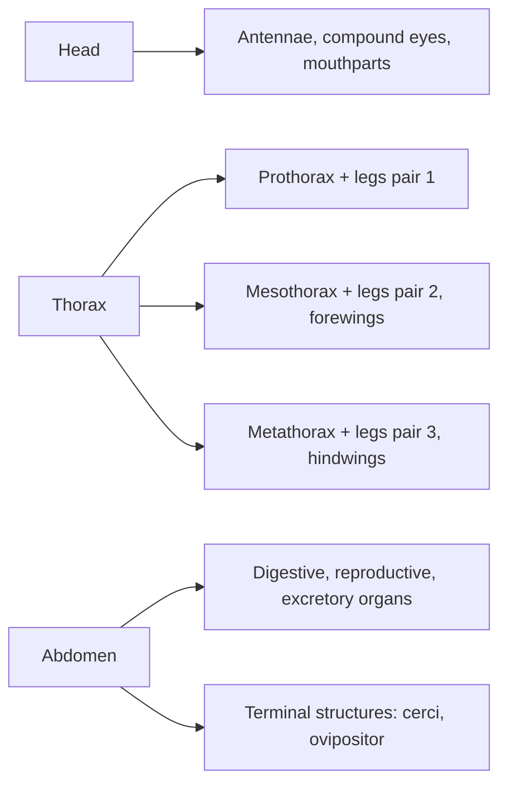
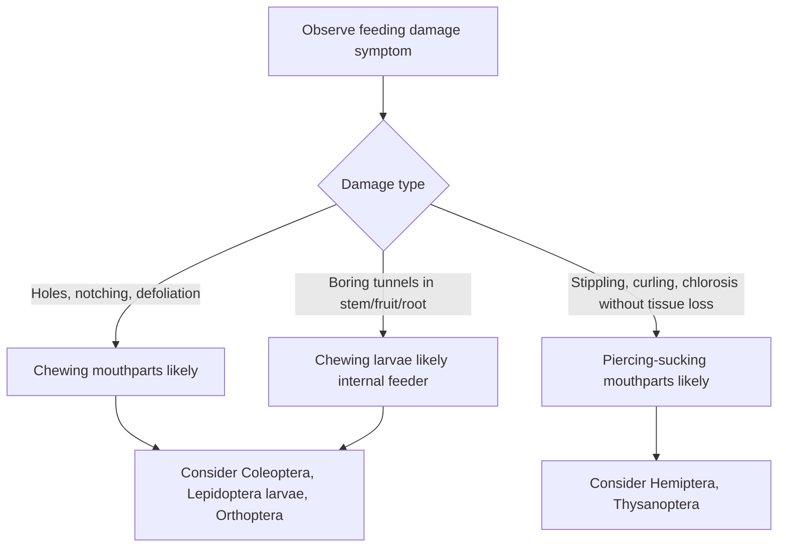
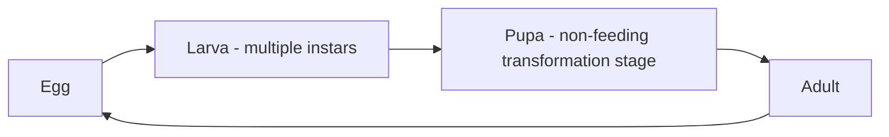

## Insect Anatomy and Classification

### Overview

Insect anatomy and classification form the biological foundation of applied entomology, providing the structural and taxonomic framework necessary for accurate pest identification, understanding feeding damage patterns, and selecting appropriate management interventions. Insects (Class Insecta) represent the most diverse animal group affecting agricultural systems, and their classification into orders based on distinguishing anatomical features directly informs both diagnostic identification and the mode of action selection for control measures targeting specific morphological or physiological vulnerabilities.

**Key Points**

- Insect body organization follows a consistent three-region body plan (head, thorax, abdomen) with paired appendages, though specific structures vary substantially across taxonomic orders.
- Taxonomic classification into orders relies heavily on wing structure, mouthpart type, and metamorphosis pattern, which together predict feeding behavior and life cycle timing relevant to pest management.
- Mouthpart type and metamorphosis pattern are the two most agriculturally significant classification criteria, since they directly determine feeding damage symptoms and the life stage most vulnerable to intervention.

---

### General Insect Body Plan

#### The Three Tagmata (Body Regions)

Insects exhibit a segmented body organized into three primary regions, termed tagmata:

- **Head**: Bears the primary sensory structures (compound eyes, ocelli, antennae) and mouthparts, functioning as the sensory and feeding center.
- **Thorax**: Composed of three segments (prothorax, mesothorax, metathorax), each typically bearing one pair of legs; the mesothorax and metathorax typically bear wings in winged insect groups.
- **Abdomen**: Composed of a variable number of segments (typically up to eleven, though often reduced or modified), housing the majority of digestive, reproductive, and excretory organs, and bearing terminal reproductive/sensory structures (cerci, ovipositor, or other genitalic structures).

#### Exoskeleton and Cuticle

- Insects possess a rigid, chitinous exoskeleton (cuticle) that provides structural support, protection, and attachment points for musculature, requiring periodic molting (ecdysis) to accommodate growth.
- The cuticle's composition and thickness influence susceptibility to certain control agents, including desiccation-based physical controls and contact insecticides requiring cuticular penetration.

#### Respiratory and Circulatory Systems

- **Tracheal system**: Insects respire via a network of internal tubes (tracheae) connected to external openings (spiracles) along the thorax and abdomen, delivering oxygen directly to tissues without reliance on a blood-based oxygen transport system.
- **Open circulatory system**: A dorsal vessel (heart) circulates hemolymph (insect blood equivalent) through an open body cavity (hemocoel) rather than through a closed vessel network, primarily transporting nutrients, hormones, and immune cells rather than respiratory gases.

---

### Antennal Structure and Function

Antennae serve as primary sensory organs for olfaction, and their morphology varies considerably across taxonomic groups, often serving as a useful field identification feature.

| Antennal Type | Description | Example Group |
| --- | --- | --- |
| Filiform | Thread-like, uniform segment width | Many beetles, grasshoppers |
| Clavate | Gradually club-shaped toward the tip | Many beetles (e.g., some scarab groups) |
| Lamellate | Terminal segments expanded into flat plates | Scarab beetles |
| Plumose | Feather-like, heavily branched | Many male moths |
| Geniculate | Elbowed, with a distinct bend | Ants, weevils |

---

### Mouthpart Types and Feeding Damage Correlation

Mouthpart structure is among the most agronomically important classification features, since it directly predicts the type of feeding damage observed on host plants and informs which control tactics (contact vs. systemic, for example) will effectively reach the pest.

#### Chewing Mouthparts

- Composed of mandibles, maxillae, and labium adapted for biting and grinding solid plant tissue.
- Produces characteristic damage symptoms: leaf holes, notching, defoliation, or boring damage into stems, fruit, or roots.
- Found in orders including Coleoptera (beetles), Lepidoptera larvae (caterpillars), and Orthoptera (grasshoppers).

#### Piercing-Sucking Mouthparts

- Modified into an elongated, needle-like stylet bundle capable of penetrating plant tissue to withdraw fluids (typically phloem or cell contents) or, in predatory groups, animal tissue fluids.
- Produces damage symptoms distinct from chewing damage: stippling, chlorosis, curling, or wilting, without visible tissue removal; often associated with transmission of plant pathogens (particularly viruses) during feeding.
- Found in orders including Hemiptera (true bugs, aphids, leafhoppers, whiteflies) and Thysanoptera (thrips, which possess a distinctive asymmetrical rasping-sucking mechanism).

#### Siphoning Mouthparts

- Elongated, coiled proboscis adapted for liquid feeding (typically nectar), found in adult Lepidoptera (butterflies and moths).
- Adults of this group typically cause minimal direct feeding damage to crops, in contrast to their often highly damaging larval (chewing) stage.

#### Sponging Mouthparts

- Adapted for absorbing liquid or semi-liquid food via a spongy labellum, found in many adult Diptera (flies).

---

### Metamorphosis Patterns

Metamorphosis pattern is the second major classification criterion with direct pest management relevance, since it determines which life stages are morphologically and behaviorally distinct, and therefore which stage presents the optimal timing window for intervention.

#### Ametabolous Development

Minimal metamorphosis, where juveniles resemble smaller versions of adults with no distinct larval or pupal stage; largely restricted to primitive, wingless insect groups of limited agricultural significance (e.g., silverfish, Order Zygentoma/Thysanura).

#### Hemimetabolous Development (Incomplete Metamorphosis)

Juveniles (nymphs) resemble adults in general body form but lack fully developed wings and reproductive structures, developing gradually through successive molts (instars) without a distinct pupal stage.

- Nymphs and adults typically occupy the same habitat and feed on the same food sources, meaning both stages may require concurrent management consideration.
- Found in orders including Hemiptera, Orthoptera, and Thysanoptera (though thrips exhibit a modified pattern sometimes termed "incomplete metamorphosis with a pupa-like stage").

#### Holometabolous Development (Complete Metamorphosis)

Development proceeds through four morphologically and often ecologically distinct stages: egg, larva, pupa, and adult, with larvae typically bearing no resemblance to the adult form.

- Larval and adult stages frequently occupy different ecological niches and feed on different food sources or in different manners entirely (e.g., leaf-feeding caterpillar larvae vs. nectar-feeding adult moths), meaning management timing must account for which stage causes economically significant damage.
- The pupal stage is typically non-feeding and often physically protected (in soil, plant tissue, or a silken cocoon), generally representing the least accessible stage for direct control intervention.
- Found in the largest and most agriculturally significant orders: Coleoptera (beetles), Lepidoptera (moths and butterflies), Diptera (flies), and Hymenoptera (bees, wasps, ants).

---

### Major Agriculturally Significant Insect Orders

| Order | Common Name | Mouthparts | Metamorphosis | Agricultural Relevance |
| --- | --- | --- | --- | --- |
| Coleoptera | Beetles | Chewing | Complete | Largest insect order; includes major crop pests (weevils, rootworms) and beneficial predators |
| Lepidoptera | Moths, butterflies | Larvae: chewing; Adults: siphoning | Complete | Larval stage (caterpillars) among the most economically significant defoliating and boring pests |
| Hemiptera | True bugs, aphids, leafhoppers, whiteflies | Piercing-sucking | Incomplete | Major vectors of plant viral pathogens; direct feeding damage via sap withdrawal |
| Diptera | Flies | Larvae: variable; Adults: sponging/piercing | Complete | Includes leafminers, fruit flies, and vectors of plant/animal disease |
| Hymenoptera | Bees, wasps, ants | Chewing to chewing-lapping | Complete | Includes critical pollinators and numerous parasitoid/predatory beneficial species |
| Orthoptera | Grasshoppers, crickets | Chewing | Incomplete | Can cause severe defoliation, particularly during outbreak/swarm conditions |
| Thysanoptera | Thrips | Piercing-sucking (rasping) | Incomplete (modified) | Direct feeding damage plus significant plant virus vector potential |

---

### Practical Application in Diagnostic Identification

**Example**

A scout observing stippled, discolored leaves with fine webbing-like symptoms but no visible chewed tissue would reasonably narrow the diagnostic possibilities toward a piercing-sucking pest (such as a mite, though technically an arachnid rather than a true insect, or a hemipteran such as an aphid or leafhopper) rather than a chewing insect, since the absence of tissue removal is inconsistent with mandibulate feeding damage. Confirming the presence of small, soft-bodied insects clustered on the leaf underside alongside honeydew secretion would further support an aphid identification, informing selection of a systemic or translaminar insecticide capable of reaching a piercing-sucking pest rather than a stomach-poison product requiring ingestion of treated leaf tissue.

**Next Steps**

- Practice field identification of major mouthpart types by correlating observed damage symptoms with insect order characteristics.
- Study metamorphosis patterns for economically significant pest species present in the target cropping system to identify the most vulnerable life stage for intervention timing.
- Develop familiarity with regional diagnostic keys for order- and family-level identification specific to local pest complexes.
- Cross-reference suspected pest identification against documented feeding damage symptoms before selecting a control approach.

---

### Related Topics

- Insect life cycles and developmental stages
- Integrated pest management (IPM) principles
- Insecticide mode of action classification
- Beneficial insects and biological control agents
- Plant virus transmission by insect vectors
- Scouting and monitoring techniques for insect pests
- Economic thresholds in insect pest management