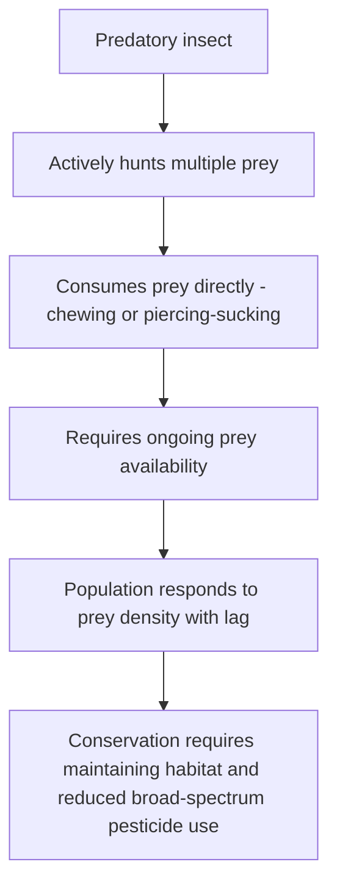
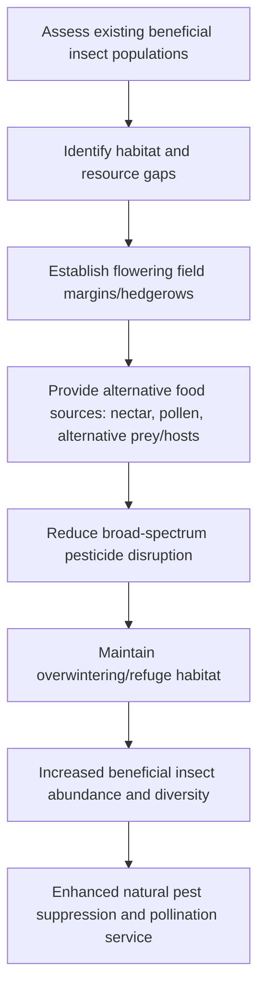

## Beneficial Insects and Pollinators

### Overview

Beneficial insects and pollinators comprise the functional groups within agricultural ecosystems that provide ecosystem services essential to crop production, including natural pest suppression through predation and parasitism, and reproductive services through pollination. Understanding these groups' biology, habitat requirements, and functional roles is essential for designing integrated pest management (IPM) and pollinator conservation programs that preserve these services while managing target pest populations.

**Key Points**

- Beneficial insects are broadly categorized into predators, parasitoids, and pollinators, each providing distinct ecosystem services requiring different conservation and augmentation approaches.
- Conservation biological control (protecting and enhancing existing beneficial populations) and augmentative biological control (releasing additional beneficial organisms) represent complementary strategies within IPM programs.
- Pesticide selectivity, application timing, and habitat management are the primary tools available for protecting beneficial insect populations while still achieving necessary pest control.

---

### Predatory Insects

Predatory insects actively hunt, capture, and consume multiple prey individuals throughout their development, typically consuming many prey items over their lifetime.

#### Major Predatory Groups

- **Coccinellidae (lady beetles)**: Both larval and adult stages are predatory, primarily targeting soft-bodied prey such as aphids, scale insects, and mites; larvae are often less recognizable to growers than the familiar adult form, risking misidentification and unintended harm.
- **Chrysopidae (green lacewings)**: Predatory larvae ("aphid lions") consume aphids, mites, and other soft-bodied prey using specialized piercing mandibles; adults of some species are primarily nectar/pollen feeders rather than predatory.
- **Coccinellidae, Carabidae (ground beetles), and Staphylinidae (rove beetles)**: Ground-dwelling predators targeting soil-surface pests including cutworms, slugs, and various insect eggs and larvae.
- **Syrphidae (hover fly/syrphid fly) larvae**: Predatory on aphids, while adults serve as pollinators, making this family valuable for dual ecosystem service provision.
- **Anthocoridae (minute pirate bugs) and Miridae (predatory plant bugs)**: Piercing-sucking predators targeting thrips, mites, and small soft-bodied insects.
- **Predatory mites** (Phytoseiidae): Though technically arachnids rather than insects, frequently included in beneficial arthropod discussions due to their significant role in suppressing pest mite populations.

---

### Parasitoid Insects

Parasitoids differ fundamentally from predators in their reproductive strategy: rather than consuming multiple prey items directly, a single parasitoid female lays eggs in, on, or near a host insect, and the developing parasitoid larva consumes the host from within or attached externally, ultimately killing the host as development completes.

#### Major Parasitoid Groups

- **Braconidae and Ichneumonidae (parasitic wasps)**: Among the most diverse parasitoid families, attacking a wide range of host insect orders, particularly Lepidoptera larvae and various Hemiptera.
- **Trichogrammatidae**: Extremely small egg parasitoids that develop entirely within host insect eggs, commonly used in augmentative biological control programs against Lepidoptera pests.
- **Aphidiinae (aphid parasitoid wasps)**: Specialize in parasitizing aphids, producing the characteristic swollen, hardened "mummy" aphid carcasses visible in the field as a diagnostic sign of parasitoid activity.
- **Tachinidae (parasitic flies)**: Parasitize a range of host insects, including many caterpillar and beetle species, by depositing eggs or larvae directly on or near the host.

#### Host Specificity and Life Cycle Considerations

Parasitoids often exhibit high host specificity (attacking a narrow range of related host species), which contributes to their value in targeted biological control programs but also means their effectiveness is inherently limited to fields or regions where their specific host is present at sufficient density to sustain the parasitoid population.

$$Parasitism \, Rate \, (\%) = \frac{Number \, of \, Parasitized \, Hosts}{Total \, Hosts \, Sampled} \times 100$$

Parasitism rate is a standard field monitoring metric used to assess natural biological control activity, though [Inference: the relationship between observed parasitism rate and subsequent host population suppression is influenced by timing of sampling relative to parasitoid generation time, and a single-point parasitism rate measurement may not fully predict season-long suppression outcomes].

---

### Pollinators

Pollinators provide the ecosystem service of transferring pollen between flowers, enabling fertilization and fruit/seed set for a substantial proportion of global food crops, particularly fruits, vegetables, nuts, and some oilseed crops.

#### Major Pollinator Groups

- **Apis mellifera (European honey bee)**: The most widely managed agricultural pollinator globally, valued for colony portability, large colony size, and generalist foraging behavior across diverse crop types.
- **Bombus spp. (bumble bees)**: Effective pollinators for certain crops requiring "buzz pollination" (sonication), a technique involving vibration to release pollen from anthers, particularly relevant for crops such as tomatoes and certain berries.
- **Solitary bees** (e.g., Osmia spp./mason bees, Megachile spp./leafcutter bees): Many solitary bee species are highly efficient pollinators for specific crops (e.g., orchard fruits), often requiring less management infrastructure than social honey bee colonies but presenting different habitat and nesting requirements.
- **Syrphid flies, certain beetles, and other insect groups**: Provide supplementary pollination services for a range of crops, though generally considered less efficient per-visit than specialized bee pollinators for most managed crop systems.

#### Pollination Mechanisms and Crop Dependency

| Pollination Dependency Level | Description | Example Crops |
| --- | --- | --- |
| Pollinator-dependent (high) | Yield/fruit set severely reduced without adequate pollinator activity | Almonds, many cucurbits, blueberries |
| Pollinator-benefited (moderate) | Yield/quality improved with pollinator activity but some self- or wind-pollination occurs | Many fruit tree species, canola |
| Pollinator-independent (low) | Primarily self-pollinated or wind-pollinated | Most cereal grains, many legumes |

[Inference: specific dependency classifications and quantified yield benefit percentages vary across published sources and by cultivar, so classification should be treated as general guidance requiring crop-specific verification.]

---

### Conservation Biological Control

Conservation biological control focuses on protecting and enhancing existing populations of naturally occurring beneficial insects already present in and around agricultural fields, rather than introducing additional organisms.

#### Habitat Management Strategies

- **Flowering field margins and hedgerows**: Provide nectar and pollen resources supporting adult stages of many parasitoids and predators (which often require these resources even when larval stages are exclusively predatory or parasitic), while also supporting pollinator populations.
- **Reduced-disturbance refuge areas**: Field margins, cover crop strips, or beetle banks providing overwintering habitat and refuge from disturbance for ground-dwelling predators.
- **Companion and insectary planting**: Deliberate establishment of specific plant species known to support target beneficial insect groups through resource provision or alternative host/prey maintenance.

#### Pesticide Selectivity Considerations

- **Selective/reduced-risk insecticides**: Products with narrower activity spectra or modes of action that spare many beneficial insect groups while controlling target pests, reducing unintended disruption of natural control.
- **Application timing**: Applying pesticides during periods of reduced beneficial insect activity (e.g., early morning or evening for pollinators, or timing relative to beneficial insect life stage vulnerability) can reduce non-target impact.
- **Systemic vs. contact product selection**: Systemic products absorbed into plant tissue may reduce direct contact exposure to foliage-visiting beneficials compared to broad-spectrum contact sprays, though systemic products can present distinct exposure routes (e.g., via pollen or nectar) requiring separate evaluation, particularly for pollinator safety. [Unverified: specific comparative non-target impact data varies substantially by active ingredient, application method, and target beneficial species, so product-specific pollinator and beneficial insect safety data should be consulted directly rather than assuming broad generalizations about systemic versus contact chemistries.]

---

### Augmentative Biological Control

Augmentative biological control involves the deliberate release of commercially reared beneficial insects to supplement naturally occurring populations, typically used when natural populations are insufficient to achieve adequate pest suppression within an economically acceptable timeframe.

- **Inoculative release**: Small-scale release intended to establish a persisting population that continues providing control over an extended period, often used in protected/greenhouse cropping systems with stable environmental conditions.
- **Inundative release**: Large-scale release intended to achieve immediate pest suppression through the released individuals themselves, without expectation of establishing a persisting population, commonly used for rapid response to established pest outbreaks.
- Common commercially available biological control agents include various Trichogramma species (egg parasitoids), predatory mites (Phytoseiidae) for spider mite and thrips control, and certain lacewing and lady beetle species for aphid control.

---

### Managed Pollinator Considerations

#### Honey Bee Colony Management for Crop Pollination

- Commercial pollination services typically involve transporting managed honey bee colonies to coincide with crop bloom timing, requiring coordination between growers and beekeepers regarding colony placement density, timing, and pesticide application scheduling.
- Colony stocking density recommendations vary substantially by crop pollination requirements, with some high-value, highly pollinator-dependent crops requiring considerably higher hive densities per unit area than crops with lower pollination dependency. [Inference: specific stocking density recommendations are crop- and region-specific, developed through applied pollination research, and should be obtained from current regional extension or industry guidance rather than generalized figures.]

#### Protecting Pollinators During Pesticide Application

- Avoiding application during active bloom periods when pollinators are foraging, where feasible given pest management timing constraints.
- Communicating application schedules with commercial beekeepers providing pollination services to allow colony relocation or protective measures where necessary.
- Selecting products and formulations with reduced pollinator toxicity profiles when effective alternatives exist for the target pest, consistent with product label pollinator protection requirements.

---

### Practical Integration Example

**Example**

A grower managing an aphid infestation in a field bordered by an established flowering hedgerow might first assess existing natural enemy activity by sampling for aphid mummies (indicating parasitoid activity) and counting lady beetle or lacewing larvae present, since substantial existing biological control activity might justify a delayed intervention decision consistent with an economic threshold approach. If natural control appears insufficient to prevent economically damaging aphid populations before harvest, the grower might select a selective aphicide with documented reduced impact on parasitoid wasps and predatory beetles rather than a broad-spectrum contact insecticide, preserving the hedgerow-supported beneficial insect population's ongoing contribution to pest suppression in subsequent growth stages and future seasons.

**Next Steps**

- Conduct field scouting to identify existing beneficial insect and pollinator activity before selecting pest control interventions.
- Evaluate field margin and non-crop habitat for opportunities to establish or enhance flowering resources supporting beneficial insect adult stages.
- Review pesticide product labels for beneficial insect and pollinator toxicity data and label-specified application timing restrictions.
- Coordinate pesticide application scheduling with commercial pollination service providers where managed pollinators are present for crop pollination.
- Consider augmentative biological control release for high-value or protected cropping systems where natural beneficial populations are insufficient.

---

### Related Topics

- Insect anatomy and classification
- Integrated pest management (IPM) principles
- Insecticide mode of action and selectivity
- Habitat management and conservation biological control
- Economic thresholds in insect pest management
- Pollination biology and crop-specific pollination requirements
- Insecticide resistance management