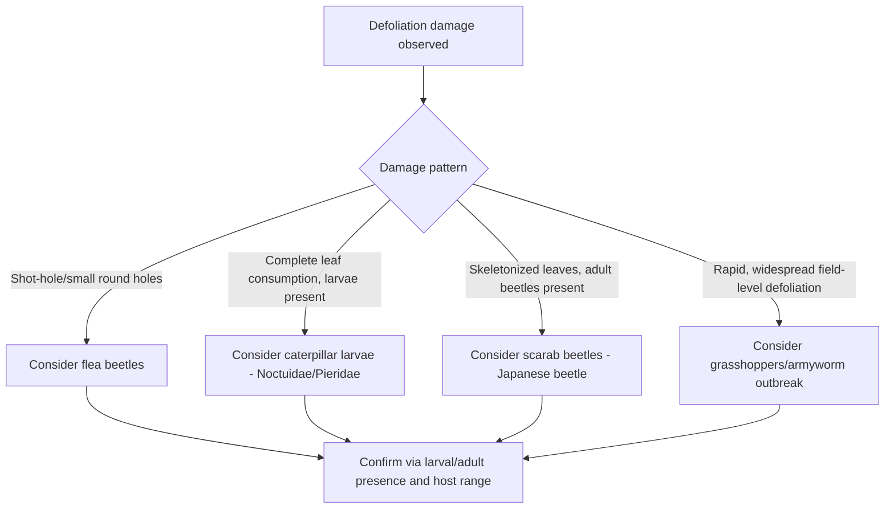
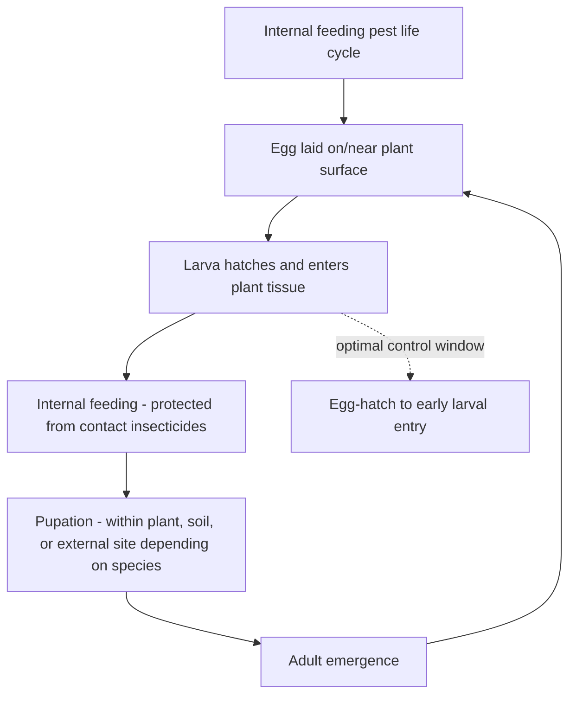

## Major Crop Insect Pests

### Overview

Major crop insect pests represent the economically significant species that recur across agricultural systems worldwide, causing yield loss through direct feeding damage, disease transmission, or product quality degradation. Organizing pest knowledge by feeding guild and taxonomic group—rather than memorizing individual species in isolation—provides a transferable framework for diagnosing new or regional pest problems based on damage symptoms, host range, and life cycle characteristics.

**Key Points**

- Major crop pests are commonly organized by feeding guild (defoliators, sap feeders, borers, root feeders, and fruit/grain feeders), since guild membership predicts damage symptoms and informs scouting and control timing.
- Pest identification should integrate damage symptom observation, host plant range, and regional/seasonal occurrence patterns rather than relying on visual identification alone.
- Many major pests occur across multiple crop families, making cross-crop biological understanding valuable for diversified farming operations.

---

### Defoliating Pests

Defoliators consume leaf tissue through chewing mouthparts, reducing photosynthetic capacity and, at high densities, causing complete plant defoliation.

#### Lepidopteran Defoliators

- **Armyworms and cutworms** (Family Noctuidae): Larvae feed on foliage and, in cutworm species, can sever seedling stems at or near the soil surface; many species exhibit periodic outbreak population dynamics, sometimes migrating in large numbers ("armyworm" behavior) across fields.
- **Loopers and cabbage worms** (various Noctuidae and Pieridae): Common defoliators of brassica and other broadleaf crops, identifiable partly by characteristic looping locomotion in looper species due to reduced abdominal prolegs.
- **Hornworms** (Family Sphingidae): Large larvae causing substantial defoliation in solanaceous crops (tomato, tobacco, pepper), notable for their size and characteristic posterior horn structure.

#### Coleopteran Defoliators

- **Flea beetles** (Family Chrysomelidae): Small beetles producing characteristic "shot-hole" feeding damage on leaves; larvae of some species feed on roots, creating dual above- and below-ground damage potential.
- **Colorado potato beetle**: A well-documented example of both adult and larval defoliation occurring on the same host plants (solanaceous crops), with the species widely referenced for its capacity to develop resistance to multiple insecticide modes of action.
- **Japanese beetle and related scarabs**: Adults cause skeletonized leaf damage across a broad host range, while larvae (white grubs) feed on plant roots, particularly in turf and pasture settings.

#### Orthopteran Defoliators

- **Grasshoppers**: Capable of causing severe, rapid defoliation during outbreak conditions, with feeding damage spanning a wide host range across grain, forage, and vegetable crops.

---

### Sap-Feeding Pests

Sap feeders use piercing-sucking mouthparts to withdraw plant fluids, causing direct feeding damage (stippling, curling, chlorosis) and, significantly, serving as primary vectors for numerous plant pathogens, particularly viruses.

#### Aphids (Family Aphididae)

- Cause direct damage through fluid withdrawal and honeydew secretion (which promotes secondary sooty mold growth), and represent among the most significant plant virus vectors across nearly all major crop groups.
- Reproductive biology often includes parthenogenetic (asexual) reproduction during favorable conditions, enabling rapid population increase within a single growing season.
- Winged (alate) forms develop under crowding or host quality decline, enabling dispersal to new host plants and facilitating virus spread across a field or region.

#### Whiteflies (Family Aleyrodidae)

- Piercing-sucking pests causing direct feeding damage and honeydew-associated sooty mold, while also serving as vectors for economically significant plant viruses (particularly in vegetable and fiber crops).
- Populations can develop insecticide resistance rapidly under intensive chemical control programs, making resistance management a persistent consideration for this group.

#### Leafhoppers and Planthoppers (Families Cicadellidae, Delphacidae, and related)

- Cause direct feeding injury (including a characteristic damage symptom termed "hopperburn" in some species, presenting as leaf margin browning) and transmit various plant pathogens including phytoplasmas and viruses.

#### Thrips (Order Thysanoptera)

- Rasping-sucking mouthparts cause characteristic silvering, stippling, or scarring damage on leaf and fruit surfaces, and thrips serve as vectors for economically significant plant viruses (notably tospoviruses) in numerous vegetable and ornamental crops.

#### Scale Insects and Mealybugs (Superfamily Coccoidea)

- Sessile or limited-mobility sap feeders causing direct feeding damage and honeydew secretion, particularly significant in perennial tree, vine, and ornamental crops; some species produce protective waxy coverings complicating contact insecticide efficacy.

---

### Boring Pests

Boring pests feed internally within plant structures (stems, fruit, roots, or trunks), often causing damage disproportionate to their visible external presence and presenting distinct control challenges due to their protected feeding location.

#### Stem and Stalk Borers

- **European corn borer and related stalk borers**: Larvae tunnel within plant stems, disrupting vascular transport and structural integrity, with internal feeding location limiting the efficacy of contact-only control measures applied after larval entry.
- **Squash vine borer**: Larvae bore into cucurbit stems near the base, often causing sudden plant wilting that can be misattributed to disease or water stress without stem examination.

#### Fruit and Grain Borers

- **Codling moth**: Larvae bore into pome fruit (apple, pear), feeding internally and rendering fruit unmarketable; a well-documented example requiring precisely timed control intervention targeting the egg-hatch to early larval entry window before internal feeding begins.
- **Corn earworm/bollworm** (a species with substantial cross-crop significance across corn, cotton, and other hosts): Larvae feed within developing ears, bolls, or fruiting structures.

#### Root and Below-Ground Borers/Feeders

- **Wireworms** (larval click beetles, Family Elateridae): Feed on seeds, roots, and below-ground stem tissue, causing stand establishment failure in various row crops; larval stages can persist in soil for multiple years, complicating rotation-based management timing.
- **Rootworms** (various Chrysomelidae, notably corn rootworm species): Larvae feed on root tissue, causing lodging and water/nutrient uptake impairment; well-documented for regional adaptation to crop rotation as a control tactic in some populations.

---

### Below-Ground and Soil-Dwelling Pests

- **White grubs** (larval scarab beetles): Feed on plant roots, particularly significant in turf, pasture, and some row crop establishment.
- **Wireworms**: As noted above, persistent multi-year soil-dwelling larvae feeding on seeds and roots.
- **Root maggots** (various Diptera, e.g., seedcorn maggot, cabbage maggot): Larvae feed on germinating seeds or root tissue, often most damaging under cool, wet establishment conditions that slow crop emergence and extend larval feeding exposure.

---

### Storage and Post-Harvest Pests

- **Grain weevils and beetles** (e.g., various Curculionidae, Bostrichidae, Tenebrionidae): Infest stored grain and grain products, causing direct consumption loss and quality degradation through contamination.
- **Stored product moths** (e.g., Indian meal moth): Larvae feed within stored grain, flour, and related products, with webbing and frass contamination contributing to additional quality loss beyond direct consumption.

---

### Pest Identification and Monitoring Framework

#### Integrating Damage Symptoms with Host Range and Timing

| Feeding Guild | Primary Damage Symptom | Typical Detection Method |
| --- | --- | --- |
| Defoliators | Leaf tissue loss, holes, skeletonization | Visual scouting, sweep netting |
| Sap feeders | Stippling, curling, honeydew, virus symptoms | Visual scouting, sticky traps, tap sampling |
| Borers | Internal tunneling, wilting, entry/exit holes with frass | Pheromone trapping, plant dissection |
| Root/soil feeders | Stand loss, wilting, lodging, root pruning | Soil sampling, bait traps |
| Storage pests | Product contamination, webbing, adult presence in storage | Trap monitoring within storage facilities |

#### Pheromone and Trap-Based Monitoring

Many economically significant Lepidopteran and Coleopteran pests can be monitored using species-specific pheromone lures paired with trapping devices, enabling detection of adult flight activity and informing the timing of scouting or intervention relative to anticipated egg-laying and larval hatch periods. [Inference: specific trap catch thresholds correlating with economically damaging populations vary by species, region, and trap type, requiring calibration against locally validated degree-day or threshold models rather than universal trap count benchmarks.]

---

### Practical Diagnostic Approach

**Example**

A scout encountering wilted individual plants scattered within an otherwise healthy cucurbit field, without a uniform field-wide wilting pattern suggesting disease or water stress, might reasonably suspect a boring pest given the localized, individual-plant symptom pattern; examining the stem base for entry holes and characteristic frass (sawdust-like excrement) would help distinguish squash vine borer infestation from a root or vascular disease presenting with similar above-ground wilting symptoms, directing subsequent management toward the appropriate borer-specific intervention rather than a fungicide-based response.

**Next Steps**

- Develop familiarity with the dominant pest feeding guilds present in the target cropping system and region, prioritizing species with documented economic significance for the specific crops grown.
- Establish routine scouting protocols matched to each major pest's detection method (visual scouting, pheromone trapping, soil sampling) and life cycle timing.
- Cross-reference observed damage symptoms against host plant range and regional occurrence data before finalizing pest identification.
- Consult regional extension resources for locally validated economic thresholds and degree-day models specific to major pests in the target production area.

---

### Related Topics

- Insect anatomy and classification
- Integrated pest management (IPM) principles
- Insecticide mode of action classification
- Plant virus transmission by insect vectors
- Economic thresholds in insect pest management
- Scouting and monitoring techniques for insect pests
- Insecticide resistance management