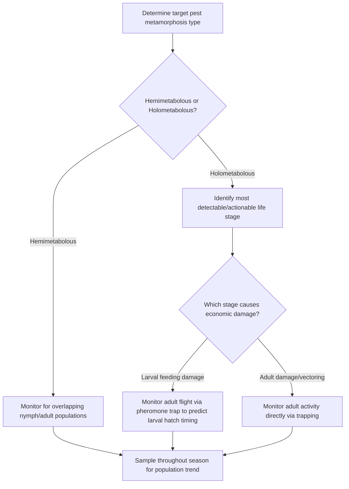
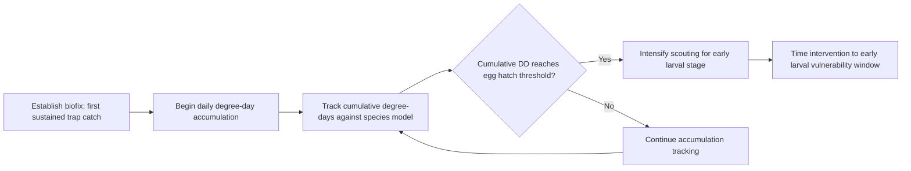
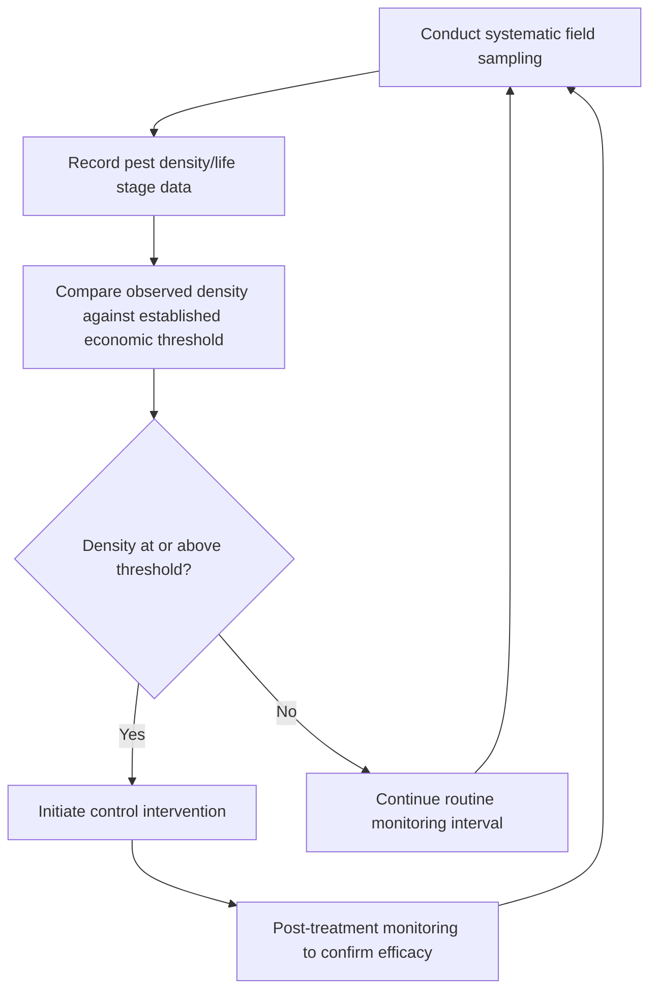

## Insect Life Cycles and Monitoring

### Overview

Insect life cycles and monitoring together form the operational backbone of applied pest management, translating biological knowledge of development and reproduction into actionable field scouting and decision-making protocols. Understanding how environmental factors (particularly temperature) drive developmental timing allows practitioners to predict pest life stage occurrence, while systematic monitoring techniques provide the empirical data needed to time interventions precisely and evaluate whether populations warrant control action.

**Key Points**

- Insect development rate is strongly temperature-dependent, enabling degree-day modeling to predict life stage timing and inform intervention windows.
- Monitoring techniques must be matched to target pest biology (mobile vs. sessile, day vs. night active, above-ground vs. soil-dwelling) to generate representative population data.
- Effective monitoring programs combine systematic sampling protocols with economic threshold interpretation to support objective, data-driven treatment decisions rather than calendar-based or reactive-only approaches.

---

### Life Cycle Patterns Relevant to Monitoring Timing

#### Hemimetabolous (Incomplete Metamorphosis) Monitoring Implications

Species with gradual, incomplete metamorphosis (egg to nymph to adult, without a pupal stage) present overlapping generations and co-occurring nymphal and adult stages within a field at a given time, meaning monitoring programs must often account for multiple simultaneously present life stages rather than a single discrete generation.

#### Holometabolous (Complete Metamorphosis) Monitoring Implications

Species with complete metamorphosis (egg, larva, pupa, adult) present temporally and often spatially distinct life stages, meaning monitoring strategy must target the specific stage most detectable and most relevant to the intervention decision.

---

### Temperature-Driven Development and Degree-Day Modeling

#### Degree-Day Concept

Insect development rate correlates strongly with accumulated heat over time rather than calendar days alone, since insects are ectothermic and their metabolic and developmental processes are directly temperature-dependent. Degree-day (also termed heat unit or growing degree-day) accumulation models translate daily temperature data into a standardized developmental progress metric.

$$DD = \frac{T_{max} + T_{min}}{2} - T_{base}$$

Where $T_{max}$ and $T_{min}$ are the daily maximum and minimum temperatures, and $T_{base}$ is the species-specific developmental threshold temperature below which development does not proceed. Daily degree-day values are summed across the season (or from a defined biofix date) to track cumulative heat accumulation.

$$DD_{cumulative} = \sum_{i=1}^{n} DD_i$$

#### Upper Developmental Thresholds

Many degree-day models also incorporate an upper threshold temperature, above which development rate plateaus or declines rather than continuing to increase linearly, since extreme heat can impair rather than accelerate insect physiological processes. [Inference: the specific upper threshold value and the shape of the development-temperature relationship above that threshold vary by species and are derived from species-specific laboratory rearing studies, so models should be sourced from validated regional or species-specific research rather than assumed universally.]

#### Biofix and Model Application

- A **biofix** (biological fixed point, such as first sustained adult trap catch or first observed egg mass) establishes the starting date from which degree-day accumulation begins for a given season and location, since absolute calendar dates vary in biological relevance across years with different weather patterns.
- Degree-day accumulation from the biofix is then compared against published developmental thresholds (e.g., degree-days required from egg hatch to a specific larval instar) to predict the timing of vulnerable life stages, directly informing optimal scouting intensification or intervention timing windows.

**Example**

If a species' published degree-day model indicates egg hatch begins at approximately 100 degree-days (base temperature 10°C) after a pheromone trap-established biofix, a scout would begin daily degree-day accumulation from the biofix date and intensify field scouting for early larval presence as cumulative accumulation approaches that threshold, rather than relying on a fixed calendar date that may not align with actual biological development in a season with atypical temperature patterns.

---

### Monitoring Techniques by Pest Biology

#### Pheromone Trapping

- Uses species-specific synthetic sex pheromone lures to attract and capture adult males (in most commercially available lure systems), providing a relative index of adult flight activity and population presence.
- Primarily useful for establishing biofix timing, detecting first seasonal occurrence, and tracking relative population trends across a season rather than providing direct absolute population density estimates.
- Trap placement (height, spacing, orientation relative to field edges and prevailing wind) and lure maintenance (replacement interval) significantly influence catch consistency and require adherence to species-specific protocols. [Unverified: specific trap catch threshold values correlating to economically significant populations are species-, region-, and trap-design-specific, and current locally validated thresholds should be obtained from regional extension resources rather than generalized figures.]

#### Sticky Traps (Yellow/Blue Card Traps)

- Yellow sticky traps are broadly attractive to numerous flying pest groups including aphids, whiteflies, leafhoppers, and various small Diptera, providing a general index of flying pest activity and dispersal timing.
- Blue sticky traps show enhanced attraction for thrips in many production systems, providing a more targeted monitoring tool for that specific pest group.
- Useful for detecting the onset of pest colonization/dispersal flights, particularly relevant for timing intervention against vector species before disease transmission occurs.

#### Visual Scouting and Sweep Netting

- **Direct visual counts**: Systematic examination of a defined number of plants or plant parts per sampling unit, recording pest presence, life stage, and density; essential for pests not effectively captured by trapping methods (e.g., many sessile scale insects, mites, and larvae feeding within protected plant structures).
- **Sweep netting**: A standardized number of net sweeps through crop canopy (particularly effective in field crops and forage) provides a relative density index for mobile insects including many Hemiptera, Orthoptera, and adult beetle populations.

#### Soil Sampling and Baiting

- Soil core sampling or bait trap deployment (e.g., buried bait stations for wireworm detection) provides population indices for below-ground pests not detectable through above-ground visual scouting.
- Timing of soil sampling relative to soil temperature and moisture conditions affects detection accuracy, since many soil-dwelling pests exhibit vertical movement within the soil profile in response to these factors.

#### Beat Sheet Sampling

- Vigorous shaking or striking of plant foliage over a collection sheet dislodges and collects insects for direct counting, particularly useful for pests that drop or feign death when disturbed (many beetle species) or that are otherwise difficult to count via direct visual observation on the plant.

---

### Sampling Design Considerations

#### Sample Size and Field Representativeness

Effective monitoring requires a sampling protocol sufficient to represent actual field-wide population density and distribution, since insect populations frequently exhibit clustered or edge-concentrated spatial distribution patterns rather than uniform dispersal across a field.

$$Sample \, Adequacy = f(\text{number of sampling points}, \text{spatial distribution pattern}, \text{field size and variability})$$

- **Systematic/grid sampling**: Sampling points distributed at regular intervals across the field, providing broad spatial representation.
- **Edge-weighted sampling**: Additional sampling concentrated near field margins, appropriate for pests known to exhibit edge-biased colonization patterns (common for many immigrating pest species).
- **Random sampling**: Points selected without a predetermined pattern, reducing potential bias from unconsciously selecting visually conspicuous or convenient sampling locations.

#### Sampling Frequency

Sampling interval should be matched to the target pest's generation time and population growth rate, since pests with short generation times and high reproductive rates (e.g., aphids under favorable conditions) can shift from below-threshold to above-threshold densities within a relatively short interval, requiring more frequent monitoring than slower-developing species.

---

### Integrating Monitoring Data with Threshold-Based Decisions

- **Economic threshold**: The pest density at which control intervention becomes economically justified, based on the anticipated cost of control relative to the value of yield loss prevented; monitoring data provides the empirical density estimate compared against this threshold.
- **Economic injury level**: The pest density at which economic damage first equals the cost of control, generally set slightly above the economic threshold to account for the time lag between detection and intervention implementation.

[Inference: published economic thresholds for a given pest-crop combination are typically derived from regional research trials under specific conditions, and actual local thresholds may require adjustment for current commodity prices, control costs, and cultivar-specific tolerance, so monitoring programs should reference current regional extension guidance rather than static historical threshold values.]

---

### Record-Keeping and Trend Analysis

Maintaining season-over-season and field-level monitoring records supports several management functions beyond immediate treatment decisions:

- Identifying recurring problem areas within fields (often correlating with soil type, drainage, or field history) that may warrant targeted cultural or preventive intervention.
- Tracking the effectiveness of implemented control tactics across seasons to inform program adjustments.
- Supporting resistance management by correlating control failures with specific product or mode-of-action use history.
- Informing degree-day model refinement and biofix timing for subsequent seasons based on observed correlation between predicted and actual life stage occurrence.

---

### Practical Application Example

**Example**

A grower monitoring for a Lepidopteran pest with a documented degree-day model might deploy pheromone traps at the start of the season to establish a biofix upon first sustained adult catch, then track daily degree-day accumulation from that date using local weather station data. As cumulative degree-days approach the published threshold for egg hatch, the grower would intensify visual scouting specifically for early larval instars on a systematic sampling schedule across representative field zones, comparing observed larval density against the regionally established economic threshold before deciding whether an insecticide application is warranted, rather than applying treatment on a fixed calendar date that may not align with actual pest development in a given season's specific weather pattern.

**Next Steps**

- Identify degree-day models and base temperature thresholds published for the major pest species relevant to the target cropping system and region.
- Establish appropriate trapping or scouting-based biofix determination methods for key pests at the start of each season.
- Match monitoring technique (pheromone trap, sticky trap, visual scouting, soil sampling) to each target pest's specific biology and detectability characteristics.
- Develop a systematic sampling protocol (method, frequency, spatial design) appropriate to field size and pest population dynamics.
- Maintain detailed monitoring records across seasons to refine local threshold interpretation and evaluate control program effectiveness over time.

---

### Related Topics

- Insect anatomy and classification
- Major crop insect pests
- Integrated pest management (IPM) principles
- Economic thresholds in insect pest management
- Insecticide mode of action classification
- Beneficial insects and pollinators
- Insecticide resistance management