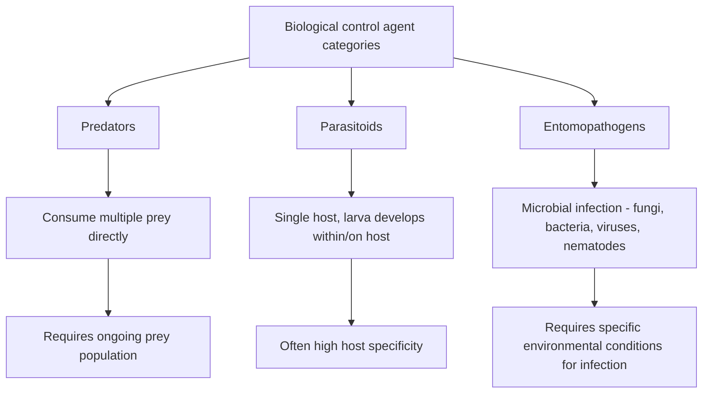
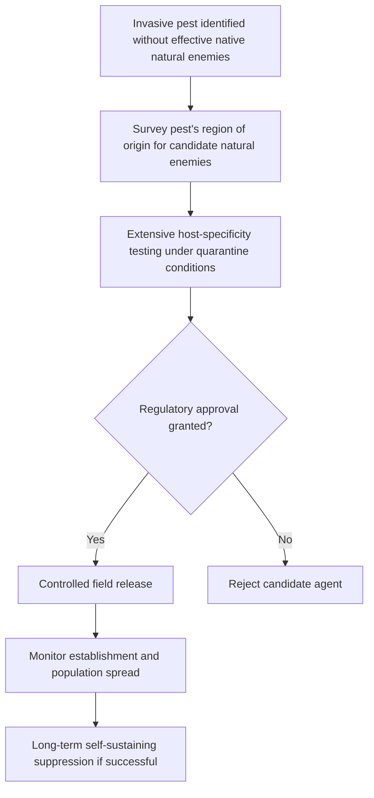
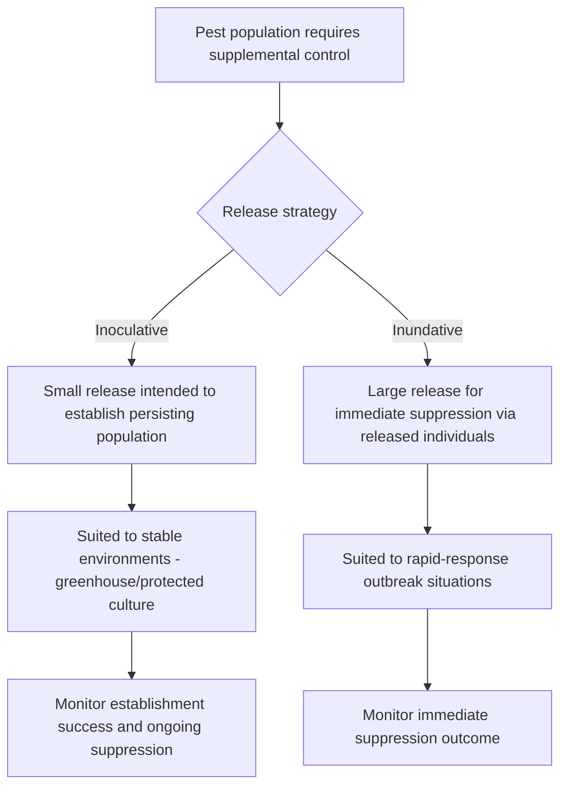

## Biological Control Agents

### Overview

Biological control agents are living organisms—predators, parasitoids, and pathogens—deployed or conserved to suppress pest populations through natural antagonistic interactions rather than chemical intervention. Biological control operates through three principal strategic approaches (classical, conservation, and augmentative), each differing in implementation method, regulatory context, and expected population-level outcome, together forming a core pillar of integrated pest management (IPM) programs seeking to reduce chemical input reliance while maintaining effective pest suppression.

**Key Points**

- Biological control agents fall into three functional categories: predators (consume multiple prey), parasitoids (develop within/on a single host, ultimately killing it), and entomopathogens (disease-causing microorganisms).
- Three implementation strategies—classical, conservation, and augmentative biological control—differ fundamentally in approach, timescale, and regulatory requirements.
- Successful biological control implementation requires understanding agent-specific environmental requirements, host/prey specificity, and compatibility with other IPM program components, particularly pesticide selection.

---

### Functional Categories of Biological Control Agents

#### Predators

Predatory organisms actively hunt and consume multiple prey individuals throughout development, generally requiring ongoing prey availability to sustain their own population.

- **Insect predators**: Lady beetles (Coccinellidae), lacewings (Chrysopidae), predatory bugs (Anthocoridae, Miridae), ground beetles (Carabidae), and syrphid fly larvae, among many others.
- **Predatory mites** (Phytoseiidae): Frequently included in biological control discussions despite being arachnids rather than insects, due to their substantial role in suppressing pest mite and thrips populations.
- **Predatory nematodes and other soil organisms**: Contribute to suppression of soil-dwelling pest life stages in some systems.

#### Parasitoids

Parasitoids exhibit a distinct reproductive strategy in which a single female deposits eggs in, on, or near a host insect; the developing parasitoid larva consumes the host, typically resulting in host death upon or before parasitoid maturation.

- **Parasitic wasps** (Braconidae, Ichneumonidae, Trichogrammatidae, Aphidiinae, and others): The most diverse and commercially significant parasitoid group, often exhibiting high host specificity.
- **Parasitic flies** (Tachinidae): Parasitize a range of hosts, particularly Lepidopteran and Coleopteran larvae, via egg or larval deposition on or near the host.

#### Entomopathogens

Entomopathogens are microorganisms that cause disease in insect hosts, generally requiring specific environmental conditions (moisture, temperature, UV exposure) for effective infection and persistence.

- **Entomopathogenic fungi** (e.g., *Beauveria bassiana*, *Metarhizium anisopliae*): Infect hosts through direct cuticular penetration rather than ingestion, generally requiring adequate humidity for spore germination and infection to proceed effectively.
- **Entomopathogenic bacteria** (e.g., *Bacillus thuringiensis*/Bt): Produce insecticidal crystal proteins that must be ingested by the target host, with different Bt subspecies/strains exhibiting activity against specific insect orders (e.g., certain strains selective for Lepidoptera, others for Coleoptera or Diptera).
- **Entomopathogenic viruses** (e.g., various nucleopolyhedroviruses): Highly host-specific pathogens requiring ingestion, often used for targeted control of specific Lepidopteran pests with minimal non-target impact.
- **Entomopathogenic nematodes** (e.g., *Steinernema* and *Heterorhabditis* species): Soil-dwelling nematodes that actively seek out and infect soil-dwelling insect hosts, often in symbiotic association with pathogenic bacteria that complete the lethal infection process.

---

### Classical Biological Control

Classical biological control involves the deliberate introduction of a natural enemy—typically sourced from the pest's region of origin—to establish a permanent, self-sustaining population that provides long-term suppression of an invasive or introduced pest species.

#### Key Characteristics

- Generally targets invasive pest species that have escaped their natural enemy complex upon introduction to a new region, allowing unchecked population growth in the absence of co-evolved natural enemies.
- Implementation occurs at a regional or landscape scale rather than a field-specific basis, since the goal is establishing a persisting, self-sustaining natural enemy population.
- Requires extensive pre-release host-specificity testing and regulatory approval to minimize the risk of non-target effects on native or beneficial species, given that introduced agents cannot be readily recalled once established.

[Inference: the timeline from initial candidate agent identification through regulatory approval and confirmed field establishment for classical biological control programs is typically measured in years, reflecting the extensive testing and monitoring required, though specific program timelines vary considerably by target pest, agent, and regulatory jurisdiction.]

---

### Conservation Biological Control

Conservation biological control focuses on protecting, supporting, and enhancing existing populations of naturally occurring beneficial organisms already present within and around agricultural fields, rather than introducing additional organisms.

#### Habitat and Resource Management

- **Flowering field margins and insectary plantings**: Provide nectar and pollen resources supporting adult stages of many parasitoids and predators, since many species require these supplementary food sources even when their immature stages are exclusively predatory or parasitic.
- **Reduced-disturbance refuge habitat**: Field margins, beetle banks, and cover crop strips providing overwintering sites and disturbance refuge for ground-dwelling predators.
- **Alternative prey/host maintenance**: Non-crop vegetation supporting alternative prey or host populations can sustain beneficial organism populations during periods of low target pest density, preventing local extinction of the beneficial population between pest outbreaks.

#### Pesticide Compatibility

- Selective or reduced-risk pesticide products with narrower activity spectra can spare many beneficial organism groups while still achieving target pest control, reducing unintended disruption of existing biological control activity.
- Application timing adjustments (targeting periods of reduced beneficial organism activity, or coordinating with beneficial organism life stage vulnerability) can further reduce non-target impact.

---

### Augmentative Biological Control

Augmentative biological control involves the deliberate release of commercially reared and purchased biological control agents to supplement or substitute for insufficient natural populations, typically implemented at the field or greenhouse level as an active management input.

#### Inoculative Release

- Involves releasing a relatively small number of biological control agents with the intent of establishing a population that persists and continues providing suppression over an extended period within a single season or cropping cycle.
- Commonly used in protected cultivation (greenhouse) systems where relatively stable environmental conditions support sustained agent population establishment.

#### Inundative Release

- Involves releasing large numbers of biological control agents with the intent of achieving immediate pest suppression through the released individuals themselves, without expectation of long-term population establishment.
- Commonly used for rapid-response control of an already-established pest outbreak, functioning conceptually similar to a biological pesticide application.

#### Commercially Available Agent Examples

| Agent Type | Example | Target Pest Group |
| --- | --- | --- |
| Egg parasitoid | *Trichogramma* spp. | Lepidopteran eggs |
| Predatory mite | *Phytoseiulus persimilis* | Spider mites |
| Predatory mite | *Neoseiulus* (formerly *Amblyseius*) spp. | Thrips, spider mites |
| Parasitic wasp | *Aphidius* spp. | Aphids |
| Predatory beetle | *Delphastus* spp. | Whiteflies |
| Entomopathogenic nematode | *Steinernema* spp. | Soil-dwelling larvae (e.g., fungus gnat larvae, some weevil larvae) |
| Bacterial biopesticide | *Bacillus thuringiensis* (Bt) | Various Lepidoptera, Coleoptera, or Diptera depending on strain |

[Unverified: specific commercially available species and strain availability varies by region and supplier, and current product-specific efficacy and application guidance should be obtained directly from suppliers or regional extension resources rather than assumed from general reference lists.]

---

### Environmental Requirements and Application Considerations

#### Entomopathogen-Specific Environmental Sensitivity

- **Fungal pathogens**: Generally require elevated humidity for spore germination and cuticular penetration, with efficacy often reduced under dry field conditions unless applied with irrigation timing coordination or in naturally humid microclimates (e.g., dense canopy environments).
- **Bacterial pathogens (Bt)**: Require ingestion by the target host and are generally susceptible to UV degradation on leaf surfaces, often necessitating repeated application intervals under high UV exposure conditions and precise timing to coincide with actively feeding larval stages.
- **Nematodes**: Require adequate soil moisture for movement and host-seeking behavior, with efficacy substantially reduced under dry soil conditions; application timing often coordinated with irrigation to maintain suitable moisture during the nematode's infective window.

#### Host/Prey Specificity Considerations

Biological control agents vary considerably in host or prey range, from highly specific (attacking only one or a few closely related species) to broadly generalist. Highly specific agents offer reduced non-target risk but are correspondingly limited to situations where their specific target pest is the primary concern, while generalist predators provide broader pest suppression potential but may also exert some predation pressure on other beneficial organisms present in the system.

---

### Integration with Chemical Control

Compatibility between biological control agents and any concurrently used chemical pesticides is a critical program design consideration, since many conventional insecticides exhibit toxicity to beneficial organisms alongside target pests.

$$Program \, Compatibility = f(\text{pesticide selectivity}, \text{application timing}, \text{residual activity duration})$$

- Selecting pesticide products with documented reduced toxicity to the specific biological control agents in use, where effective alternatives exist for the target pest.
- Timing chemical applications to avoid periods immediately following augmentative release, allowing established agent populations time to persist before potential pesticide exposure.
- Considering residual activity duration of applied chemical products, since extended residual toxicity can continue impacting biological control agents introduced or naturally present after the initial application.

---

### Practical Implementation Example

**Example**

A greenhouse tomato producer experiencing early-season whitefly colonization might implement an inoculative release of a whitefly-specific parasitoid shortly after transplant, timed to establish a persisting population before whitefly densities increase substantially, since early intervention allows the parasitoid population to grow alongside the developing pest population rather than responding to an already-established outbreak. If a subsequent pest issue (such as spider mites) requires chemical intervention, the grower would select a product with documented compatibility with the established parasitoid population and apply it in a manner (spot treatment, timing away from peak parasitoid activity) that minimizes disruption to the ongoing biological control program, rather than defaulting to a broad-spectrum product that could eliminate both the target pest and the beneficial population simultaneously.

**Next Steps**

- Identify the biological control category (predator, parasitoid, entomopathogen) most appropriate for the target pest's biology and feeding location (foliar, soil, protected/internal).
- Determine whether classical, conservation, or augmentative strategy fits the specific pest situation—invasive species establishment, existing beneficial population support, or active supplemental control need.
- Review environmental requirements (humidity, soil moisture, UV exposure) for candidate agents to assess field or facility suitability before implementation.
- Evaluate pesticide compatibility for any biological control agents in use, adjusting product selection and application timing to preserve agent populations.
- Source commercially available agents from reputable suppliers with current, region-specific application guidance where augmentative release is planned.

---

### Related Topics

- Beneficial insects and pollinators
- Integrated pest management (IPM) principles
- Insect life cycles and monitoring
- Insecticide mode of action classification
- Major crop insect pests
- Insecticide resistance management
- Economic thresholds in insect pest management