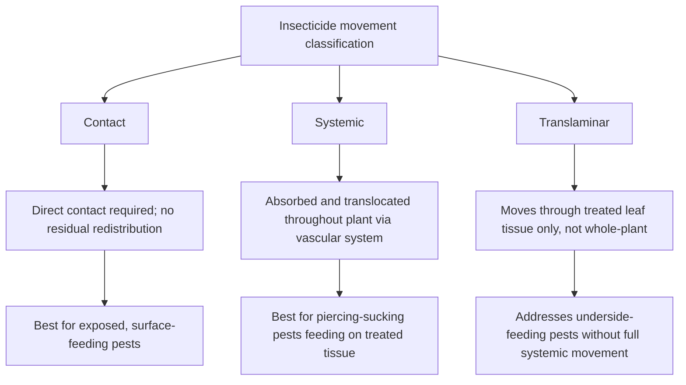
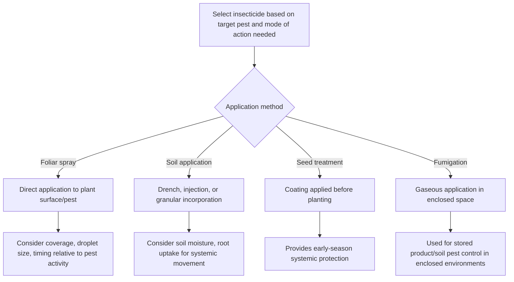

## Insecticide Types and Application

### Overview

Insecticide types and application encompasses the chemical classification, mode of action, and delivery methods used to control insect pest populations within agricultural systems. Effective insecticide use requires matching product chemistry and mode of action to target pest biology, understanding movement and persistence characteristics within the plant or environment, and applying products through methods that maximize target exposure while minimizing non-target impact and resistance selection pressure.

**Key Points**

- Insecticides are classified by chemical class, mode of action (specific biochemical target), and movement characteristic within the plant (contact, systemic, translaminar).
- Application method selection—foliar spray, soil application, seed treatment, or fumigation—must align with target pest feeding location and behavior to achieve adequate exposure.
- Insecticide resistance management, following the same core principles as herbicide resistance management, requires mode-of-action rotation and integration with non-chemical tactics.

---

### Classification by Movement Characteristic

#### Contact Insecticides

Contact insecticides require direct physical contact with the target insect to achieve toxic effect, typically through cuticular penetration, and provide no residual protection against insects that arrive on treated surfaces after initial spray deposits have degraded or been contacted by prior insects.

- Effective primarily against exposed, actively moving pests present on the plant surface at the time of application.
- Generally less effective against pests protected within plant tissue (borers), beneath waxy coverings (some scale insects), or feeding on the underside of leaves if spray coverage does not reach those surfaces.

#### Systemic Insecticides

Systemic insecticides are absorbed into plant tissue and translocated throughout the plant via the vascular system, providing protection to plant parts not directly contacted during application and remaining effective against pests feeding on treated tissue for an extended period following application.

- Particularly effective against piercing-sucking pests (aphids, whiteflies, leafhoppers) that feed directly on plant fluids containing the systemic active ingredient.
- Application methods commonly include soil drench, soil injection, trunk injection (for perennial woody crops), or seed treatment, in addition to foliar application with subsequent uptake.
- Movement pattern (typically acropetal, moving upward from roots to shoots via the xylem) affects distribution uniformity within the plant, with some products exhibiting more limited translocation to certain plant parts (e.g., fruit) than others.

#### Translaminar Insecticides

Translaminar products penetrate leaf tissue and redistribute within the treated leaf (moving from the upper to lower leaf surface, for example) without moving systemically throughout the entire plant via vascular transport.

- Provides protection against pests feeding on the untreated leaf surface (commonly the underside) when spray was applied only to the opposite surface, addressing a key limitation of purely contact products for pests with underside-feeding behavior (e.g., many mites and whiteflies).

---

### Classification by Chemical Class and Mode of Action

Modern insecticide classification systems, notably the Insecticide Resistance Action Committee (IRAC) mode-of-action grouping, organize products by their specific biochemical target site—the primary basis for resistance management planning.

| Mode of Action Category | Target Site | Example Chemical Classes |
| --- | --- | --- |
| Sodium channel modulators | Nervous system sodium channels | Pyrethroids, DDT (legacy) |
| Acetylcholinesterase inhibitors | Nervous system enzyme (acetylcholine breakdown) | Organophosphates, carbamates |
| Nicotinic acetylcholine receptor agonists | Nervous system receptor binding | Neonicotinoids |
| GABA-gated chloride channel antagonists | Nervous system chloride channel | Cyclodienes, some phenylpyrazoles |
| Chitin synthesis inhibitors | Insect growth/molting process | Benzoylureas |
| Juvenile hormone mimics | Insect growth regulation | Juvenile hormone analogs |
| Microbial disruptors | Gut/cellular disruption specific to target pathogen mechanism | *Bacillus thuringiensis* (Bt) toxins |
| Mitochondrial disruptors | Energy metabolism | Various acaricide/insecticide classes affecting ATP production |

[Inference: exact IRAC group numbering and classification details are periodically revised as new chemistries are introduced and additional resistance mechanism research becomes available, so current classification should be verified against the applicable regional regulatory or IRAC reference resource rather than relying on legacy or memorized group numbers.]

---

### Insect Growth Regulators (IGRs)

Insect growth regulators represent a distinct functional category disrupting normal insect development rather than causing direct acute neurotoxic or physical effects, generally exhibiting favorable selectivity profiles relative to many beneficial insect groups due to their developmental-process-specific mode of action.

- **Chitin synthesis inhibitors**: Disrupt cuticle formation during molting, causing lethal effects primarily in larval or nymphal stages undergoing ecdysis rather than in non-molting adult stages.
- **Juvenile hormone analogs**: Disrupt normal metamorphic transitions by maintaining juvenile hormone activity beyond its normal developmental window, preventing proper transition to the adult stage.
- **Molt-accelerating compounds (ecdysone agonists)**: Trigger premature or incomplete molting, disrupting normal developmental timing and causing lethal effects during the molting process.

IGRs generally exhibit delayed activity relative to conventional neurotoxic insecticides, since their effect depends on the timing of the insect's natural molting or metamorphic process rather than immediate physiological disruption upon exposure.

---

### Biopesticides and Biologically-Derived Insecticides

- **Microbial insecticides**: Formulated preparations of entomopathogenic bacteria (Bt), fungi, or viruses, generally requiring specific application timing and environmental conditions (as discussed in biological control agent contexts) to achieve effective infection or toxin ingestion by the target pest.
- **Botanically-derived insecticides**: Compounds extracted from plant sources (e.g., pyrethrins from chrysanthemum flowers, azadirachtin from neem), generally exhibiting shorter environmental persistence and, in the case of pyrethrins specifically, a different resistance profile than their synthetic pyrethroid analogs due to typically rapid photodegradation and often multiple active constituents.
- **Insecticidal soaps and oils**: Physical mode of action products (disrupting insect cuticle waxy coating or causing suffocation via oil coating) generally classified separately from biochemically-targeted conventional insecticides, with correspondingly reduced resistance development risk due to the non-specific physical mechanism.

---

### Application Methods

#### Foliar Spray Application

The most common application method, delivering insecticide directly to plant surfaces and any pests present at the time of treatment.

- **Coverage requirements**: Adequate spray coverage (droplet density and distribution across leaf surfaces, including undersides where relevant to target pest feeding location) is essential for contact-mode products, while systemic and translaminar products have somewhat reduced dependence on complete coverage due to internal redistribution.
- **Nozzle and droplet size selection**: Affects both coverage quality and drift potential, requiring balance between fine droplets (improved coverage, increased drift risk) and coarser droplets (reduced drift, potentially reduced coverage uniformity).

#### Soil Application

- **Soil drench**: Liquid application to the root zone, relying on root uptake for systemic products to achieve translocation throughout the plant.
- **Soil injection**: Placement of product below the soil surface, sometimes used to improve product placement relative to root zone and reduce surface volatilization or degradation losses.
- **Granular soil application**: Solid formulation incorporated into soil, often providing extended release characteristics compared to liquid formulations.

#### Seed Treatment

- Systemic insecticide products applied as a coating to seed before planting, providing early-season protection to emerging seedlings against soil-dwelling and early-colonizing above-ground pests as the systemic active ingredient is taken up through developing root tissue.
- Provides a defined, time-limited window of protection corresponding to the systemic product's uptake, translocation, and degradation characteristics, generally most relevant to early-season pest pressure rather than season-long protection.

#### Trunk Injection

- Used primarily in perennial woody crops (fruit and nut trees, ornamental trees), involving direct injection of systemic product into the vascular tissue, bypassing foliar or soil application entirely.
- Can provide extended protection duration in some applications, though requires specialized equipment and creates a wound site at the injection point requiring consideration of tree health and injury management.

#### Fumigation

- Gaseous application within an enclosed or sealed environment (stored grain facilities, soil fumigation under tarping, or structural treatment), providing thorough penetration into cracks, crevices, and stored product mass that liquid or granular applications cannot reach.
- Requires specialized safety protocols given the inherent hazards of gaseous toxic compounds, including restricted-entry intervals and specialized applicator certification in most regulatory jurisdictions.

---

### Timing Considerations Relative to Pest Life Cycle

Application timing should generally target the life stage most vulnerable to the specific product's mode of action and most accessible to the chosen application method, informed by the monitoring and degree-day modeling principles discussed in insect life cycle management.

- **Early larval instar targeting**: Many products, particularly Bt-based biopesticides, are most effective against early larval stages before larvae grow larger, become more tolerant, and potentially move into protected feeding locations (e.g., boring into plant tissue).
- **Pre-egg-hatch timing for ovicidal products**: Certain products with activity against egg stages require application timing coordinated with peak egg-laying activity, identified through monitoring programs.
- **Adult stage timing for contact products against mobile pests**: Products targeting adult insects directly often require timing coordinated with peak adult activity periods identified through trapping data.

---

### Application Rate and Coverage Calculations

$$Application \, Rate \, (\text{product/ha}) = Label \, Rate \times Field \, Area$$

Carrier volume (water volume per unit area) affects spray droplet density and coverage uniformity, with contact-mode products generally requiring higher carrier volumes to achieve adequate direct contact coverage compared to systemic products relying on plant uptake following limited initial contact.

**Example**

A contact insecticide targeting exposed foliar pests would typically require sufficient carrier volume to achieve thorough canopy penetration and leaf surface coverage (including leaf undersides for pests with that feeding behavior), since inadequate coverage directly translates to reduced pest contact and control failure; in contrast, a systemic soil-applied product relies primarily on adequate soil moisture and root uptake capacity rather than spray coverage uniformity, shifting the critical application variable from coverage quality to appropriate soil moisture conditions at and following application. [Inference: specific optimal carrier volume and application timing parameters vary by product label, target pest, and crop canopy characteristics, so current product label directions should govern actual application decisions.]

---

### Insecticide Resistance Management Considerations

Insecticide resistance follows the same fundamental evolutionary principles as herbicide resistance, requiring analogous management strategies:

- **Mode-of-action rotation**: Alternating IRAC groups across generations or seasons to avoid consistent selection pressure on a single target site.
- **Avoiding repeated use within a single generation**: Particularly important for pests with short generation times and high reproductive rates, where repeated same-mode-of-action application within one generation can rapidly select for resistant survivors.
- **Integration with non-chemical tactics**: Biological control, cultural practices, and monitoring-based threshold application reduce overall reliance on chemical selection pressure.
- **Preserving refuge populations**: In some resistance management frameworks (particularly relevant to genetically engineered insect-resistant crops), maintaining untreated refuge areas supports susceptible insect populations that dilute resistance allele frequency through interbreeding with any resistant survivors.

---

### Environmental and Safety Considerations

#### Non-Target Impact and Beneficial Insect Considerations

Product selectivity toward target pests versus beneficial insects and pollinators represents a critical selection criterion, particularly for systemic products where non-target exposure routes (pollen, nectar) may differ from the primary intended contact or ingestion pathway for the target pest.

#### Label Compliance

Insecticide product labels constitute legally binding usage directions in most regulatory jurisdictions, specifying approved crops, target pests, application rates, timing restrictions, pre-harvest intervals, restricted-entry intervals, and personal protective equipment requirements. [Unverified: specific label requirements vary by product, jurisdiction, and periodic regulatory updates, so current label documentation should always be consulted directly rather than relied upon from general reference material.]

---

### Integration Within Broader Pest Management

**Next Steps**

- Match insecticide movement characteristic (contact, systemic, translaminar) to target pest feeding location and behavior before product selection.
- Confirm current IRAC mode-of-action classification for candidate products and review resistance status for target pest species in the production region.
- Coordinate application timing with monitoring and degree-day model data to target the most vulnerable pest life stage.
- Select application method (foliar, soil, seed treatment, trunk injection, fumigation) appropriate to target pest biology and crop system characteristics.
- Incorporate mode-of-action rotation and integration with biological and cultural tactics as core resistance management practices.
- Review current product labels for rate, timing, pre-harvest interval, and beneficial organism protection requirements before application.

---

### Related Topics

- Insect anatomy and classification
- Major crop insect pests
- Insect life cycles and monitoring
- Biological control agents
- Beneficial insects and pollinators
- Insecticide resistance management
- Integrated pest management (IPM) principles