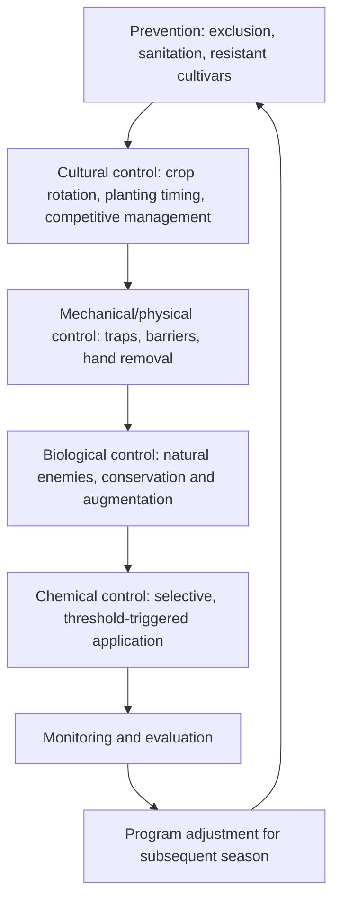
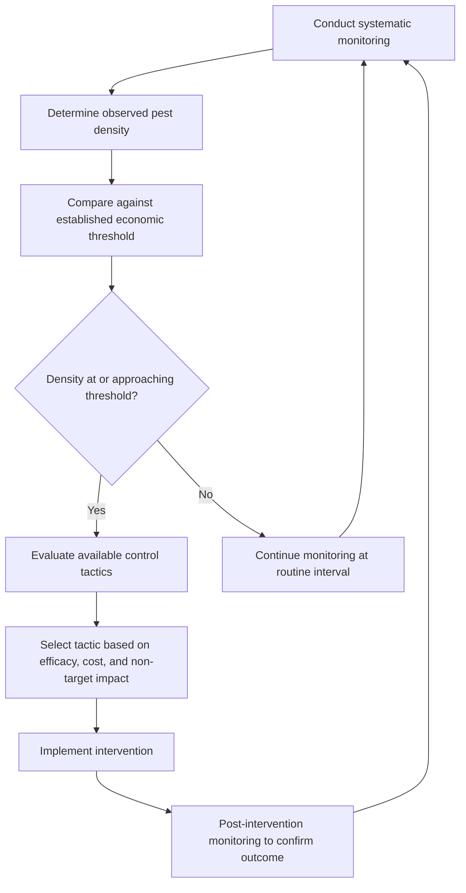
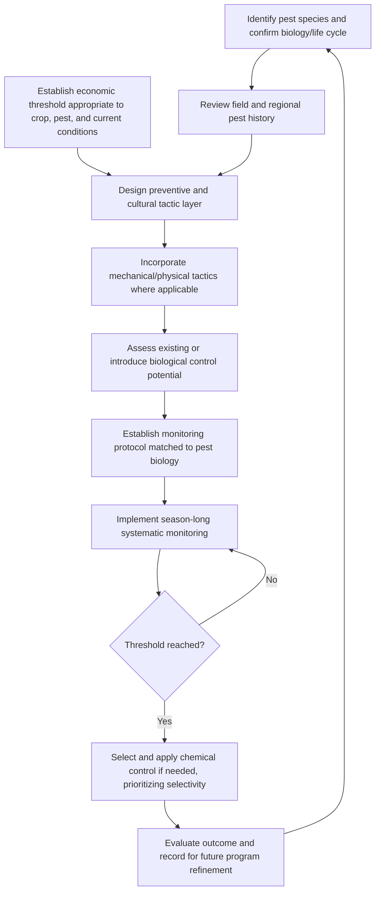

## Integrated Pest Management Principles

### Overview

Integrated pest management (IPM) is a systems-based decision-making framework that combines multiple pest suppression tactics—cultural, biological, mechanical/physical, and chemical—into a coordinated program designed to manage pest populations below economically damaging thresholds while minimizing negative economic, health, and environmental effects. Rather than defaulting to routine, calendar-based pesticide application, IPM emphasizes monitoring-driven decisions, economic threshold interpretation, and preferential use of lower-risk tactics, reserving chemical intervention for situations where non-chemical tactics alone are insufficient to prevent unacceptable loss.

**Key Points**

- IPM integrates prevention, monitoring, and multiple control tactic categories into a single coordinated decision-making framework, applying the same core systems-thinking principles established for weed management to insect and broader pest management.
- Economic thresholds and injury levels provide the objective, monitoring-based criteria for determining when intervention is warranted, replacing reactive or preventive calendar-based treatment approaches.
- Effective IPM requires accurate pest identification, understanding of pest biology and life cycle, and field-specific program design informed by site history and monitoring data.

---

### Foundational Principles of IPM

#### The Hierarchical Tactic Framework

IPM programs are commonly organized around a hierarchy of tactics, prioritizing prevention and lower-risk methods before escalating to chemical intervention when necessary.

- **Prevention**: Excluding pest introduction through resistant cultivar selection, clean planting material, sanitation, and exclusion barriers, addressing pest problems before they establish rather than after.
- **Cultural control**: Manipulating the production system (planting date, crop rotation, plant spacing, irrigation and fertility management) to create conditions less favorable for pest establishment and more favorable for crop competitiveness or tolerance.
- **Mechanical/physical control**: Direct physical intervention including trapping, barriers, hand removal, or habitat modification that does not rely on biological or chemical mechanisms.
- **Biological control**: Conservation, augmentation, or classical introduction of natural enemies to suppress pest populations through predation, parasitism, or pathogenicity.
- **Chemical control**: Pesticide application integrated as one component of the broader program, applied based on monitoring data and threshold criteria rather than as a default or sole tactic.

#### Accurate Pest Identification as a Foundation

Effective IPM decision-making depends fundamentally on correct pest identification, since management tactic selection, timing, and threshold interpretation are all pest-species-specific; misidentification can result in ineffective or unnecessary intervention, or failure to recognize an emerging problem until economic damage has already occurred.

#### Understanding Pest Biology and Life Cycle

Knowledge of a target pest's life cycle, developmental timing, and behavioral characteristics (as established through life cycle and monitoring principles) directly informs which management tactics will be effective and when they should be applied for maximum impact, since interventions timed to a pest's most vulnerable life stage or behavior generally achieve substantially better outcomes than untimed or reactive treatment.

---

### Monitoring as the Operational Core of IPM

#### Systematic Scouting and Data Collection

IPM decision-making relies on regular, systematic field monitoring to generate the population density and pest presence data needed for threshold-based decisions, rather than acting reactively only after visible crop damage or economic loss has already occurred.

- Monitoring frequency and method must be matched to target pest biology (as detailed in monitoring-specific technical guidance), since different pest groups require different detection approaches (trapping, visual scouting, soil sampling) and different sampling intervals based on generation time and population growth potential.
- Consistent, documented monitoring across a season and across multiple seasons supports both immediate treatment decisions and longer-term program evaluation and refinement.

#### Economic Thresholds and Injury Levels

- **Economic Injury Level (EIL)**: The pest population density at which the cost of damage caused equals the cost of implementing control, representing the theoretical break-even point.
- **Economic Threshold (ET)**: The pest population density at which control action should be initiated to prevent the population from reaching the economic injury level, set below the EIL to account for the time lag between detection, decision-making, and intervention implementation.

$$ET < EIL$$

This relationship exists because pest populations continue increasing (or damage continues accruing) during the interval between threshold detection and effective intervention, so triggering action only at the EIL itself would generally result in exceeding acceptable damage levels by the time control takes effect. [Inference: the specific numeric gap between ET and EIL for a given pest-crop combination depends on population growth rate, intervention lag time, and control tactic efficacy, and is typically established through regional research trials rather than a fixed universal ratio.]

#### Threshold Variability and Local Adaptation

Published economic thresholds are typically derived from regional research under specific conditions (commodity prices, control costs, cultivar tolerance, and regional pest pressure patterns) and may require local adjustment. [Inference: threshold values referenced in general educational or historical sources may not reflect current commodity prices or control costs, so current regional extension guidance should be consulted for threshold application in actual field decision-making.]

---

### Integrating Multiple Tactic Categories

#### Preventive and Cultural Foundation

- **Resistant/tolerant cultivar selection**: Reduces pest establishment success or crop damage severity without requiring additional inputs, forming a foundational preventive layer.
- **Crop rotation and planting timing**: Disrupts pest life cycle synchrony and host availability continuity, analogous to the principles applied in weed and disease management.
- **Sanitation**: Removing crop residue, volunteer plants, or alternate host material that could harbor pest populations between cropping cycles.

#### Mechanical and Physical Tactics

- **Trapping**: Beyond monitoring purposes, mass trapping or mating disruption technologies can directly contribute to population suppression in some pest systems.
- **Exclusion barriers**: Row covers, netting, or other physical barriers preventing pest access to crop plants, particularly relevant in high-value or protected cultivation systems.
- **Habitat modification**: Adjusting field margin vegetation, residue management, or tillage practices to reduce pest overwintering or breeding site availability.

#### Biological Control Integration

Conservation, augmentative, and (where applicable) classical biological control approaches contribute ongoing background suppression, reducing the population growth rate that chemical intervention must otherwise fully address alone, and potentially reducing the frequency or intensity of chemical applications required to maintain populations below threshold.

#### Chemical Control as a Coordinated Component

- **Threshold-triggered application**: Chemical intervention initiated based on monitoring data reaching established thresholds, rather than preventive or calendar-based scheduling.
- **Selective product and timing choice**: Prioritizing products and application timing that minimize disruption to biological control agents and pollinators while achieving necessary target pest suppression.
- **Resistance management integration**: Mode-of-action rotation and tank-mixing strategies, consistent with resistance management principles, to preserve long-term chemical tool efficacy.

---

### IPM Program Design Workflow

---

### Economic, Environmental, and Social Considerations

#### Cost-Benefit Evaluation

IPM decision-making inherently incorporates economic evaluation, weighing the cost of intervention against the value of yield or quality loss prevented, rather than pursuing pest elimination without regard to cost-effectiveness.

$$Net \, Benefit = (Value \, of \, Loss \, Prevented) - (Cost \, of \, Intervention)$$

#### Environmental and Non-Target Considerations

IPM programs explicitly account for non-target effects, including impacts on beneficial insects, pollinators, water quality, and broader ecosystem function, favoring tactics and products that achieve necessary pest control while minimizing these unintended consequences.

#### Regulatory and Market Considerations

Pesticide residue limits, pre-harvest intervals, and market-specific certification requirements (such as organic production standards or integrated crop management certification programs) may further constrain or shape tactic selection within an IPM framework, requiring program design to account for these external requirements alongside purely biological and economic considerations.

---

### Practical Application Example

**Example**

A vegetable grower implementing an IPM program for a recurring aphid problem might begin with cultural tactics—selecting a moderately aphid-tolerant cultivar and adjusting planting date to reduce overlap with peak regional aphid flight activity based on historical monitoring data. Reflective mulch (a physical/mechanical tactic disrupting aphid landing behavior) might be incorporated during early crop establishment, while field margin habitat is maintained to support existing parasitic wasp and lady beetle populations. Throughout the season, systematic scouting tracks aphid density against an established economic threshold; if the threshold is approached despite the preventive and biological control foundation already in place, a selective aphicide with documented reduced impact on the existing beneficial insect population would be applied, timed and chosen to preserve ongoing biological control contribution for the remainder of the season, with outcomes recorded to refine cultivar, timing, and threshold interpretation decisions for subsequent seasons.

**Next Steps**

- Develop accurate identification and biological understanding of the primary pest species relevant to the target cropping system before designing an IPM program.
- Establish or obtain economic thresholds appropriate to current commodity prices, control costs, and cultivar tolerance for key pest-crop combinations.
- Layer preventive, cultural, mechanical, and biological tactics as the program foundation, reserving chemical intervention for threshold-triggered situations.
- Implement systematic, pest-appropriate monitoring protocols to generate the population data necessary for objective, threshold-based decision-making.
- Maintain detailed program records across seasons to support continuous refinement of tactic selection, timing, and threshold interpretation.

---

### Related Topics

- Insect anatomy and classification
- Major crop insect pests
- Insect life cycles and monitoring
- Biological control agents
- Beneficial insects and pollinators
- Insecticide types and application
- Insecticide resistance management