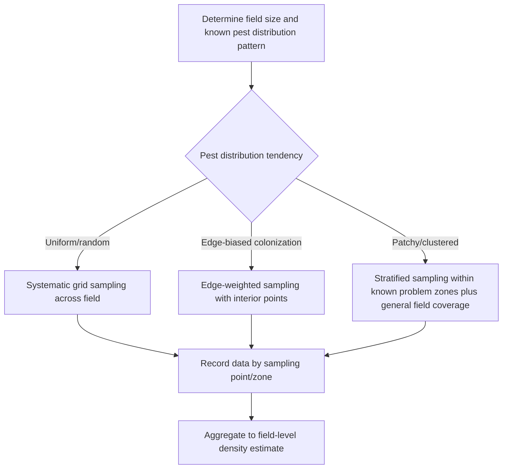
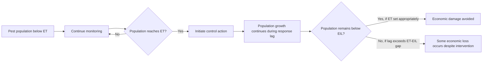
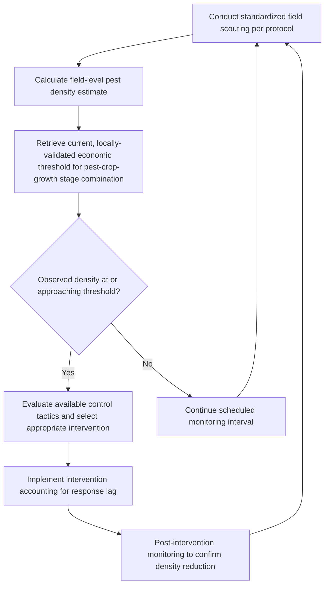

## Pest Scouting and Economic Thresholds

### Overview

Pest scouting and economic thresholds together constitute the empirical and analytical foundation upon which integrated pest management decisions are made, translating field observation into objective, data-driven intervention criteria. Systematic scouting generates the population density and distribution data required for informed decision-making, while economic threshold and injury level concepts provide the quantitative framework for determining precisely when that data justifies control intervention, replacing calendar-based or purely reactive treatment approaches with an evidence-based decision process.

**Key Points**

- Effective scouting requires standardized sampling protocols (method, frequency, spatial pattern, sample size) matched to target pest biology to generate representative, comparable field data.
- Economic injury level (EIL) and economic threshold (ET) provide distinct but related decision criteria, with the ET set below the EIL to account for the response lag between detection and effective intervention.
- Threshold values are inherently dynamic, shifting with commodity price, control cost, and crop tolerance, requiring periodic recalculation rather than reliance on static historical figures.

---

### Scouting Program Design

#### Sampling Method Selection

Scouting methodology must align with target pest biology, mobility, and habitat, since a method appropriate for one pest group may generate unrepresentative or unusable data for another.

| Pest Characteristic | Appropriate Scouting Method |
| --- | --- |
| Mobile, flying adults (moths, beetles) | Pheromone or sticky trapping |
| Small, flying sap feeders (aphids, whiteflies) | Yellow/blue sticky cards, visual leaf counts |
| Foliage-feeding larvae | Direct visual plant counts, beat sheet sampling |
| Mobile ground/canopy insects | Sweep netting |
| Soil-dwelling pests | Soil core sampling, buried bait traps |
| Sessile or low-mobility pests (scale, some mite species) | Direct visual inspection of representative plant units |

#### Spatial Sampling Design

- **Systematic/grid sampling**: Sampling points distributed at regular intervals, appropriate when pest distribution is expected to be relatively uniform across the field.
- **Edge-weighted sampling**: Additional sampling concentrated near field margins, appropriate for pests known to exhibit edge-biased colonization (common among many immigrating pest species arriving from adjacent habitat).
- **Stratified/zone-based sampling**: Additional sampling intensity within historically problematic zones (informed by prior season mapping), combined with general field coverage to detect emerging issues elsewhere.

#### Sample Size and Statistical Considerations

Adequate sample size is necessary to generate a population density estimate that reasonably represents true field conditions, since insufficient sampling can produce misleading density estimates in either direction—falsely triggering unnecessary intervention or failing to detect an economically significant population.

$$n \geq \left(\frac{Z \times \sigma}{E}\right)^2$$

Where $n$ is required sample size, $Z$ is the statistical confidence coefficient, $\sigma$ is the estimated population standard deviation, and $E$ is the acceptable margin of error. [Inference: while this general statistical relationship underlies sample size determination, practical field scouting protocols typically rely on pre-established, pest-specific sample size and sampling unit recommendations derived from regional research rather than calculating sample size from first principles for each scouting event.]

#### Sampling Frequency

Sampling interval should be matched to the target pest's generation time and population growth potential, since species capable of rapid population increase (many aphid species under favorable conditions, for example) require more frequent monitoring to avoid missing the window between below-threshold and above-threshold density.

---

### Economic Injury Level (EIL)

#### Conceptual Definition

The economic injury level represents the pest population density at which the cost of crop damage caused equals the cost of implementing control, functioning as the theoretical break-even point beyond which allowing the pest population to persist becomes more costly than intervening.

$$EIL = \frac{C}{V \times I \times D}$$

Where $C$ is the cost of control per unit area, $V$ is the market value of the crop per unit yield, $I$ is the injury (yield loss) per pest unit, and $D$ is the proportion of damage prevented by control (control efficacy). [Inference: this represents a simplified, widely referenced conceptual formulation; actual applied EIL calculations for specific pest-crop systems often incorporate additional refinements such as non-linear injury-yield relationships or multiple damage mechanisms, and should be sourced from validated regional research for practical application rather than derived independently.]

#### Components Affecting EIL Value

- **Control cost (C)**: Includes product cost, application cost, and any associated labor or equipment expense; higher control costs raise the EIL, since intervention becomes justified only at higher pest densities when the cost of acting is greater.
- **Crop market value (V)**: Higher-value crops generally exhibit lower EILs, since even relatively minor yield loss represents greater absolute economic value, justifying intervention at lower pest densities.
- **Injury per pest unit (I)**: Reflects the crop's biological sensitivity to the specific pest's feeding or damage mechanism, varying substantially by pest species, crop growth stage, and plant part affected.
- **Control efficacy (D)**: Lower efficacy control options raise the EIL, since a portion of the pest population and associated damage persists even after intervention, reducing the value of acting at any given density.

---

### Economic Threshold (ET)

#### Relationship to EIL

The economic threshold is set at a population density below the EIL, representing the trigger point at which control action should be initiated to prevent the population from reaching or exceeding the EIL before intervention can take effect.

$$ET < EIL$$

#### Factors Determining the ET-EIL Gap

The magnitude of the gap between ET and EIL depends primarily on:

- **Population growth rate**: Faster-growing pest populations require a larger gap (earlier intervention trigger) to allow adequate response time before the EIL is reached.
- **Response/implementation lag**: The time required to detect the threshold, make a decision, and implement effective control (e.g., time to schedule and complete a spray application) directly determines how much population growth will occur before intervention takes effect.
- **Control tactic response time**: Some control methods (e.g., biological control agents) act more slowly than others (e.g., fast-acting contact insecticides), requiring the threshold to account for the specific tactic's expected response timeline.

[Inference: specific published ET values for a given pest-crop combination are derived from regional research incorporating locally relevant population growth rates and response lag assumptions, so thresholds developed in one region or cropping system may not transfer directly to different conditions without validation.]

---

### Dynamic Nature of Thresholds

#### Threshold Sensitivity to Economic Conditions

Because both EIL and ET depend on control cost and crop market value, threshold values are inherently dynamic rather than fixed biological constants, shifting as commodity prices and input costs change over time.

$$\frac{\partial EIL}{\partial V} < 0 \quad \text{(higher crop value lowers EIL)}$$

$$\frac{\partial EIL}{\partial C} > 0 \quad \text{(higher control cost raises EIL)}$$

This means published historical threshold figures may not reflect current economic conditions, and growers or advisors should periodically reassess thresholds against current price and cost data rather than relying indefinitely on figures established under different market conditions. [Inference: the practical frequency and method of threshold recalculation vary across advisory and extension programs, with some providing regularly updated regional guidance and others requiring individual grower-level recalculation based on current input data.]

#### Cultivar and Growth Stage Sensitivity

Crop tolerance to a given pest density often varies by cultivar and by growth stage, meaning a single threshold value may not appropriately apply across all production contexts for the same crop-pest combination; growth-stage-specific thresholds are commonly published for pests whose damage impact varies substantially depending on the crop's developmental stage at the time of infestation.

---

### Applying Scouting Data to Threshold-Based Decisions

**Example**

A scout sampling a field for aphid density using a standardized leaf-count protocol across a systematic grid of sampling points might calculate an average field density of, for instance, 8 aphids per leaf. If the current, locally-validated economic threshold for that crop and growth stage is established at approximately 10 aphids per leaf (accounting for typical population growth rate and a several-day application scheduling lag), the scout would recommend continued close monitoring at a shortened interval rather than immediate intervention, since the population remains below the threshold but close enough to warrant increased scouting frequency to detect if the threshold is reached before the next scheduled routine sampling date.

---

### Record-Keeping and Threshold Refinement

Maintaining detailed scouting records across seasons supports several functions beyond immediate treatment decisions:

- **Historical pattern identification**: Recognizing recurring problem zones within fields or predictable seasonal timing patterns for specific pests, informing more targeted future scouting intensity and timing.
- **Threshold validation**: Comparing actual outcomes (yield impact, control effectiveness) against threshold-based decisions over multiple seasons to assess whether locally applied thresholds are appropriately calibrated.
- **Program economic evaluation**: Tracking control costs and outcomes over time to refine the cost and efficacy inputs used in local EIL and ET calculations.

---

### Practical Implementation Considerations

**Next Steps**

- Establish standardized scouting protocols (method, sample size, spatial design, frequency) matched to the biology of each major pest species relevant to the target cropping system.
- Obtain current, regionally validated economic thresholds for key pest-crop combinations, verifying that published figures reflect current commodity prices and control costs rather than outdated historical values.
- Account for crop growth stage sensitivity when applying thresholds, using growth-stage-specific values where available rather than a single generalized threshold.
- Factor response/implementation lag time into threshold interpretation, intensifying scouting frequency as populations approach threshold levels to avoid missing the intervention window.
- Maintain detailed scouting and outcome records across seasons to support ongoing threshold validation and program refinement.

---

### Related Topics

- Insect life cycles and monitoring
- Integrated pest management (IPM) principles
- Major crop insect pests
- Insecticide types and application
- Biological control agents
- Beneficial insects and pollinators
- Insecticide resistance management