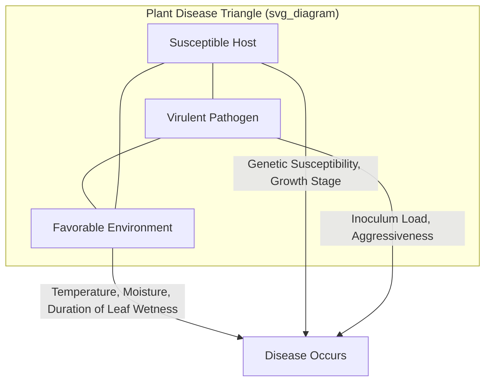
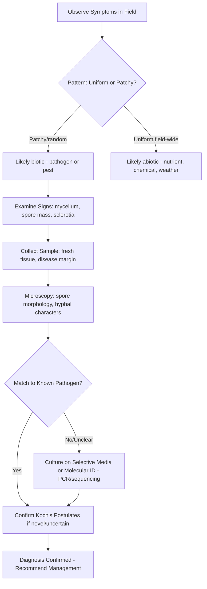

## Fungal Diseases of Crops

### Overview

Fungal pathogens cause the largest share of infectious crop diseases worldwide, exceeding bacterial, viral, and nematode diseases combined in terms of number of described pathogen species and economic impact. Fungi are eukaryotic, heterotrophic organisms that acquire nutrients through absorption, typically after secreting extracellular enzymes to break down host tissue. Their reproductive versatility — combining rapid asexual cycles with genetically recombining sexual cycles — allows fast field-level spread alongside longer-term genetic adaptation that can overcome host resistance genes and fungicide modes of action.

### Fungal Biology Relevant to Pathogenicity

**Key Points**

- Vegetative body is the **mycelium**, composed of thread-like **hyphae**; septate (cross-walled) in most pathogenic groups, aseptate/coenocytic in Oomycota (technically not true fungi, but traditionally studied under plant pathology).
- Cell walls are chitin-based (true fungi) versus cellulose-based (Oomycota), a distinction that determines fungicide susceptibility since many fungicides target chitin or ergosterol synthesis, which are absent or different in Oomycetes.
- Nutrition modes:
  - **Biotrophs** — feed on living host tissue, keep host alive as long as possible (e.g., rusts, powdery mildews, downy mildews).
  - **Necrotrophs** — kill host tissue ahead of colonization, often using toxins and lytic enzymes (e.g., *Botrytis*, *Sclerotinia*).
  - **Hemibiotrophs** — begin biotrophic, switch to necrotrophic later in infection (e.g., *Magnaporthe oryzae*, *Colletotrichum* spp.).

### Reproduction and Spore Types

Fungal spores are the primary infective and dispersal units. Recognizing spore type helps predict dispersal distance, survival strategy, and disease cycle timing.

| Spore Type | Reproduction | Typical Dispersal | Example Pathogen |
| --- | --- | --- | --- |
| Conidia | Asexual | Wind, splash, insects | *Botrytis cinerea* |
| Sporangiospores/Zoospores | Asexual | Water, soil moisture | *Phytophthora infestans* |
| Urediniospores | Asexual (repeating) | Wind (long distance) | *Puccinia graminis* |
| Ascospores | Sexual | Wind, forcible discharge | *Venturia inaequalis* |
| Basidiospores | Sexual | Wind | *Puccinia* spp. (teliospore-derived) |
| Teliospores/Chlamydospores | Survival/resting | Soil persistence | *Ustilago*, *Fusarium* |
| Oospores | Sexual (Oomycota) | Soil persistence | *Phytophthora*, *Pythium* |

### The Disease Cycle (Life Cycle) Concept

A **disease cycle** describes the chronological events in disease development, distinct from a pathogen's life cycle (which focuses on the organism's reproduction). Standard stages:

1. **Inoculation** — arrival of the pathogen (inoculum) at an infection court on the host.
2. **Penetration** — entry via direct penetration (appressorium-mediated), natural openings (stomata, lenticels), or wounds.
3. **Infection** — establishment of a parasitic relationship; host cells recognize or fail to recognize the pathogen.
4. **Incubation** — time between infection and symptom expression (latent period).
5. **Colonization** — pathogen growth and spread within host tissue.
6. **Reproduction/Sporulation** — production of new inoculum.
7. **Dissemination** — spread to new hosts via wind, water, vectors, seed, soil, or equipment.
8. **Overwintering/Oversummering (Survival)** — persistence during unfavorable periods as resting spores, mycelium in debris, or in alternate hosts.

The **monocyclic vs. polycyclic** distinction matters for management timing:

- **Monocyclic diseases**: one infection cycle per season (e.g., many smuts, some wilts); management emphasizes reducing initial inoculum (sanitation, seed treatment).
- **Polycyclic diseases**: multiple repeating cycles per season (e.g., late blight, rusts, powdery mildews); management emphasizes reducing infection rate (fungicide timing, resistant cultivars, canopy management).

**Diagram: Generalized Polycyclic Disease Cycle (svg_diagram)**

<svg xmlns="http://www.w3.org/2000/svg" viewBox="0 0 800 560">
<text x="400" y="30" text-anchor="middle" font-size="20" font-weight="bold" fill="#1a1a1a">Generalized Polycyclic Disease Cycle (svg_diagram)</text>
<circle cx="400" cy="300" r="220" fill="none" stroke="#888" stroke-width="2" stroke-dasharray="4,4" />
<g font-family="Arial" font-size="14">
<rect x="340" y="80" width="120" height="45" rx="8" fill="#d9ead3" stroke="#38761d" stroke-width="1.5" />
<text x="400" y="107" text-anchor="middle">Inoculation</text>
<rect x="520" y="150" width="130" height="45" rx="8" fill="#cfe2f3" stroke="#1155cc" stroke-width="1.5" />
<text x="585" y="177" text-anchor="middle">Penetration</text>
<rect x="580" y="290" width="130" height="45" rx="8" fill="#fff2cc" stroke="#bf9000" stroke-width="1.5" />
<text x="645" y="317" text-anchor="middle">Infection</text>
<rect x="520" y="420" width="150" height="45" rx="8" fill="#f4cccc" stroke="#990000" stroke-width="1.5" />
<text x="595" y="447" text-anchor="middle">Colonization</text>
<rect x="330" y="470" width="150" height="45" rx="8" fill="#e6d5f7" stroke="#674ea7" stroke-width="1.5" />
<text x="405" y="497" text-anchor="middle">Sporulation</text>
<rect x="140" y="420" width="150" height="45" rx="8" fill="#d0e0e3" stroke="#134f5c" stroke-width="1.5" />
<text x="215" y="447" text-anchor="middle">Dissemination</text>
<rect x="90" y="290" width="140" height="45" rx="8" fill="#fce5cd" stroke="#b45f06" stroke-width="1.5" />
<text x="160" y="317" text-anchor="middle" font-size="13">Secondary Inoculum</text>
<rect x="150" y="150" width="150" height="45" rx="8" fill="#d9d2e9" stroke="#351c75" stroke-width="1.5" />
<text x="225" y="170" text-anchor="middle" font-size="12">Favorable</text>
<text x="225" y="186" text-anchor="middle" font-size="12">Environment</text>
<path d="M460,102 L520,160" stroke="#333" stroke-width="2" marker-end="url(#arrow)" />
<path d="M600,195 L635,290" stroke="#333" stroke-width="2" marker-end="url(#arrow)" />
<path d="M640,335 L610,420" stroke="#333" stroke-width="2" marker-end="url(#arrow)" />
<path d="M540,455 L480,485" stroke="#333" stroke-width="2" marker-end="url(#arrow)" />
<path d="M330,490 L280,455" stroke="#333" stroke-width="2" marker-end="url(#arrow)" />
<path d="M200,420 L175,335" stroke="#333" stroke-width="2" marker-end="url(#arrow)" />
<path d="M170,290 L200,195" stroke="#333" stroke-width="2" marker-end="url(#arrow)" />
<path d="M290,172 L340,105" stroke="#333" stroke-width="2" marker-end="url(#arrow)" />

<text x="400" y="300" text-anchor="middle" font-size="15" font-weight="bold" fill="#555">Repeating Cycle</text>

<text x="400" y="320" text-anchor="middle" font-size="12" fill="#555">(multiple per season)</text>

</g>

</svg>

### Major Taxonomic Groups of Plant-Pathogenic Fungi

**Ascomycota (Sac Fungi)**

- Sexual spores (ascospores) produced in an ascus.
- Includes powdery mildews (*Erysiphales*), *Fusarium*, *Colletotrichum*, *Venturia*, *Sclerotinia*, *Botrytis*.
- Many economically dominant crop pathogens belong here.

**Basidiomycota (Club Fungi)**

- Sexual spores (basidiospores) on a basidium.
- Includes rusts (*Pucciniales*) and smuts (*Ustilaginomycotina*), plus wood decay/root rot fungi (*Armillaria*, *Rhizoctonia* — technically an anamorphic Basidiomycete).

**Oomycota (Water Molds — Fungus-like Organisms)**

- Not true fungi (kingdom Chromista/Stramenopila); cellulose cell walls, diploid dominant life cycle, motile zoospores.
- Includes *Phytophthora*, *Pythium*, *Plasmopara* (downy mildews) — grouped with fungal diseases operationally due to similar disease management approaches.

**Deuteromycota / Fungi Imperfecti (Mitosporic Fungi)**

- Historical grouping for fungi with no known sexual stage; largely reclassified into Ascomycota or Basidiomycota using molecular phylogenetics, but the term persists in older literature and diagnostic keys.

### Major Fungal Disease Categories with Representative Pathogens

**Rusts**

- Caused by obligate biotrophic Basidiomycetes (order Pucciniales).
- Complex life cycles, some **heteroecious** (requiring two unrelated host species) and **macrocyclic** (up to five spore stages).
- Example: *Puccinia graminis* f. sp. *tritici* (wheat stem rust) — alternate host *Berberis* spp. (barberry); highly damaging historically, with the **Ug99** lineage (first detected in Uganda, 1998) overcoming widely deployed *Sr31* resistance gene.
- Symptoms: pustules (uredinia) rupturing epidermis, releasing orange/red/brown/black spores depending on stage.

**Smuts**

- Basidiomycetes producing dark, powdery teliospore masses replacing floral or vegetative structures.
- Example: *Ustilago maydis* (corn smut) — forms galls on ears, tassels, stalks; unusually, the galls are harvested as the delicacy *huitlacoche* in some cuisines.
- Example: *Tilletia caries* (common bunt of wheat) — seed-borne, replaces kernel contents with spore masses ("stinking smut").

**Powdery Mildews**

- Obligate biotrophic Ascomycetes (order Erysiphales); superficial white mycelial growth on leaf/stem surfaces.
- Favored by moderate temperatures and **high humidity without free water** on leaves (unusual among foliar fungal diseases in not requiring leaf wetness for spore germination).
- Example: *Erysiphe necator* (grape powdery mildew), *Blumeria graminis* (cereal powdery mildew).

**Downy Mildews**

- Caused by Oomycetes; require free moisture and cool-to-moderate temperatures for sporulation.
- Symptoms: angular chlorotic lesions on upper leaf surface with corresponding grayish/purplish sporulation on the lower surface.
- Example: *Plasmopara viticola* (grape downy mildew), *Peronospora* spp.

**Blights**

- Rapid, extensive tissue necrosis.
- Example: *Phytophthora infestans* (late blight of potato and tomato) — historically responsible for the Irish Potato Famine (1845–1852); still a major re-emerging threat due to fungicide-resistant and more aggressive genotypes.
- Example: *Alternaria solani* (early blight), *Helminthosporium/Bipolaris* spp. (Southern corn leaf blight).

**Wilts**

- Vascular pathogens colonizing xylem, disrupting water transport.
- Example: *Fusarium oxysporum* f. sp. *lycopersici* (tomato Fusarium wilt), *Verticillium dahliae* (Verticillium wilt) — both soilborne, long-persisting via chlamydospores/microsclerotia.

**Root and Crown Rots / Damping-off**

- Example: *Rhizoctonia solani*, *Pythium* spp., *Fusarium* spp. — damping-off of seedlings (pre-emergence or post-emergence).
- Example: *Armillaria mellea* (Armillaria root rot) affecting perennial/tree crops, spreading via rhizomorphs.

**Anthracnose**

- Sunken, dark lesions on fruit, stems, or leaves, caused mainly by *Colletotrichum* spp.
- Hemibiotrophic; asymptomatic (quiescent) infection in unripe fruit that becomes active as fruit ripens — a major postharvest management challenge.

**Leaf Spots**

- Example: *Septoria tritici* (wheat), *Cercospora* spp. (Cercospora leaf spot in sugar beet, groundnut), *Bipolaris/Cochliobolus* spp.

**Gray Mold and Storage/Postharvest Rots**

- Example: *Botrytis cinerea* — broad host range necrotroph, major cause of pre- and postharvest losses in fruits, vegetables, and cut flowers; also economically desirable as "noble rot" (*Botrytis cinerea* on grapes for dessert wines such as Sauternes) under specific dry, controlled conditions.

**Ergot**

- *Claviceps purpurea* replaces cereal/grass grain with a sclerotium (ergot) containing toxic alkaloids, historically linked to human/animal poisoning (ergotism).

### Symptom Terminology (Diagnostic Vocabulary)

- **Chlorosis** — yellowing due to chlorophyll loss.
- **Necrosis** — death of tissue, appearing brown/black.
- **Lesion** — a localized area of diseased tissue.
- **Mosaic** — irregular light/dark green patterning (more typical of viruses, but occasionally used loosely).
- **Wilting** — loss of turgor from vascular dysfunction or root damage.
- **Canker** — localized dead lesion on woody stem/bark, often sunken.
- **Gall** — abnormal tissue proliferation.
- **Mummification** — shriveled, dried fruit retaining pathogen structures (e.g., *Monilinia* brown rot mummies).
- **Damping-off** — seedling collapse at or below the soil line.
- **Blight** — rapid, extensive necrosis of foliage, flowers, or stems.
- **Signs vs. symptoms** — a **sign** is the visible pathogen structure itself (mycelium, spore mass, sclerotium); a **symptom** is the host's response (lesion, wilting, chlorosis). Confusing the two is a common diagnostic error.

### Environmental Requirements for Disease (The Disease Triangle)

Disease requires three simultaneous factors: a susceptible **host**, a virulent **pathogen**, and a **favorable environment**. Adding time as a fourth dimension produces the **disease pyramid**, and adding human activity (cultural practices, vectors introduced by trade) yields the extended tetrahedron model used in modern epidemiology.

Key environmental drivers:

- **Leaf wetness duration** — critical for germination/penetration in most foliar fungal pathogens (e.g., *Venturia inaequalis* apple scab models use wetness-duration and temperature thresholds, per the Mills table).
- **Relative humidity** — powdery mildews thrive at high RH without free water; most other foliar fungi need free water or near-saturation.
- **Temperature optima** — pathogen-specific; e.g., *Phytophthora infestans* favors cool, wet conditions (10–20°C), while *Rhizoctonia solani* often favors warmer soils.
- **Host phenology** — susceptibility often peaks at specific growth stages (e.g., wheat is most vulnerable to Fusarium head blight during anthesis/flowering).

### Disease Assessment and Quantification

- **Incidence** — proportion (%) of plants or plant units affected: $Incidence = \frac{Number\ of\ diseased\ units}{Total\ units\ assessed} \times 100$
- **Severity** — proportion of plant tissue affected, often estimated via standard area diagrams (SADs).
- **Disease progress curve** — severity/incidence plotted against time, commonly modeled with logistic or Gompertz growth functions:

$$\frac{dy}{dt} = r \cdot y \cdot (1 - y)$$

where $y$ is disease severity/incidence (proportion), $t$ is time, and $r$ is the apparent infection rate — a foundational parameter in Van der Plank's epidemiological framework used to compare cultivar resistance and fungicide efficacy across polycyclic epidemics. [Inference: the specific rate parameter magnitude is pathosystem-dependent and requires field calibration; the general logistic model form is standard/well-established in plant disease epidemiology.]

- **Area Under the Disease Progress Curve (AUDPC)** — integrates severity over the growing season, widely used to compare treatments across trials:

$$AUDPC = \sum_{i=1}^{n-1} \frac{(y_i + y_{i+1})}{2}(t_{i+1} - t_i)$$

### Integrated Disease Management (IDM) Principles

**Cultural Controls**

- Crop rotation to reduce soilborne inoculum (effective against pathogens with limited host range and survival period; less effective against long-lived resting structures like *Sclerotinia* sclerotia or *Verticillium* microsclerotia).
- Sanitation — removal/destruction of crop debris, cull piles, volunteer plants.
- Adjusting planting date/density to avoid high-risk windows or reduce canopy humidity.
- Balanced fertilization (excess nitrogen often increases susceptibility to certain foliar pathogens by promoting succulent, dense canopy growth).
- Irrigation management — drip vs. overhead; morning irrigation to reduce leaf wetness duration.

**Host Resistance**

- **Vertical resistance** (race-specific, often single-gene, "R-gene" mediated, gene-for-gene) — strong but potentially short-lived if pathogen virulence genes shift.
- **Horizontal resistance** (race-nonspecific, polygenic, partial) — more durable, often used in combination with vertical resistance ("gene pyramiding") and cultivar rotation/mixtures.

**Biological Control**

- Antagonistic microorganisms: *Trichoderma* spp. (mycoparasitism, competition, induced resistance), *Bacillus subtilis*-based products (antibiosis), *Coniothyrium minitans* (targets *Sclerotinia* sclerotia).
- Induced systemic resistance (ISR) and systemic acquired resistance (SAR) elicitors (e.g., acibenzolar-S-methyl) prime host defenses without directly killing the pathogen.

**Chemical Control (Fungicides)**

Fungicides are classified by **FRAC (Fungicide Resistance Action Committee) group/mode of action** to manage resistance risk:

| FRAC Group (example) | Mode of Action | Example Active Ingredient | Resistance Risk |
| --- | --- | --- | --- |
| M (multi-site) | Multiple non-specific sites | Chlorothalonil, mancozeb, copper | Low |
| 1 (MBC) | Beta-tubulin assembly | Benomyl, thiophanate-methyl | High |
| 3 (DMI/Triazole) | Sterol 14α-demethylation | Tebuconazole, propiconazole | Medium |
| 7 (SDHI) | Succinate dehydrogenase | Boscalid, fluxapyroxad | Medium–High |
| 11 (QoI/Strobilurin) | Cytochrome bc1 (Qo site) | Azoxystrobin, pyraclostrobin | High |
| 4 (PA) | RNA polymerase I (Oomycetes) | Metalaxyl, mefenoxam | High |

- Single-site (targeted) fungicides carry higher resistance risk and are typically rotated or tank-mixed with multi-site protectants as an anti-resistance strategy. [Inference: exact resistance risk ratings can shift as new mutations/populations are documented by FRAC; the group classifications themselves are standard/documented.]
- **Systemic vs. contact** fungicides: systemics translocate within plant tissue (useful curatively, post-infection, within limits), while contact/protectant fungicides remain on the treated surface and must be applied before infection.

**Forecasting and Decision Support**

- Disease forecasting models combine weather data (temperature, leaf wetness, humidity) with pathogen biology thresholds to time fungicide applications, reducing unnecessary sprays. Examples include the Mills table for apple scab, TOMCAST for tomato early blight, and BLITECAST for potato late blight. [Inference: specific model thresholds vary by region/cultivar and are typically calibrated locally by extension services; the general forecasting approach is a standard, established practice.]

### Diagnostic Workflow

**Koch's Postulates** (adapted for plant pathology) remain the gold standard for confirming causal relationships between a suspected fungal pathogen and observed disease:

1. The pathogen must be consistently associated with the disease.
2. The pathogen must be isolated and grown in pure culture.
3. Inoculating a healthy host with the pure culture must reproduce the disease.
4. The same pathogen must be re-isolated from the newly diseased plant.

### Example: Applying the Framework to Wheat Rust

**Example**

- **Host**: Bread wheat (*Triticum aestivum*).
- **Pathogen**: *Puccinia graminis* f. sp. *tritici* (stem rust) or *Puccinia striiformis* (stripe/yellow rust).
- **Disease cycle type**: Polycyclic, with urediniospores as repeating inoculum.
- **Environment**: Stem rust favors warmer conditions (~15–35°C) with dew; stripe rust favors cooler temperatures (~7–15°C).
- **Management stack**: resistant cultivars (often pyramided R-genes), fungicide application (triazole or SDHI-strobilurin mixtures) timed via regional rust-tracking/forecasting networks, and elimination of alternate hosts (barberry eradication programs) where feasible.
- **Emerging concern**: the Ug99 race group and subsequent variants have defeated several previously durable resistance genes, prompting international surveillance (e.g., the Borlaug Global Rust Initiative). [Unverified: the current geographic extent and dominant races may have shifted since major reporting; consult current rust-tracking bulletins for up-to-date race distribution.]

### Emerging and Molecular Diagnostic Tools

- **qPCR and LAMP (loop-mediated isothermal amplification)** assays allow rapid, field-deployable pathogen detection, increasingly used for early blight-warning systems and seed health testing.
- **Metabarcoding/high-throughput sequencing** of environmental or plant samples enables simultaneous detection of multiple fungal taxa, useful for soil health and microbiome-informed disease risk assessment.
- **Remote sensing and hyperspectral imaging** are being integrated into precision agriculture platforms to detect pre-symptomatic stress signatures associated with fungal infection, though operational accuracy across diverse fungal pathosystems is still an active research area. [Speculation: broad field-scale reliability across pathogen types remains under active validation in current literature.]

### Conclusion

Fungal diseases of crops span an enormous taxonomic and ecological range, from obligate biotrophs like rusts and powdery mildews to aggressive necrotrophs like *Botrytis* and *Sclerotinia*, each with disease cycles shaped by specific environmental triggers. Effective management rests on accurate diagnosis (signs, symptoms, and confirmatory testing), an integrated combination of cultural, genetic, biological, and chemical tools, and increasingly, forecasting models and molecular diagnostics that allow more precise, resistance-conscious intervention timing.

**Related Topics**

- Bacterial diseases of crops (comparative diagnostics)
- Viral and viroid plant diseases
- Fungicide resistance management and FRAC rotation strategies
- Plant immune system: PAMP-triggered immunity (PTI) and effector-triggered immunity (ETI)
- Soilborne pathogen ecology and suppressive soils
- Mycotoxins in food/feed safety (aflatoxins, fumonisins, deoxynivalenol)
- Epidemiological modeling: Van der Plank's equations and AUDPC applications
- Seed pathology and seed health testing
- Postharvest pathology and storage disease management
- Climate change impacts on fungal pathogen range shifts