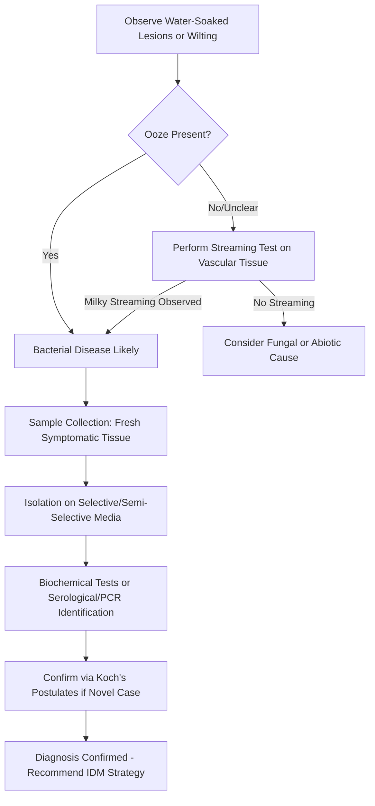

## Bacterial Plant Diseases

### Overview

Bacterial plant pathogens are prokaryotic microorganisms that cause substantial crop losses through mechanisms distinct from fungi — they lack specialized penetration structures like appressoria and must enter hosts through natural openings or wounds. Compared to fungal pathogens, fewer bacterial genera cause plant disease, but the diseases they cause (blights, wilts, soft rots, cankers, galls) can be extremely destructive and are often harder to control chemically since bactericides are more limited than fungicides.

### Bacterial Biology Relevant to Pathogenicity

**Key Points**

- Prokaryotic, unicellular, lacking a true nucleus; most plant-pathogenic bacteria are rod-shaped (bacilliform).
- Reproduce asexually by binary fission, allowing extremely rapid population growth under favorable conditions (doubling times of 20 minutes to a few hours).
- Most plant-pathogenic bacteria are Gram-negative (exceptions include *Clavibacter*, *Streptomyces*, *Rhodococcus*, which are Gram-positive).
- Genetic exchange occurs via horizontal gene transfer (conjugation, transformation, transduction) rather than sexual reproduction, contributing to spread of virulence factors and antibiotic/copper resistance genes.
- Motility via polar or peritrichous flagella aids movement through water films on plant surfaces toward natural openings.

### Entry Points and Infection Mechanisms

Unlike many fungi, most bacteria cannot directly penetrate intact plant cuticle or cell walls. Entry occurs via:

- **Natural openings**: stomata, hydathodes, lenticels, nectarthodes (floral nectaries).
- **Wounds**: mechanical damage, insect feeding sites, pruning cuts, frost cracks, cultivation injury.
- **Vector-mediated introduction**: insects (e.g., psyllids, leafhoppers) delivering bacteria directly into vascular tissue during feeding.

Once inside, bacteria multiply in intercellular spaces (apoplast) or within xylem/phloem vessels, depending on the pathogen's ecological niche.

### Disease Cycle Concept

Similar to fungal disease cycles, bacterial disease progression includes:

1. **Survival/overwintering** — in plant debris, seed, soil, insect vectors, or symptomless perennial hosts.
2. **Dissemination** — primarily via splashing water (rain, irrigation), wind-driven rain, insects, contaminated tools/equipment, and infected planting material (seed, cuttings, transplants).
3. **Inoculation and entry** — via wounds or natural openings as described above.
4. **Multiplication** — rapid exponential growth in intercellular spaces or vascular tissue.
5. **Symptom expression** — often after a short latent period; can be rapid under warm, wet, humid conditions.
6. **Secondary spread** — bacterial ooze (masses of cells exuded from infected tissue) becomes new inoculum, spread by rain splash or insects.

**Diagram: Generalized Bacterial Disease Cycle (svg_diagram)**

<svg xmlns="http://www.w3.org/2000/svg" viewBox="0 0 800 520">
<text x="400" y="30" text-anchor="middle" font-size="20" font-weight="bold" fill="#1a1a1a">Generalized Bacterial Disease Cycle (svg_diagram)</text>
<g font-family="Arial" font-size="14">
<rect x="330" y="70" width="140" height="45" rx="8" fill="#d9ead3" stroke="#38761d" stroke-width="1.5" />
<text x="400" y="97" text-anchor="middle">Survival Source</text>
<text x="400" y="112" text-anchor="middle" font-size="11">(debris, seed, soil)</text>
<rect x="550" y="170" width="150" height="45" rx="8" fill="#cfe2f3" stroke="#1155cc" stroke-width="1.5" />
<text x="625" y="197" text-anchor="middle">Dissemination</text>
<text x="625" y="211" text-anchor="middle" font-size="11">(rain splash, insects)</text>
<rect x="560" y="300" width="150" height="45" rx="8" fill="#fff2cc" stroke="#bf9000" stroke-width="1.5" />
<text x="635" y="322" text-anchor="middle">Entry via Wound</text>
<text x="635" y="336" text-anchor="middle" font-size="11">or Natural Opening</text>
<rect x="440" y="410" width="150" height="45" rx="8" fill="#f4cccc" stroke="#990000" stroke-width="1.5" />
<text x="515" y="437" text-anchor="middle">Multiplication</text>
<rect x="220" y="410" width="150" height="45" rx="8" fill="#e6d5f7" stroke="#674ea7" stroke-width="1.5" />
<text x="295" y="432" text-anchor="middle">Symptom Expression</text>
<text x="295" y="446" text-anchor="middle" font-size="11">(ooze production)</text>
<rect x="100" y="300" width="150" height="45" rx="8" fill="#d0e0e3" stroke="#134f5c" stroke-width="1.5" />
<text x="175" y="327" text-anchor="middle">Secondary Spread</text>
<rect x="90" y="170" width="150" height="45" rx="8" fill="#fce5cd" stroke="#b45f06" stroke-width="1.5" />
<text x="165" y="192" text-anchor="middle">Favorable Environment</text>
<text x="165" y="206" text-anchor="middle" font-size="11">(warmth, moisture, wounds)</text>
<path d="M460,95 L560,180" stroke="#333" stroke-width="2" marker-end="url(#arrow2)" />
<path d="M625,215 L635,300" stroke="#333" stroke-width="2" marker-end="url(#arrow2)" />
<path d="M600,345 L555,410" stroke="#333" stroke-width="2" marker-end="url(#arrow2)" />
<path d="M440,432 L370,432" stroke="#333" stroke-width="2" marker-end="url(#arrow2)" />
<path d="M250,432 L200,345" stroke="#333" stroke-width="2" marker-end="url(#arrow2)" />
<path d="M175,300 L165,215" stroke="#333" stroke-width="2" marker-end="url(#arrow2)" />
<path d="M240,180 L330,100" stroke="#333" stroke-width="2" marker-end="url(#arrow2)" />
</g>
</svg>

### Classification by Disease Symptom / Ecological Niche

**Vascular Wilts**

- Bacteria colonize xylem vessels, causing water stress, wilting, and often vascular discoloration.
- Example: *Ralstonia solanacearum* (bacterial wilt of solanaceous crops — tomato, potato, tobacco); notable for a milky bacterial ooze test (stem cross-section suspended in water releases a white streaming ooze).
- Example: *Xylella fastidiosa* — xylem-limited, insect-vectored (sharpshooters, spittlebugs); causes Pierce's disease of grapevine, citrus variegated chlorosis, and olive quick decline syndrome (associated with *Xylella fastidiosa* subsp. *pauca* in the Mediterranean).
- Example: *Clavibacter michiganensis* subsp. *michiganensis* (bacterial canker of tomato) — seed-borne and highly persistent in greenhouse structures.
- Example: *Erwinia tracheiphila* (bacterial wilt of cucurbits) — vectored by cucumber beetles, which also serve as an overwintering site for the pathogen.

**Soft Rots**

- Caused primarily by *Pectobacterium* spp. (formerly *Erwinia carotovora*) and *Dickeya* spp.; produce pectolytic enzymes that macerate cell walls, causing rapid tissue collapse into a slimy, foul-smelling mass.
- Major postharvest concern in potato, carrot, onion, and other fleshy vegetables; favored by high moisture, warm temperatures, and low oxygen (poor storage ventilation).

**Fire Blight and Related Blights**

- *Erwinia amylovora* (fire blight of apple, pear, and other Rosaceae) — causes blossom blight, shoot blight ("shepherd's crook" symptom), and cankers; spread by pollinating insects, rain splash, and pruning tools.
- Highly weather-dependent; infection risk models (e.g., Cougarblight, MaryblytT) use temperature and wetness data to time streptomycin or copper applications during bloom.

**Leaf Spots and Blights**

- Example: *Pseudomonas syringae* pathovars (numerous host-specific pathovars, e.g., pv. *tomato* causing bacterial speck, pv. *syringae* causing bacterial canker/blast of stone fruit) — many strains produce ice-nucleation-active proteins that increase frost injury susceptibility, indirectly facilitating infection.
- Example: *Xanthomonas* species/pathovars — e.g., *X. oryzae* pv. *oryzae* (bacterial leaf blight of rice), *X. campestris* pv. *campestris* (black rot of crucifers, causing characteristic V-shaped lesions along leaf margins).
- Example: *Xanthomonas citri* subsp. *citri* (citrus canker) — raised, corky lesions with a yellow halo; regulated quarantine pathogen in many countries due to trade risk.

**Galls (Crown Gall and Related)**

- *Agrobacterium tumefaciens* (reclassified in some taxonomies as *Rhizobium radiobacter*) — transfers a segment of its Ti (tumor-inducing) plasmid, the T-DNA, into the host plant genome, causing uncontrolled cell proliferation (crown gall tumors) at wound sites, typically at the root-shoot junction.
- This natural gene-transfer mechanism is the biological basis for widely used plant genetic engineering (*Agrobacterium*-mediated transformation), making this pathogen scientifically significant beyond its disease impact.

**Scabs**

- *Streptomyces scabies* and related species (Gram-positive, filamentous actinobacteria) — cause corky, scab-like lesions on potato tubers; favored by alkaline, dry soil conditions (contrasting with most bacterial diseases that favor wet conditions).

### Symptom and Diagnostic Terminology Specific to Bacterial Diseases

- **Water-soaking** — translucent, greasy-appearing lesion margin, often an early diagnostic sign of bacterial infection (from water and bacterial cells filling intercellular spaces).
- **Ooze** — visible exudate of bacterial cells and plant sap from infected tissue; a key diagnostic sign distinguishing bacterial from fungal disease.
- **Halo** — chlorotic yellow ring surrounding a necrotic lesion, common in *Pseudomonas* and *Xanthomonas* leaf spots, caused by phytotoxins (e.g., coronatine in some *P. syringae* strains).
- **Shot-hole** — necrotic lesion centers drop out, leaving a hole (common in bacterial spot of stone fruit).
- **Streaming test** — diagnostic technique: cutting a symptomatic vascular stem section and suspending it in clear water; a milky bacterial stream confirms a vascular bacterial pathogen (distinguishes from fungal vascular wilts, which do not produce this stream).

### Environmental Requirements (Disease Triangle Applied to Bacteria)

- **Moisture** is the dominant driver — nearly all bacterial diseases require free water (rain, dew, irrigation, high humidity) for both dissemination and infection-court entry.
- **Wind-driven rain** is a particularly important dispersal mechanism, physically driving bacterial cells into wounds and natural openings.
- **Warm temperatures** generally favor most bacterial pathogens (many optima 25–35°C), though some (e.g., *Pseudomonas syringae* on stone fruit) are active at cooler temperatures and even facilitate frost damage.
- **Wounding events** — hail, wind-driven sand, insect feeding, pruning, and cultivation practices sharply increase infection risk by creating entry points.

$$Infection\ Risk \propto f(Moisture\ Duration, Temperature, Wound\ Frequency, Inoculum\ Density)$$

[Inference: this is a conceptual relationship rather than a fitted equation — actual bacterial disease forecasting models (e.g., Cougarblight for fire blight) use pathogen-specific empirical thresholds calibrated to local climate and cultivar susceptibility.]

### Bacteria vs. Fungi: Comparative Diagnostic Table

| Feature | Bacterial Diseases | Fungal Diseases |
| --- | --- | --- |
| Cell type | Prokaryotic | Eukaryotic |
| Visible signs | Ooze, no mycelium | Mycelium, spore masses, mildew, rust pustules |
| Penetration | Natural openings/wounds only | Direct penetration possible (appressoria) |
| Lesion margin | Often water-soaked | Often dry, defined margin |
| Vascular test | Milky bacterial streaming | No streaming; may show discoloration only |
| Typical control | Copper bactericides, resistant cultivars, sanitation | Wide range of fungicide chemistries (FRAC groups) |
| Reproduction | Binary fission (asexual only) | Asexual + sexual spore stages |

### Integrated Management of Bacterial Plant Diseases

**Cultural Controls**

- Use of certified, pathogen-free seed and planting material — critical since many bacterial pathogens (e.g., *Xanthomonas*, *Clavibacter*, *Pseudomonas*) are seed-transmitted.
- Crop rotation with non-host species to reduce soilborne inoculum (effective for *Ralstonia*, *Streptomyces scabies*).
- Avoiding overhead irrigation, or irrigating early in the day to reduce leaf wetness duration.
- Sanitizing tools between plants/blocks (particularly important for graft-transmissible and systemic pathogens like *Clavibacter* and fire blight).
- Removing and destroying infected plant material (cankers, blighted shoots) during dry weather to avoid spreading ooze-borne inoculum.
- Avoiding working in fields when foliage is wet (mechanical spread on hands, tools, equipment).

**Host Resistance**

- Deployment of resistant or tolerant cultivars where available (e.g., fire blight–resistant apple rootstocks/cultivars, bacterial wilt–resistant tomato rootstocks used in grafting programs).
- Resistance is often quantitative/polygenic for bacterial diseases, making it generally more durable than single-gene resistance, though exceptions exist (e.g., specific R-genes against *Xanthomonas* races in pepper and tomato).

**Chemical and Biological Control**

- **Copper-based bactericides** — the most widely used chemical control class; act as multi-site protectants but resistance (via plasmid-borne copper resistance genes) has developed in some *Xanthomonas* and *Pseudomonas* populations in intensively treated regions. [Inference: extent of copper resistance is regionally variable and requires local monitoring; the resistance mechanism itself is documented.]
- **Antibiotics** — streptomycin and oxytetracycline are used in some cropping systems (notably fire blight management in apple/pear), though regulatory restrictions vary considerably by country due to concerns about antibiotic resistance development and stewardship. [Unverified: current regulatory status should be checked against local/regional agricultural authority guidance, as antibiotic-use policy for agriculture is an active and evolving regulatory area.]
- **Biological control agents** — non-pathogenic or antagonistic strains, such as *Agrobacterium radiobacter* strain K84 (biocontrol of crown gall via bacteriocin production) and certain *Bacillus* and *Pseudomonas* biocontrol strains that compete for the same infection niche or produce antimicrobial compounds.
- **Plant defense elicitors** — acibenzolar-S-methyl and related SAR inducers can reduce bacterial spot/speck severity by priming host defense pathways rather than directly killing bacteria.

**Quarantine and Regulatory Measures**

- Many highly damaging bacterial pathogens (*Xanthomonas citri*, *Ralstonia solanacearum* race 3 biovar 2, *Xylella fastidiosa*) are subject to international quarantine regulations, phytosanitary certification requirements, and eradication programs when detected in new regions, given the difficulty of curative control once established.

### Diagnostic Workflow for Suspected Bacterial Disease

### Example: Fire Blight Management in Apple Orchards

**Example**

- **Host**: Apple and pear (Rosaceae).
- **Pathogen**: *Erwinia amylovora*.
- **Key infection window**: bloom period, when open blossoms (via nectarthodes) are highly susceptible and warm, wet, or humid conditions coincide with pollinator activity.
- **Forecasting tools**: degree-day and wetness-based models (e.g., Cougarblight, MaryblytT) estimate daily infection risk to time streptomycin or biopesticide sprays only when risk thresholds are exceeded, reducing unnecessary antibiotic use.
- **Cultural response**: pruning out strikes (infected shoots) 30 cm below visible symptoms during dry weather, using sanitized tools between cuts, and avoiding excessive nitrogen fertilization (which promotes succulent, highly susceptible shoot growth).
- **Resistance deployment**: selection of less-susceptible rootstocks and scion cultivars as a long-term component of orchard-level risk reduction.

### Conclusion

Bacterial plant diseases, though caused by a comparatively smaller set of pathogen genera than fungal diseases, present distinct diagnostic signatures — water-soaking, ooze, and vascular streaming — and require management strategies weighted more heavily toward sanitation, resistant cultivars, pathogen-free planting material, and precisely timed bactericide or antibiotic applications, since the chemical control toolkit against bacteria is narrower than that available against fungi.

**Related Topics**

- Fungal diseases of crops (comparative diagnostics)
- Viral and phytoplasma plant diseases
- *Agrobacterium*-mediated genetic transformation techniques
- Seed pathology and seed health certification systems
- Insect vectors of plant pathogens (sharpshooters, psyllids, cucumber beetles)
- Copper and antibiotic resistance management in agriculture
- Quarantine pathogens and international phytosanitary regulations (IPPC, ISPM standards)
- Disease forecasting models (Cougarblight, MaryblytT, BLITECAST)
- Postharvest bacterial soft rot management in storage systems
- Plant innate immunity: PAMP-triggered immunity and effector biology in bacterial pathosystems