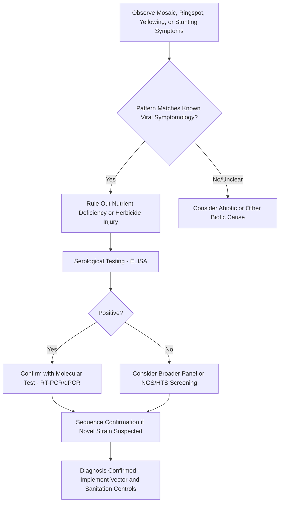

## Viral Plant Diseases

### Overview

Plant viruses are obligate intracellular parasites consisting of nucleic acid (RNA or DNA) enclosed in a protein coat, lacking independent metabolic machinery and entirely dependent on host cell machinery for replication. Unlike fungi and bacteria, viruses cannot penetrate intact plant surfaces on their own — they require a wound or a biological vector to breach the cell wall and cuticle. Despite their structural simplicity, plant viruses cause some of the most economically devastating diseases in agriculture, often because they are systemic, incurable once established, and spread efficiently by highly mobile insect vectors.

### Structure and Genome Organization

**Key Points**

- Most plant viruses have single-stranded RNA (ssRNA) genomes (positive-sense being most common); some have DNA genomes (e.g., Geminiviridae, Caulimoviridae) or double-stranded RNA.
- Capsid morphology is typically rod-shaped (rigid or flexuous, e.g., Tobamovirus, Potyvirus) or icosahedral (e.g., Comovirus, Nepovirus, Geminivirus in a distinctive twinned/geminate icosahedral form).
- Genome size is small (a few kilobases), encoding only essential proteins: coat protein, replicase, and movement protein(s); some groups are multipartite, splitting the genome across two or more separate particles that must all infect the same cell (e.g., Bromoviridae, Nepovirus).
- **Viroids** are a related but distinct entity — small, naked, circular ssRNA molecules with no protein coat at all, replicating using host enzymes and causing disease through structural interference with host RNA processing (e.g., Potato spindle tuber viroid).
- **Phytoplasmas** and **spiroplasmas** are wall-less bacteria (Mollicutes) phloem-limited and insect-vectored; they cause virus-like symptoms and are often studied alongside viral diseases due to similar vector biology, though they are prokaryotic, not viral.

### Movement Within the Plant

Once a virus enters a single cell, it must spread systemically to cause disease:

1. **Cell-to-cell movement** — via plasmodesmata, facilitated by virus-encoded **movement proteins (MPs)** that modify plasmodesmatal size-exclusion limits.
2. **Long-distance movement** — via the phloem (most common) or occasionally xylem, allowing the virus to reach distant plant parts from a single infection point.
3. **Systemic infection** — most plant viruses eventually infect the entire plant, including meristematic tissue in many cases, which has major implications for vegetative propagation (tubers, cuttings, grafts) as a spread pathway.

### Disease Cycle and Transmission Mechanisms

Because viruses cannot independently penetrate host tissue, transmission mode is the central organizing concept in plant virology.

**Vector-Mediated Transmission (most epidemiologically important)**

| Transmission Mode | Retention Period | Vector Behavior | Example Virus |
| --- | --- | --- | --- |
| Non-persistent (stylet-borne) | Seconds to minutes | Brief probing feeds acquire/transmit virus | Potato virus Y, Cucumber mosaic virus |
| Semi-persistent | Hours | Longer feeding required; retained in foregut | Beet yellows virus |
| Persistent-circulative | Days to weeks; virus circulates through vector body without replicating | Latent period before transmission; often lifelong retention | Barley yellow dwarf virus (aphid) |
| Persistent-propagative | Virus replicates within the vector | Vector is also a biological host; often transovarial transmission to vector offspring | Tomato spotted wilt virus (thrips), Rice dwarf virus (leafhopper) |

- **Aphids** are the dominant vector group for non-persistent and persistent viruses; transmission efficiency of non-persistent viruses is often *inversely* related to feeding time, since brief probing (not sustained feeding) is what transfers virus particles retained on the stylet tip.
- **Whiteflies** (*Bemisia tabaci*) — major vectors of Geminiviruses (e.g., Tomato yellow leaf curl virus, Cassava mosaic virus complex) via persistent-circulative transmission.
- **Thrips** — vector Tospoviruses (e.g., Tomato spotted wilt virus) via persistent-propagative transmission; uniquely, only larval-stage thrips can acquire the virus, though transmission occurs after they mature to adults.
- **Leafhoppers/Planthoppers** — vector phytoplasmas and certain propagative viruses (e.g., Rice dwarf virus).
- **Nematodes** — some soilborne viruses are transmitted by ectoparasitic nematode feeding on roots (e.g., Tobacco ringspot virus by *Xiphinema* spp.).
- **Fungi (as vectors)** — certain soilborne viruses are transmitted via zoospores of plasmodiophorid or chytrid organisms (e.g., Wheat soil-borne mosaic virus via *Polymyxa graminis*).

**Non-Vector Transmission**

- **Mechanical transmission** — sap contact via tools, hands, or plant-to-plant contact; important for stable, highly concentrated viruses such as Tobacco mosaic virus (TMV) and Tomato mosaic virus (ToMV), which can persist for extended periods on surfaces and in dried plant debris.
- **Seed transmission** — a subset of viruses can pass through seed to the embryo (e.g., Bean common mosaic virus, Lettuce mosaic virus), creating a critical pathway for long-distance and cross-season spread.
- **Vegetative propagation** — grafting, cuttings, and tubers transmit essentially all systemic viruses present in the parent plant; this is why certified virus-tested/virus-free propagation material programs are essential for vegetatively propagated crops (potato, citrus, grapevine, sugarcane, ornamentals).
- **Pollen transmission** — a smaller subset of viruses spread via infected pollen to seed or to the mother plant (e.g., some Nepoviruses, Ilarviruses).

**Diagram: Virus Transmission Pathways (svg_diagram)**

<svg xmlns="http://www.w3.org/2000/svg" viewBox="0 0 800 480">
<text x="400" y="30" text-anchor="middle" font-size="20" font-weight="bold" fill="#1a1a1a">Virus Transmission Pathways (svg_diagram)</text>
<g font-family="Arial" font-size="14">
<rect x="330" y="60" width="140" height="45" rx="8" fill="#d9ead3" stroke="#38761d" stroke-width="1.5" />
<text x="400" y="87" text-anchor="middle">Infected Plant</text>
<rect x="60" y="150" width="150" height="55" rx="8" fill="#cfe2f3" stroke="#1155cc" stroke-width="1.5" />
<text x="135" y="172" text-anchor="middle">Insect Vectors</text>
<text x="135" y="188" text-anchor="middle" font-size="11">(aphid, whitefly, thrips)</text>
<rect x="240" y="150" width="150" height="55" rx="8" fill="#fff2cc" stroke="#bf9000" stroke-width="1.5" />
<text x="315" y="172" text-anchor="middle">Mechanical/Sap</text>
<text x="315" y="188" text-anchor="middle" font-size="11">(tools, hands, contact)</text>
<rect x="420" y="150" width="150" height="55" rx="8" fill="#f4cccc" stroke="#990000" stroke-width="1.5" />
<text x="495" y="172" text-anchor="middle">Seed/Pollen</text>
<rect x="600" y="150" width="150" height="55" rx="8" fill="#e6d5f7" stroke="#674ea7" stroke-width="1.5" />
<text x="675" y="172" text-anchor="middle">Vegetative Propagation</text>
<text x="675" y="188" text-anchor="middle" font-size="11">(grafts, cuttings, tubers)</text>
<rect x="30" y="280" width="180" height="45" rx="8" fill="#d0e0e3" stroke="#134f5c" stroke-width="1.5" />
<text x="120" y="307" text-anchor="middle" font-size="12">Non-persistent/Semi/</text>
<text x="120" y="322" text-anchor="middle" font-size="12">Persistent-circulative</text>
<rect x="230" y="280" width="170" height="45" rx="8" fill="#fce5cd" stroke="#b45f06" stroke-width="1.5" />
<text x="315" y="307" text-anchor="middle" font-size="12">Persistent-propagative</text>
<rect x="200" y="380" width="400" height="50" rx="8" fill="#eeeeee" stroke="#666" stroke-width="1.5" />
<text x="400" y="410" text-anchor="middle" font-weight="bold">New Infected Plant / Systemic Spread</text>
<path d="M370,105 L150,150" stroke="#333" stroke-width="2" marker-end="url(#arrow3)" />
<path d="M400,105 L315,150" stroke="#333" stroke-width="2" marker-end="url(#arrow3)" />
<path d="M420,105 L495,150" stroke="#333" stroke-width="2" marker-end="url(#arrow3)" />
<path d="M470,90 L675,150" stroke="#333" stroke-width="2" marker-end="url(#arrow3)" />
<path d="M120,205 L120,280" stroke="#333" stroke-width="2" marker-end="url(#arrow3)" />
<path d="M180,205 L280,280" stroke="#333" stroke-width="2" marker-end="url(#arrow3)" />
<path d="M120,325 L350,380" stroke="#333" stroke-width="2" marker-end="url(#arrow3)" />
<path d="M315,325 L370,380" stroke="#333" stroke-width="2" marker-end="url(#arrow3)" />
<path d="M315,205 L400,380" stroke="#333" stroke-width="2" marker-end="url(#arrow3)" />
<path d="M495,205 L430,380" stroke="#333" stroke-width="2" marker-end="url(#arrow3)" />
<path d="M675,205 L500,380" stroke="#333" stroke-width="2" marker-end="url(#arrow3)" />
</g>
</svg>

### Major Virus Groups and Representative Diseases

**Tobamovirus**

- Rigid rod-shaped virions, extremely stable and mechanically transmissible.
- Example: *Tobacco mosaic virus* (TMV) — the first virus ever discovered/characterized (late 19th/early 20th century work by Ivanovsky and Beijerinck); causes mosaic mottling and leaf distortion in tobacco, tomato, and peppers.
- Example: *Tomato mosaic virus* (ToMV) — similarly stable, seed-transmissible, difficult to eradicate from greenhouse structures.

**Potyvirus (largest plant virus genus)**

- Flexuous rod-shaped, aphid-transmitted non-persistently.
- Example: *Potato virus Y* (PVY) — affects potato, tomato, pepper; major seed potato certification concern.
- Example: *Papaya ringspot virus* — devastated Hawaiian papaya production until transgenic resistant cultivars (e.g., "Rainbow" papaya) were deployed, a landmark case of biotechnology-based virus disease management.

**Cucumovirus**

- Icosahedral, wide host range, aphid-transmitted non-persistently.
- Example: *Cucumber mosaic virus* (CMV) — one of the broadest host-range plant viruses known, infecting hundreds of species across many families.

**Geminiviridae (Geminivirus)**

- Distinctive twinned (geminate) icosahedral particles, ssDNA genome, whitefly-transmitted (Begomovirus genus) in a persistent-circulative manner.
- Example: *Tomato yellow leaf curl virus* (TYLCV) — major constraint on tomato production in warm climates; whitefly (*Bemisia tabaci*) population management is central to control.
- Example: *African cassava mosaic virus* and related Cassava mosaic geminivirus complex — a food-security-critical disease across sub-Saharan Africa.

**Tospovirus (family Bunyaviricetes/Tospoviridae)**

- Enveloped, thrips-transmitted persistent-propagative virus.
- Example: *Tomato spotted wilt virus* (TSWV) — extremely broad host range, causes ringspots, necrotic lesions, and stunting; management relies heavily on thrips control and resistant cultivars carrying the *Sw-5* resistance gene.

**Luteovirus/Polerovirus**

- Phloem-limited, persistent-circulative aphid transmission.
- Example: *Barley yellow dwarf virus* (BYDV) — one of the most widespread cereal viruses globally, causing yellowing/reddening and stunting in wheat, barley, oats.

**Potexvirus/Carlavirus**

- Example: *Potato virus X* (PVX) — often causes mild or latent symptoms alone but severe synergistic symptoms in mixed infection with PVY ("PVX + PVY synergism"), illustrating that co-infection can amplify disease severity beyond either virus alone.

### Symptom Terminology

- **Mosaic** — irregular patches of light and dark green (or yellow) on leaves, the classic viral symptom, caused by uneven chloroplast development in infected versus uninfected tissue sectors.
- **Mottling** — similar to mosaic but less distinctly patterned.
- **Ringspot** — concentric ring-shaped chlorotic or necrotic lesions.
- **Vein clearing/vein banding** — chlorosis specifically along or adjacent to leaf veins, often an early symptom.
- **Leaf curling/leaf rolling** — associated with phloem-limited viruses (e.g., Geminiviruses, Luteoviruses).
- **Stunting** — reduced overall plant size and vigor from diverted metabolic resources and disrupted vascular function.
- **Yellowing/reddening** — often seen in phloem-restricted viruses (e.g., BYDV reddening in cereals) due to impaired sugar translocation and secondary pigment accumulation.
- **Distortion/malformation** — leaf strap-like narrowing, fern-leaf symptoms, or fruit deformation (e.g., "green blotch" or fruit distortion in some Tospovirus and Potyvirus infections).
- **Symptomless (latent) infection** — some virus-host combinations produce no visible symptoms yet remain fully infectious, which is precisely why virus-tested planting material programs are essential — visual inspection alone cannot rule out infection.

Note: unlike fungal or bacterial pathogens, viral infections generally do not have visible "signs" (there is no pathogen structure to observe on the plant surface) — diagnosis relies almost entirely on symptom pattern recognition and laboratory confirmation.

### Environmental and Ecological Drivers

- **Vector population dynamics** are the dominant driver of viral disease epidemics — weather conditions favoring vector reproduction and migration (e.g., mild winters allowing aphid overwintering survival, or wind patterns carrying whitefly/aphid populations into new fields) directly correlate with viral disease incidence.
- **Reservoir hosts** — many viruses persist in weeds, volunteer plants, or perennial crops between growing seasons, acting as a bridge for vectors to reintroduce virus into new plantings.
- **Cropping pattern and landscape structure** — continuous cropping, overlapping planting dates, and proximity to reservoir vegetation increase vector movement and virus spread between fields/seasons.
- **Temperature effects on symptom expression** — some viruses show temperature-dependent "masking" (mild symptoms at high temperature that reappear at cooler temperatures), a phenomenon exploited historically in **thermotherapy** for virus elimination from propagation stock.

### Diagnostic Methods

- **ELISA (Enzyme-Linked Immunosorbent Assay)** — the historical workhorse for routine virus detection; relies on antibodies raised against viral coat proteins; fast and low-cost for known, well-characterized viruses.
- **RT-PCR / qPCR** — amplifies viral nucleic acid (reverse-transcribed for RNA viruses), offering higher sensitivity and strain-level resolution than serology.
- **High-throughput sequencing (HTS)/metagenomics** — increasingly used for discovering novel or divergent viruses, and for comprehensive screening of certified propagation material, since it does not require prior knowledge of which specific virus to test for. [Inference: HTS adoption for routine certification programs is expanding but implementation specifics vary by country/program and continue to evolve.]
- **Indicator/indexing plants** — biological assays using known virus-sensitive species that develop diagnostic symptoms (e.g., *Nicotiana* or *Chenopodium* species) when mechanically inoculated with sap from a suspect plant; still used as a confirmatory or low-cost method, particularly in certification schemes.
- **Grafting/bioassay indexing** — used extensively in perennial crop certification (citrus, grapevine, fruit trees) where graft-transmission to a known-susceptible indicator plant reveals latent viral infections not otherwise detectable.

### Integrated Management of Viral Diseases

Because there is no direct curative chemical treatment for a virus-infected plant (unlike fungicides or bactericides for other pathogen classes), management is overwhelmingly preventive and vector-focused.

**Vector Management**

- Insecticide applications targeted at vector populations — though efficacy against non-persistent virus transmission is often limited, since transmission can occur within seconds of vector probing, faster than most insecticides act.
- Reflective mulches (aluminum/UV-reflective plastic) to repel aphids and whiteflies from settling on crop canopy.
- Physical barriers — insect-proof netting/screening in high-value or nursery production.
- Trap cropping and border/perimeter management to intercept incoming vectors before they reach the main crop.

**Sanitation and Cultural Controls**

- Roguing (removal) of infected plants early in the season to reduce inoculum sources for vector-mediated spread.
- Elimination of weed and volunteer reservoir hosts around field margins.
- Avoiding mechanical spread — disinfecting tools, avoiding handling healthy plants after infected ones (particularly critical for stable viruses like TMV/ToMV), and controlling worker movement patterns in greenhouses.
- Use of certified virus-tested/virus-indexed planting material — the single most effective control point for vegetatively propagated crops.

**Host Resistance**

- Natural resistance/tolerance genes (e.g., *Tm-2^2* in tomato against ToMV, *Sw-5* against TSWV) — often race-specific and subject to resistance-breaking strain emergence.
- **Cross-protection** — deliberate inoculation with a mild virus strain to induce resistance against severe strains of the same virus, historically used in citrus tristeza virus management.
- **Transgenic/GM resistance** — pathogen-derived resistance strategies (e.g., coat-protein-mediated resistance in Papaya ringspot virus–resistant papaya) represent a well-documented biotechnology success case; broader adoption varies by crop and regulatory jurisdiction. [Unverified: current regulatory approval status for specific virus-resistant GM crops varies by country and is subject to change — consult current regulatory authority listings.]
- RNA interference (RNAi)-based resistance strategies are an active area of applied research for engineering virus resistance in crops. [Speculation: commercial-scale deployment breadth across crop species remains an evolving area as of current literature.]

**Thermotherapy and Meristem Culture**

- Heat treatment (thermotherapy) combined with meristem-tip culture is a standard technique to produce virus-free propagation stock in vegetatively propagated crops, exploiting the fact that virus concentration is typically lowest in the actively dividing meristematic dome.

### Example: Managing Tomato Yellow Leaf Curl Virus

**Example**

- **Host**: Tomato (*Solanum lycopersicum*).
- **Pathogen**: Tomato yellow leaf curl virus (TYLCV), a Begomovirus.
- **Vector**: *Bemisia tabaci* (whitefly), persistent-circulative transmission.
- **Symptoms**: upward leaf curling, yellowing of leaf margins, severe stunting, flower abortion leading to major yield loss, especially when infection occurs at early growth stages.
- **Management stack**: whitefly population monitoring and management (insecticides, reflective mulch, insect netting in nurseries/transplant production), use of TYLCV-resistant tomato cultivars (bred using introgressed resistance genes from wild *Solanum* relatives), roguing of early-infected plants, and elimination of weed reservoir hosts around field margins.

### Conclusion

Viral plant diseases occupy a fundamentally different management paradigm from fungal and bacterial diseases: there is no direct chemical cure once a plant is infected, so control depends almost entirely on preventing introduction and spread — via vector management, sanitation, certified clean planting material, and resistant cultivars. Understanding a virus's specific transmission mode (mechanical, seed, vegetative, or a particular vector relationship) is the single most important diagnostic and management-planning step in viral plant pathology.

**Related Topics**

- Insect vectors of plant pathogens (aphids, whiteflies, thrips, leafhoppers)
- Phytoplasma and spiroplasma diseases (Mollicutes)
- Viroids and subviral pathogens
- Virus-tested/virus-indexed certification programs for vegetatively propagated crops
- Meristem culture and thermotherapy for virus elimination
- Transgenic and RNAi-based virus resistance strategies
- Bacterial plant diseases and fungal diseases of crops (comparative diagnostics)
- Plant virus epidemiology and landscape-level spread modeling
- Cross-protection strategies in perennial crop virus management
- High-throughput sequencing for plant virus discovery and biosecurity screening