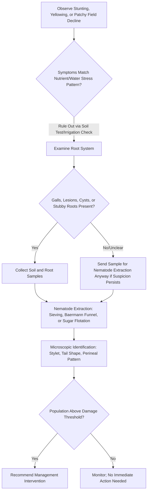

## Nematode Pests

### Overview

Plant-parasitic nematodes are microscopic, unsegmented roundworms (phylum Nematoda) that feed on plant tissue, primarily roots, using a specialized piercing mouthpart called a **stylet**. Although often studied alongside plant pathology because they cause disease-like symptoms and frequently interact with fungal and bacterial pathogens to worsen disease outcomes, nematodes are technically classified as pests (animals) rather than microbial pathogens. They are among the most economically damaging yet under-diagnosed constraints in agriculture, since their below-ground feeding produces symptoms (stunting, wilting, chlorosis) that are easily mistaken for nutrient deficiency, water stress, or other soilborne diseases.

### Nematode Biology Relevant to Plant Parasitism

**Key Points**

- Body size typically 0.3–3 mm, requiring microscopy for direct observation and identification.
- The **stylet** (a hollow, protrusible, needle-like structure) is the defining feeding structure — used to puncture plant cell walls, inject digestive secretions (esophageal gland enzymes), and withdraw cell contents.
- Life cycle stages: egg → four juvenile (larval) stages (J1–J4, separated by molts) → adult; most plant-parasitic nematodes retain a similar general body form throughout development (unlike insects with metamorphosis), except for sedentary endoparasites, which undergo dramatic body swelling in later juvenile/adult stages.
- Reproduction can be sexual (requiring both males and females), parthenogenetic (asexual, females only), or hermaphroditic depending on genus — this affects population growth rate and genetic diversity, with parthenogenetic species often building damaging populations faster.
- Generation time is short (typically 3–6 weeks under favorable soil temperature and moisture), allowing several generations per growing season for many species.

### Feeding Strategy Classification

Plant-parasitic nematodes are broadly classified by feeding behavior, which strongly predicts symptom pattern and management approach.

**Ectoparasites**

- Remain outside the root, feeding by inserting only the stylet while the body stays in the soil.
- Example: *Xiphinema* spp. (dagger nematodes) — also significant as vectors of certain plant viruses (e.g., Grapevine fanleaf virus).
- Example: *Trichodorus*/*Paratrichodorus* spp. (stubby-root nematodes) — cause characteristic stunted, stubby root systems; also virus vectors (Tobacco rattle virus).

**Migratory Endoparasites**

- Enter root tissue and move through it, feeding as they migrate, causing necrotic tunneling injury.
- Example: *Pratylenchus* spp. (lesion nematodes) — cause dark necrotic root lesions, wide host range across field and horticultural crops; often facilitate secondary fungal/bacterial infection through wound sites.
- Example: *Radopholus similis* (burrowing nematode) — major pathogen of banana and citrus, causing extensive root tunneling and toppling disease in banana.

**Sedentary Endoparasites**

- Establish a permanent feeding site within root tissue, inducing specialized host cells (giant cells or syncytia) that supply nutrients for the remainder of the nematode's life; the female typically becomes immobile and swells substantially.
- Example: *Meloidogyne* spp. (root-knot nematodes) — induce characteristic root galls ("knots") via giant-cell formation; one of the most economically damaging and widely distributed plant-parasitic nematode genera globally, with an extremely broad host range spanning vegetables, field crops, and ornamentals.
- Example: *Heterodera* and *Globodera* spp. (cyst nematodes) — induce syncytia; mature females die and their cuticle hardens into a protective cyst containing hundreds of eggs, which can persist in soil for many years even without a host present. *Globodera rostochiensis* and *G. pallida* (potato cyst nematodes) are subject to strict quarantine regulation in many potato-producing regions.
- Example: *Heterodera glycines* (soybean cyst nematode) — one of the most economically damaging pathogens of soybean in producing regions worldwide.

**Semi-Endoparasites**

- Partially embed the anterior body in root tissue while the posterior remains outside.
- Example: *Rotylenchulus reniformis* (reniform nematode) — significant pest of cotton and various vegetable crops.

**Foliar and Stem Nematodes (non-root feeders)**

- Example: *Ditylenchus dipsaci* (stem and bulb nematode) — attacks above-ground tissue (stems, bulbs) rather than roots, causing swelling, distortion, and discoloration in crops like onion, garlic, and alfalfa.
- Example: *Aphelenchoides* spp. (foliar nematodes) — cause angular necrotic lesions bounded by leaf veins in ornamentals and some vegetables, spread by water film on leaf surfaces.

### Disease Cycle and Life Cycle

1. **Egg stage** — deposited in soil, in a gelatinous egg mass (root-knot nematodes), or retained within the protective cyst (cyst nematodes).
2. **Hatching** — triggered by favorable temperature and moisture; for cyst nematodes, hatching is often stimulated specifically by root exudates from a host plant, a chemical cue that synchronizes hatch with host availability.
3. **Juvenile (J2) infective stage** — the primary infective stage for most sedentary endoparasites; migrates through soil toward roots using chemotactic cues from root exudates.
4. **Root penetration** — stylet-mediated entry, often near the root tip or through wounds.
5. **Feeding site establishment** — for sedentary species, secretion of effector proteins reprograms host cell development to form giant cells (root-knot) or syncytia (cyst nematodes).
6. **Molting through J3–J4 to adult** — occurs at or near the feeding site for sedentary species.
7. **Reproduction** — egg-laying (root-knot: gelatinous egg mass extruded outside root tissue; cyst nematodes: eggs retained inside the hardened cyst body).
8. **Survival** — eggs within protective structures (egg masses, cysts) can persist in soil for extended periods between susceptible host crops, in some cyst nematode species for over a decade in the absence of a host. [Inference: exact multi-year survival duration is species- and environment-dependent; the general long-term persistence phenomenon in cyst structures is well documented.]

**Diagram: Root-Knot Nematode Disease Cycle (svg_diagram)**

<svg xmlns="http://www.w3.org/2000/svg" viewBox="0 0 800 500">
<text x="400" y="30" text-anchor="middle" font-size="19" font-weight="bold" fill="#1a1a1a">Root-Knot Nematode Disease Cycle (svg_diagram)</text>
<g font-family="Arial" font-size="13">
<rect x="330" y="65" width="140" height="45" rx="8" fill="#d9ead3" stroke="#38761d" stroke-width="1.5" />
<text x="400" y="92" text-anchor="middle">Egg in Soil</text>
<rect x="540" y="150" width="150" height="45" rx="8" fill="#cfe2f3" stroke="#1155cc" stroke-width="1.5" />
<text x="615" y="172" text-anchor="middle">Hatch to J2</text>
<text x="615" y="186" text-anchor="middle" font-size="11">(infective juvenile)</text>
<rect x="540" y="260" width="170" height="45" rx="8" fill="#fff2cc" stroke="#bf9000" stroke-width="1.5" />
<text x="625" y="282" text-anchor="middle">Root Penetration</text>
<text x="625" y="296" text-anchor="middle" font-size="11">(near root tip)</text>
<rect x="440" y="370" width="180" height="50" rx="8" fill="#f4cccc" stroke="#990000" stroke-width="1.5" />
<text x="530" y="392" text-anchor="middle">Giant Cell Formation</text>
<text x="530" y="406" text-anchor="middle" font-size="11">(root gall develops)</text>
<rect x="220" y="370" width="180" height="50" rx="8" fill="#e6d5f7" stroke="#674ea7" stroke-width="1.5" />
<text x="310" y="392" text-anchor="middle">Molt J3-J4-Adult</text>
<text x="310" y="406" text-anchor="middle" font-size="11">Female swells</text>
<rect x="60" y="260" width="170" height="45" rx="8" fill="#d0e0e3" stroke="#134f5c" stroke-width="1.5" />
<text x="145" y="282" text-anchor="middle">Egg Mass Extruded</text>
<text x="145" y="296" text-anchor="middle" font-size="11">outside root surface</text>
<rect x="90" y="150" width="150" height="45" rx="8" fill="#fce5cd" stroke="#b45f06" stroke-width="1.5" />
<text x="165" y="177" text-anchor="middle">Return to Soil</text>
<path d="M460,100 L590,155" stroke="#333" stroke-width="2" marker-end="url(#arrow4)" />
<path d="M615,195 L620,260" stroke="#333" stroke-width="2" marker-end="url(#arrow4)" />
<path d="M600,305 L560,370" stroke="#333" stroke-width="2" marker-end="url(#arrow4)" />
<path d="M440,395 L400,395" stroke="#333" stroke-width="2" marker-end="url(#arrow4)" />
<path d="M280,370 L200,305" stroke="#333" stroke-width="2" marker-end="url(#arrow4)" />
<path d="M180,260 L175,195" stroke="#333" stroke-width="2" marker-end="url(#arrow4)" />
<path d="M220,160 L340,95" stroke="#333" stroke-width="2" marker-end="url(#arrow4)" />
</g>
</svg>

### Symptom Terminology

**Above-Ground Symptoms (non-specific, often mistaken for other stresses)**

- Stunting and reduced vigor, often in patches or irregular field patterns reflecting soil nematode distribution.
- Chlorosis/yellowing resembling nutrient deficiency (particularly nitrogen).
- Wilting under moisture stress disproportionate to actual soil moisture levels, due to root system dysfunction.
- Reduced yield without dramatic visible foliar symptoms in low-to-moderate infestations — a key reason nematode damage is frequently underdiagnosed.

**Below-Ground Symptoms (diagnostic)**

- **Galls/knots** — swollen root tissue, the hallmark sign of *Meloidogyne* infection; distinct from beneficial nitrogen-fixing nodules on legume roots (nodules can be dislodged easily and have a distinct internal pink coloration from leghemoglobin; galls are integral to root tissue and cannot be removed without damaging the root).
- **Root lesions** — dark, necrotic, sunken areas from migratory endoparasite feeding (e.g., *Pratylenchus*).
- **Stubby, shortened roots** — from ectoparasitic feeding at root tips (e.g., *Trichodorus*).
- **Cysts** — small, often lemon-shaped, visible (with hand lens or dissecting scope) structures attached to root surfaces, initially white/cream, turning brown at maturity (*Heterodera*, *Globodera*).
- **Reduced root mass and excessive lateral branching ("hairy root" appearance)** — a compensatory but inefficient root growth response to nematode injury.

### Interactions with Other Pathogens (Disease Complexes)

Nematodes frequently interact synergistically with fungal and bacterial pathogens, producing disease severity greater than either organism alone:

- **Fusarium wilt–nematode complex** ("nematode-fungus disease complex") — root-knot nematode feeding wounds and physiological changes predispose plants to more severe *Fusarium oxysporum* wilt symptoms; well documented in cotton and other crops.
- Nematode feeding punctures serve as entry wounds for opportunistic soilborne fungi and bacteria, effectively lowering the threshold inoculum needed for secondary infection.
- Some nematode species act as direct **virus vectors** (dagger and stubby-root nematodes, as noted above), transmitting nepoviruses and tobraviruses via feeding.

### Environmental and Ecological Drivers

- **Soil temperature** — nematode activity and reproduction rates increase with warming soil up to species-specific optima (many root-knot and cyst nematode species favor warm soils, roughly 25–30°C).
- **Soil texture** — sandy soils generally support higher nematode mobility and populations than heavy clay soils, which physically restrict movement.
- **Soil moisture** — adequate but not waterlogged moisture supports nematode movement (a thin water film facilitates locomotion); extremely dry or saturated/anaerobic soils suppress activity.
- **Host plant presence** — population dynamics of most plant-parasitic nematodes depend heavily on availability of susceptible host root exudates to stimulate hatching and directional movement (chemotaxis).

### Diagnostic Workflow

- **Soil sampling protocol** — samples should be taken from the root zone (typically 15–20 cm depth) using a systematic pattern (zigzag or grid) across the field, since nematode distribution is often highly aggregated/patchy rather than uniform.
- **Extraction methods** — Baermann funnel technique (relies on nematode motility to migrate through a mesh into water), sugar/sucrose centrifugal flotation, and elutriation/sieving methods separate nematodes from soil and root debris for counting and identification.
- **Identification** — based on morphological characters (stylet length/shape, tail shape, perineal pattern in mature *Meloidogyne* females, cyst shape) under compound microscopy, increasingly supplemented or replaced by molecular/PCR-based species identification for greater accuracy and speed. [Inference: the relative balance of morphological versus molecular diagnostic use varies by laboratory and region; both approaches are standard/established in nematology.]
- **Damage threshold concept** — management decisions are typically based on population density thresholds (nematodes per unit soil volume) rather than presence/absence alone, since low populations often cause negligible economic damage. [Inference: specific threshold values are species-, crop-, and region-specific and require reference to local extension/diagnostic lab guidance.]

### Integrated Nematode Management

**Cultural Controls**

- **Crop rotation** with non-host or poor-host crops — effective against species with narrower host ranges (e.g., soybean cyst nematode rotation with non-host crops); less effective against extremely broad-host-range genera like *Meloidogyne*, which can maintain populations on many rotation crop options.
- **Fallow periods** — bare fallow reduces nematode populations over time in the absence of host root exudates to sustain the population, though this comes at the cost of lost production and potential soil erosion/organic matter decline.
- **Sanitation** — cleaning equipment between fields, using nematode-free planting material/transplants, and avoiding movement of infested soil on tools, boots, and machinery.
- **Organic amendments** — incorporation of composts, manures, and cover crops can suppress nematode populations partly by promoting antagonistic soil microbial communities (nematode-trapping fungi, nematophagous bacteria) and improving overall soil health.
- **Solarization** — using clear plastic mulch to raise soil temperature to lethal levels for nematodes (and many other soilborne pests) in warm, sunny climates; primarily effective in surface soil layers.

**Host Resistance**

- Resistant cultivars carrying specific resistance genes (e.g., the *Mi* gene conferring root-knot nematode resistance in tomato) are a cornerstone of management where available; resistance-breaking populations/species can emerge under sustained selection pressure, particularly relevant with *Meloidogyne* species that can overcome single-gene resistance under high inoculum pressure or elevated soil temperature in some cases. [Inference: temperature-dependent resistance breakdown is documented for specific gene-species combinations (e.g., *Mi* gene efficacy reduction at high soil temperature) but is not universal across all resistance genes.]
- Grafting susceptible scions onto nematode-resistant rootstocks — widely used in vegetable production (e.g., tomato, cucurbits) as a non-chemical management tool.

**Biological Control**

- Nematophagous (nematode-trapping) fungi (e.g., *Purpureocillium lilacinum*, formerly *Paecilomyces lilacinus*, and various *Trichoderma* species) parasitize nematode eggs and juveniles.
- *Pasteuria penetrans* — an obligate bacterial parasite of root-knot nematodes, used as a biological seed/soil treatment component in some integrated programs.
- Certain plant species with nematicidal or nematode-suppressive properties (e.g., marigold, *Tagetes* spp., some Brassica cover crops releasing biofumigant glucosinolate breakdown products) are used as rotation or intercropping components.

**Chemical Control**

- **Nematicides** — historically included broad-spectrum soil fumigants (e.g., methyl bromide, now phased out in many jurisdictions under international environmental agreements) and non-fumigant nematicides (e.g., organophosphates, carbamates); regulatory availability and restrictions vary considerably by country and continue to evolve due to environmental and human health concerns. [Unverified: current registration status of specific nematicide active ingredients is jurisdiction-dependent and subject to ongoing regulatory change — consult current local regulatory authority listings before use.]
- Seed treatments and biologically derived nematicidal products (e.g., abamectin-based seed treatments) are increasingly used as more targeted alternatives to broad-spectrum soil fumigation.

### Example: Managing Root-Knot Nematode in Vegetable Production

**Example**

- **Host**: Tomato (highly susceptible without resistance genes).
- **Pathogen/pest**: *Meloidogyne incognita* (Southern root-knot nematode), among the most widely distributed root-knot species.
- **Diagnosis**: patchy stunting and yellowing across a field, confirmed by extracting roots and observing characteristic galling; soil sample sent for extraction and population density estimation.
- **Management stack**: use of *Mi*-gene resistant tomato cultivars or resistant rootstock grafting, rotation with a non-host cereal crop for at least one season where feasible, incorporation of composted organic matter to build antagonistic soil biology, and avoidance of moving infested soil/equipment into clean fields.

### Conclusion

Nematode pests occupy a distinct niche in plant pathology curricula: animals rather than microbes, but producers of disease-like symptoms that are frequently confused with nutritional or fungal/bacterial problems and that often synergize with true pathogens to worsen outcomes. Effective management depends on accurate below-ground diagnosis (root examination and laboratory extraction), understanding species-specific feeding strategy and host range, and layering cultural, resistance, biological, and where appropriate chemical tools, since no single tactic reliably eliminates an established soil nematode population.

**Related Topics**

- Fungal diseases of crops and bacterial plant diseases (disease complex interactions)
- Soil health and suppressive soil ecology
- Cover cropping and biofumigation strategies
- Grafting and rootstock selection in vegetable production
- Soil solarization and physical pest management techniques
- Nematode extraction and identification laboratory techniques
- Certified planting material and phytosanitary regulation for quarantine nematode species
- Integrated Pest Management (IPM) principles across pathogen and pest categories
- Plant virus vectors among soil-dwelling organisms
- Precision agriculture applications for site-specific nematode population mapping