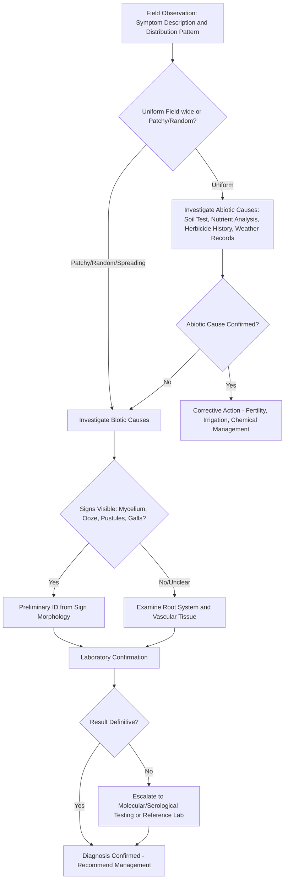

## Disease Diagnosis Techniques

### Overview

Accurate plant disease diagnosis is the foundation of effective crop protection — a wrong diagnosis leads to wasted inputs, ineffective treatment timing, and continued crop loss. Diagnosis in plant pathology draws on a layered approach: field-level observation and pattern recognition, laboratory-based morphological and physiological examination, and increasingly, molecular and serological confirmation. No single technique is universally sufficient; diagnosticians typically combine methods, moving from cheap/fast screening tools toward more specific and costly confirmatory tests only as needed.

### The Diagnostic Framework: Signs vs. Symptoms

**Key Points**

- A **symptom** is the plant's visible or measurable response to disease (e.g., chlorosis, necrosis, wilting, stunting, galling) — it reflects host reaction, not the pathogen itself.
- A **sign** is direct physical evidence of the pathogen (e.g., fungal mycelium, spore masses, bacterial ooze, nematode cysts, rust pustules) — signs allow more confident diagnosis than symptoms alone, since many different causes (biotic and abiotic) can produce similar symptoms.
- **Biotic vs. abiotic distinction** is the first branch point in any diagnostic workflow: infectious pathogens (fungi, bacteria, viruses, nematodes, phytoplasmas) versus non-infectious disorders (nutrient deficiency/toxicity, herbicide injury, mechanical damage, weather stress, genetic disorders).
- Distribution pattern in the field is a critical early clue: **random or patchy distribution** suggests a biotic cause with limited initial inoculum sources spreading outward; **uniform, field-wide distribution** suggests an abiotic cause affecting the whole area equally (nutrient deficiency, soil pH problem, chemical drift, weather event).

### General Diagnostic Workflow

### Field-Level Observation Techniques

**History Taking and Site Assessment**

- Crop history: previous crops grown, rotation sequence, prior disease occurrences at the site.
- Cultural practice review: fertilization history, irrigation method and schedule, recent pesticide/herbicide applications, planting date and seed/transplant source.
- Weather history: recent temperature extremes, rainfall/humidity patterns, frost events, hail — all can mimic or predispose to disease symptoms.
- Symptom onset timing relative to specific events (irrigation change, spray application, weather event) helps distinguish abiotic triggers from progressive biotic spread.

**Symptom Pattern Analysis**

- **Spatial pattern**: random scattering (suggests airborne/soilborne biotic spread from point sources), radiating/expanding patches (suggests spreading infectious disease, often soilborne), uniform whole-field expression (suggests abiotic or systemic seed-borne issue), or patterns following field topography/drainage lines (often points to waterlogging, salinity, or soilborne pathogen distribution tied to moisture).
- **Symptom progression over time**: rapid symptom development and plant death often indicates aggressive necrotrophic pathogens or acute abiotic stress (chemical injury, frost); slow progressive decline often indicates vascular wilts, root rots, or chronic nutrient/nematode issues.
- **Plant part affected**: foliar-only symptoms versus root-focused symptoms versus vascular discoloration each point toward different pathogen categories.

**Direct Field Examination Tools**

- **Hand lens (10–20x magnification)** — allows visualization of small signs not visible to the naked eye (early rust pustules, small sclerotia, nematode cysts, mite presence for differential diagnosis).
- **Root excavation** — critical since many important diagnostic signs (galls, lesions, cysts, discoloration) are below ground and missed by foliage-only inspection.
- **Vascular streaming test** — cutting a symptomatic stem cross-section and suspending it in clear water; a milky bacterial ooze stream confirms a vascular bacterial pathogen and helps distinguish bacterial wilts from fungal vascular wilts (which typically show only vascular discoloration without streaming).
- **Stem/crown dissection** — longitudinal or cross-sectional cuts through stems, crowns, and root collars reveal internal discoloration patterns diagnostic of specific vascular pathogens (e.g., characteristic browning patterns in Fusarium versus Verticillium wilt).

### Laboratory Morphological Techniques

**Microscopy**

- **Compound light microscopy** — standard tool for examining fungal spore morphology (shape, septation, color, size), essential for genus-level and often species-level fungal identification.
- **Dissecting (stereo) microscopy** — used for larger-scale structures: sclerotia, nematode cysts, insect examination for differential diagnosis, and initial sample triage before higher-magnification work.
- **Wet mount preparation** — a small tissue sample or spore suspension mounted in water or lactophenol cotton blue stain on a slide for microscopic examination; a routine, low-cost first diagnostic step for suspected fungal pathogens.

**Culturing Techniques**

- **Isolation onto growth media** — pathogen tissue is surface-sterilized (to eliminate surface contaminants) and plated onto general media (potato dextrose agar, PDA) or selective/semi-selective media formulated to favor growth of specific pathogen groups while suppressing others.
- **Selective media examples**: King's B medium favors fluorescent *Pseudomonas* species; specific semi-selective media exist for *Ralstonia solanacearum*, *Phytophthora* species, and various other economically important pathogens, incorporating antibiotics or other inhibitory compounds that suppress non-target microorganisms.
- **Colony morphology assessment** — growth rate, colony color, texture, and pigment production on standard media provide preliminary identification clues before microscopic spore examination.
- **Single-spore or hyphal-tip isolation** — techniques to obtain a genetically pure culture from a mixed or contaminated sample, essential before molecular identification or pathogenicity testing.

**Koch's Postulates**

The classical framework for confirming a causal relationship between a suspected pathogen and observed disease, particularly important when diagnosing a novel or previously unreported pathogen-host combination:

1. The suspected pathogen must be consistently found associated with diseased plants showing the symptoms in question.
2. The pathogen must be isolated from diseased tissue and grown in pure culture.
3. Inoculating the pure culture onto a healthy plant of the same species/cultivar must reproduce the identical disease symptoms.
4. The same pathogen must be re-isolated from the newly symptomatic plant and shown to match the original isolate.

[Inference: Koch's postulates require modification for obligate biotrophs that cannot be cultured on artificial media (e.g., rusts, powdery mildews, many viruses) — in these cases, alternative confirmatory approaches such as maintaining the pathogen on live host tissue for re-inoculation, or molecular detection consistency, substitute for the standard pure-culture step; this modification is a well-established, standard practice in plant pathology, not a speculative workaround.]

### Serological Techniques

**ELISA (Enzyme-Linked Immunosorbent Assay)**

- Uses antibodies raised against specific pathogen antigens (commonly viral coat proteins, but also usable for some bacterial and fungal targets) bound to a substrate plate; a color-change reaction indicates presence of the target pathogen.
- **DAS-ELISA (Double Antibody Sandwich)** is the most common format for plant virus detection — highly specific, moderate cost, widely used in seed/planting-material certification programs and routine diagnostic labs.
- Advantages: relatively low cost per sample, fast turnaround, does not require specialized molecular biology equipment, well suited to high sample-volume screening.
- Limitations: requires a pre-existing, validated antibody for the specific target pathogen (cannot detect unknown or novel pathogens), and lower sensitivity than molecular methods for very low pathogen titers.

**Lateral Flow Devices / Immunostrips**

- Field-deployable, rapid (minutes) antibody-based test strips, functioning similarly in principle to a home pregnancy test; used for rapid on-site screening of suspected viral or some bacterial infections without laboratory access, at the cost of somewhat lower sensitivity than laboratory ELISA.

### Molecular Diagnostic Techniques

**PCR (Polymerase Chain Reaction) and Variants**

- **Conventional PCR** — amplifies a specific DNA target region using pathogen-specific primers; result visualized via gel electrophoresis (presence/absence of a band of expected size).
- **RT-PCR (Reverse Transcription PCR)** — required for RNA-genome pathogens (most plant viruses), converting RNA to complementary DNA (cDNA) before amplification.
- **qPCR (quantitative/real-time PCR)** — allows quantification of pathogen load in addition to detection, useful for assessing infection severity and for research/epidemiological applications; generally more sensitive than conventional PCR and avoids gel electrophoresis by monitoring fluorescence in real time.
- **Multiplex PCR** — simultaneous detection of multiple pathogens in a single reaction using multiple primer pairs, increasing diagnostic efficiency for samples with suspected mixed infections or unclear symptomology.

**Isothermal Amplification Methods**

- **LAMP (Loop-Mediated Isothermal Amplification)** — amplifies target DNA/RNA at a constant temperature (no thermal cycler required), making it well suited to field-deployable diagnostic kits; results can be read by visual color change or turbidity, offering a faster and more portable alternative to conventional PCR for point-of-care or point-of-field testing. [Inference: field-kit sensitivity and specificity performance can vary by manufacturer and target pathogen; the underlying LAMP methodology itself is standard and well documented.]
- **RPA (Recombinase Polymerase Amplification)** — another isothermal method gaining use in portable plant pathogen diagnostics, operating at lower temperatures than LAMP in some formats.

**Sequencing-Based Methods**

- **Sanger sequencing** — used to confirm species/strain identity from a PCR amplicon by comparing the resulting sequence against reference databases (e.g., GenBank), particularly valuable for confirming novel or ambiguous PCR results.
- **High-throughput sequencing (HTS) / Next-Generation Sequencing (NGS) / Metagenomics** — sequences all nucleic acid in a sample without requiring prior knowledge of the target pathogen, enabling discovery of novel or unexpected pathogens and comprehensive screening of certified propagation material; increasingly used in advanced diagnostic labs and biosecurity/quarantine screening programs. [Inference: routine adoption breadth for HTS in standard extension-level diagnostics (versus specialized/reference labs) continues to expand and varies by region and program resourcing.]
- **DNA barcoding** — using standardized, short genetic marker regions (e.g., ITS region for fungi, specific gene regions for bacteria) to identify species by comparison against curated reference sequence databases.

**Diagram: Diagnostic Technique Selection by Confidence and Cost (svg_diagram)**

<svg xmlns="http://www.w3.org/2000/svg" viewBox="0 0 800 460">
<text x="400" y="30" text-anchor="middle" font-size="19" font-weight="bold" fill="#1a1a1a">Diagnostic Technique Selection (svg_diagram)</text>
<line x1="100" y1="400" x2="750" y2="400" stroke="#333" stroke-width="2" />
<line x1="100" y1="400" x2="100" y2="60" stroke="#333" stroke-width="2" />
<text x="425" y="440" text-anchor="middle" font-size="14" font-weight="bold">Cost / Turnaround Time (increasing right)</text>
<text x="40" y="230" text-anchor="middle" font-size="14" font-weight="bold" transform="rotate(-90 40 230)">Specificity / Confidence</text>
<g font-family="Arial" font-size="12">
<rect x="130" y="360" width="120" height="30" rx="6" fill="#d9ead3" stroke="#38761d" />
<text x="190" y="380" text-anchor="middle">Field Symptom ID</text>
<rect x="270" y="320" width="120" height="30" rx="6" fill="#cfe2f3" stroke="#1155cc" />
<text x="330" y="340" text-anchor="middle">Hand Lens/Signs</text>
<rect x="400" y="270" width="130" height="30" rx="6" fill="#fff2cc" stroke="#bf9000" />
<text x="465" y="290" text-anchor="middle">Microscopy/Culture</text>
<rect x="530" y="210" width="120" height="30" rx="6" fill="#f4cccc" stroke="#990000" />
<text x="590" y="230" text-anchor="middle">ELISA/LAMP</text>
<rect x="630" y="150" width="110" height="30" rx="6" fill="#e6d5f7" stroke="#674ea7" />
<text x="685" y="170" text-anchor="middle">PCR/qPCR</text>
<rect x="600" y="90" width="140" height="30" rx="6" fill="#d0e0e3" stroke="#134f5c" />
<text x="670" y="110" text-anchor="middle">Sequencing/HTS</text>
</g>
</svg>

### Diagnosing Abiotic Disorders (Ruling Out Non-Infectious Causes)

Abiotic diagnosis relies on different tools than biotic diagnosis, since there is no pathogen to isolate:

- **Soil testing** — pH, nutrient levels (N, P, K, micronutrients), electrical conductivity (salinity), and organic matter content; nutrient deficiency and toxicity symptoms often have characteristic, well-documented visual patterns (e.g., interveinal chlorosis pattern differs between iron, magnesium, and manganese deficiency).
- **Plant tissue analysis** — laboratory nutrient analysis of leaf tissue, compared against established sufficiency ranges for the crop and growth stage, provides more direct evidence of nutritional status than soil testing alone.
- **Herbicide injury diagnosis** — symptom patterns often correlate with herbicide mode of action (e.g., growth regulator herbicide injury causes characteristic leaf cupping/twisting; photosynthesis-inhibiting herbicides cause interveinal chlorosis progressing to necrosis); spray records and drift pattern analysis (symptom severity decreasing with distance from a suspected drift source) support diagnosis.
- **Environmental/weather damage assessment** — correlating symptom onset with historical weather data (frost events, hail, drought stress, waterlogging) from site records or nearby weather stations.
- **Genetic/varietal disorders** — some symptoms are cultivar-specific physiological responses rather than disease (e.g., certain genetic leaf variegations or fruit disorders), distinguished by consistent expression across a known cultivar regardless of field conditions.

### Bioassay and Indicator Plant Techniques

- **Indicator/indexing plants** — mechanical sap inoculation of a suspect sample onto a known virus-sensitive indicator species (e.g., certain *Nicotiana* or *Chenopodium* species) that develops distinctive, well-characterized symptoms if the target virus is present; a long-standing, low-cost confirmatory method still used in certification programs alongside newer molecular tools.
- **Graft transmission/indexing** — used extensively in perennial crop certification (citrus, grapevine, stone fruit) to detect latent viral or phytoplasma infections not otherwise visible, by grafting a scion from the suspect plant onto a known-susceptible indicator rootstock and observing for characteristic symptom development over an extended monitoring period.
- **Baiting techniques** — used for soilborne pathogens such as *Phytophthora* species, where a susceptible plant tissue (e.g., young leaves or fruit) is floated on soil-water suspensions or placed in infested soil to attract and allow recovery of the pathogen for subsequent isolation and identification.

### Sample Collection and Submission Best Practices

**Example**

- Collect samples showing a **range of symptom stages** (early, moderate, advanced) rather than only the most severely affected (often dead or overrun by secondary saprophytic organisms) tissue, since advanced necrotic tissue frequently yields unreliable or misleading culture results dominated by secondary colonizers.
- Include the **transition zone** between healthy and diseased tissue when sampling for culturing, as this zone is most likely to yield the primary causal organism rather than secondary decomposers.
- For root/vascular disease suspicion, submit the **entire root system** with adhering soil rather than just above-ground tissue.
- Package samples appropriately: most fresh plant tissue samples should be kept cool (not frozen, which damages cell structure and can obscure certain diagnostic signs) and shipped promptly to minimize secondary microbial overgrowth during transit.
- Provide complete **case history documentation** alongside the physical sample: crop variety, planting date, symptom onset date, field history, recent chemical applications, irrigation practices, and a clear description of the spatial symptom pattern — this contextual information is often as diagnostically valuable as the laboratory test itself.

### Remote and Precision Diagnostic Tools (Emerging)

- **Hyperspectral and multispectral imaging** — captures plant reflectance signatures across wavelength bands beyond human vision, potentially detecting pre-symptomatic physiological stress associated with disease before visible symptoms appear; deployment via drone, handheld sensor, or satellite platforms is an active area of applied agricultural research. [Speculation: operational field reliability and cost-effectiveness across diverse pathogen-crop combinations remains under active validation and is not yet a universally standardized diagnostic tool at the current time.]
- **AI/machine-learning-based image classification** — smartphone and drone-based image recognition tools trained on symptom image datasets are increasingly used for preliminary triage/screening, though such tools generally function as a first-pass screening aid rather than a replacement for laboratory confirmation, particularly for novel or atypical presentations. [Inference: accuracy is dependent on training dataset quality and regional/crop-specific validation, and performance claims should be evaluated against independently published validation studies rather than assumed uniformly reliable.]
- **Disease forecasting/decision support systems** — integrate weather data with pathogen biology thresholds (e.g., Mills table for apple scab, BLITECAST for potato late blight) to flag high-risk periods, functioning as a predictive complement to direct diagnostic confirmation rather than a diagnostic method itself.

### Comparative Summary of Diagnostic Techniques

| Technique | Turnaround Time | Relative Cost | Specificity | Requires Known Target? |
| --- | --- | --- | --- | --- |
| Field symptom/sign observation | Immediate | Very low | Low–Moderate | No |
| Microscopy (wet mount) | Hours | Low | Moderate | No |
| Culturing/isolation | Days | Low–Moderate | Moderate–High | No |
| ELISA | Hours–1 day | Low–Moderate | High | Yes |
| Lateral flow strip | Minutes | Low | Moderate–High | Yes |
| PCR/RT-PCR | Hours–1 day | Moderate | Very High | Yes |
| qPCR | Hours | Moderate–High | Very High | Yes |
| LAMP | Minutes–1 hour | Low–Moderate | High | Yes |
| Sanger sequencing | 1–3 days | Moderate | Very High | Partial (confirms identity) |
| HTS/metagenomics | Days–weeks | High | Very High | No |

### Conclusion

Effective plant disease diagnosis is rarely a single-test process — it begins with careful field observation and pattern recognition to distinguish biotic from abiotic causes, proceeds through morphological and culturing techniques to narrow the causal agent, and escalates to serological or molecular confirmation when precision, novel-pathogen detection, or regulatory certainty is required. Matching the diagnostic tool to the situation — balancing cost, turnaround time, and required specificity — is itself a core diagnostic skill, and thorough case-history documentation remains as valuable as any single laboratory test.

**Related Topics**

- Fungal diseases of crops, bacterial plant diseases, viral plant diseases, and nematode pests (pathogen-specific diagnostic signs)
- Koch's postulates and modifications for unculturable pathogens
- Plant disease clinics and diagnostic laboratory workflow design
- Seed health testing and certification protocols
- Disease forecasting models and decision support systems
- Precision agriculture and remote sensing for crop health monitoring
- Nutrient deficiency and herbicide injury identification
- Quarantine pathogen detection and biosecurity screening
- Epidemiology and disease progress monitoring (AUDPC, incidence/severity assessment)
- Reference sequence databases and bioinformatics tools for pathogen identification