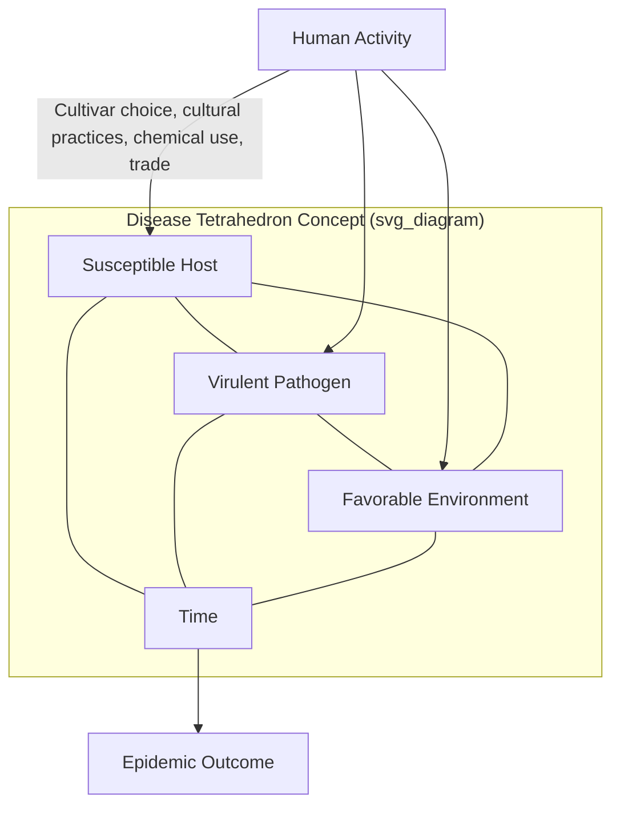

## Disease Cycles and Epidemiology

### Overview

Plant disease epidemiology is the quantitative and conceptual study of disease development in populations of plants over space and time, distinct from the study of an individual infection event. Where a **disease cycle** describes the chronological sequence of events by which a single infection occurs and produces new inoculum, **epidemiology** scales this up to populations, seasons, and landscapes — asking how fast disease spreads, how far, and what factors determine whether an outbreak remains trivial or becomes an epidemic. This field underpins nearly all rational disease management timing decisions, from fungicide spray scheduling to breeding program priorities to quarantine policy.

### Disease Cycle vs. Pathogen Life Cycle: A Critical Distinction

**Key Points**

- A **pathogen life cycle** describes the pathogen's own reproductive biology (asexual and sexual spore stages, host alternation, etc.) independent of disease outcome.
- A **disease cycle** describes the chain of events specifically as they relate to disease development in the host: inoculation, penetration, infection, incubation, colonization, reproduction, dissemination, and survival (overwintering/oversummering).
- The two cycles overlap substantially but are not identical — a pathogen life cycle stage (e.g., sexual recombination) may occur independently of active disease development (e.g., during survival on residue), while a disease cycle emphasizes the host-pathogen interaction sequence that determines symptom expression and spread.

### Components of the Disease Cycle (Detailed)

1. **Survival (Overwintering/Oversummering)** — the pathogen persists during periods unfavorable for active growth or when susceptible hosts are absent, via resting structures (sclerotia, chlamydospores, oospores, teliospores), infected seed, infected perennial tissue, alternate/collateral hosts, or crop debris.
2. **Primary Inoculum Production** — the initial inoculum source that starts the season's epidemic, often from overwintering structures triggered by favorable spring conditions.
3. **Dispersal (Dissemination)** — movement of inoculum to susceptible host tissue via wind, rain splash, water, insects, soil movement, or human activity (equipment, seed, transplants).
4. **Inoculation** — arrival of viable inoculum at a susceptible infection court on the host surface.
5. **Penetration** — pathogen entry via direct penetration, natural openings, or wounds (mechanism varies by pathogen type, as detailed in fungal, bacterial, and nematode disease cycles).
6. **Infection** — establishment of a parasitic relationship, with the host either succumbing (compatible interaction) or successfully resisting (incompatible/resistant interaction).
7. **Incubation Period** — time between infection and first symptom appearance (the "latent period" in epidemiological modeling terms often refers more specifically to the time until the plant becomes infectious/able to produce secondary inoculum, which may differ slightly from symptom appearance).
8. **Colonization** — pathogen growth and spread within host tissue.
9. **Reproduction/Sporulation** — production of secondary inoculum from the newly infected tissue.
10. **Secondary Spread** — repeated cycling of steps 3–9 within a single season for polycyclic diseases, driving epidemic increase.

**Diagram: Disease Cycle Components Mapped to Epidemic Time Scale (svg_diagram)**

<svg xmlns="http://www.w3.org/2000/svg" viewBox="0 0 820 420">
<text x="410" y="30" text-anchor="middle" font-size="19" font-weight="bold" fill="#1a1a1a">Disease Cycle Mapped to Epidemic Time Scale (svg_diagram)</text>
<line x1="80" y1="350" x2="760" y2="350" stroke="#333" stroke-width="2" />
<text x="420" y="390" text-anchor="middle" font-size="14" font-weight="bold">Time (season progression)</text>
<g font-family="Arial" font-size="12">
<rect x="90" y="280" width="110" height="50" rx="6" fill="#d9ead3" stroke="#38761d" />
<text x="145" y="300" text-anchor="middle">Overwintering</text>
<text x="145" y="316" text-anchor="middle" font-size="10">Primary Inoculum</text>
<rect x="230" y="230" width="110" height="50" rx="6" fill="#cfe2f3" stroke="#1155cc" />
<text x="285" y="250" text-anchor="middle">Dispersal</text>
<text x="285" y="266" text-anchor="middle" font-size="10">Inoculation</text>
<rect x="370" y="180" width="110" height="50" rx="6" fill="#fff2cc" stroke="#bf9000" />
<text x="425" y="200" text-anchor="middle">Penetration</text>
<text x="425" y="216" text-anchor="middle" font-size="10">Infection</text>
<rect x="510" y="130" width="110" height="50" rx="6" fill="#f4cccc" stroke="#990000" />
<text x="565" y="150" text-anchor="middle">Incubation</text>
<text x="565" y="166" text-anchor="middle" font-size="10">Colonization</text>
<rect x="650" y="80" width="110" height="50" rx="6" fill="#e6d5f7" stroke="#674ea7" />
<text x="705" y="100" text-anchor="middle">Sporulation</text>
<text x="705" y="116" text-anchor="middle" font-size="10">Secondary Spread</text>
<path d="M340,255 Q420,260 510,150" stroke="#990000" stroke-width="2" fill="none" stroke-dasharray="6,4" marker-end="url(#arrow5)" />
<text x="450" y="290" font-size="11" fill="#990000">Repeating loop for</text>
<text x="450" y="305" font-size="11" fill="#990000">polycyclic diseases</text>
</g>
</svg>

### Monocyclic vs. Polycyclic vs. Polyetic Diseases

- **Monocyclic diseases** — only one infection cycle occurs per growing season; the pathogen has limited or no secondary spread capacity within that season (e.g., many smuts, *Fusarium* wilts, some soilborne vascular diseases). Management logically focuses on **reducing initial (primary) inoculum**, since there is no meaningful "infection rate" to slow down within-season.
- **Polycyclic diseases** — multiple repeating infection cycles occur within a single season, each cycle generating new inoculum that drives further spread (e.g., late blight, rusts, powdery and downy mildews). Management focuses on **reducing the apparent infection rate** through fungicide timing, resistant cultivars, and reducing canopy microclimate favorability, since even small delays early in the epidemic compound substantially due to exponential/logistic growth dynamics.
- **Polyetic diseases** — epidemics that build up gradually across multiple growing seasons rather than within one (e.g., some tree diseases, replant disease complexes, certain virus diseases in perennial crops where inoculum accumulates year over year in a semi-permanent orchard or plantation setting).

This classification directly determines management strategy: intervening in a monocyclic disease usually means acting before planting or early in the season (seed treatment, resistant variety, soil fumigation), while intervening in a polycyclic disease means active in-season monitoring and repeated intervention timed to interrupt the compounding cycle.

### The Disease Triangle and Tetrahedron

Disease requires three simultaneous conditions, classically depicted as a triangle:

- **Susceptible host** — genetic susceptibility, growth stage vulnerability, plant density/spacing.
- **Virulent pathogen** — sufficient inoculum quantity and aggressiveness/virulence.
- **Favorable environment** — temperature, moisture, humidity, soil conditions matched to pathogen requirements.

Adding **time** transforms the triangle into a **disease pyramid** (duration of favorable conditions matters, not just their presence), and adding **human activity** (cultural practices, cultivar choice, chemical use, trade/movement of planting material) produces the **disease tetrahedron**, which is the more complete conceptual model used in modern applied epidemiology since human decisions actively modulate all three original triangle components.

### Quantitative Epidemiology: Measuring Disease

**Incidence and Severity**

- **Incidence** — the proportion or percentage of plant units (plants, leaves, fruit) that show disease symptoms, regardless of how much of each unit is affected:

$$Incidence\ (\%) = \frac{Number\ of\ diseased\ units}{Total\ units\ assessed} \times 100$$

- **Severity** — the proportion of plant tissue area affected by disease on a given unit, typically estimated visually using standardized reference diagrams (Standard Area Diagrams, SADs) to improve rater consistency and reduce estimation bias.
- Incidence is generally easier and faster to assess (simple presence/absence scoring) and is most useful at low disease levels; severity provides more precise information at higher disease levels where incidence approaches saturation (100% of plants affected but with widely varying damage).

**Disease Progress Curves**

Plotting disease incidence or severity ($y$, expressed as a proportion between 0 and 1) against time ($t$) produces a disease progress curve. Two models dominate classical plant disease epidemiology, developed primarily through the foundational work of J.E. Van der Plank:

**Logistic Model** (used for polycyclic, multiple-infection-cycle diseases where secondary spread compounds):

$$\frac{dy}{dt} = r \cdot y \cdot (1 - y)$$

Integrated form:

$$y_t = \frac{1}{1 + \left(\frac{1 - y_0}{y_0}\right) e^{-rt}}$$

where $y_0$ is initial disease proportion, $r$ is the apparent infection rate, and $t$ is time.

**Monomolecular Model** (used for monocyclic diseases where disease increase depends only on remaining healthy tissue, not compounding secondary infection):

$$\frac{dy}{dt} = r \cdot (1 - y)$$

Integrated form:

$$y_t = 1 - (1 - y_0)e^{-rt}$$

[Inference: real-world epidemics often deviate from these idealized models due to changing weather, host growth stage shifts, and management interventions mid-season; the models themselves and their mathematical derivations are standard, well-established components of classical plant disease epidemiology, but field-fitted parameter values are pathosystem- and season-specific.]

**Area Under the Disease Progress Curve (AUDPC)**

A widely used integrative metric that summarizes the total disease burden over an entire assessment period into a single comparable value, commonly used to compare cultivar resistance levels or treatment efficacy across field trials:

$$AUDPC = \sum_{i=1}^{n-1} \frac{(y_i + y_{i+1})}{2} (t_{i+1} - t_i)$$

where $y_i$ is disease severity/incidence at the $i$-th assessment and $t_i$ is the time of that assessment. Lower AUDPC values indicate less cumulative disease over the observation period, making it a standard outcome variable in fungicide efficacy trials and resistance breeding evaluations.

**Apparent Infection Rate ($r$)**

The rate parameter $r$ from the logistic/monomolecular models serves as a comparative measure of epidemic speed under given conditions — a lower $r$ value (achieved through resistant cultivars, effective fungicide programs, or unfavorable environmental manipulation) means slower epidemic buildup even if the pathogen is still present. This concept underlies the practical strategy of "slowing the epidemic" rather than expecting complete elimination, particularly for polycyclic diseases where complete eradication is often unrealistic.

### Basic Reproduction Number Concept ($R_0$)

Borrowed from general epidemiological theory (and widely familiar from human/animal disease epidemiology), the basic reproduction number concept has plant disease analogues: it represents the number of new infections arising from a single infected unit in a fully susceptible host population under given environmental conditions.

- $R_0 > 1$ — epidemic increases.
- $R_0 < 1$ — epidemic declines/dies out.
- $R_0 = 1$ — epidemic remains stable (endemic equilibrium).

[Inference: while conceptually transferable, formal $R_0$ estimation in plant pathosystems is less standardized and less routinely used in applied field decision-making than the logistic-rate ($r$) and AUDPC approaches described above, which remain the more commonly applied quantitative tools in classical plant disease epidemiology literature.]

### Spatial Epidemiology and Spread Patterns

- **Focal (aggregated) spread pattern** — disease radiates outward from discrete point sources (e.g., an initial infected transplant, a localized soilborne inoculum patch), producing expanding circular or irregular patches; typical of diseases with limited-range dispersal mechanisms (splash-dispersed pathogens, soilborne pathogens with limited movement).
- **Random/uniform spread pattern** — disease appears scattered relatively evenly across a field, typical of diseases with highly efficient long-distance dispersal (wind-borne rust urediniospores, insect-vectored viruses with mobile vectors) or diseases originating from widely distributed inoculum sources (contaminated seed lots distributed evenly at planting).
- **Gradient (distance-decay) spread** — disease severity decreases with increasing distance from a known point source (e.g., a nearby infected orchard, an inoculum nursery, a drift source), used diagnostically to help confirm a specific inoculum origin.
- Spatial pattern analysis increasingly incorporates geostatistical tools (e.g., spatial autocorrelation indices) in research settings to formally characterize aggregation versus randomness, informing sampling design and localized management (e.g., variable-rate fungicide application in precision agriculture contexts). [Speculation: operational adoption of formal spatial statistics for routine field-level management decisions (versus research applications) remains limited and is an evolving area of precision agriculture integration.]

### Environmental Drivers of Epidemic Development

- **Temperature** — governs pathogen infection rate, latent period length, and sporulation rate; each pathogen has characteristic minimum, optimum, and maximum temperatures for these processes, often summarized in temperature-response curves used in forecasting models.
- **Moisture (rainfall, humidity, leaf wetness duration)** — critical for spore germination, penetration, and dispersal (splash-dispersed pathogens specifically require rain events; wind-dispersed pathogens like many rusts can spread without rain but often still require dew/moisture for infection after landing).
- **Host growth stage and canopy density** — denser canopies retain humidity longer (favoring many foliar pathogens) and provide more surface area for inoculum interception; host susceptibility often varies by phenological stage (e.g., peak susceptibility to Fusarium head blight in wheat during flowering).
- **Wind** — primary dispersal mechanism for many fungal spores (rust urediniospores can travel hundreds of kilometers in favorable wind systems) and for wind-driven rain that disperses splash-borne pathogens further than rain alone.

### Disease Forecasting Systems

Forecasting models translate epidemiological principles into practical, actionable spray/scouting timing recommendations by combining real-time or forecast weather data with pathogen-specific biological thresholds:

- **Mills table** (apple scab, *Venturia inaequalis*) — relates leaf wetness duration and temperature during that wetness period to infection probability, one of the earliest and most enduring disease-forecasting frameworks in plant pathology.
- **BLITECAST** (potato late blight) — combines temperature and relative humidity/rainfall data to calculate disease severity values used to time fungicide applications.
- **TOMCAST** (tomato early blight and related diseases) — a similar weather-based disease severity value accumulation system.
- **Cougarblight/MaryblytT** (fire blight, a bacterial disease, included here as forecasting principles are shared across pathogen types) — use temperature and wetness/bloom stage data to estimate daily infection risk.

[Inference: specific numeric thresholds within these models are calibrated to particular regions, cultivars, and historical validation datasets — the general forecasting logic (combining weather monitoring with biological thresholds) is a standard, well-established approach, but exact threshold values require reference to regionally validated, currently maintained model versions rather than generic application across all locations.]

### Example: Applying Epidemiological Concepts to Late Blight Management

**Example**

- **Pathogen**: *Phytophthora infestans*, a polycyclic Oomycete pathogen of potato and tomato.
- **Disease cycle type**: highly polycyclic, with sporangia capable of producing a new infection cycle in as little as 3–5 days under optimal cool, wet conditions — among the fastest disease cycles in plant pathology.
- **Epidemiological implication**: because the apparent infection rate ($r$) can be very high under favorable weather, a delay of even a few days in fungicide application after a favorable infection period can allow disease to reach damaging levels before intervention, illustrating why forecasting-based proactive spray timing (via BLITECAST-type systems) outperforms purely calendar-based or reactive spraying.
- **Spatial pattern**: often begins as focal outbreaks from infected seed tubers or cull piles, then transitions to more widespread wind/rain-dispersed secondary spread across a field or region once initial foci establish.
- **Management link to epidemiology**: reducing primary inoculum (certified seed, cull pile destruction) targets the *start* of the epidemic curve, while fungicide programs and resistant cultivars target the *rate* ($r$) of subsequent spread — a direct practical application of the monocyclic-versus-polycyclic management principle.

### Conclusion

Disease cycles describe the mechanistic "how" of individual infection events, while epidemiology provides the quantitative "how fast and how far" framework needed to make timely, population-level management decisions. Understanding whether a disease is monocyclic or polycyclic determines whether management should target initial inoculum reduction or in-season infection-rate suppression, while tools like disease progress curves, AUDPC, and weather-based forecasting models translate these concepts into practical, measurable decision-support systems used throughout modern crop protection.

**Related Topics**

- Fungal diseases of crops, bacterial plant diseases, and viral plant diseases (pathogen-specific disease cycles)
- Disease diagnosis techniques and case-history-based diagnostic workflows
- Fungicide resistance management and spray timing optimization
- Host resistance breeding: vertical versus horizontal resistance durability
- Precision agriculture and spatial epidemiology tools
- Weather-based disease forecasting system design and validation
- Integrated Pest and Disease Management (IPDM) program development
- Quarantine pathogen risk assessment and epidemic modeling for biosecurity
- Statistical methods in plant pathology (AUDPC, logistic/monomolecular model fitting)
- Climate change impacts on pathogen range and epidemic dynamics