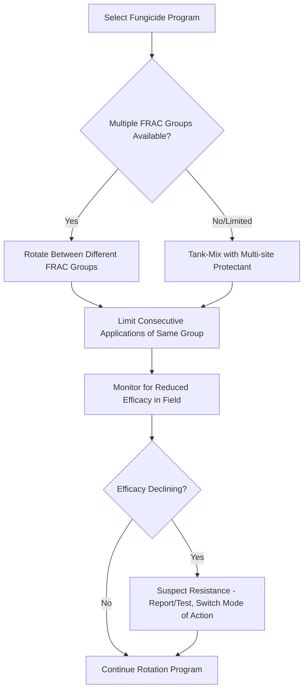

## Fungicide and Bactericide Use

### Overview

Fungicides and bactericides are chemical or biological agents applied to plants, seeds, or soil to prevent, suppress, or eradicate fungal and bacterial pathogens. Effective use requires understanding not just which product controls which disease, but how mode of action, timing, application method, and resistance management interact — a poorly timed or poorly rotated fungicide program can fail even when the product itself is highly effective in laboratory conditions. This topic connects directly to disease cycle and epidemiology concepts: chemical control decisions are fundamentally epidemiological decisions about when and how to interrupt a disease cycle.

### Fungicide Classification by Movement in the Plant

**Key Points**

- **Contact (protectant) fungicides** — remain on the treated plant surface, forming a protective barrier; must be applied *before* infection occurs, since they act on spores/pathogen structures at the surface and cannot reach pathogen tissue already inside the plant. Examples: chlorothalonil, mancozeb, copper-based products.
- **Systemic fungicides** — absorbed into plant tissue and translocated (fully or locally) within the plant, providing some curative activity against early-stage infections and more consistent protection of new growth that emerges after application. Examples: azoxystrobin (translaminar/limited systemic), tebuconazole (systemic, xylem-mobile).
- **Translaminar fungicides** — move from the treated (usually upper) leaf surface through leaf tissue to the opposite surface, without extensive whole-plant translocation — an intermediate category between strict contact and full systemic movement.
- **Curative vs. protectant activity** — protectant products must be present before spore germination/penetration; curative products can still act for a limited window after infection has begun (typically only during early incubation, before symptoms appear) but virtually no fungicide can reverse established, symptomatic disease.

### FRAC Classification System (Fungicide Resistance Action Committee)

The FRAC system classifies fungicides by **mode of action (MoA)** rather than by chemical class alone, since resistance develops against the specific biochemical target, and products sharing a MoA group share cross-resistance risk even if chemically distinct. This classification is the foundation of all modern resistance-management spray programs.

| FRAC Group | Mode of Action | Example Active Ingredients | Resistance Risk | Typical Use |
| --- | --- | --- | --- | --- |
| M (Multi-site) | Multiple non-specific biochemical sites | Chlorothalonil, mancozeb, copper compounds, sulfur | Low | Broad-spectrum protectants, resistance-management partners |
| 1 (MBC) | Beta-tubulin assembly (mitosis) | Benomyl, thiophanate-methyl, carbendazim | High | Legacy use; resistance widespread in many pathosystems |
| 2 (Dicarboximide) | Signal transduction (osmotic) | Iprodione, vinclozolin | Medium | *Botrytis*, *Sclerotinia* control |
| 3 (DMI/Triazole) | Sterol 14α-demethylase inhibition (ergosterol biosynthesis) | Tebuconazole, propiconazole, difenoconazole | Medium | Broad-spectrum systemic, cereals, fruit |
| 4 (PA) | RNA polymerase I inhibition | Metalaxyl, mefenoxam | High | Oomycete-specific (downy mildew, *Phytophthora*, *Pythium*) |
| 7 (SDHI) | Succinate dehydrogenase inhibition | Boscalid, fluxapyroxad, penthiopyrad | Medium–High | Broad-spectrum, often in premixes |
| 9 (AP) | Amino acid/protein synthesis (specific) | Cyprodinil | Medium | *Botrytis*, cereal diseases |
| 11 (QoI/Strobilurin) | Cytochrome bc1 complex, Qo site (respiration) | Azoxystrobin, pyraclostrobin, trifloxystrobin | High | Broad-spectrum, widely used, high resistance pressure |
| 40 (CAA) | Cellulose synthase inhibition | Mandipropamid, dimethomorph | Medium | Oomycete-specific |
| 43 (QiI) | Cytochrome bc1 complex, Qi site | Cyazofamid, amisulbrom | Medium | Oomycete-specific |

[Inference: resistance risk ratings reflect general FRAC guidance and documented resistance case histories; actual resistance status in a specific field or region depends on local fungicide use history and should be verified against current FRAC pathogen-specific resistance monitoring reports, since resistance status is genuinely dynamic and evolves with use pressure.]

### Bactericide Options and Limitations

Chemical options for bacterial disease control are considerably narrower than for fungal disease, since bacteria lack many of the specific biochemical targets (ergosterol synthesis, chitin synthesis) that fungicides exploit.

**Copper-Based Bactericides**

- The primary chemical tool against bacterial plant pathogens; act as multi-site protectants disrupting bacterial cell membranes and enzyme function.
- Formulations include copper hydroxide, copper oxychloride, copper sulfate (Bordeaux mixture, a historic copper-lime formulation), and fixed copper products.
- Copper resistance has developed in some *Xanthomonas* and *Pseudomonas* populations under intensive, prolonged copper use, typically via plasmid-borne resistance genes; resistance prevalence varies substantially by region and crop history. [Inference: exact resistance frequency in any given area is a local monitoring question, not a fixed global fact — the resistance mechanism and its documented occurrence in specific pathosystems is established.]
- Copper can cause phytotoxicity (leaf spotting/russeting) under certain temperature and humidity conditions, requiring careful rate and timing management.

**Antibiotics**

- Streptomycin and oxytetracycline are used in some cropping systems, most notably for fire blight (*Erwinia amylovora*) management in apple and pear during bloom.
- Regulatory status varies substantially by country, and agricultural antibiotic use is subject to increasing scrutiny and restriction in many jurisdictions due to concerns about contributing to broader antimicrobial resistance. [Unverified: current regulatory approval and use restrictions for agricultural antibiotics vary by country and are subject to ongoing regulatory change — always verify against current local regulatory authority guidance before use.]

**Biological Bactericides**

- *Bacillus subtilis*- and *Bacillus amyloliquefaciens*-based biopesticides act via antibiosis (production of antimicrobial lipopeptides) and competitive exclusion.
- *Agrobacterium radiobacter* strain K84 — a specific biocontrol bacterium producing a bacteriocin (agrocin 84) effective against crown gall–causing *Agrobacterium tumefaciens* strains, typically applied as a root-dip treatment for nursery stock.

### Application Timing Principles

**Protectant Timing Logic**

Since most fungicides and all copper bactericides work primarily as protectants, application must generally precede infection events, not follow symptom appearance. This is a fundamental epidemiological principle: by the time symptoms are visible, the infection has often already progressed through incubation, meaning a newly applied protectant fungicide will not eliminate existing infection — it only protects tissue not yet infected.

**Weather-Based/Forecast-Driven Timing**

- Disease forecasting models (Mills table for apple scab, BLITECAST for potato late blight, Cougarblight for fire blight) translate weather monitoring into specific application timing recommendations, reducing unnecessary calendar-based spraying while ensuring coverage during genuine high-risk infection periods.
- This approach exemplifies applying epidemiological rate concepts practically: since polycyclic diseases compound rapidly under favorable conditions, missing a single critical infection period can allow the epidemic to escape effective control for the remainder of the season.

**Growth-Stage-Based Timing**

- Many fungicide programs are tied to specific host phenological stages rather than (or in addition to) weather alone — e.g., Fusarium head blight fungicide applications in wheat are timed specifically to anthesis (flowering), the period of peak host susceptibility, regardless of whether weather conditions alone would otherwise dictate timing.

**Pre-Infection vs. Post-Infection Application Windows**

- Some systemic fungicides retain limited "kick-back" or curative activity within a defined window (typically 24–72 hours post-infection, before symptoms appear), but this window and efficacy level are product- and pathogen-specific and should not be relied upon as a substitute for protectant timing. [Inference: specific curative window duration varies by active ingredient, pathogen, and environmental conditions — manufacturer label data and independent efficacy trials for the specific product-pathogen combination are the authoritative reference.]

### Resistance Management Principles

**Core Anti-Resistance Strategies**

- **Rotation** — alternating fungicides from different FRAC groups across successive applications within a season, preventing sustained selection pressure on a single target site.
- **Mixtures/Tank-mixing** — combining a high-resistance-risk single-site product (e.g., a strobilurin, FRAC 11) with a low-resistance-risk multi-site protectant (e.g., chlorothalonil, FRAC M) in the same application, so that any resistant individuals surviving the single-site component are still controlled by the multi-site partner.
- **Limiting applications per season** — many product labels specify a maximum number of sequential or total-season applications for high-resistance-risk groups (particularly QoI/strobilurins and DMI/triazoles) specifically to slow resistance selection.
- **Avoiding sole reliance on a single high-risk mode of action** even when it is the most effective available product, since short-term efficacy gains can be outweighed by longer-term loss of that entire mode of action across a region once resistance becomes established and spreads (resistant pathogen populations can disperse via the same wind/rain/vector mechanisms as susceptible populations).
- Documented resistance case histories (e.g., widespread QoI/strobilurin resistance in several wheat *Septoria* and cucurbit powdery mildew populations, MBC resistance in numerous pathosystems) illustrate that resistance risk ratings are not theoretical — they reflect real, field-documented efficacy loss. [Inference: the specific pathogens and regions where resistance is currently most severe shifts over time as new resistance develops and as management practices change; consult current FRAC pathogen-specific resistance monitoring bulletins for up-to-date status.]

### Application Methods and Equipment Considerations

- **Foliar spray application** — the most common method; droplet size, spray volume, and coverage uniformity directly affect protectant efficacy, since contact fungicides only protect the tissue surface actually covered by spray deposit.
- **Seed treatment** — fungicide applied directly to seed before planting, targeting seed-borne and early seedling-stage soilborne pathogens (damping-off organisms, seed-borne smuts and bunts); an efficient, low-volume application method that protects the crop during its most vulnerable early growth stage.
- **Soil/drench application** — used for soilborne pathogens and some systemic products taken up through roots; less common for fungicides generally due to cost and limited product registration for this use pattern compared to foliar application.
- **Airblast/orchard sprayers** — designed for canopy penetration in tree and vine crops, where achieving adequate coverage of inner canopy foliage is a persistent practical challenge affecting real-world efficacy compared to trial-plot results.
- **Aerial application** — used for large-acreage field crops where ground equipment access is limited or timing windows are narrow (e.g., rapid response to a forecasted infection period across large wheat or rice acreage).

**Spray Coverage and Efficacy Relationship**

$$Protection\ Level \propto Coverage\ Uniformity \times Deposit\ Density \times Product\ Persistence$$

[Inference: this is a conceptual relationship illustrating the interacting factors that determine field efficacy, not a validated quantitative formula — actual efficacy depends on interacting factors including weather washoff, plant growth dilution of deposit over time, and pathogen pressure, which are typically assessed empirically through field efficacy trials rather than calculated from a single equation.]

### Integrating Chemical Control with Epidemiological Concepts

- **Monocyclic diseases**: chemical intervention (typically seed treatment or a single well-timed soil/foliar application) targets reducing initial inoculum, since there is limited or no secondary spread to interrupt later in the season.
- **Polycyclic diseases**: chemical intervention must address the *rate* of epidemic increase, requiring repeated, well-timed applications throughout the season since the disease can generate many infection cycles; missing early applications allows compounding spread that later applications cannot fully compensate for.
- **Economic thresholds** — decisions to apply fungicide/bactericide are ideally based on a cost-benefit threshold: the point where potential yield/quality loss from disease exceeds the cost of the application, rather than calendar-based "insurance" spraying, though in practice many programs use a combination of threshold-based and preventive scheduling depending on crop value and disease unpredictability. [Inference: specific economic threshold values are crop-, region-, and disease-specific and require locally validated extension guidance rather than universal figures.]

### Environmental and Regulatory Considerations

- **Pre-harvest intervals (PHI)** — the mandatory minimum time between the last application and harvest, established to ensure pesticide residues decline to acceptable levels by the time of consumption; PHI requirements vary by product, crop, and regulatory jurisdiction. [Unverified: specific PHI values must be confirmed against the current product label and local regulatory authority for the crop and region in question, as these are subject to periodic regulatory revision.]
- **Re-entry intervals (REI)** — the minimum time workers must wait before re-entering a treated field without personal protective equipment, established for worker safety.
- **Buffer zones and drift management** — many products carry label requirements limiting application near water bodies, sensitive habitats, or adjacent properties to reduce off-target environmental and drift exposure risk.
- **Integrated Pest Management (IPM) context** — regulatory and market trends in many regions increasingly favor reduced-risk products, biological alternatives, and threshold-based application over calendar-based preventive spraying, though the pace and specifics of this shift vary considerably by region, crop, and market requirements. [Speculation: the long-term trajectory of specific regulatory changes (e.g., future copper or specific synthetic fungicide restrictions) is an evolving policy area and should not be assumed to follow any particular timeline without checking current regulatory sources.]

### Example: Season-Long Resistance-Managed Fungicide Program for Grape Powdery Mildew

**Example**

- **Pathogen**: *Erysiphe necator*, an obligate biotrophic Ascomycete favored by warm temperatures and high humidity without requiring free leaf moisture.
- **Early season**: sulfur or a multi-site protectant (FRAC M) applied preventively before disease onset, taking advantage of low resistance risk to establish a season-long protective baseline.
- **Bloom through fruit set (high-risk period)**: rotation between different single-site systemic modes of action (e.g., a FRAC 3 DMI product, then a FRAC 7 SDHI product, then a FRAC 11 QoI product on subsequent applications) rather than repeated use of any single mode of action, directly implementing FRAC rotation guidance.
- **Tank-mix strategy**: pairing each single-site product application with a reduced-rate multi-site partner (sulfur or another FRAC M product) to provide a resistance-management backstop.
- **Late season**: reversion to lower-risk multi-site or biological products as disease pressure typically declines and fruit approaches harvest, also helping manage pre-harvest interval compliance.
- **Monitoring component**: field scouting throughout the season to detect any signs of reduced efficacy that might indicate developing resistance, prompting a program adjustment if detected.

### Conclusion

Effective fungicide and bactericide use depends on integrating chemical mode-of-action knowledge (FRAC classification), disease cycle timing principles (protectant-before-infection logic, monocyclic versus polycyclic strategy), and resistance management practices (rotation and mixing across modes of action) into a coherent program rather than treating chemical control as a simple "spray when disease appears" reaction. Because bactericide options remain far more limited than fungicide options, bacterial disease programs lean more heavily on cultural and resistance-based strategies, with copper and limited antibiotic use serving as a chemical supplement rather than a complete solution.

**Related Topics**

- Disease cycles and epidemiology (foundational timing logic)
- Fungal diseases of crops and bacterial plant diseases (pathogen-specific product selection)
- Integrated Pest and Disease Management (IPDM) program design
- Biological control agents and biopesticide formulations
- Disease forecasting systems for application timing (Mills table, BLITECAST, Cougarblight)
- Pesticide regulatory frameworks: PHI, REI, and residue tolerance standards
- Host plant resistance as a complement to chemical control
- Precision agriculture: variable-rate and targeted spray application technology
- Antimicrobial resistance stewardship in agriculture
- Copper and antibiotic alternatives in organic and sustainable disease management systems