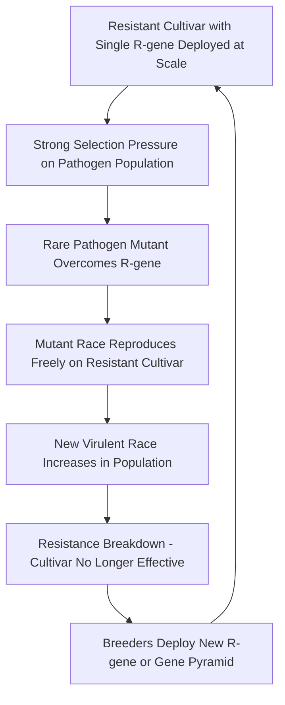

## Disease-Resistant Cultivar Selection

### Overview

Host plant resistance is widely regarded as the most economical, environmentally sustainable, and durable long-term strategy for managing plant disease, since it requires no repeated input cost once deployed and does not carry the environmental and resistance-management burdens associated with chemical control. Selecting and deploying disease-resistant cultivars, however, requires understanding the genetic basis of resistance, its durability trade-offs, and how resistance interacts with pathogen population dynamics — a resistant cultivar is not a permanent solution but a component that must be managed within a broader epidemiological framework.

### Types of Host Resistance

**Key Points**

- **Immunity** — complete absence of disease under all conditions; genuinely immune host-pathogen combinations are relatively rare in practice, since most "resistant" cultivars show resistance to specific pathogen races/strains rather than absolute immunity to the pathogen species as a whole.
- **Resistance** — the host's ability to suppress or retard pathogen growth and disease development, existing on a continuum from near-immunity to mild suppression, typically categorized by degree (highly resistant, moderately resistant, tolerant).
- **Tolerance** — the host becomes infected and the pathogen develops normally, but the plant sustains disease with minimal yield or quality loss; distinct from resistance because the pathogen population is not actually suppressed (a tolerant cultivar can still serve as an inoculum source for spread to susceptible neighboring plants).
- **Susceptibility** — the host permits normal pathogen infection, colonization, and reproduction, with associated yield/quality loss proportional to disease severity.

### Vertical (Race-Specific) Resistance

**Genetic Basis: Gene-for-Gene Relationship**

- Vertical resistance is typically conferred by a single major resistance gene (**R-gene**), often functioning within the classic **gene-for-gene model** first articulated by Flor's work on flax rust: for every host resistance gene, there is a corresponding pathogen avirulence gene, and resistance is expressed only when both are present in matching form.
- Modern molecular understanding frames this interaction through **effector-triggered immunity (ETI)**: pathogen effector proteins (products of avirulence genes) are recognized by corresponding host resistance (R) protein receptors, triggering a strong, often localized defense response — frequently the **hypersensitive response (HR)**, a rapid, controlled cell death at the infection site that restricts pathogen spread by cutting off its access to living tissue.
- Because vertical resistance targets a specific pathogen race/strain (defined by its specific avirulence gene complement), it can be rendered ineffective by a single pathogen mutation that alters or eliminates the recognized avirulence gene product — this is the central durability weakness of vertical resistance.

**Characteristics**

- Typically provides strong, often complete protection against the specific race(s) it targets.
- Usually simple to breed for (single dominant gene, straightforward Mendelian inheritance, relatively fast to introgress into elite breeding lines via marker-assisted selection).
- Prone to **resistance breakdown** when new, matching-virulent pathogen races emerge and are selected for under the resistance pressure the deployed cultivar itself creates — a well-documented "boom-and-bust" cycle observed repeatedly in cereal rust and other pathosystems.

### Horizontal (Race-Nonspecific/Partial) Resistance

**Genetic Basis**

- Typically **polygenic** (controlled by multiple genes, often with small individual effects), producing quantitative rather than qualitative resistance — a gradient of partial protection rather than an all-or-nothing response.
- Not tied to specific pathogen avirulence genes, so it is generally effective against all races/strains of a pathogen rather than being race-specific.
- Often mediated through **PAMP-triggered immunity (PTI)** — a more general first layer of plant immune recognition of conserved pathogen-associated molecular patterns (e.g., bacterial flagellin, fungal chitin fragments), producing a broader but typically weaker defense response than the R-gene-mediated ETI response.

**Characteristics**

- Generally more **durable** than vertical resistance because it does not depend on a single gene-for-gene match that a single pathogen mutation can defeat; overcoming polygenic resistance typically requires the pathogen to accumulate changes across multiple independent traits simultaneously, a much higher evolutionary hurdle.
- More difficult and slower to breed for, since selecting and stacking multiple minor-effect genes requires larger breeding populations, more extensive field-based phenotyping across multiple environments, and quantitative genetic/statistical approaches rather than simple marker tracking of a single gene.
- Provides partial rather than complete protection, meaning horizontal resistance is often combined with other management tactics (fungicides, cultural practices) rather than relied upon as a standalone solution.

### Comparative Summary

| Feature | Vertical Resistance | Horizontal Resistance |
| --- | --- | --- |
| Genetic basis | Single/few major genes (R-genes) | Multiple minor genes (polygenic) |
| Specificity | Race-specific | Race-nonspecific (broad) |
| Protection level | Strong, often near-complete | Partial |
| Durability | Often short-lived under pressure | Generally more durable |
| Breeding difficulty | Relatively straightforward | More complex, resource-intensive |
| Immune mechanism | Effector-triggered immunity (ETI) | PAMP-triggered immunity (PTI), quantitative traits |
| Typical use | Rapid response to a specific emerging threat | Long-term baseline protection |

### Resistance Deployment Strategies for Durability

Because vertical resistance is vulnerable to being overcome, breeders and agronomists use several strategies to extend its useful lifespan and reduce the risk of sudden regional resistance breakdown:

**Gene Pyramiding (Stacking)**

- Combining multiple different R-genes (each targeting different avirulence genes) within a single cultivar, so that the pathogen would need to simultaneously overcome all stacked genes to cause disease — a substantially higher evolutionary barrier than defeating a single gene.
- Increasingly facilitated by marker-assisted selection (MAS) and genomic selection techniques, which allow breeders to track and combine multiple resistance loci more efficiently than phenotypic selection alone.

**Cultivar Rotation/Diversification**

- Rotating different resistant cultivars (carrying different resistance genes) across seasons or regions to avoid prolonged, uniform selection pressure on the pathogen population toward any single virulence profile.

**Cultivar Mixtures/Multilines**

- Planting a mixture of genetically similar lines differing only in their resistance gene(s) within the same field, so that a pathogen race capable of infecting one component of the mixture still encounters resistant plants nearby, physically diluting inoculum buildup and slowing epidemic spread — a strategy historically well documented in cereal disease management.

**Combining Vertical and Horizontal Resistance**

- Deploying cultivars that carry both a strong vertical resistance gene (for immediate, high-level protection) and background horizontal/quantitative resistance (as a durability buffer if the vertical gene is eventually overcome) is a commonly recommended breeding strategy, since it provides strong short-term protection while reducing the severity of any eventual vertical resistance breakdown. [Inference: the specific combination strategies and their relative emphasis vary by crop and breeding program; the general principle of combining resistance types for durability is well established in resistance breeding literature.]

### Diagram: Resistance Breakdown Cycle Under Vertical Resistance Pressure

This boom-and-bust cycle has been documented repeatedly in real agricultural history — for example, the sequential deployment and subsequent overcoming of individual stem rust resistance genes in wheat, most notably illustrated by the emergence of the Ug99 rust race group (first identified in Uganda) overcoming the previously widely effective *Sr31* resistance gene, prompting renewed international breeding efforts to identify and deploy new resistance sources. [Unverified: the current global distribution and dominant virulent races within rust pathogen populations shift over time; consult current international rust surveillance networks such as the Borlaug Global Rust Initiative for up-to-date race distribution data.]

### Practical Cultivar Selection Criteria

**Key Points**

- **Match resistance genes to locally prevalent pathogen races/species** — a resistance gene effective against one geographic pathogen population may offer little protection against a different race present in another region; local extension variety trial data and regional disease history are essential references rather than relying solely on seed catalog resistance claims.
- **Consider multiple disease resistances simultaneously** — most commercial cultivars are bred with resistance packages addressing several key regional diseases at once (e.g., a tomato variety coded with resistance letters such as V, F, N, T, indicating Verticillium, Fusarium, Nematode, and Tobacco mosaic virus resistance respectively in common horticultural labeling conventions).
- **Balance resistance against agronomic and quality traits** — resistant cultivars must still meet yield potential, quality, and market requirements; resistance breeding inherently involves trade-off management with these other traits, and a highly resistant but agronomically poor cultivar may not be commercially viable despite its disease advantage.
- **Assess resistance durability history** — cultivars carrying resistance genes with a long track record of field durability in similar production regions carry lower risk than those relying on genes already showing signs of erosion elsewhere.
- **Consider environmental interaction** — some resistance genes show temperature-, humidity-, or growth-stage-dependent efficacy (e.g., certain nematode resistance genes losing efficacy at elevated soil temperatures), meaning a resistance source effective in one production environment may underperform in another with different climatic conditions. [Inference: temperature-dependent resistance efficacy is documented for specific gene-pathogen combinations but should not be assumed universal across all resistance sources without checking the specific gene's documented behavior.]

### Sources of Resistance Genes

- **Wild relatives and landraces** — a historically major source of novel resistance genes, since wild crop relatives often evolved under long-term co-evolutionary pressure with regional pathogen populations and retain genetic diversity largely absent from highly selected modern cultivars.
- **Existing cultivated germplasm collections/genebanks** — systematic screening of maintained germplasm collections for resistance to specific pathogens is a standard early step in resistance breeding programs.
- **Induced mutation breeding** — using mutagens to generate novel genetic variation when existing germplasm lacks adequate resistance sources, though this approach is less commonly the primary route compared to natural genetic resource screening.
- **Genetic engineering/transgenic approaches** — introducing resistance genes across species boundaries (e.g., coat-protein-mediated viral resistance in Papaya ringspot virus–resistant papaya) where conventional breeding sources are unavailable or would take prohibitively long to introgress; regulatory approval and market acceptance for such approaches vary considerably by crop, country, and evolving policy context. [Unverified: current regulatory and market acceptance status for specific transgenic resistance traits varies by jurisdiction and is subject to ongoing change — consult current regulatory authority sources for the specific crop and region in question.]

### Breeding Methodologies for Resistance Introgression

**Marker-Assisted Selection (MAS)**

- Uses DNA markers linked to known resistance genes to track their presence in breeding populations without waiting for disease symptom expression under field conditions, substantially accelerating breeding cycle time and allowing selection even in the absence of natural or artificial disease pressure during a given season.

**Genomic Selection**

- For polygenic/horizontal resistance traits controlled by many small-effect loci, genomic selection uses genome-wide marker data to predict breeding values across the entire genome rather than tracking individual major genes, better suited to capturing the additive, distributed genetic architecture typical of quantitative resistance traits.

**Backcross Breeding**

- The classical method for introgressing a single major resistance gene from a donor source (often a wild relative or landrace with otherwise poor agronomic traits) into an elite, agronomically desirable recurrent parent background, recovering the recurrent parent's traits over successive backcross generations while retaining the target resistance gene.

**Disease Nursery/Hot-Spot Screening**

- Field evaluation under natural or artificially enhanced disease pressure (disease nurseries maintained specifically to ensure consistent, high inoculum pressure) allows more reliable phenotypic differentiation between resistant and susceptible breeding lines than relying on unpredictable natural field disease incidence alone.

### Example: Selecting Tomato Cultivars for a Root-Knot Nematode–Prone Field

**Example**

- **Situation**: A grower has a field with a documented history of *Meloidogyne incognita* (root-knot nematode) pressure alongside occasional Fusarium wilt incidence.
- **Cultivar selection approach**: prioritize cultivars carrying the *Mi* resistance gene (root-knot nematode resistance) combined with Fusarium wilt resistance genes (commonly denoted with F-race designations in seed catalog labeling), checking that the specific *Fusarium oxysporum* races present regionally match the resistance gene's known effective race spectrum.
- **Environmental consideration**: since *Mi*-gene efficacy against root-knot nematode can decline at elevated soil temperatures in some documented cases, timing planting to avoid peak soil temperature periods, or considering grafting onto a nematode-resistant rootstock as a supplementary tactic, may be warranted in warm-climate production. [Inference: this temperature-sensitivity consideration applies specifically where documented for the relevant gene-nematode combination and should be confirmed against current variety-specific technical information rather than assumed universally.]
- **Complementary practices**: even with resistant cultivar selection, rotation with non-host crops and organic matter incorporation remain recommended as a durability and population-management buffer, since relying solely on the resistance gene without other practices increases long-term risk of localized resistance-breaking nematode population selection.

### Conclusion

Disease-resistant cultivar selection is not a single decision but an ongoing strategic process requiring understanding of resistance gene type (vertical versus horizontal), matching resistance sources to locally relevant pathogen races, and deploying durability-extending strategies such as gene pyramiding, cultivar rotation, and combining resistance types. Because vertical resistance can be overcome by pathogen evolution under sustained selection pressure, resistant cultivars are best understood as a powerful but time-limited management tool that performs most reliably when integrated within a broader disease management program rather than treated as a permanent, standalone solution.

**Related Topics**

- Disease cycles and epidemiology (resistance gene deployment and pathogen race dynamics)
- Fungal diseases of crops, bacterial plant diseases, viral plant diseases, and nematode pests (pathogen-specific resistance sources)
- Marker-assisted selection and genomic selection breeding techniques
- Plant immune system biology: PAMP-triggered immunity (PTI) and effector-triggered immunity (ETI)
- Gene-for-gene theory and avirulence gene evolution
- Grafting and rootstock selection as a resistance-complementary strategy
- Germplasm conservation and genebank screening programs
- Transgenic and genome-editing approaches to disease resistance
- Fungicide and bactericide use as a complementary management layer
- International crop disease surveillance networks (e.g., rust tracking initiatives)