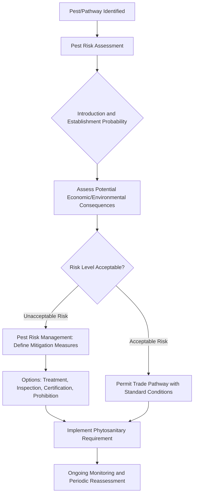
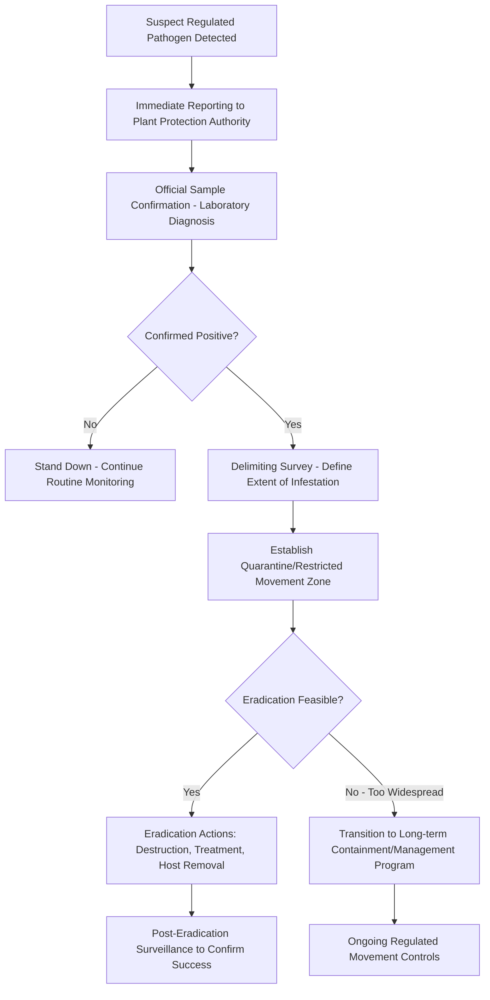

## Biosecurity and Quarantine Practices

### Overview

Biosecurity and quarantine practices form the regulatory and operational framework designed to prevent the introduction, establishment, and spread of plant pests and pathogens across borders, regions, and individual production sites. Unlike disease management strategies applied after a pathogen is already present, biosecurity operates on a preventive, exclusion-first principle: the most cost-effective way to manage a devastating pathogen is to keep it out entirely, since eradication after establishment is often far more expensive, sometimes impossible, and always disruptive to trade and production.

### Core Biosecurity Concepts

**Key Points**

- **Biosecurity** — the broad set of measures, policies, and practices designed to prevent, detect, and respond to the introduction and spread of harmful organisms (pathogens, pests, weeds) that could damage agriculture, the environment, or the economy.
- **Quarantine** — legally enforced restriction on the movement of specific plants, plant products, soil, or associated materials to prevent the spread of regulated pests/pathogens, typically implemented through inspection, treatment, certification, or outright prohibition of movement from infested areas.
- **Regulated pest/pathogen** — an organism officially designated by a national or regional plant protection authority as posing sufficient risk to warrant legal control measures, distinguishing it from pathogens that, while damaging, are not subject to the same formal regulatory action (often because they are already widespread and considered unfeasible to exclude or eradicate).
- **Quarantine pest categories** typically include: pests absent from a country/region entirely, pests present but under official control (limited distribution, actively being contained/eradicated), and pests present and widespread but still regulated for movement between specific zones (e.g., pest-free area certification programs).

### The Pest Risk Analysis (PRA) Framework

Modern phytosanitary regulation is built on a structured risk-assessment process, internationally standardized under the International Plant Protection Convention (IPPC) framework:

1. **Initiation** — identifying a pest, commodity pathway, or policy scenario that requires risk assessment (e.g., a new pathogen detected elsewhere, a proposed new trade pathway).
2. **Pest Risk Assessment** — evaluating the probability of introduction and establishment, potential for spread, and the magnitude of economic, environmental, and social consequences if the pest establishes.
3. **Pest Risk Management** — identifying and evaluating options to reduce the assessed risk to an acceptable level, ranging from inspection and treatment requirements to complete prohibition of the pathway.
4. **Communication and Documentation** — formalizing the assessment and resulting measures into official phytosanitary policy, import requirements, and certification standards.

### International Regulatory Framework

**International Plant Protection Convention (IPPC)**

- The primary international treaty governing plant health, providing a framework for international cooperation, harmonized phytosanitary standards, and coordinated pest risk information sharing among member countries.
- Develops **International Standards for Phytosanitary Measures (ISPMs)** — harmonized guidelines covering topics such as pest risk analysis methodology, phytosanitary certification, treatment standards, and surveillance requirements, intended to reduce trade friction while maintaining consistent biosecurity rigor across countries.

**National Plant Protection Organizations (NPPOs)**

- Each IPPC member country designates a national authority responsible for implementing phytosanitary measures, issuing phytosanitary certificates for exports, conducting import inspections, and coordinating pest surveillance and emergency response within its jurisdiction.
- Examples of national/regional plant protection authorities include the USDA Animal and Plant Health Inspection Service (APHIS) in the United States, the European and Mediterranean Plant Protection Organization (EPPO) coordinating across European countries, and equivalent bodies in other regions; specific regulatory authority names, current pest lists, and requirements vary by country and should be verified against the current official source for the relevant jurisdiction. [Unverified: specific agency names, current regulated pest lists, and import requirement details are subject to periodic official revision and vary by country — always confirm against the current official regulatory source before making trade or planting decisions.]

**Phytosanitary Certification**

- A phytosanitary certificate is an official document issued by an exporting country's NPPO, confirming that a shipment of plants or plant products has been inspected and/or treated and meets the importing country's specific phytosanitary requirements.
- Certification requirements are commodity- and destination-specific, often specifying required treatments (fumigation, heat treatment, cold treatment), inspection protocols, or area freedom declarations (confirming the exporting region is free of specific regulated pests).

### Pathways of Pathogen Introduction and Spread

Understanding introduction pathways is central to designing effective biosecurity measures, since different pathways require different intervention points:

- **International trade in plants and plant products** — nursery stock, seed, cut flowers, fresh produce, and propagative material represent high-risk pathways since they can carry latent or asymptomatic infections not detectable by visual inspection alone.
- **Soil and growing media** — can harbor resting structures (sclerotia, cysts, oospores, chlamydospores) of soilborne pathogens and nematodes; many countries impose strict restrictions or prohibitions on soil movement across borders for this reason.
- **Wood packaging material** — pallets, crates, and dunnage can harbor wood-boring pests and associated fungal pathogens; international standards (notably ISPM 15) mandate specific treatment (heat treatment or fumigation) of wood packaging material in international trade.
- **Human travelers and personal baggage** — undeclared plant material, seeds, or produce carried by travelers represents a persistent, difficult-to-fully-control introduction pathway, addressed through traveler declaration requirements, detector dog programs, and baggage inspection at ports of entry.
- **Natural spread across borders** — wind-borne spores (rust urediniospores capable of long-distance atmospheric transport) and insect vector movement can introduce pathogens across political borders independent of human trade activity, representing a pathway that regulatory measures cannot fully control and that instead requires surveillance and rapid-response preparedness.

### On-Farm and Facility-Level Biosecurity Practices

Biosecurity operates at multiple scales — while international/national regulation addresses border-level exclusion, individual farms, nurseries, and greenhouse operations implement site-level biosecurity to prevent introduction and internal spread.

**Sanitation and Hygiene Protocols**

- Cleaning and disinfecting tools, equipment, and footwear between fields, greenhouse compartments, or production blocks, particularly when moving between areas of differing known disease status.
- Foot baths and hand-washing/sanitizing stations at facility entry points, especially in nurseries and greenhouse operations handling high-value or export-destined planting material.
- Dedicated or sanitized equipment for handling suspect or confirmed diseased material, avoiding cross-contamination to clean production areas.

**Sourcing Clean Planting Material**

- Using certified disease-tested/virus-indexed seed, seedlings, and vegetative propagation material from reputable, traceable sources rather than uncertified or informally sourced material.
- Maintaining clear traceability records of planting material origin, allowing rapid tracing and containment response if a problem is later detected.

**Visitor and Vehicle Management**

- Restricting or controlling visitor access to production areas, particularly in high-value nursery, seed production, or breeding program settings where introduction of a new pathogen could be especially costly.
- Vehicle and equipment cleaning protocols for machinery moving between farms or fields, since soil and plant debris adhering to equipment can carry pathogen propagules.

**Early Detection and Surveillance**

- Regular scouting and monitoring specifically trained to recognize symptoms of regulated/quarantine pathogens, not just common endemic diseases, since early detection dramatically improves the feasibility and cost-effectiveness of eradication or containment response.
- Reporting protocols/hotlines connecting growers and field staff to official plant health authorities for suspect quarantine pathogen findings, since delayed reporting reduces the window for effective containment.

### Response to Detected Outbreaks: Containment and Eradication

**Delimiting Survey**

- Systematic sampling around an initial detection point to determine the actual geographic extent of an infestation before deciding on an appropriate response scale, since responding based on the initial detection point alone risks either under- or over-committing containment resources.

**Eradication Measures**

- Host plant destruction (removal and destruction of infected and often surrounding at-risk plants within a defined radius) is a common eradication tactic for localized, early-stage detections of highly regulated pathogens.
- Movement restrictions and quarantine zones legally prevent movement of host plants, plant products, soil, and sometimes associated equipment out of the affected area during the response period.
- Chemical or heat treatment of soil, equipment, or plant material may be specified as part of an eradication or containment protocol depending on the specific pathogen and its known survival characteristics.

**Containment (When Eradication Is Not Feasible)**

- Once a pathogen becomes too widely established for practical eradication, response typically shifts to long-term containment: regulated movement zones, area freedom certification programs for unaffected regions, and integration of the pathogen into standard regional disease management guidance rather than continued emergency-response status.

### Example Cases Illustrating Biosecurity Principles

**Example**

- **Citrus canker** (*Xanthomonas citri* subsp. *citri*) — has prompted large-scale eradication programs involving destruction of infected and nearby exposed trees in various citrus-producing regions historically, illustrating the host-destruction eradication approach for a highly regulated bacterial pathogen; current program status and regional presence should be checked against current official sources, as containment/eradication program status changes over time. [Unverified: current geographic distribution and active management program status for citrus canker vary by region and change over time — consult current national plant protection authority sources for up-to-date status.]
- **Potato cyst nematodes** (*Globodera rostochiensis* and *G. pallida*) — subject to strict quarantine regulation in many potato-producing regions due to their extreme soil persistence (viable cysts can remain in soil for many years without a host), illustrating why soil movement restrictions are a standard biosecurity measure for pathogens/pests with long-term environmental persistence.
- **Wood packaging material standard (ISPM 15)** — an internationally harmonized treatment standard requiring heat treatment or fumigation of wooden pallets and crates in international trade, illustrating how a single standardized pathway-level intervention can address risk from numerous different wood-boring pest and associated fungal pathogen species simultaneously, rather than requiring pathogen-by-pathogen pathway regulation.

### Area Freedom and Pest-Free Area Certification

- **Pest-free areas (PFAs)** — officially recognized geographic zones demonstrated, through surveillance and monitoring meeting international standard requirements, to be free of a specific regulated pest, allowing reduced-restriction trade of relevant commodities from that area to markets that would otherwise require more stringent treatment or exclude the commodity entirely.
- **Systems approaches** — an alternative to relying on a single measure (e.g., fumigation alone), combining multiple partial risk-reduction measures across the production and supply chain (resistant cultivars, field sanitation, packing-house inspection, and a reduced-intensity treatment) that cumulatively achieve an equivalent level of phytosanitary security, offering more flexibility for trade while maintaining risk management rigor. [Inference: the specific combination of measures accepted under a systems approach is negotiated bilaterally between trading countries for each commodity-pest combination and varies accordingly; the systems approach concept itself is a standard, internationally recognized IPPC framework element.]

### Emerging Biosecurity Tools and Approaches

- **Molecular diagnostics at border inspection points** — increasing use of rapid PCR/LAMP-based field-deployable testing at ports of entry allows faster, more sensitive screening than morphological inspection alone, particularly valuable for detecting latent infections in asymptomatic plant material.
- **High-throughput sequencing for novel pathogen detection** — metagenomic screening approaches capable of detecting previously uncharacterized or unexpected pathogens are increasingly incorporated into advanced biosecurity screening programs for imported high-risk germplasm, since traditional targeted diagnostic tests require prior knowledge of what to test for. [Inference: the extent of routine operational adoption of HTS screening in border biosecurity programs (versus specialized quarantine facility use) continues to expand and varies by country's resourcing and program maturity.]
- **Predictive pest risk modeling and climate-based distribution modeling** — increasingly used to anticipate which regions may become newly suitable for the establishment of a given pathogen under changing climate conditions, informing proactive rather than purely reactive biosecurity planning. [Speculation: the practical operational integration of climate-based predictive models into routine regulatory decision-making is an evolving area, and model outputs should be treated as risk-informing tools rather than definitive forecasts.]

### On-Farm Biosecurity Plan Components

**Example**

A basic on-farm/nursery biosecurity plan typically includes:

- A documented sourcing policy requiring certified, traceable planting material only.
- Sanitation protocols for tools, equipment, and footwear, with clear signage and accessible cleaning stations at key transition points.
- A visitor/vehicle log and access control policy for higher-risk production areas.
- Staff training on recognizing symptoms of key regulated pests/pathogens relevant to the crop and region, with clear internal reporting procedures.
- A defined response protocol for suspect detections, including who to contact at the relevant plant protection authority and interim isolation/containment steps pending official confirmation.
- Regular self-audit or third-party biosecurity certification participation where available, particularly relevant for operations engaged in export trade or supplying certified planting material programs.

### Conclusion

Biosecurity and quarantine practices function as a layered defense system spanning international regulatory frameworks (IPPC, ISPMs, national plant protection organizations), pathway-specific interventions (phytosanitary certification, treatment standards like ISPM 15), and on-farm operational practices (sanitation, clean planting material sourcing, surveillance). Because eradication after establishment is typically far more costly and often infeasible compared to exclusion, the guiding principle across all scales is that prevention and early detection deliver substantially greater long-term value than post-establishment disease management — making biosecurity a foundational complement to, rather than a replacement for, the diagnostic, resistance, and chemical control strategies covered elsewhere in plant pathology.

**Related Topics**

- Disease diagnosis techniques (regulated pathogen detection and confirmation protocols)
- Disease cycles and epidemiology (introduction pathway and spread pattern analysis)
- Fungal diseases of crops, bacterial plant diseases, viral plant diseases, and nematode pests (specific quarantine-significant pathogens)
- International Plant Protection Convention (IPPC) and International Standards for Phytosanitary Measures (ISPMs)
- Certified seed and virus-tested planting material programs
- Climate change impacts on pest and pathogen geographic range shifts
- Molecular and high-throughput sequencing diagnostics for border biosecurity screening
- Integrated Pest and Disease Management (IPDM) as a post-establishment complement to biosecurity
- Trade policy and phytosanitary certification requirements
- Emergency response planning and delimiting survey methodology