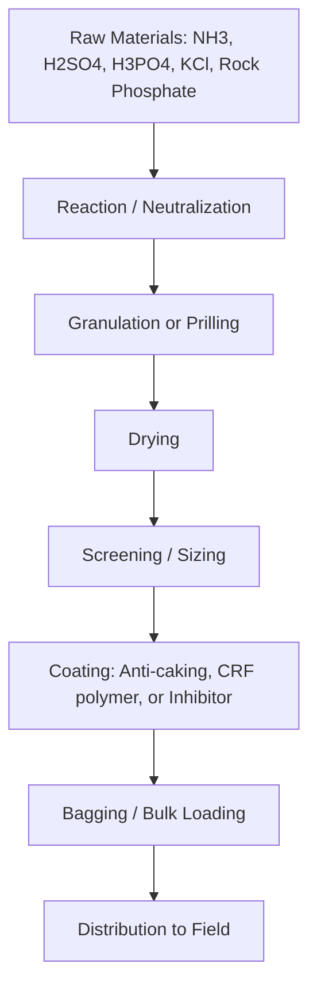
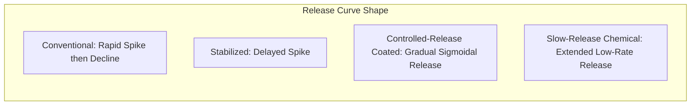

## Fertilizer Types and Formulations

### Overview

Fertilizers are materials, natural or synthetic, applied to soil or plant tissue to supply one or more plant nutrients essential to growth. They are classified by nutrient content, physical form, release behavior, and manufacturing origin. Formulation science determines how nutrients are combined, granulated, coated, or dissolved to control availability, handling properties, and application method.

**Key Points**

- Fertilizers supply macronutrients (N, P, K, Ca, Mg, S) and micronutrients (Fe, Zn, Mn, Cu, B, Mo, Cl, Ni)
- Classification axes: nutrient source (organic vs synthetic), nutrient count (straight vs compound), physical form (solid vs liquid), and release kinetics (conventional vs controlled-release)
- Formulation grade is expressed as an N-P₂O₅-K₂O percentage ratio (e.g., 15-15-15)
- Choice of formulation affects nutrient use efficiency (NUE), leaching/volatilization losses, and cost per unit nutrient

---

### Essential Plant Nutrients and Fertilizer Sources

#### Macronutrients

| Nutrient | Symbol | Common Fertilizer Sources | Primary Plant Function |
| --- | --- | --- | --- |
| Nitrogen | N | Urea, ammonium nitrate, ammonium sulfate | Vegetative growth, chlorophyll, protein synthesis |
| Phosphorus | P | Single/triple superphosphate, DAP, MAP | Root development, energy transfer (ATP), flowering |
| Potassium | K | Muriate of potash (KCl), sulfate of potash (K₂SO₄) | Water regulation, enzyme activation, disease resistance |
| Calcium | Ca | Gypsum, calcium nitrate, lime | Cell wall structure |
| Magnesium | Mg | Magnesium sulfate (Epsom salt), dolomite | Chlorophyll core, enzyme cofactor |
| Sulfur | S | Ammonium sulfate, gypsum, elemental S | Amino acid/protein synthesis |

#### Micronutrients

Applied in small quantities (grams to kilograms per hectare), typically as sulfates, chelates (EDTA, DTPA), or oxides: iron (Fe), zinc (Zn), manganese (Mn), copper (Cu), boron (B), molybdenum (Mo), chlorine (Cl), nickel (Ni).

---

### Classification by Nutrient Composition

#### Straight (Single-Nutrient) Fertilizers

Supply one primary nutrient.

- **Nitrogenous**: Urea (46-0-0), ammonium sulfate (21-0-0-24S), ammonium nitrate (34-0-0), calcium ammonium nitrate (CAN)
- **Phosphatic**: Single superphosphate (SSP, 0-16-0), triple superphosphate (TSP, 0-46-0), rock phosphate
- **Potassic**: Muriate of potash (MOP, 0-0-60), sulfate of potash (SOP, 0-0-50-18S)

#### Compound/Complex Fertilizers

Contain two or more nutrients chemically combined in each granule via a single manufacturing process (as opposed to physically blended).

- Diammonium phosphate (DAP): 18-46-0
- Monoammonium phosphate (MAP): 11-52-0
- NPK complexes: e.g., 20-20-20, 15-15-15, 12-32-16

#### Mixed/Blended Fertilizers (Bulk Blends)

Physical mixtures of straight or compound fertilizers, granules remain distinct. Cost-effective for custom nutrient ratios but prone to segregation during transport/handling if particle sizes and densities mismatch.

**Example**

A blend targeting 20-10-10 might combine urea, DAP, and MOP in calculated proportions rather than manufacturing a single compound granule.

---

### Classification by Physical Form

#### Solid Fertilizers

- **Granular**: Uniform particle size (typically 2–4 mm), free-flowing, suited to mechanical spreaders
- **Prilled**: Formed by spraying molten material into a cooling tower (common for urea); smaller, less uniform than granulated product
- **Powdered**: Fine particle size, faster dissolution, higher dust/caking risk
- **Crystalline**: Water-soluble crystals (e.g., potassium nitrate) for fertigation/hydroponics

#### Liquid Fertilizers

- **Clear liquids (solutions)**: Fully dissolved nutrients, e.g., UAN (urea-ammonium nitrate solution, 28-32% N)
- **Suspensions**: Contain suspended solids requiring agitation, allow higher nutrient analysis than clear solutions
- **Fertigation-grade**: Fully water-soluble formulations delivered via drip/sprinkler irrigation

#### Gaseous

- **Anhydrous ammonia (NH₃)**: 82-0-0, injected directly into soil; requires specialized equipment due to pressurization

---

### Classification by Release Behavior

#### Conventional (Quick-Release) Fertilizers

Dissolve rapidly upon soil contact; nutrients become available within days. Higher risk of leaching (N, K) and volatilization (N as NH₃), lower cost per unit nutrient.

#### Controlled-Release Fertilizers (CRF)

Nutrient release is physically regulated by a coating (polymer, sulfur, or resin) that slows water penetration and dissolution.

- **Sulfur-coated urea (SCU)**: Sulfur coating with wax sealant; release governed by coating imperfections and microbial degradation
- **Polymer-coated urea (PCU)**: Polymer membrane; release primarily temperature-dependent, following near-linear or sigmoidal kinetics
- **Resin-coated products**: Thicker, more durable coating; used for extended-release (3–12 month) applications, notably in turf and nursery

#### Slow-Release Fertilizers (SRF)

Release is governed by chemical structure requiring microbial or hydrolytic breakdown rather than a physical barrier.

- **Urea-formaldehyde (UF)**: Methylene urea polymer chains of varying length hydrolyze at different rates
- **IBDU (isobutylidene diurea)**: Hydrolysis-dependent, low water solubility

#### Stabilized Fertilizers

Conventional fertilizers combined with additives that inhibit specific loss pathways rather than physically restricting release.

- **Urease inhibitors** (e.g., NBPT): Delay hydrolysis of urea to ammonium, reducing volatilization losses
- **Nitrification inhibitors** (e.g., DCD, nitrapyrin): Slow conversion of ammonium to nitrate, reducing leaching and denitrification losses

$$\text{CO(NH}_2\text{)}_2 + \text{H}_2\text{O} \xrightarrow{\text{urease}} \text{2NH}_3 + \text{CO}_2$$

---

### Organic and Bio-Based Fertilizers

- **Farmyard manure (FYM)**: Variable nutrient content (~0.5-0.2-0.5 N-P-K typical range), improves soil organic matter and structure
- **Compost**: Stabilized organic matter from controlled decomposition; nutrient content lower and slower-release than mineral fertilizers
- **Green manure**: Cover crops (legumes, e.g., sesbania) incorporated into soil, contributing biologically fixed nitrogen
- **Biofertilizers**: Microbial inoculants (Rhizobium, Azotobacter, mycorrhizal fungi, phosphate-solubilizing bacteria) that enhance nutrient availability rather than supplying nutrients directly
- **Vermicompost**: Earthworm-processed organic matter, nutrient-rich with improved microbial activity

[Inference] Nutrient content and release rate of organic sources vary substantially with feedstock, processing method, and storage conditions, so lab analysis is recommended over generic reference values for precise nutrient budgeting.

---

### Formulation Grade Notation

Grade is expressed as three numbers representing percentage by weight:

$$N - P_2O_5 - K_2O$$

**Example**

A 50 kg bag labeled 15-15-15 contains:

- $15\% \times 50 = 7.5\ \text{kg}$ elemental N
- $7.5\ \text{kg}$ $P_2O_5$ (equivalent to $7.5 \times 0.436 \approx 3.27\ \text{kg}$ elemental P)
- $7.5\ \text{kg}$ $K_2O$ (equivalent to $7.5 \times 0.830 \approx 6.23\ \text{kg}$ elemental K)

Conversion factors: $P_2O_5 \times 0.436 = P$; $K_2O \times 0.830 = K$.

---

### Manufacturing Process Overview

#### Key Unit Operations

- **Granulation**: Agglomeration of fine particles into uniform granules, typically in rotary drums or pan granulators
- **Prilling**: Molten material sprayed from a prilling tower, solidifying into spherical prills during free-fall
- **Coating**: Application of sulfur, polymer, or inhibitor layers, either in rotating drums (SCU) or fluidized-bed reactors (PCU)
- **Conditioning**: Anti-caking agents (e.g., clay, diatomaceous earth) applied to prevent moisture absorption and granule fusion during storage

---

### Nutrient Release Comparison (Conceptual)

**Key Points**

- Conventional fertilizers show a sharp availability peak within 1–2 weeks, aligning poorly with crop uptake curves for long-season crops
- CRF products are engineered to approximate the crop's nutrient demand curve, reducing split-application labor
- Release rate for coated products is strongly temperature-dependent; warmer soil temperatures accelerate release [Inference, since exact release curves are manufacturer- and product-specific]

---

### Selection Criteria for Formulation Choice

| Factor | Consideration |
| --- | --- |
| Soil type | Sandy soils favor stabilized/CRF to reduce leaching; clay soils retain nutrients longer |
| Crop duration | Long-season crops benefit from CRF matching extended uptake period |
| Application method | Fertigation requires fully water-soluble crystalline/liquid forms; broadcast suits granular |
| Climate | High rainfall/irrigation regions favor coated or inhibitor-stabilized N sources |
| Cost constraints | Straight fertilizers and bulk blends are typically lower cost per unit nutrient than compound or CRF products |
| Regulatory/environmental | Nitrate-sensitive watersheds may mandate inhibitor use or restrict application timing |

---

### Illustrative Granule Cross-Section (Coated Urea)

<svg xmlns="http://www.w3.org/2000/svg" viewBox="0 0 400 300">
<title>Coated Urea Granule Cross-Section (svg_diagram)</title>
<circle cx="200" cy="150" r="110" fill="none" stroke="#8B5E3C" stroke-width="10" />
<circle cx="200" cy="150" r="95" fill="#F2E8CF" stroke="#333" stroke-width="2" />
<circle cx="200" cy="150" r="95" fill="none" stroke="#333" stroke-width="1" stroke-dasharray="4,4" />
<text x="200" y="155" font-size="16" text-anchor="middle" fill="#333">Urea Core</text>
<text x="200" y="175" font-size="12" text-anchor="middle" fill="#333">(N source)</text>
<text x="200" y="45" font-size="14" text-anchor="middle" fill="#8B5E3C">Polymer/Sulfur Coating</text>
<line x1="200" y1="55" x2="200" y2="95" stroke="#8B5E3C" stroke-width="1" />
<text x="200" y="280" font-size="12" text-anchor="middle" fill="#555">Water diffuses inward through coating; dissolved N diffuses outward</text>
<path d="M 60 150 L 90 150" stroke="#0077b6" stroke-width="2" marker-end="url(#arrow)" />
<path d="M 340 150 L 310 150" stroke="#2a9d8f" stroke-width="2" marker-end="url(#arrow)" />
</svg>

---

### Common Application Methods

- **Broadcasting**: Uniform surface spread, suited to granular straight/compound fertilizers
- **Banding/placement**: Concentrated application near seed/root zone, improves P uptake efficiency in low-mobility conditions
- **Fertigation**: Dissolved nutrient delivery through irrigation systems, requires fully soluble crystalline or liquid formulations
- **Foliar application**: Direct leaf uptake of dilute nutrient solutions, primarily used for micronutrient correction and rapid deficiency response
- **Deep placement**: Urea supergranules/briquettes placed below the root zone (notably in flooded rice systems) to reduce ammonia volatilization and denitrification losses

---

### Environmental and Efficiency Considerations

- **Volatilization**: Surface-applied urea in warm, moist, high-pH conditions can lose significant N as NH₃ gas; incorporation or urease inhibitors mitigate this pathway
- **Leaching**: Nitrate ($NO_3^-$) is highly mobile in soil water and prone to leaching below the root zone, particularly in sandy soils and high-rainfall/irrigation regimes
- **Eutrophication**: Runoff of P and N into water bodies contributes to algal bloom formation; buffer strips and precise placement reduce off-site transport
- **4R Nutrient Stewardship framework**: Right source, right rate, right time, right place — a widely referenced management approach for optimizing NUE while limiting environmental loss [Unverified as a universal standard, as regional adoption and terminology vary by extension body]

---

### Worked Example: Blend Calculation

**Example**

Target: 100 kg of a 20-10-10 blend using urea (46-0-0), DAP (18-46-0), and MOP (0-0-60).

1. P requirement: $10\ \text{kg} \div 0.46 = 21.7\ \text{kg DAP}$
2. N contributed by DAP: $21.7 \times 0.18 = 3.9\ \text{kg N}$
3. Remaining N needed: $20 - 3.9 = 16.1\ \text{kg}$, from urea: $16.1 \div 0.46 = 35.0\ \text{kg urea}$
4. K requirement: $10 \div 0.60 = 16.7\ \text{kg MOP}$
5. Filler (inert carrier) to reach 100 kg: $100 - (21.7 + 35.0 + 16.7) = 26.6\ \text{kg}$

---

**Related Topics**

- Soil testing and nutrient recommendation systems
- Nitrogen cycle and losses (volatilization, denitrification, leaching)
- Fertigation system design and drip irrigation compatibility
- Precision agriculture: variable-rate fertilizer application
- Biofertilizers and microbial inoculant technology
- 4R Nutrient Stewardship and regulatory frameworks
- Soil pH management and liming materials
- Micronutrient deficiency diagnosis and correction