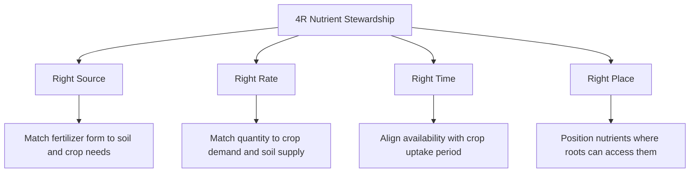
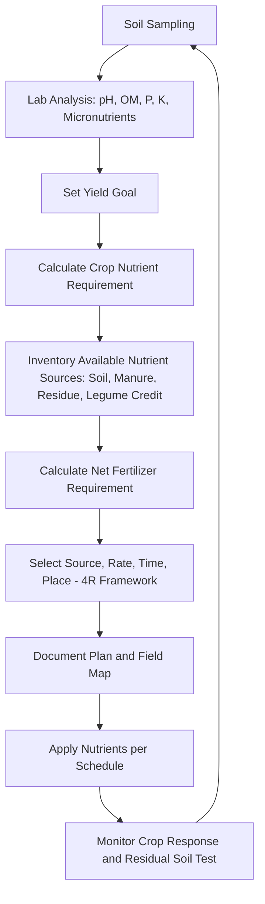

## Nutrient Management Planning

### Overview

Nutrient management planning (NMP) is the systematic process of matching nutrient supply (from soil reserves, organic amendments, and fertilizers) to crop demand across space and time, while minimizing off-site environmental losses. It integrates soil testing, crop nutrient requirement data, source characterization, and application logistics into a documented, field-specific plan.

**Key Points**

- Core framework: the 4Rs — right source, right rate, right time, right place
- NMPs are both agronomic tools (yield/profit optimization) and regulatory instruments (nutrient loss mitigation, especially N and P)
- Plans are field- and season-specific, built from soil test data, yield goals, and nutrient budgets
- Effective planning requires balancing all nutrient sources: soil-supplied, manure/organic, and mineral fertilizer

---

### Objectives of Nutrient Management Planning

- Optimize crop yield and quality relative to input cost
- Maintain or improve soil fertility status over time
- Minimize nutrient loss pathways: leaching, runoff, volatilization, erosion-bound P
- Comply with regulatory nutrient limits (e.g., watershed P-index restrictions, nitrate vulnerable zone rules)
- Improve nutrient use efficiency (NUE), reducing cost per unit of yield

---

### The 4R Nutrient Stewardship Framework

#### Right Source

Select fertilizer/amendment type based on nutrient form compatibility, soil chemistry (pH, CEC), and balance with other applied nutrients (e.g., avoiding antagonistic ion interactions).

#### Right Rate

Determined via soil test calibration, yield goal, and nutrient budgeting — not a fixed regional default.

#### Right Time

Synchronize nutrient availability with crop uptake curve; split applications reduce loss risk versus single upfront doses, particularly for mobile nutrients like nitrate.

#### Right Place

Placement method (banding, broadcasting, deep placement) relative to root zone and seed to maximize uptake efficiency and minimize fixation/loss.

---

### Core Planning Components

#### 1. Soil Testing

Baseline data collection: pH, organic matter, available P (Bray, Olsen, or Mehlich methods depending on soil type/region), exchangeable K, Ca, Mg, and micronutrients as needed.

**Key Points**

- Sampling depth and timing must be standardized (typically 0–15 cm or 0–20 cm for most row crops, pre-plant or post-harvest)
- Composite sampling (multiple cores per management zone) reduces spatial variability error
- Testing frequency: [Inference] commonly every 2–4 years for stable fields, though local extension guidance and cropping intensity may adjust this interval

#### 2. Yield Goal Setting

Realistic yield targets are set from field history (3–5 year average), soil productivity class, and water availability, since nutrient rate recommendations scale with expected yield removal.

#### 3. Nutrient Budgeting

$$\text{Fertilizer Rate} = \text{Crop Nutrient Requirement} - \text{Soil-Supplied Nutrient} - \text{Credits (manure, legume N, residual N)}$$

**Example**

A maize crop with a yield goal of 10 t/ha requiring 180 kg N/ha total uptake, with a soil test-based supply estimate of 40 kg N/ha and a prior legume credit of 30 kg N/ha, requires a fertilizer N application of:

$$180 - 40 - 30 = 110\ \text{kg N/ha}$$

#### 4. Source Inventory and Characterization

All available nutrient sources are quantified before allocating mineral fertilizer:

- Manure/compost: nutrient content via lab analysis (variable by species, bedding, storage)
- Crop residues: N credit from prior legumes, mineralization of incorporated residue
- Irrigation water: dissolved nutrient contribution, particularly relevant for nitrate-bearing groundwater
- Atmospheric deposition: [Unverified as universally significant] typically minor except in specific regional contexts

#### 5. Application Timing and Method Plan

Documented schedule specifying: which nutrient, source, rate, timing (growth stage), and method for each field.

#### 6. Record-Keeping and Documentation

Regulatory-compliant plans typically require records of: soil test results, applied rates/dates/sources, weather conditions at application, and field maps identifying sensitive areas (waterways, buffer zones).

---

### Nutrient Management Planning Workflow

---

### Regulatory and Environmental Risk Considerations

#### Nitrogen Risk Management

- **Leaching risk**: Nitrate is water-soluble and mobile; sandy soils, high rainfall, and over-application increase groundwater contamination risk
- **Volatilization risk**: Surface-applied urea/ammonium sources in warm, high-pH, moist conditions lose N as NH₃; incorporation or urease inhibitors mitigate this
- **Denitrification**: Waterlogged/anaerobic soils convert nitrate to N₂O/N₂ gas, a loss pathway and a greenhouse gas concern

#### Phosphorus Risk Management

- **P-Index tools**: Field-level risk assessment combining soil P level, erosion potential, distance to water body, and application method to flag high-risk fields for restricted or modified P application
- **Erosion-bound transport**: Unlike nitrate, P loss is predominantly attached to eroded soil particles and surface runoff rather than leaching (except in very sandy or organic soils)

#### Buffer Zones and Setbacks

Vegetated or unfertilized strips adjacent to waterways reduce nutrient and sediment transport via runoff interception.

---

### Comprehensive Nutrient Management Plan (CNMP)

In systems with significant manure/animal waste inputs (e.g., livestock operations), plans typically expand to include:

- Manure storage and handling capacity assessment
- Land application rate limits based on the most restrictive nutrient (often P, due to lower crop removal relative to N in manure)
- Setback distances from wells, waterways, and sensitive features
- Emergency/contingency provisions for storage overflow or extreme weather

[Inference] Regulatory specifics for CNMPs vary considerably by jurisdiction; local extension or environmental agency guidance should be consulted for compliance thresholds.

---

### Precision Nutrient Management

- **Variable-rate application (VRA)**: Prescription maps derived from soil test grids, yield maps, or remote sensing (NDVI) adjust application rate spatially within a field
- **Grid vs. zone sampling**: Grid sampling (fixed-interval points) offers higher spatial resolution; zone sampling (delineated by soil type, yield history, or imagery) is more cost-efficient for large fields
- **Sensor-based in-season adjustment**: Optical crop sensors (e.g., canopy reflectance) can inform mid-season N top-dressing rates based on real-time crop status rather than fixed pre-season estimates

---

### Illustrative Field Nutrient Budget Diagram

<svg xmlns="http://www.w3.org/2000/svg" viewBox="0 0 500 320">
<title>Field Nitrogen Budget Balance (svg_diagram)</title>
<rect x="20" y="40" width="200" height="240" fill="#e9f5e1" stroke="#333" stroke-width="1.5" />
<text x="120" y="30" font-size="14" text-anchor="middle" fill="#333">Nutrient Supply</text>
<rect x="40" y="60" width="160" height="40" fill="#a8dadc" stroke="#333" />
<text x="120" y="85" font-size="12" text-anchor="middle">Soil-Supplied N</text>
<rect x="40" y="110" width="160" height="40" fill="#a8dadc" stroke="#333" />
<text x="120" y="135" font-size="12" text-anchor="middle">Legume/Residue Credit</text>
<rect x="40" y="160" width="160" height="40" fill="#a8dadc" stroke="#333" />
<text x="120" y="185" font-size="12" text-anchor="middle">Manure Credit</text>
<rect x="40" y="210" width="160" height="40" fill="#f4a261" stroke="#333" />
<text x="120" y="235" font-size="12" text-anchor="middle">Fertilizer N (calculated)</text>
<line x1="220" y1="160" x2="270" y2="160" stroke="#333" stroke-width="2" marker-end="url(#arrow2)" />
<rect x="280" y="40" width="200" height="240" fill="#fff3cd" stroke="#333" stroke-width="1.5" />
<text x="380" y="30" font-size="14" text-anchor="middle" fill="#333">Crop Nutrient Demand</text>
<rect x="300" y="130" width="160" height="60" fill="#e76f51" stroke="#333" />
<text x="380" y="155" font-size="12" text-anchor="middle" fill="white">Total N Uptake</text>
<text x="380" y="172" font-size="11" text-anchor="middle" fill="white">(Yield Goal Based)</text>
</svg>

---

### Common Pitfalls in Nutrient Management Planning

- Applying regional blanket recommendations without field-specific soil test calibration
- Ignoring nutrient credits from manure or legume history, leading to over-application
- Single large pre-plant N applications on sandy/high-rainfall soils, elevating leaching risk versus split timing
- Neglecting micronutrient status when correcting only N-P-K deficiencies
- Failure to update plans after cropping system or manure source changes

---

### Monitoring and Plan Revision

- **Tissue testing**: In-season plant nutrient status check to validate whether the plan is meeting crop demand
- **Residual soil nitrate testing**: Post-harvest assessment of leftover soil N to refine following season's credit calculations
- **Yield mapping and response comparison**: Correlating harvested yield spatial data against applied rate maps to evaluate plan effectiveness
- Plans are revised iteratively based on monitoring outcomes, not treated as static documents

---

**Related Topics**

- Soil testing methods and interpretation (Bray, Olsen, Mehlich)
- 4R Nutrient Stewardship implementation
- Manure nutrient analysis and land application rate calculation
- Phosphorus Index risk assessment tools
- Variable-rate application and precision agriculture technology
- Nitrogen cycle: mineralization, nitrification, denitrification, volatilization
- Cover cropping and legume nitrogen credits
- Water quality regulations and nutrient loss mitigation (nitrate vulnerable zones)