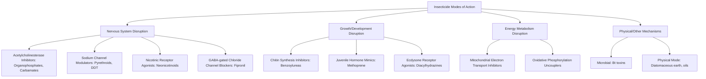
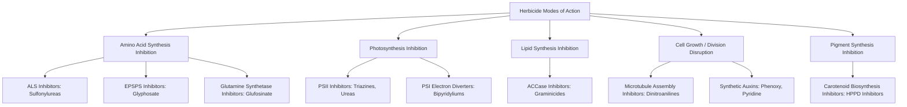
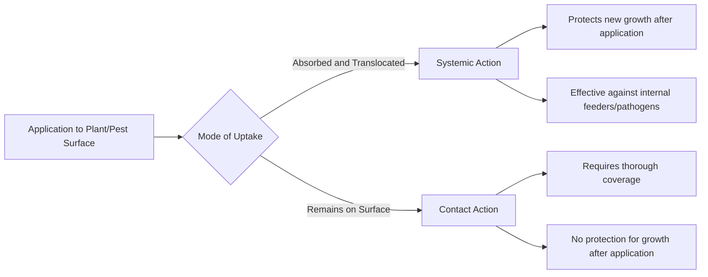

## Pesticide Classification and Modes of Action

### Overview

Pesticides are chemical or biological agents used to prevent, destroy, repel, or mitigate pests, including insects, weeds, fungi, nematodes, and rodents. Classification systems organize pesticides by target organism, chemical class, and mode of action (MoA) — the specific biochemical or physiological process disrupted in the target organism. MoA classification is central to resistance management, since rotating between different MoA groups (rather than just different product names) is what delays resistance development.

**Key Points**

- Classification axes: target pest group, chemical family, mode of action, and toxicity/regulatory hazard class
- Standardized MoA numbering systems exist for insecticides (IRAC), herbicides (HRAC/WSSA), and fungicides (FRAC)
- Resistance management strategy depends on rotating MoA groups, not merely alternating trade names or chemical families that share a mechanism
- Selectivity (target vs. non-target impact) and persistence are formulation- and compound-specific properties distinct from MoA classification

---

### Classification by Target Pest Group

| Category | Target Organisms | Examples |
| --- | --- | --- |
| Insecticides | Insects, some arthropods | Organophosphates, pyrethroids, neonicotinoids |
| Herbicides | Weeds/unwanted plants | Glyphosate, atrazine, 2,4-D |
| Fungicides | Fungal pathogens | Triazoles, strobilurins, copper compounds |
| Nematicides | Nematodes | Fumigants, organophosphates |
| Rodenticides | Rodents | Anticoagulants (warfarin-type), zinc phosphide |
| Acaricides/Miticides | Mites, ticks | Abamectin, bifenazate |
| Molluscicides | Slugs, snails | Metaldehyde, iron phosphate |
| Bactericides | Bacterial pathogens | Copper compounds, streptomycin |

---

### Insecticide Modes of Action (IRAC Classification)

The Insecticide Resistance Action Committee (IRAC) groups insecticides by target site in the insect nervous system or physiology, assigning a group number used on product labels for resistance management.

#### Key IRAC Groups

- **Group 1 (Acetylcholinesterase inhibitors)**: Organophosphates and carbamates block AChE, causing acetylcholine accumulation and continuous nerve stimulation, leading to paralysis
- **Group 3 (Sodium channel modulators)**: Pyrethroids keep voltage-gated sodium channels open, causing repetitive nerve firing and paralysis (knockdown effect)
- **Group 4 (Nicotinic acetylcholine receptor agonists)**: Neonicotinoids bind nAChRs, causing continuous nervous stimulation; selective toxicity toward insects relative to mammals is attributed to receptor binding affinity differences
- **Group 6 (Chloride channel activators)**: Avermectins (e.g., abamectin) activate glutamate-gated chloride channels, causing paralysis
- **Group 15 (Chitin synthesis inhibitors, Type 0)**: Benzoylureas disrupt chitin deposition, affecting molting in larvae
- **Group 11 (Microbial disruptors of insect gut membranes)**: Bt (Bacillus thuringiensis) toxins bind specific gut receptors, causing cell lysis and gut paralysis, generally target-specific to particular insect orders

**Example**

A resistance management rotation for aphid control might alternate a Group 4 neonicotinoid with a Group 9 (selective feeding blocker, e.g., flonicamid) rather than simply switching between two different Group 4 products, since same-group rotation does not interrupt resistance selection pressure.

---

### Herbicide Modes of Action (HRAC/WSSA Classification)

Herbicide Resistance Action Committee (HRAC) groups (recently harmonized with the Weed Science Society of America, WSSA, numbering system) classify herbicides by the specific plant enzyme or process targeted.

#### Key HRAC/WSSA Groups

- **Group 2 (ALS inhibitors)**: Block acetolactate synthase, halting branched-chain amino acid (valine, leucine, isoleucine) synthesis; plant growth stops within hours though visible symptoms develop over days to weeks
- **Group 9 (EPSPS inhibitors)**: Glyphosate blocks the shikimate pathway enzyme EPSPS, preventing aromatic amino acid synthesis; systemic translocation throughout the plant is a key characteristic
- **Group 5/7 (PSII inhibitors)**: Triazines and phenylureas bind the D1 protein in photosystem II, blocking electron transport and causing oxidative damage
- **Group 4 (Synthetic auxins)**: Phenoxy compounds (2,4-D) and pyridines mimic natural auxin, causing uncontrolled cell division and growth, particularly disruptive to broadleaf plants
- **Group 1 (ACCase inhibitors)**: Block acetyl-CoA carboxylase, an enzyme specific to grass fatty acid synthesis, giving grass-selective activity with limited broadleaf effect
- **Group 27 (HPPD inhibitors)**: Block carotenoid synthesis, causing characteristic bleaching (white/pale) symptoms on new growth

$$\text{Shikimate Pathway: } \text{PEP} + \text{E4P} \xrightarrow{\text{EPSPS (inhibited by glyphosate)}} \text{Aromatic Amino Acids}$$

---

### Fungicide Modes of Action (FRAC Classification)

Fungicide Resistance Action Committee (FRAC) groups fungicides by biochemical target within the fungal cell.

| FRAC Group | Mode of Action | Example Chemical Class |
| --- | --- | --- |
| 1 | Beta-tubulin assembly inhibition (mitosis) | Benzimidazoles |
| 3 | Sterol biosynthesis inhibition (demethylation) | Triazoles (DMIs) |
| 7 | Succinate dehydrogenase inhibition (SDHI) | Carboxamides |
| 11 | Cytochrome bc1 complex inhibition (QoI/strobilurins) | Strobilurins |
| M (Multi-site) | Multiple non-specific cellular targets | Copper compounds, mancozeb, chlorothalonil |

**Key Points**

- Multi-site fungicides (FRAC Group M) carry inherently lower resistance risk since resistance would require simultaneous mutation at multiple independent targets
- Single-site fungicides (e.g., QoI, DMI, SDHI groups) carry higher resistance risk and are typically recommended for rotation or tank-mixing with multi-site partners
- Systemic fungicides move within plant tissue (xylem-mobile in most cases), while contact fungicides remain on treated surfaces, protecting only tissue present at application time

---

### Selectivity and Toxicity Classification

#### Selectivity

- **Selective**: Affects target pest with minimal impact on non-target/desirable species (e.g., graminicides on grass weeds in broadleaf crops)
- **Non-selective**: Affects a broad range of species (e.g., glyphosate, paraquat), requiring careful application timing/method to avoid crop injury

#### WHO Hazard Classification (Acute Toxicity)

| Class | Category | LD50 Indicator (oral, rat, mg/kg) |
| --- | --- | --- |
| Ia | Extremely hazardous | ≤ 5 |
| Ib | Highly hazardous | 5–50 |
| II | Moderately hazardous | 50–2000 |
| III | Slightly hazardous | > 2000 |
| U | Unlikely to present acute hazard | — |

[Unverified as universally applied] Exact LD50 threshold values and category boundaries are periodically revised by WHO; label-stated hazard classification for a specific product should be treated as authoritative over generic reference ranges.

---

### Systemic vs. Contact Action

- **Systemic pesticides**: Absorbed into plant vascular tissue, translocated to untreated parts; effective against internal feeders, vascular pathogens, and provide extended protection window
- **Contact pesticides**: Act only on tissue directly treated; require thorough spray coverage and repeat application as new growth emerges or residue degrades
- **Translaminar action**: An intermediate category where the active ingredient moves through leaf tissue (top to bottom surface) without full systemic translocation

---

### Illustrative Neuromuscular Mode of Action Diagram

<svg xmlns="http://www.w3.org/2000/svg" viewBox="0 0 500 300">
<title>Acetylcholinesterase Inhibition Mechanism (svg_diagram)</title>
<rect x="20" y="30" width="180" height="100" fill="#e0fbfc" stroke="#333" stroke-width="1.5" />
<text x="110" y="20" font-size="13" text-anchor="middle">Presynaptic Neuron</text>
<text x="110" y="85" font-size="12" text-anchor="middle">Releases Acetylcholine</text>
<line x1="200" y1="80" x2="260" y2="80" stroke="#333" stroke-width="2" marker-end="url(#arrow3)" />
<rect x="270" y="30" width="200" height="100" fill="#ffe8d6" stroke="#333" stroke-width="1.5" />
<text x="370" y="20" font-size="13" text-anchor="middle">Synaptic Cleft</text>
<text x="370" y="70" font-size="11" text-anchor="middle">AChE normally breaks</text>
<text x="370" y="85" font-size="11" text-anchor="middle">down Acetylcholine</text>
<text x="370" y="105" font-size="11" fill="#c1121f" text-anchor="middle">Pesticide blocks AChE</text>
<rect x="20" y="180" width="180" height="90" fill="#d8f3dc" stroke="#333" stroke-width="1.5" />
<text x="110" y="170" font-size="13" text-anchor="middle">Postsynaptic Neuron</text>
<text x="110" y="215" font-size="11" text-anchor="middle">Continuous receptor</text>
<text x="110" y="230" font-size="11" text-anchor="middle">stimulation</text>
<text x="110" y="250" font-size="11" fill="#c1121f" text-anchor="middle">Result: Paralysis</text>
<line x1="200" y1="220" x2="20" y2="220" stroke="#c1121f" stroke-width="2" stroke-dasharray="3,3" />
</svg>

---

### Resistance Management Principles

- **Rotate MoA groups**, not just product trade names, within and across growing seasons
- **Tank-mix or sequence** single-site and multi-site actives where practical, especially for high-resistance-risk fungicide groups
- **Integrate non-chemical controls**: cultural practices, biological control, resistant varieties reduce overall selection pressure on chemical MoAs
- **Monitor resistance status**: regional resistance surveys and bioassay data inform whether a given MoA remains effective in a specific area
- **Avoid unnecessary applications**: reducing total selection events preserves MoA efficacy over the long term

---

### Formulation Types Affecting Application

| Formulation | Abbreviation | Characteristics |
| --- | --- | --- |
| Emulsifiable concentrate | EC | Oil-based, forms emulsion in water |
| Wettable powder | WP | Fine powder, requires agitation, dust exposure risk |
| Water-dispersible granule | WDG/WG | Granular, reduced dust vs. WP |
| Suspension concentrate | SC | Liquid suspension, generally lower dust/vapor exposure |
| Soluble concentrate | SL | Fully dissolves in water |
| Ultra-low volume | ULV | Concentrated, minimal carrier volume, specialized equipment |

---

**Related Topics**

- Integrated Pest Management (IPM) principles and thresholds
- Herbicide/insecticide/fungicide resistance monitoring and bioassays
- Pesticide formulation chemistry and adjuvant selection
- Pesticide application equipment and drift management
- Pre-harvest intervals (PHI) and maximum residue limits (MRL)
- Biological control agents and biopesticides
- Pesticide label interpretation and personal protective equipment (PPE) requirements
- Environmental fate: persistence, degradation pathways, and soil/water mobility